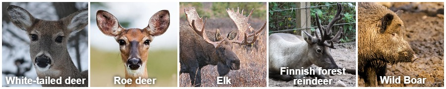

## Tilastokeskuksen Visualisointihackathon 15.9.2021 - 30.9.2021
### Joukkue Visukintut

Tämä on joukkue Visukinttujen kilpailutyö Tilastokeskuksen Visualisointihackathonia varten. Tilastokeskuksen Visualisointihackathonin tehtävänä oli tehdä visualisointi pohjautuen Tilastokeskuksen kokeellisiin tilastoihin.

Joukkueemme visualisoi kokeellisista tilastoista riistaonnettomuustilaston luvut karttakuvaa mukailevan pallokuvion avulla. Kilpailutyö on alla ja sen alle on koottu vastaukset tuomariston esittämiin kysymyksiin ja myös käytetty koodi aineistoineen.

### Selvitä alta mihin eläimeen törmätään eniten kunnittain?

Kuvion tiedot perustuvat [riistaonnettomuustilaston](https://www.stat.fi/tup/kokeelliset-tilastot/riistaonnettomuudet/2020/index.html) vuoden 2020 kunnittaisiin tietoihin, jotka on poimittu tilaston tietokantataulukoista.

Tilasto sisältää tietoja valkohäntäpeurojen, metsäkauriiden, hirvien, metsäpeurojen, kuusipeurojen ja villisikojen kanssa ajetuista kolareista. Katso alla olevasta kuviosta mikä riistaeläin aiheuttaa eniten kolareita kunnittain ja miten onnettomuudet jakautuvat vuoden sisällä eläinlajeittain. Alla on mallikuvat eläimistä tunnistamisen helpottamiseksi. 



Vie hiiri pallojen päälle tai kosketa niitä mobiilissa sormella ja eniten onnettomuuksia aiheuttavan eläimen kuva paljastuu. Saat samalla lisätietoa kunnassa vuoden 2020 aikana tapahtuneista onnettomuuksista ja niitä aiheuttaneista eläimistä.
<body>
 <meta charset="utf-8">


 <style>


div.tooltip {	
    position: absolute;

    text-align: left;			
    width: 200px;					
    height: 40px;					
    padding: 2px;				
    font: 14px sans-serif;		
    background: black;	
    border: 6px;		
    border-radius: 8px;			
    pointer-events: none;

}
</style>


 <!-- Add 2 buttons-->

<script src="https://d3js.org/d3.v4.min.js">
</script>


<div id="chart"> 


<script>

//(function test () {
	var width = 900,
	height=900;
//data
	var data = [
{id:'i1', name: 'Akaa', onn:160, onnkvl:66.3625051845707, xk:303.238349769901, yk:571.846271456827, maakunta: '06' ,kuva: 'kuvat/valkohantapeura.png' ,kaavio: 'kaaviot/Akaa.png', altt:'Kunnassa Akaa tapahtui vuonna 2020 yhteensä 160 riistaonnettomuutta. Eniten kolareita aiheutti Valkohäntäpeura.' },
{id:'i2', name: 'Alajärvi', onn:22, onnkvl:30.0957592339261, xk:317.3470602544, yk:462.626844312414, maakunta: '14' ,kuva: 'kuvat/metsakauris.png' ,kaavio: 'kaaviot/Alajärvi.png', altt:'Kunnassa Alajärvi tapahtui vuonna 2020 yhteensä 22 riistaonnettomuutta. Eniten kolareita aiheutti Metsäkauris.' },
{id:'i3', name: 'Alavieska', onn:6, onnkvl:8.67052023121387, xk:332.981210522673, yk:388.5864227523, maakunta: '17' ,kuva: 'kuvat/metsakauris.png' ,kaavio: 'kaaviot/Alavieska.png', altt:'Kunnassa Alavieska tapahtui vuonna 2020 yhteensä 6 riistaonnettomuutta. Eniten kolareita aiheutti Metsäkauris.' },
{id:'i4', name: 'Alavus', onn:20, onnkvl:22.4466891133558, xk:302.167610931134, yk:483.55273900845, maakunta: '14' ,kuva: 'kuvat/metsakauris.png' ,kaavio: 'kaaviot/Alavus.png', altt:'Kunnassa Alavus tapahtui vuonna 2020 yhteensä 20 riistaonnettomuutta. Eniten kolareita aiheutti Metsäkauris.' },
{id:'i5', name: 'Asikkala', onn:56, onnkvl:50.8628519527702, xk:367.440754543461, yk:570.827617827684, maakunta: '07' ,kuva: 'kuvat/metsakauris.png' ,kaavio: 'kaaviot/Asikkala.png', altt:'Kunnassa Asikkala tapahtui vuonna 2020 yhteensä 56 riistaonnettomuutta. Eniten kolareita aiheutti Metsäkauris.' },
{id:'i6', name: 'Askola', onn:9, onnkvl:11.0429447852761, xk:369.323640369133, yk:611.299912530083, maakunta: '01' ,kuva: 'kuvat/valkohantapeura.png' ,kaavio: 'kaaviot/Askola.png', altt:'Kunnassa Askola tapahtui vuonna 2020 yhteensä 9 riistaonnettomuutta. Eniten kolareita aiheutti Valkohäntäpeura.' },
{id:'i7', name: 'Aura', onn:39, onnkvl:14.2961876832845, xk:258.766760445058, yk:602.22488657623, maakunta: '02' ,kuva: 'kuvat/valkohantapeura.png' ,kaavio: 'kaaviot/Aura.png', altt:'Kunnassa Aura tapahtui vuonna 2020 yhteensä 39 riistaonnettomuutta. Eniten kolareita aiheutti Valkohäntäpeura.' },
//{id:'i8', name: 'Enonkoski', onn:0, onnkvl:0, xk:479.439627618523, yk:513.996600530962, maakunta: '10' ,kuva: 'kuvat/villisika.png' ,kaavio: 'kaaviot/Enonkoski.png' },
{id:'i9', name: 'Enontekiö', onn:1, onnkvl:2.31481481481481, xk:301.481668402982, yk:114.947176323877, maakunta: '19' ,kuva: 'kuvat/hirvi.png' ,kaavio: 'kaaviot/Enontekiö.png', altt:'Kunnassa Enontekiö tapahtui vuonna 2020 yhteensä 1 riistaonnettomuutta. Eniten kolareita aiheutti Hirvi.' },
{id:'i10', name: 'Espoo', onn:218, onnkvl:12.342184226915, xk:333.731770063556, yk:630.24305531201, maakunta: '01' ,kuva: 'kuvat/metsakauris.png' ,kaavio: 'kaaviot/Espoo.png', altt:'Kunnassa Espoo tapahtui vuonna 2020 yhteensä 218 riistaonnettomuutta. Eniten kolareita aiheutti Metsäkauris.' },
{id:'i11', name: 'Eura', onn:207, onnkvl:161.71875, xk:244.060216334976, yk:572.212422826438, maakunta: '04' ,kuva: 'kuvat/valkohantapeura.png' ,kaavio: 'kaaviot/Eura.png', altt:'Kunnassa Eura tapahtui vuonna 2020 yhteensä 207 riistaonnettomuutta. Eniten kolareita aiheutti Valkohäntäpeura.' },
{id:'i12', name: 'Eurajoki', onn:150, onnkvl:82.2819528250137, xk:228.675884428329, yk:558.663992024852, maakunta: '04' ,kuva: 'kuvat/valkohantapeura.png' ,kaavio: 'kaaviot/Eurajoki.png', altt:'Kunnassa Eurajoki tapahtui vuonna 2020 yhteensä 150 riistaonnettomuutta. Eniten kolareita aiheutti Valkohäntäpeura.' },
{id:'i13', name: 'Evijärvi', onn:10, onnkvl:14.0252454417952, xk:302.58383731489, yk:436.824302723446, maakunta: '14' ,kuva: 'kuvat/metsakauris.png' ,kaavio: 'kaaviot/Evijärvi.png', altt:'Kunnassa Evijärvi tapahtui vuonna 2020 yhteensä 10 riistaonnettomuutta. Eniten kolareita aiheutti Metsäkauris.' },
{id:'i14', name: 'Forssa', onn:60, onnkvl:38.4122919334187, xk:298.621185692857, yk:587.170771085459, maakunta: '05' ,kuva: 'kuvat/valkohantapeura.png' ,kaavio: 'kaaviot/Forssa.png', altt:'Kunnassa Forssa tapahtui vuonna 2020 yhteensä 60 riistaonnettomuutta. Eniten kolareita aiheutti Valkohäntäpeura.' },
{id:'i15', name: 'Haapajärvi', onn:6, onnkvl:7.27272727272727, xk:362.179963924433, yk:413.946499535387, maakunta: '17' ,kuva: 'kuvat/hirvi.png' ,kaavio: 'kaaviot/Haapajärvi.png', altt:'Kunnassa Haapajärvi tapahtui vuonna 2020 yhteensä 6 riistaonnettomuutta. Eniten kolareita aiheutti Hirvi.' },
{id:'i16', name: 'Haapavesi', onn:5, onnkvl:9.3984962406015, xk:364.470702150471, yk:393.048213287343, maakunta: '17' ,kuva: 'kuvat/metsakauris.png' ,kaavio: 'kaaviot/Haapavesi.png', altt:'Kunnassa Haapavesi tapahtui vuonna 2020 yhteensä 5 riistaonnettomuutta. Eniten kolareita aiheutti Metsäkauris.' },
//{id:'i17', name: 'Hailuoto', onn:0, onnkvl:0, xk:350.036768855332, yk:338.015942844466, maakunta: '17' ,kuva: 'kuvat/villisika.png' ,kaavio: 'kaaviot/Hailuoto.png' },
{id:'i18', name: 'Halsua', onn:3, onnkvl:8.31024930747922, xk:329.165974389664, yk:433.004677182753, maakunta: '16' ,kuva: 'kuvat/hirvi.png' ,kaavio: 'kaaviot/Halsua.png', altt:'Kunnassa Halsua tapahtui vuonna 2020 yhteensä 3 riistaonnettomuutta. Eniten kolareita aiheutti Hirvi.' },
{id:'i19', name: 'Hamina', onn:16, onnkvl:9.90712074303406, xk:424.225236446083, yk:608.097948788292, maakunta: '08' ,kuva: 'kuvat/metsakauris.png' ,kaavio: 'kaaviot/Hamina.png', altt:'Kunnassa Hamina tapahtui vuonna 2020 yhteensä 16 riistaonnettomuutta. Eniten kolareita aiheutti Metsäkauris.' },
{id:'i20', name: 'Hankasalmi', onn:12, onnkvl:12.1457489878543, xk:399.023379884124, yk:500.235366417823, maakunta: '13' ,kuva: 'kuvat/metsakauris.png' ,kaavio: 'kaaviot/Hankasalmi.png', altt:'Kunnassa Hankasalmi tapahtui vuonna 2020 yhteensä 12 riistaonnettomuutta. Eniten kolareita aiheutti Metsäkauris.' },
{id:'i21', name: 'Hanko', onn:42, onnkvl:28.4552845528455, xk:275.010094664591, yk:650, maakunta: '01' ,kuva: 'kuvat/valkohantapeura.png' ,kaavio: 'kaaviot/Hanko.png', altt:'Kunnassa Hanko tapahtui vuonna 2020 yhteensä 42 riistaonnettomuutta. Eniten kolareita aiheutti Valkohäntäpeura.' },
{id:'i22', name: 'Harjavalta', onn:17, onnkvl:8.62068965517241, xk:248.476140175245, yk:559.287714899431, maakunta: '04' ,kuva: 'kuvat/valkohantapeura.png' ,kaavio: 'kaaviot/Harjavalta.png', altt:'Kunnassa Harjavalta tapahtui vuonna 2020 yhteensä 17 riistaonnettomuutta. Eniten kolareita aiheutti Valkohäntäpeura.' },
{id:'i23', name: 'Hartola', onn:11, onnkvl:9.55690703735882, xk:384.101126023221, yk:547.435295789788, maakunta: '07' ,kuva: 'kuvat/metsakauris.png' ,kaavio: 'kaaviot/Hartola.png', altt:'Kunnassa Hartola tapahtui vuonna 2020 yhteensä 11 riistaonnettomuutta. Eniten kolareita aiheutti Metsäkauris.' },
{id:'i24', name: 'Hattula', onn:74, onnkvl:30.8848080133556, xk:320.254401161779, yk:579.376412281938, maakunta: '05' ,kuva: 'kuvat/valkohantapeura.png' ,kaavio: 'kaaviot/Hattula.png', altt:'Kunnassa Hattula tapahtui vuonna 2020 yhteensä 74 riistaonnettomuutta. Eniten kolareita aiheutti Valkohäntäpeura.' },
{id:'i25', name: 'Hausjärvi', onn:63, onnkvl:63.2530120481928, xk:346.085696676996, yk:595.33390995597, maakunta: '05' ,kuva: 'kuvat/valkohantapeura.png' ,kaavio: 'kaaviot/Hausjärvi.png', altt:'Kunnassa Hausjärvi tapahtui vuonna 2020 yhteensä 63 riistaonnettomuutta. Eniten kolareita aiheutti Valkohäntäpeura.' },
{id:'i26', name: 'Heinola', onn:44, onnkvl:15.2883947185546, xk:386.281330748139, yk:569.13800704065, maakunta: '07' ,kuva: 'kuvat/metsakauris.png' ,kaavio: 'kaaviot/Heinola.png', altt:'Kunnassa Heinola tapahtui vuonna 2020 yhteensä 44 riistaonnettomuutta. Eniten kolareita aiheutti Metsäkauris.' },
{id:'i27', name: 'Heinävesi', onn:6, onnkvl:11.9284294234592, xk:473.476670454342, yk:496.170040108483, maakunta: '12' ,kuva: 'kuvat/hirvi.png' ,kaavio: 'kaaviot/Heinävesi.png', altt:'Kunnassa Heinävesi tapahtui vuonna 2020 yhteensä 6 riistaonnettomuutta. Eniten kolareita aiheutti Hirvi.' },
{id:'i28', name: 'Helsinki', onn:59, onnkvl:1.54949181920845, xk:347.154546674285, yk:631.91681374863, maakunta: '01' ,kuva: 'kuvat/metsakauris.png' ,kaavio: 'kaaviot/Helsinki.png', altt:'Kunnassa Helsinki tapahtui vuonna 2020 yhteensä 59 riistaonnettomuutta. Eniten kolareita aiheutti Metsäkauris.' },
{id:'i29', name: 'Hirvensalmi', onn:11, onnkvl:15.5148095909732, xk:406.327484844379, yk:541.40935762297, maakunta: '10' ,kuva: 'kuvat/metsakauris.png' ,kaavio: 'kaaviot/Hirvensalmi.png', altt:'Kunnassa Hirvensalmi tapahtui vuonna 2020 yhteensä 11 riistaonnettomuutta. Eniten kolareita aiheutti Metsäkauris.' },
{id:'i30', name: 'Hollola', onn:118, onnkvl:71.7761557177616, xk:361.529605176579, yk:583.673965214606, maakunta: '07' ,kuva: 'kuvat/metsakauris.png' ,kaavio: 'kaaviot/Hollola.png', altt:'Kunnassa Hollola tapahtui vuonna 2020 yhteensä 118 riistaonnettomuutta. Eniten kolareita aiheutti Metsäkauris.' },
{id:'i32', name: 'Huittinen', onn:176, onnkvl:144.499178981938, xk:269.044431064543, yk:572.183504560864, maakunta: '04' ,kuva: 'kuvat/valkohantapeura.png' ,kaavio: 'kaaviot/Huittinen.png', altt:'Kunnassa Huittinen tapahtui vuonna 2020 yhteensä 176 riistaonnettomuutta. Eniten kolareita aiheutti Valkohäntäpeura.' },
{id:'i33', name: 'Humppila', onn:60, onnkvl:39.4218134034166, xk:288.485153804379, yk:584.160418292426, maakunta: '05' ,kuva: 'kuvat/valkohantapeura.png' ,kaavio: 'kaaviot/Humppila.png', altt:'Kunnassa Humppila tapahtui vuonna 2020 yhteensä 60 riistaonnettomuutta. Eniten kolareita aiheutti Valkohäntäpeura.' },
{id:'i34', name: 'Hyrynsalmi', onn:8, onnkvl:28.673835125448, xk:469.903656952459, yk:362.722665130318, maakunta: '18' ,kuva: 'kuvat/metsakauris.png' ,kaavio: 'kaaviot/Hyrynsalmi.png', altt:'Kunnassa Hyrynsalmi tapahtui vuonna 2020 yhteensä 8 riistaonnettomuutta. Eniten kolareita aiheutti Metsäkauris.' },
{id:'i35', name: 'Hyvinkää', onn:137, onnkvl:30.5803571428571, xk:339.142986745247, yk:606.930319956659, maakunta: '01' ,kuva: 'kuvat/valkohantapeura.png' ,kaavio: 'kaaviot/Hyvinkää.png', altt:'Kunnassa Hyvinkää tapahtui vuonna 2020 yhteensä 137 riistaonnettomuutta. Eniten kolareita aiheutti Valkohäntäpeura.' },
{id:'i36', name: 'Hämeenkyrö', onn:68, onnkvl:41.743400859423, xk:285.393301042076, yk:542.605920942601, maakunta: '06' ,kuva: 'kuvat/metsakauris.png' ,kaavio: 'kaaviot/Hämeenkyrö.png', altt:'Kunnassa Hämeenkyrö tapahtui vuonna 2020 yhteensä 68 riistaonnettomuutta. Eniten kolareita aiheutti Metsäkauris.' },
{id:'i37', name: 'Hämeenlinna', onn:349, onnkvl:194.104560622914, xk:329.439929100528, yk:580.163259161906, maakunta: '05' ,kuva: 'kuvat/valkohantapeura.png' ,kaavio: 'kaaviot/Hämeenlinna.png', altt:'Kunnassa Hämeenlinna tapahtui vuonna 2020 yhteensä 349 riistaonnettomuutta. Eniten kolareita aiheutti Valkohäntäpeura.' },
{id:'i38', name: 'Ii', onn:7, onnkvl:5.81395348837209, xk:369.57161108358, yk:310.403049123104, maakunta: '17' ,kuva: 'kuvat/metsakauris.png' ,kaavio: 'kaaviot/Ii.png', altt:'Kunnassa Ii tapahtui vuonna 2020 yhteensä 7 riistaonnettomuutta. Eniten kolareita aiheutti Metsäkauris.' },
{id:'i39', name: 'Iisalmi', onn:14, onnkvl:13.7254901960784, xk:423.351731943367, yk:430.715158138486, maakunta: '11' ,kuva: 'kuvat/metsakauris.png' ,kaavio: 'kaaviot/Iisalmi.png', altt:'Kunnassa Iisalmi tapahtui vuonna 2020 yhteensä 14 riistaonnettomuutta. Eniten kolareita aiheutti Metsäkauris.' },
{id:'i40', name: 'Iitti', onn:17, onnkvl:17.9704016913319, xk:389.842301051902, yk:588.066473879251, maakunta: '07' ,kuva: 'kuvat/valkohantapeura.png' ,kaavio: 'kaaviot/Iitti.png', altt:'Kunnassa Iitti tapahtui vuonna 2020 yhteensä 17 riistaonnettomuutta. Eniten kolareita aiheutti Valkohäntäpeura.' },
{id:'i41', name: 'Ikaalinen', onn:36, onnkvl:33.4261838440111, xk:282.789180007547, yk:530.403421276897, maakunta: '06' ,kuva: 'kuvat/metsakauris.png' ,kaavio: 'kaaviot/Ikaalinen.png', altt:'Kunnassa Ikaalinen tapahtui vuonna 2020 yhteensä 36 riistaonnettomuutta. Eniten kolareita aiheutti Metsäkauris.' },
{id:'i42', name: 'Ilmajoki', onn:34, onnkvl:22.3097112860892, xk:269.995095292087, yk:475.476995090868, maakunta: '14' ,kuva: 'kuvat/metsakauris.png' ,kaavio: 'kaaviot/Ilmajoki.png', altt:'Kunnassa Ilmajoki tapahtui vuonna 2020 yhteensä 34 riistaonnettomuutta. Eniten kolareita aiheutti Metsäkauris.' },
{id:'i43', name: 'Ilomantsi', onn:3, onnkvl:12.8205128205128, xk:550, yk:473.168229509572, maakunta: '12' ,kuva: 'kuvat/metsakauris.png' ,kaavio: 'kaaviot/Ilomantsi.png', altt:'Kunnassa Ilomantsi tapahtui vuonna 2020 yhteensä 3 riistaonnettomuutta. Eniten kolareita aiheutti Metsäkauris.' },
{id:'i44', name: 'Imatra', onn:14, onnkvl:4.40528634361234, xk:481.064017539138, yk:572.184627332326, maakunta: '09' ,kuva: 'kuvat/metsakauris.png' ,kaavio: 'kaaviot/Imatra.png', altt:'Kunnassa Imatra tapahtui vuonna 2020 yhteensä 14 riistaonnettomuutta. Eniten kolareita aiheutti Metsäkauris.' },
{id:'i45', name: 'Inari', onn:9, onnkvl:19.1897654584222, xk:416.858940873398, yk:101.439809601301, maakunta: '19' ,kuva: 'kuvat/hirvi.png' ,kaavio: 'kaaviot/Inari.png', altt:'Kunnassa Inari tapahtui vuonna 2020 yhteensä 9 riistaonnettomuutta. Eniten kolareita aiheutti Hirvi.' },
{id:'i46', name: 'Inkoo', onn:127, onnkvl:80.6861499364676, xk:307.784617935558, yk:641.187899804601, maakunta: '01' ,kuva: 'kuvat/valkohantapeura.png' ,kaavio: 'kaaviot/Inkoo.png', altt:'Kunnassa Inkoo tapahtui vuonna 2020 yhteensä 127 riistaonnettomuutta. Eniten kolareita aiheutti Valkohäntäpeura.' },
{id:'i47', name: 'Isojoki', onn:22, onnkvl:52.6315789473684, xk:244.327959354659, yk:508.899285605549, maakunta: '14' ,kuva: 'kuvat/metsakauris.png' ,kaavio: 'kaaviot/Isojoki.png', altt:'Kunnassa Isojoki tapahtui vuonna 2020 yhteensä 22 riistaonnettomuutta. Eniten kolareita aiheutti Metsäkauris.' },
{id:'i48', name: 'Isokyrö', onn:8, onnkvl:11.4777618364419, xk:265.870353870427, yk:459.874216572977, maakunta: '14' ,kuva: 'kuvat/metsakauris.png' ,kaavio: 'kaaviot/Isokyrö.png', altt:'Kunnassa Isokyrö tapahtui vuonna 2020 yhteensä 8 riistaonnettomuutta. Eniten kolareita aiheutti Metsäkauris.' },
{id:'i49', name: 'Janakkala', onn:209, onnkvl:70.7275803722504, xk:335.669063255857, yk:591.073863388494, maakunta: '05' ,kuva: 'kuvat/valkohantapeura.png' ,kaavio: 'kaaviot/Janakkala.png', altt:'Kunnassa Janakkala tapahtui vuonna 2020 yhteensä 209 riistaonnettomuutta. Eniten kolareita aiheutti Valkohäntäpeura.' },
{id:'i50', name: 'Joensuu', onn:28, onnkvl:26.046511627907, xk:530.757087976521, yk:485.244350892136, maakunta: '12' ,kuva: 'kuvat/hirvi.png' ,kaavio: 'kaaviot/Joensuu.png', altt:'Kunnassa Joensuu tapahtui vuonna 2020 yhteensä 28 riistaonnettomuutta. Eniten kolareita aiheutti Hirvi.' },
{id:'i51', name: 'Jokioinen', onn:51, onnkvl:34.3434343434343, xk:291.755776113134, yk:591.449755256019, maakunta: '05' ,kuva: 'kuvat/valkohantapeura.png' ,kaavio: 'kaaviot/Jokioinen.png', altt:'Kunnassa Jokioinen tapahtui vuonna 2020 yhteensä 51 riistaonnettomuutta. Eniten kolareita aiheutti Valkohäntäpeura.' },
{id:'i52', name: 'Joroinen', onn:13, onnkvl:10.7615894039735, xk:443.493759892955, yk:511.593397365012, maakunta: '11' ,kuva: 'kuvat/hirvi.png' ,kaavio: 'kaaviot/Joroinen.png', altt:'Kunnassa Joroinen tapahtui vuonna 2020 yhteensä 13 riistaonnettomuutta. Eniten kolareita aiheutti Hirvi.' },
{id:'i53', name: 'Joutsa', onn:7, onnkvl:6.38686131386861, xk:389.006464515659, yk:532.709967850649, maakunta: '13' ,kuva: 'kuvat/metsakauris.png' ,kaavio: 'kaaviot/Joutsa.png', altt:'Kunnassa Joutsa tapahtui vuonna 2020 yhteensä 7 riistaonnettomuutta. Eniten kolareita aiheutti Metsäkauris.' },
{id:'i54', name: 'Juuka', onn:4, onnkvl:7.8740157480315, xk:490.120631957307, yk:449.257838272439, maakunta: '12' ,kuva: 'kuvat/hirvi.png' ,kaavio: 'kaaviot/Juuka.png', altt:'Kunnassa Juuka tapahtui vuonna 2020 yhteensä 4 riistaonnettomuutta. Eniten kolareita aiheutti Hirvi.' },
{id:'i55', name: 'Juupajoki', onn:10, onnkvl:13.4228187919463, xk:330.176367516508, yk:531.551673549928, maakunta: '06' ,kuva: 'kuvat/hirvi.png' ,kaavio: 'kaaviot/Juupajoki.png', altt:'Kunnassa Juupajoki tapahtui vuonna 2020 yhteensä 10 riistaonnettomuutta. Eniten kolareita aiheutti Hirvi.' },
{id:'i56', name: 'Juva', onn:11, onnkvl:11.2130479102956, xk:446.180671149577, yk:533.37503912662, maakunta: '10' ,kuva: 'kuvat/hirvi.png' ,kaavio: 'kaaviot/Juva.png', altt:'Kunnassa Juva tapahtui vuonna 2020 yhteensä 11 riistaonnettomuutta. Eniten kolareita aiheutti Hirvi.' },
{id:'i57', name: 'Jyväskylä', onn:74, onnkvl:20.981003685852, xk:371.42838335979, yk:513.476586385586, maakunta: '13' ,kuva: 'kuvat/metsakauris.png' ,kaavio: 'kaaviot/Jyväskylä.png', altt:'Kunnassa Jyväskylä tapahtui vuonna 2020 yhteensä 74 riistaonnettomuutta. Eniten kolareita aiheutti Metsäkauris.' },
{id:'i58', name: 'Jämijärvi', onn:7, onnkvl:11.7056856187291, xk:270.172577393986, yk:528.362186663753, maakunta: '04' ,kuva: 'kuvat/valkohantapeura.png' ,kaavio: 'kaaviot/Jämijärvi.png', altt:'Kunnassa Jämijärvi tapahtui vuonna 2020 yhteensä 7 riistaonnettomuutta. Eniten kolareita aiheutti Valkohäntäpeura.' },
{id:'i59', name: 'Jämsä', onn:36, onnkvl:37.4609781477627, xk:350.42535413771, yk:527.700631083845, maakunta: '13' ,kuva: 'kuvat/metsakauris.png' ,kaavio: 'kaaviot/Jämsä.png', altt:'Kunnassa Jämsä tapahtui vuonna 2020 yhteensä 36 riistaonnettomuutta. Eniten kolareita aiheutti Metsäkauris.' },
{id:'i60', name: 'Järvenpää', onn:9, onnkvl:0.838144905941516, xk:349.537393806062, yk:614.168600724161, maakunta: '01' ,kuva: 'kuvat/metsakauris.png' ,kaavio: 'kaaviot/Järvenpää.png', altt:'Kunnassa Järvenpää tapahtui vuonna 2020 yhteensä 9 riistaonnettomuutta. Eniten kolareita aiheutti Metsäkauris.' },
{id:'i61', name: 'Kaarina', onn:88, onnkvl:12.6056438905601, xk:254.143184795721, yk:616.24029856969, maakunta: '02' ,kuva: 'kuvat/metsakauris.png' ,kaavio: 'kaaviot/Kaarina.png', altt:'Kunnassa Kaarina tapahtui vuonna 2020 yhteensä 88 riistaonnettomuutta. Eniten kolareita aiheutti Metsäkauris.' },
{id:'i62', name: 'Kaavi', onn:3, onnkvl:9.06344410876133, xk:475.203681170371, yk:465.049653194518, maakunta: '11' ,kuva: 'kuvat/hirvi.png' ,kaavio: 'kaaviot/Kaavi.png', altt:'Kunnassa Kaavi tapahtui vuonna 2020 yhteensä 3 riistaonnettomuutta. Eniten kolareita aiheutti Hirvi.' },
{id:'i63', name: 'Kajaani', onn:16, onnkvl:14.8423005565863, xk:428.702296659166, yk:392.059526702769, maakunta: '18' ,kuva: 'kuvat/hirvi.png' ,kaavio: 'kaaviot/Kajaani.png', altt:'Kunnassa Kajaani tapahtui vuonna 2020 yhteensä 16 riistaonnettomuutta. Eniten kolareita aiheutti Hirvi.' },
{id:'i64', name: 'Kalajoki', onn:11, onnkvl:9.9728014505893, xk:316.299048269838, yk:387.645591511647, maakunta: '17' ,kuva: 'kuvat/metsakauris.png' ,kaavio: 'kaaviot/Kalajoki.png', altt:'Kunnassa Kalajoki tapahtui vuonna 2020 yhteensä 11 riistaonnettomuutta. Eniten kolareita aiheutti Metsäkauris.' },
{id:'i65', name: 'Kangasala', onn:84, onnkvl:36.2850971922246, xk:330.242194323422, yk:552.947239859856, maakunta: '06' ,kuva: 'kuvat/metsakauris.png' ,kaavio: 'kaaviot/Kangasala.png', altt:'Kunnassa Kangasala tapahtui vuonna 2020 yhteensä 84 riistaonnettomuutta. Eniten kolareita aiheutti Metsäkauris.' },
{id:'i66', name: 'Kangasniemi', onn:7, onnkvl:14.4329896907216, xk:404.328470259467, yk:521.316623070686, maakunta: '10' ,kuva: 'kuvat/hirvi.png' ,kaavio: 'kaaviot/Kangasniemi.png', altt:'Kunnassa Kangasniemi tapahtui vuonna 2020 yhteensä 7 riistaonnettomuutta. Eniten kolareita aiheutti Hirvi.' },
{id:'i67', name: 'Kankaanpää', onn:74, onnkvl:90.2439024390244, xk:258.370954179557, yk:524.55177990183, maakunta: '04' ,kuva: 'kuvat/valkohantapeura.png' ,kaavio: 'kaaviot/Kankaanpää.png', altt:'Kunnassa Kankaanpää tapahtui vuonna 2020 yhteensä 63 riistaonnettomuutta. Eniten kolareita aiheutti Valkohäntäpeura.' },
{id:'i68', name: 'Kannonkoski', onn:7, onnkvl:19.3905817174515, xk:363.836580826132, yk:464.615528061075, maakunta: '13' ,kuva: 'kuvat/metsakauris.png' ,kaavio: 'kaaviot/Kannonkoski.png', altt:'Kunnassa Kannonkoski tapahtui vuonna 2020 yhteensä 7 riistaonnettomuutta. Eniten kolareita aiheutti Metsäkauris.' },
{id:'i69', name: 'Kannus', onn:3, onnkvl:3.37837837837838, xk:320.697958247121, yk:403.57530216994, maakunta: '16' ,kuva: 'kuvat/metsakauris.png' ,kaavio: 'kaaviot/Kannus.png', altt:'Kunnassa Kannus tapahtui vuonna 2020 yhteensä 3 riistaonnettomuutta. Eniten kolareita aiheutti Metsäkauris.' },
{id:'i70', name: 'Karijoki', onn:6, onnkvl:16.260162601626, xk:240.564152311855, yk:498.297755051156, maakunta: '14' ,kuva: 'kuvat/metsakauris.png' ,kaavio: 'kaaviot/Karijoki.png', altt:'Kunnassa Karijoki tapahtui vuonna 2020 yhteensä 6 riistaonnettomuutta. Eniten kolareita aiheutti Metsäkauris.' },
{id:'i71', name: 'Karkkila', onn:97, onnkvl:58.2932692307692, xk:319.806374089356, yk:608.794020254683, maakunta: '01' ,kuva: 'kuvat/valkohantapeura.png' ,kaavio: 'kaaviot/Karkkila.png', altt:'Kunnassa Karkkila tapahtui vuonna 2020 yhteensä 97 riistaonnettomuutta. Eniten kolareita aiheutti Valkohäntäpeura.' },
{id:'i72', name: 'Karstula', onn:14, onnkvl:28.6298568507157, xk:344.079261223069, yk:467.502258833229, maakunta: '13' ,kuva: 'kuvat/metsakauris.png' ,kaavio: 'kaaviot/Karstula.png', altt:'Kunnassa Karstula tapahtui vuonna 2020 yhteensä 14 riistaonnettomuutta. Eniten kolareita aiheutti Metsäkauris.' },
{id:'i73', name: 'Karvia', onn:9, onnkvl:21.0280373831776, xk:267.359916534393, yk:509.521631119883, maakunta: '04' ,kuva: 'kuvat/valkohantapeura.png' ,kaavio: 'kaaviot/Karvia.png', altt:'Kunnassa Karvia tapahtui vuonna 2020 yhteensä 9 riistaonnettomuutta. Eniten kolareita aiheutti Valkohäntäpeura.' },
{id:'i74', name: 'Kauhajoki', onn:49, onnkvl:62.3409669211196, xk:260.4208636458, yk:499.96156475929, maakunta: '14' ,kuva: 'kuvat/metsakauris.png' ,kaavio: 'kaaviot/Kauhajoki.png', altt:'Kunnassa Kauhajoki tapahtui vuonna 2020 yhteensä 49 riistaonnettomuutta. Eniten kolareita aiheutti Metsäkauris.' },
{id:'i75', name: 'Kauhava', onn:20, onnkvl:22.5479143179256, xk:286.278253492343, yk:446.251300515219, maakunta: '14' ,kuva: 'kuvat/metsakauris.png' ,kaavio: 'kaaviot/Kauhava.png', altt:'Kunnassa Kauhava tapahtui vuonna 2020 yhteensä 20 riistaonnettomuutta. Eniten kolareita aiheutti Metsäkauris.' },
{id:'i76', name: 'Kauniainen', onn:6, onnkvl:0.216974650128377, xk:334.838394418919, yk:630.764322529798, maakunta: '01' ,kuva: 'kuvat/metsakauris.png' ,kaavio: 'kaaviot/Kauniainen.png', altt:'Kunnassa Kauniainen tapahtui vuonna 2020 yhteensä 6 riistaonnettomuutta. Eniten kolareita aiheutti Metsäkauris.' },
{id:'i77', name: 'Kaustinen', onn:9, onnkvl:6.66173205033309, xk:311.935271501533, yk:424.947741992503, maakunta: '16' ,kuva: 'kuvat/hirvi.png' ,kaavio: 'kaaviot/Kaustinen.png', altt:'Kunnassa Kaustinen tapahtui vuonna 2020 yhteensä 9 riistaonnettomuutta. Eniten kolareita aiheutti Hirvi.' },
{id:'i78', name: 'Keitele', onn:4, onnkvl:12.6984126984127, xk:395.187924377461, yk:452.293238617656, maakunta: '11' ,kuva: 'kuvat/metsakauris.png' ,kaavio: 'kaaviot/Keitele.png', altt:'Kunnassa Keitele tapahtui vuonna 2020 yhteensä 4 riistaonnettomuutta. Eniten kolareita aiheutti Metsäkauris.' },
{id:'i79', name: 'Kemi', onn:15, onnkvl:3.11397135146357, xk:344.641727650883, yk:296.428034928296, maakunta: '19' ,kuva: 'kuvat/metsakauris.png' ,kaavio: 'kaaviot/Kemi.png', altt:'Kunnassa Kemi tapahtui vuonna 2020 yhteensä 15 riistaonnettomuutta. Eniten kolareita aiheutti Metsäkauris.' },
{id:'i80', name: 'Kemijärvi', onn:8, onnkvl:17.3913043478261, xk:433.318577414958, yk:239.825506773483, maakunta: '19' ,kuva: 'kuvat/hirvi.png' ,kaavio: 'kaaviot/Kemijärvi.png', altt:'Kunnassa Kemijärvi tapahtui vuonna 2020 yhteensä 8 riistaonnettomuutta. Eniten kolareita aiheutti Hirvi.' },
{id:'i81', name: 'Keminmaa', onn:12, onnkvl:8.13008130081301, xk:352.091271670827, yk:287.58640562923, maakunta: '19' ,kuva: 'kuvat/metsakauris.png' ,kaavio: 'kaaviot/Keminmaa.png', altt:'Kunnassa Keminmaa tapahtui vuonna 2020 yhteensä 12 riistaonnettomuutta. Eniten kolareita aiheutti Metsäkauris.' },
{id:'i82', name: 'Kemiönsaari', onn:68, onnkvl:92.6430517711172, xk:255.689452233281, yk:639.36255265912, maakunta: '02' ,kuva: 'kuvat/valkohantapeura.png' ,kaavio: 'kaaviot/Kemiönsaari.png', altt:'Kunnassa Kemiönsaari tapahtui vuonna 2020 yhteensä 68 riistaonnettomuutta. Eniten kolareita aiheutti Valkohäntäpeura.' },
{id:'i83', name: 'Kempele', onn:7, onnkvl:0.99304865938431, xk:372.916542171747, yk:346.341723202241, maakunta: '17' ,kuva: 'kuvat/metsakauris.png' ,kaavio: 'kaaviot/Kempele.png', altt:'Kunnassa Kempele tapahtui vuonna 2020 yhteensä 7 riistaonnettomuutta. Eniten kolareita aiheutti Metsäkauris.' },
{id:'i84', name: 'Kerava', onn:31, onnkvl:1.79066543438078, xk:349.524323394593, yk:620.399378222389, maakunta: '01' ,kuva: 'kuvat/metsakauris.png' ,kaavio: 'kaaviot/Kerava.png', altt:'Kunnassa Kerava tapahtui vuonna 2020 yhteensä 31 riistaonnettomuutta. Eniten kolareita aiheutti Metsäkauris.' },
{id:'i85', name: 'Keuruu', onn:25, onnkvl:35.4107648725212, xk:335.789302283485, yk:503.586729492136, maakunta: '13' ,kuva: 'kuvat/metsakauris.png' ,kaavio: 'kaaviot/Keuruu.png', altt:'Kunnassa Keuruu tapahtui vuonna 2020 yhteensä 25 riistaonnettomuutta. Eniten kolareita aiheutti Metsäkauris.' },
{id:'i86', name: 'Kihniö', onn:5, onnkvl:11.6009280742459, xk:290.071519884907, yk:508.291875622669, maakunta: '06' ,kuva: 'kuvat/metsakauris.png' ,kaavio: 'kaaviot/Kihniö.png', altt:'Kunnassa Kihniö tapahtui vuonna 2020 yhteensä 5 riistaonnettomuutta. Eniten kolareita aiheutti Metsäkauris.' },
{id:'i87', name: 'Kinnula', onn:4, onnkvl:10.8695652173913, xk:352.905919227272, yk:441.46465442399, maakunta: '13' ,kuva: 'kuvat/hirvi.png' ,kaavio: 'kaaviot/Kinnula.png', altt:'Kunnassa Kinnula tapahtui vuonna 2020 yhteensä 4 riistaonnettomuutta. Eniten kolareita aiheutti Hirvi.' },
{id:'i88', name: 'Kirkkonummi', onn:251, onnkvl:55.0438596491228, xk:324.772033501916, yk:638.233807841442, maakunta: '01' ,kuva: 'kuvat/valkohantapeura.png' ,kaavio: 'kaaviot/Kirkkonummi.png', altt:'Kunnassa Kirkkonummi tapahtui vuonna 2020 yhteensä 251 riistaonnettomuutta. Eniten kolareita aiheutti Valkohäntäpeura.' },
{id:'i89', name: 'Kitee', onn:15, onnkvl:25.6410256410256, xk:519.0767520461, yk:519.875608873952, maakunta: '12' ,kuva: 'kuvat/hirvi.png' ,kaavio: 'kaaviot/Kitee.png', altt:'Kunnassa Kitee tapahtui vuonna 2020 yhteensä 15 riistaonnettomuutta. Eniten kolareita aiheutti Hirvi.' },
{id:'i90', name: 'Kittilä', onn:7, onnkvl:12.6353790613718, xk:359.998867378504, yk:164.669697456527, maakunta: '19' ,kuva: 'kuvat/hirvi.png' ,kaavio: 'kaaviot/Kittilä.png', altt:'Kunnassa Kittilä tapahtui vuonna 2020 yhteensä 7 riistaonnettomuutta. Eniten kolareita aiheutti Hirvi.' },
{id:'i91', name: 'Kiuruvesi', onn:6, onnkvl:18.2926829268293, xk:404.177683338624, yk:422.890223975377, maakunta: '11' ,kuva: 'kuvat/hirvi.png' ,kaavio: 'kaaviot/Kiuruvesi.png', altt:'Kunnassa Kiuruvesi tapahtui vuonna 2020 yhteensä 6 riistaonnettomuutta. Eniten kolareita aiheutti Hirvi.' },
{id:'i92', name: 'Kivijärvi', onn:7, onnkvl:23.1023102310231, xk:352.950943324818, yk:451.796731491708, maakunta: '13' ,kuva: 'kuvat/metsakauris.png' ,kaavio: 'kaaviot/Kivijärvi.png', altt:'Kunnassa Kivijärvi tapahtui vuonna 2020 yhteensä 7 riistaonnettomuutta. Eniten kolareita aiheutti Metsäkauris.' },
{id:'i93', name: 'Kokemäki', onn:32, onnkvl:38.1406436233611, xk:255.464318184996, yk:560.018532559359, maakunta: '04' ,kuva: 'kuvat/metsakauris.png' ,kaavio: 'kaaviot/Kokemäki.png', altt:'Kunnassa Kokemäki tapahtui vuonna 2020 yhteensä 32 riistaonnettomuutta. Eniten kolareita aiheutti Metsäkauris.' },
{id:'i94', name: 'Kokkola', onn:41, onnkvl:25.625, xk:302.630890639511, yk:406.591064847047, maakunta: '16' ,kuva: 'kuvat/metsakauris.png' ,kaavio: 'kaaviot/Kokkola.png', altt:'Kunnassa Kokkola tapahtui vuonna 2020 yhteensä 41 riistaonnettomuutta. Eniten kolareita aiheutti Metsäkauris.' },
{id:'i95', name: 'Kolari', onn:8, onnkvl:15.4142581888247, xk:330.236340385591, yk:200.466992568253, maakunta: '19' ,kuva: 'kuvat/metsakauris.png' ,kaavio: 'kaaviot/Kolari.png', altt:'Kunnassa Kolari tapahtui vuonna 2020 yhteensä 8 riistaonnettomuutta. Eniten kolareita aiheutti Metsäkauris.' },
{id:'i96', name: 'Konnevesi', onn:6, onnkvl:10.3986135181976, xk:391.439646831282, yk:482.633356530289, maakunta: '13' ,kuva: 'kuvat/hirvi.png' ,kaavio: 'kaaviot/Konnevesi.png', altt:'Kunnassa Konnevesi tapahtui vuonna 2020 yhteensä 6 riistaonnettomuutta. Eniten kolareita aiheutti Hirvi.' },
{id:'i97', name: 'Kontiolahti', onn:17, onnkvl:11.509817197021, xk:510.654003256506, yk:472.360804809415, maakunta: '12' ,kuva: 'kuvat/hirvi.png' ,kaavio: 'kaaviot/Kontiolahti.png', altt:'Kunnassa Kontiolahti tapahtui vuonna 2020 yhteensä 17 riistaonnettomuutta. Eniten kolareita aiheutti Hirvi.' },
{id:'i98', name: 'Korsnäs', onn:15, onnkvl:25.3807106598985, xk:223.66477579467, yk:467.985679816686, maakunta: '15' ,kuva: 'kuvat/metsakauris.png' ,kaavio: 'kaaviot/Korsnäs.png', altt:'Kunnassa Korsnäs tapahtui vuonna 2020 yhteensä 15 riistaonnettomuutta. Eniten kolareita aiheutti Metsäkauris.' },
{id:'i99', name: 'Koski Tl', onn:77, onnkvl:88.2016036655212, xk:279.490639540404, yk:601.99800913753, maakunta: '02' ,kuva: 'kuvat/valkohantapeura.png' ,kaavio: 'kaaviot/Koski Tl.png', altt:'Kunnassa Koski Tl tapahtui vuonna 2020 yhteensä 77 riistaonnettomuutta. Eniten kolareita aiheutti Valkohäntäpeura.' },
{id:'i100', name: 'Kotka', onn:14, onnkvl:2.74941084053417, xk:417.269968281696, yk:618.431876266764, maakunta: '08' ,kuva: 'kuvat/metsakauris.png' ,kaavio: 'kaaviot/Kotka.png', altt:'Kunnassa Kotka tapahtui vuonna 2020 yhteensä 14 riistaonnettomuutta. Eniten kolareita aiheutti Metsäkauris.' },
{id:'i101', name: 'Kouvola', onn:112, onnkvl:80.6335493160547, xk:406.362485079314, yk:590.655125807054, maakunta: '08' ,kuva: 'kuvat/metsakauris.png' ,kaavio: 'kaaviot/Kouvola.png', altt:'Kunnassa Kouvola tapahtui vuonna 2020 yhteensä 112 riistaonnettomuutta. Eniten kolareita aiheutti Metsäkauris.' },
{id:'i102', name: 'Kristiinankaupunki', onn:39, onnkvl:51.5191545574637, xk:228.407996199887, yk:505.245077799532, maakunta: '15' ,kuva: 'kuvat/metsakauris.png' ,kaavio: 'kaaviot/Kristiinankaupunki.png', altt:'Kunnassa Kristiinankaupunki tapahtui vuonna 2020 yhteensä 39 riistaonnettomuutta. Eniten kolareita aiheutti Metsäkauris.' },
{id:'i103', name: 'Kruunupyy', onn:37, onnkvl:38.2626680455015, xk:300.501410033811, yk:420.475426489389, maakunta: '15' ,kuva: 'kuvat/metsakauris.png' ,kaavio: 'kaaviot/Kruunupyy.png', altt:'Kunnassa Kruunupyy tapahtui vuonna 2020 yhteensä 37 riistaonnettomuutta. Eniten kolareita aiheutti Metsäkauris.' },
{id:'i104', name: 'Kuhmo', onn:15, onnkvl:66.6666666666667, xk:503.421273076535, yk:385.425556243878, maakunta: '18' ,kuva: 'kuvat/metsapeura.png' ,kaavio: 'kaaviot/Kuhmo.png', altt:'Kunnassa Kuhmo tapahtui vuonna 2020 yhteensä 15 riistaonnettomuutta. Eniten kolareita aiheutti Metsäpeura.' },
{id:'i105', name: 'Kuhmoinen', onn:22, onnkvl:39.3559928443649, xk:354.502963207769, yk:543.754100914311, maakunta: '06' ,kuva: 'kuvat/valkohantapeura.png' ,kaavio: 'kaaviot/Kuhmoinen.png', altt:'Kunnassa Kuhmoinen tapahtui vuonna 2020 yhteensä 22 riistaonnettomuutta. Eniten kolareita aiheutti Valkohäntäpeura.' },
{id:'i106', name: 'Kuopio', onn:54, onnkvl:43.9739413680782, xk:444.256428512294, yk:459.238745994135, maakunta: '11' ,kuva: 'kuvat/metsakauris.png' ,kaavio: 'kaaviot/Kuopio.png', altt:'Kunnassa Kuopio tapahtui vuonna 2020 yhteensä 54 riistaonnettomuutta. Eniten kolareita aiheutti Metsäkauris.' },
{id:'i107', name: 'Kuortane', onn:13, onnkvl:13, xk:302.585716995391, yk:474.217222935401, maakunta: '14' ,kuva: 'kuvat/metsakauris.png' ,kaavio: 'kaaviot/Kuortane.png', altt:'Kunnassa Kuortane tapahtui vuonna 2020 yhteensä 13 riistaonnettomuutta. Eniten kolareita aiheutti Metsäkauris.' },
{id:'i108', name: 'Kurikka', onn:53, onnkvl:51.7578125, xk:260.207209140221, yk:483.517591152796, maakunta: '14' ,kuva: 'kuvat/metsakauris.png' ,kaavio: 'kaaviot/Kurikka.png', altt:'Kunnassa Kurikka tapahtui vuonna 2020 yhteensä 53 riistaonnettomuutta. Eniten kolareita aiheutti Metsäkauris.' },
{id:'i109', name: 'Kustavi', onn:44, onnkvl:117.333333333333, xk:215.392405474394, yk:603.8726874715, maakunta: '02' ,kuva: 'kuvat/valkohantapeura.png' ,kaavio: 'kaaviot/Kustavi.png', altt:'Kunnassa Kustavi tapahtui vuonna 2020 yhteensä 44 riistaonnettomuutta. Eniten kolareita aiheutti Valkohäntäpeura.' },
{id:'i110', name: 'Kuusamo', onn:5, onnkvl:10.4384133611691, xk:481.363913636606, yk:282.650344288579, maakunta: '17' ,kuva: 'kuvat/hirvi.png' ,kaavio: 'kaaviot/Kuusamo.png', altt:'Kunnassa Kuusamo tapahtui vuonna 2020 yhteensä 5 riistaonnettomuutta. Eniten kolareita aiheutti Hirvi.' },
{id:'i111', name: 'Kyyjärvi', onn:11, onnkvl:18.9003436426117, xk:335.935113371675, yk:458.663590792884, maakunta: '13' ,kuva: 'kuvat/metsakauris.png' ,kaavio: 'kaaviot/Kyyjärvi.png', altt:'Kunnassa Kyyjärvi tapahtui vuonna 2020 yhteensä 11 riistaonnettomuutta. Eniten kolareita aiheutti Metsäkauris.' },
{id:'i112', name: 'Kärkölä', onn:42, onnkvl:43.0769230769231, xk:356.060328452469, yk:592.217888320045, maakunta: '07' ,kuva: 'kuvat/metsakauris.png' ,kaavio: 'kaaviot/Kärkölä.png', altt:'Kunnassa Kärkölä tapahtui vuonna 2020 yhteensä 42 riistaonnettomuutta. Eniten kolareita aiheutti Metsäkauris.' },
{id:'i113', name: 'Kärsämäki', onn:15, onnkvl:18.3823529411765, xk:379.236449911854, yk:402.913124969479, maakunta: '17' ,kuva: 'kuvat/hirvi.png' ,kaavio: 'kaaviot/Kärsämäki.png', altt:'Kunnassa Kärsämäki tapahtui vuonna 2020 yhteensä 15 riistaonnettomuutta. Eniten kolareita aiheutti Hirvi.' },
{id:'i114', name: 'Lahti', onn:97, onnkvl:20.0911350455675, xk:377.469137749272, yk:584.420662664455, maakunta: '07' ,kuva: 'kuvat/metsakauris.png' ,kaavio: 'kaaviot/Lahti.png', altt:'Kunnassa Lahti tapahtui vuonna 2020 yhteensä 97 riistaonnettomuutta. Eniten kolareita aiheutti Metsäkauris.' },
{id:'i115', name: 'Laihia', onn:5, onnkvl:5.82750582750583, xk:253.090807173288, yk:464.104895813141, maakunta: '15' ,kuva: 'kuvat/metsakauris.png' ,kaavio: 'kaaviot/Laihia.png', altt:'Kunnassa Laihia tapahtui vuonna 2020 yhteensä 5 riistaonnettomuutta. Eniten kolareita aiheutti Metsäkauris.' },
{id:'i116', name: 'Laitila', onn:123, onnkvl:91.7910447761194, xk:232.375377639649, yk:583.220619143312, maakunta: '02' ,kuva: 'kuvat/valkohantapeura.png' ,kaavio: 'kaaviot/Laitila.png', altt:'Kunnassa Laitila tapahtui vuonna 2020 yhteensä 123 riistaonnettomuutta. Eniten kolareita aiheutti Valkohäntäpeura.' },
{id:'i117', name: 'Lapinjärvi', onn:7, onnkvl:6.62878787878788, xk:386.828841374413, yk:607.207260356846, maakunta: '01' ,kuva: 'kuvat/valkohantapeura.png' ,kaavio: 'kaaviot/Lapinjärvi.png', altt:'Kunnassa Lapinjärvi tapahtui vuonna 2020 yhteensä 7 riistaonnettomuutta. Eniten kolareita aiheutti Valkohäntäpeura.' },
{id:'i118', name: 'Lapinlahti', onn:8, onnkvl:10.8991825613079, xk:436.667470437175, yk:439.836182019334, maakunta: '11' ,kuva: 'kuvat/metsakauris.png' ,kaavio: 'kaaviot/Lapinlahti.png', altt:'Kunnassa Lapinlahti tapahtui vuonna 2020 yhteensä 8 riistaonnettomuutta. Eniten kolareita aiheutti Metsäkauris.' },
{id:'i119', name: 'Lappajärvi', onn:7, onnkvl:9.37081659973226, xk:305.818851405748, yk:446.607541382708, maakunta: '14' ,kuva: 'kuvat/metsakauris.png' ,kaavio: 'kaaviot/Lappajärvi.png', altt:'Kunnassa Lappajärvi tapahtui vuonna 2020 yhteensä 7 riistaonnettomuutta. Eniten kolareita aiheutti Metsäkauris.' },
{id:'i120', name: 'Lappeenranta', onn:31, onnkvl:19.2188468691878, xk:458.760769445745, yk:585.562221378539, maakunta: '09' ,kuva: 'kuvat/hirvi.png' ,kaavio: 'kaaviot/Lappeenranta.png', altt:'Kunnassa Lappeenranta tapahtui vuonna 2020 yhteensä 31 riistaonnettomuutta. Eniten kolareita aiheutti Hirvi.' },
{id:'i121', name: 'Lapua', onn:6, onnkvl:3.96563119629874, xk:292.24060325305, yk:462.684508822087, maakunta: '14' ,kuva: 'kuvat/metsakauris.png' ,kaavio: 'kaaviot/Lapua.png', altt:'Kunnassa Lapua tapahtui vuonna 2020 yhteensä 6 riistaonnettomuutta. Eniten kolareita aiheutti Metsäkauris.' },
{id:'i122', name: 'Laukaa', onn:42, onnkvl:18.850987432675, xk:383.800395640219, yk:499.980334766061, maakunta: '13' ,kuva: 'kuvat/metsakauris.png' ,kaavio: 'kaaviot/Laukaa.png', altt:'Kunnassa Laukaa tapahtui vuonna 2020 yhteensä 42 riistaonnettomuutta. Eniten kolareita aiheutti Metsäkauris.' },
{id:'i123', name: 'Lemi', onn:14, onnkvl:14.9892933618844, xk:445.033702858311, yk:579.158171414584, maakunta: '09' ,kuva: 'kuvat/metsakauris.png' ,kaavio: 'kaaviot/Lemi.png', altt:'Kunnassa Lemi tapahtui vuonna 2020 yhteensä 14 riistaonnettomuutta. Eniten kolareita aiheutti Metsäkauris.' },
{id:'i124', name: 'Lempäälä', onn:54, onnkvl:7.73085182534001, xk:304.210055912815, yk:560.2855889024, maakunta: '06' ,kuva: 'kuvat/metsakauris.png' ,kaavio: 'kaaviot/Lempäälä.png', altt:'Kunnassa Lempäälä tapahtui vuonna 2020 yhteensä 54 riistaonnettomuutta. Eniten kolareita aiheutti Metsäkauris.' },
{id:'i125', name: 'Leppävirta', onn:27, onnkvl:20.4545454545455, xk:450.264391612853, yk:491.723297550323, maakunta: '11' ,kuva: 'kuvat/hirvi.png' ,kaavio: 'kaaviot/Leppävirta.png', altt:'Kunnassa Leppävirta tapahtui vuonna 2020 yhteensä 27 riistaonnettomuutta. Eniten kolareita aiheutti Hirvi.' },
{id:'i126', name: 'Lestijärvi', onn:7, onnkvl:15.5210643015521, xk:342.158880088493, yk:431.836392005086, maakunta: '16' ,kuva: 'kuvat/metsapeura.png' ,kaavio: 'kaaviot/Lestijärvi.png', altt:'Kunnassa Lestijärvi tapahtui vuonna 2020 yhteensä 7 riistaonnettomuutta. Eniten kolareita aiheutti Metsäpeura.' },
{id:'i127', name: 'Lieksa', onn:6, onnkvl:21.1267605633803, xk:521.683175896316, yk:440.290240147345, maakunta: '12' ,kuva: 'kuvat/hirvi.png' ,kaavio: 'kaaviot/Lieksa.png', altt:'Kunnassa Lieksa tapahtui vuonna 2020 yhteensä 6 riistaonnettomuutta. Eniten kolareita aiheutti Hirvi.' },
{id:'i128', name: 'Lieto', onn:98, onnkvl:41.5078356628547, xk:260.468609740948, yk:605.696909489939, maakunta: '02' ,kuva: 'kuvat/valkohantapeura.png' ,kaavio: 'kaaviot/Lieto.png', altt:'Kunnassa Lieto tapahtui vuonna 2020 yhteensä 98 riistaonnettomuutta. Eniten kolareita aiheutti Valkohäntäpeura.' },
{id:'i129', name: 'Liminka', onn:12, onnkvl:4.55753892897835, xk:374.459722704037, yk:357.868173678516, maakunta: '17' ,kuva: 'kuvat/metsakauris.png' ,kaavio: 'kaaviot/Liminka.png', altt:'Kunnassa Liminka tapahtui vuonna 2020 yhteensä 12 riistaonnettomuutta. Eniten kolareita aiheutti Metsäkauris.' },
{id:'i130', name: 'Liperi', onn:12, onnkvl:9.47119179163378, xk:494.611328621296, yk:488.153287675066, maakunta: '12' ,kuva: 'kuvat/hirvi.png' ,kaavio: 'kaaviot/Liperi.png', altt:'Kunnassa Liperi tapahtui vuonna 2020 yhteensä 12 riistaonnettomuutta. Eniten kolareita aiheutti Hirvi.' },
{id:'i131', name: 'Lohja', onn:319, onnkvl:136.034115138593, xk:306.339511086918, yk:620.622656065114, maakunta: '01' ,kuva: 'kuvat/valkohantapeura.png' ,kaavio: 'kaaviot/Lohja.png', altt:'Kunnassa Lohja tapahtui vuonna 2020 yhteensä 319 riistaonnettomuutta. Eniten kolareita aiheutti Valkohäntäpeura.' },
{id:'i132', name: 'Loimaa', onn:250, onnkvl:229.147571035747, xk:273.606477253957, yk:586.117455952001, maakunta: '02' ,kuva: 'kuvat/valkohantapeura.png' ,kaavio: 'kaaviot/Loimaa.png', altt:'Kunnassa Loimaa tapahtui vuonna 2020 yhteensä 250 riistaonnettomuutta. Eniten kolareita aiheutti Valkohäntäpeura.' },
{id:'i133', name: 'Loppi', onn:224, onnkvl:200, xk:325.13617757604, yk:601.699482560723, maakunta: '05' ,kuva: 'kuvat/valkohantapeura.png' ,kaavio: 'kaaviot/Loppi.png', altt:'Kunnassa Loppi tapahtui vuonna 2020 yhteensä 224 riistaonnettomuutta. Eniten kolareita aiheutti Valkohäntäpeura.' },
{id:'i134', name: 'Loviisa', onn:49, onnkvl:27.4509803921569, xk:388.263242070702, yk:617.307932158061, maakunta: '01' ,kuva: 'kuvat/metsakauris.png' ,kaavio: 'kaaviot/Loviisa.png', altt:'Kunnassa Loviisa tapahtui vuonna 2020 yhteensä 49 riistaonnettomuutta. Eniten kolareita aiheutti Metsäkauris.' },
{id:'i135', name: 'Luhanka', onn:4, onnkvl:11.2359550561798, xk:372.916142871897, yk:535.322253251839, maakunta: '13' ,kuva: 'kuvat/metsakauris.png' ,kaavio: 'kaaviot/Luhanka.png', altt:'Kunnassa Luhanka tapahtui vuonna 2020 yhteensä 4 riistaonnettomuutta. Eniten kolareita aiheutti Metsäkauris.' },
{id:'i136', name: 'Lumijoki', onn:5, onnkvl:4.79386385426654, xk:359.686511305664, yk:348.274154948544, maakunta: '17' ,kuva: 'kuvat/metsakauris.png' ,kaavio: 'kaaviot/Lumijoki.png', altt:'Kunnassa Lumijoki tapahtui vuonna 2020 yhteensä 5 riistaonnettomuutta. Eniten kolareita aiheutti Metsäkauris.' },
{id:'i137', name: 'Luoto', onn:10, onnkvl:4.8661800486618, xk:279.024153426958, yk:410.500211043374, maakunta: '15' ,kuva: 'kuvat/metsakauris.png' ,kaavio: 'kaaviot/Luoto.png', altt:'Kunnassa Luoto tapahtui vuonna 2020 yhteensä 10 riistaonnettomuutta. Eniten kolareita aiheutti Metsäkauris.' },
{id:'i138', name: 'Luumäki', onn:19, onnkvl:15.7938487115544, xk:434.505551670593, yk:587.858878731038, maakunta: '09' ,kuva: 'kuvat/hirvi.png' ,kaavio: 'kaaviot/Luumäki.png', altt:'Kunnassa Luumäki tapahtui vuonna 2020 yhteensä 19 riistaonnettomuutta. Eniten kolareita aiheutti Hirvi.' },
{id:'i139', name: 'Maalahti', onn:26, onnkvl:25.844930417495, xk:227.66456181105, yk:459.094511521447, maakunta: '15' ,kuva: 'kuvat/metsakauris.png' ,kaavio: 'kaaviot/Maalahti.png', altt:'Kunnassa Maalahti tapahtui vuonna 2020 yhteensä 26 riistaonnettomuutta. Eniten kolareita aiheutti Metsäkauris.' },
{id:'i140', name: 'Marttila', onn:59, onnkvl:52.1201413427562, xk:271.571226231297, yk:603.411794794208, maakunta: '02' ,kuva: 'kuvat/valkohantapeura.png' ,kaavio: 'kaaviot/Marttila.png', altt:'Kunnassa Marttila tapahtui vuonna 2020 yhteensä 59 riistaonnettomuutta. Eniten kolareita aiheutti Valkohäntäpeura.' },
{id:'i141', name: 'Masku', onn:112, onnkvl:42.5047438330171, xk:237.81055651584, yk:605.896544037297, maakunta: '02' ,kuva: 'kuvat/valkohantapeura.png' ,kaavio: 'kaaviot/Masku.png', altt:'Kunnassa Masku tapahtui vuonna 2020 yhteensä 112 riistaonnettomuutta. Eniten kolareita aiheutti Valkohäntäpeura.' },
{id:'i142', name: 'Merijärvi', onn:3, onnkvl:9.00900900900901, xk:339.59358767132, yk:380.576846214204, maakunta: '17' ,kuva: 'kuvat/hirvi.png' ,kaavio: 'kaaviot/Merijärvi.png', altt:'Kunnassa Merijärvi tapahtui vuonna 2020 yhteensä 3 riistaonnettomuutta. Eniten kolareita aiheutti Hirvi.' },
{id:'i143', name: 'Merikarvia', onn:39, onnkvl:46.875, xk:229.225958353907, yk:524.172334054518, maakunta: '04' ,kuva: 'kuvat/valkohantapeura.png' ,kaavio: 'kaaviot/Merikarvia.png', altt:'Kunnassa Merikarvia tapahtui vuonna 2020 yhteensä 39 riistaonnettomuutta. Eniten kolareita aiheutti Valkohäntäpeura.' },
{id:'i144', name: 'Miehikkälä', onn:3, onnkvl:9.64630225080386, xk:441.225968714162, yk:602.165047986505, maakunta: '08' ,kuva: 'kuvat/villisika.png' ,kaavio: 'kaaviot/Miehikkälä.png', altt:'Kunnassa Miehikkälä tapahtui vuonna 2020 yhteensä 3 riistaonnettomuutta. Eniten kolareita aiheutti Villisika.' },
{id:'i145', name: 'Mikkeli', onn:74, onnkvl:66.1304736371761, xk:426.821241184998, yk:544.262810279995, maakunta: '10' ,kuva: 'kuvat/hirvi.png' ,kaavio: 'kaaviot/Mikkeli.png', altt:'Kunnassa Mikkeli tapahtui vuonna 2020 yhteensä 74 riistaonnettomuutta. Eniten kolareita aiheutti Hirvi.' },
{id:'i146', name: 'Muhos', onn:7, onnkvl:5.45596258768511, xk:392.136152611305, yk:355.629517242145, maakunta: '17' ,kuva: 'kuvat/metsakauris.png' ,kaavio: 'kaaviot/Muhos.png', altt:'Kunnassa Muhos tapahtui vuonna 2020 yhteensä 7 riistaonnettomuutta. Eniten kolareita aiheutti Metsäkauris.' },
{id:'i147', name: 'Multia', onn:11, onnkvl:21.6110019646365, xk:345.168952250108, yk:492.893280102342, maakunta: '13' ,kuva: 'kuvat/hirvi.png' ,kaavio: 'kaaviot/Multia.png', altt:'Kunnassa Multia tapahtui vuonna 2020 yhteensä 11 riistaonnettomuutta. Eniten kolareita aiheutti Hirvi.' },
{id:'i148', name: 'Muonio', onn:1, onnkvl:1.85528756957328, xk:327.029277603518, yk:163.863417673144, maakunta: '19' ,kuva: 'kuvat/hirvi.png' ,kaavio: 'kaaviot/Muonio.png', altt:'Kunnassa Muonio tapahtui vuonna 2020 yhteensä 1 riistaonnettomuutta. Eniten kolareita aiheutti Hirvi.' },
{id:'i149', name: 'Mustasaari', onn:87, onnkvl:54.2732376793512, xk:236.353350256443, yk:440.560966134686, maakunta: '15' ,kuva: 'kuvat/metsakauris.png' ,kaavio: 'kaaviot/Mustasaari.png', altt:'Kunnassa Mustasaari tapahtui vuonna 2020 yhteensä 87 riistaonnettomuutta. Eniten kolareita aiheutti Metsäkauris.' },
{id:'i150', name: 'Muurame', onn:26, onnkvl:7.40740740740741, xk:370.986690484326, yk:513.797915059549, maakunta: '13' ,kuva: 'kuvat/metsakauris.png' ,kaavio: 'kaaviot/Muurame.png', altt:'Kunnassa Muurame tapahtui vuonna 2020 yhteensä 26 riistaonnettomuutta. Eniten kolareita aiheutti Metsäkauris.' },
{id:'i151', name: 'Mynämäki', onn:138, onnkvl:103.370786516854, xk:239.545507415687, yk:596.766098251367, maakunta: '02' ,kuva: 'kuvat/valkohantapeura.png' ,kaavio: 'kaaviot/Mynämäki.png', altt:'Kunnassa Mynämäki tapahtui vuonna 2020 yhteensä 138 riistaonnettomuutta. Eniten kolareita aiheutti Valkohäntäpeura.' },
{id:'i152', name: 'Myrskylä', onn:7, onnkvl:12.8676470588235, xk:376.953460004836, yk:605.583771805067, maakunta: '01' ,kuva: 'kuvat/valkohantapeura.png' ,kaavio: 'kaaviot/Myrskylä.png', altt:'Kunnassa Myrskylä tapahtui vuonna 2020 yhteensä 7 riistaonnettomuutta. Eniten kolareita aiheutti Valkohäntäpeura.' },
{id:'i153', name: 'Mäntsälä', onn:135, onnkvl:36.4175883463717, xk:356.287796298311, yk:604.184058602591, maakunta: '01' ,kuva: 'kuvat/valkohantapeura.png' ,kaavio: 'kaaviot/Mäntsälä.png', altt:'Kunnassa Mäntsälä tapahtui vuonna 2020 yhteensä 135 riistaonnettomuutta. Eniten kolareita aiheutti Valkohäntäpeura.' },
{id:'i154', name: 'Mänttä-Vilppula', onn:21, onnkvl:24.0825688073394, xk:328.759925568501, yk:517.143812223803, maakunta: '06' ,kuva: 'kuvat/metsakauris.png' ,kaavio: 'kaaviot/Mänttä-Vilppula.png', altt:'Kunnassa Mänttä-Vilppula tapahtui vuonna 2020 yhteensä 21 riistaonnettomuutta. Eniten kolareita aiheutti Metsäkauris.' },
{id:'i155', name: 'Mäntyharju', onn:14, onnkvl:16.7865707434053, xk:410.923208707444, yk:562.089153363606, maakunta: '10' ,kuva: 'kuvat/valkohantapeura.png' ,kaavio: 'kaaviot/Mäntyharju.png', altt:'Kunnassa Mäntyharju tapahtui vuonna 2020 yhteensä 14 riistaonnettomuutta. Eniten kolareita aiheutti Valkohäntäpeura.' },
{id:'i156', name: 'Naantali', onn:136, onnkvl:77.8032036613272, xk:233.324003406246, yk:612.666871760007, maakunta: '02' ,kuva: 'kuvat/valkohantapeura.png' ,kaavio: 'kaaviot/Naantali.png', altt:'Kunnassa Naantali tapahtui vuonna 2020 yhteensä 136 riistaonnettomuutta. Eniten kolareita aiheutti Valkohäntäpeura.' },
{id:'i157', name: 'Nakkila', onn:43, onnkvl:23.3441910966341, xk:241.922812776593, yk:556.247320020075, maakunta: '04' ,kuva: 'kuvat/metsakauris.png' ,kaavio: 'kaaviot/Nakkila.png', altt:'Kunnassa Nakkila tapahtui vuonna 2020 yhteensä 43 riistaonnettomuutta. Eniten kolareita aiheutti Metsäkauris.' },
{id:'i158', name: 'Nivala', onn:3, onnkvl:3.39750849377123, xk:354.154113994843, yk:405.497474729077, maakunta: '17' ,kuva: 'kuvat/metsakauris.png' ,kaavio: 'kaaviot/Nivala.png', altt:'Kunnassa Nivala tapahtui vuonna 2020 yhteensä 3 riistaonnettomuutta. Eniten kolareita aiheutti Metsäkauris.' },
{id:'i159', name: 'Nokia', onn:90, onnkvl:24.31775195893, xk:291.066035295624, yk:554.019705342725, maakunta: '06' ,kuva: 'kuvat/valkohantapeura.png' ,kaavio: 'kaaviot/Nokia.png', altt:'Kunnassa Nokia tapahtui vuonna 2020 yhteensä 90 riistaonnettomuutta. Eniten kolareita aiheutti Valkohäntäpeura.' },
{id:'i160', name: 'Nousiainen', onn:35, onnkvl:28.6885245901639, xk:244.53758047953, yk:600.968438594628, maakunta: '02' ,kuva: 'kuvat/valkohantapeura.png' ,kaavio: 'kaaviot/Nousiainen.png', altt:'Kunnassa Nousiainen tapahtui vuonna 2020 yhteensä 35 riistaonnettomuutta. Eniten kolareita aiheutti Valkohäntäpeura.' },
{id:'i161', name: 'Nurmes', onn:18, onnkvl:37.9746835443038, xk:483.629947525964, yk:425.088451518857, maakunta: '12' ,kuva: 'kuvat/hirvi.png' ,kaavio: 'kaaviot/Nurmes.png', altt:'Kunnassa Nurmes tapahtui vuonna 2020 yhteensä 18 riistaonnettomuutta. Eniten kolareita aiheutti Hirvi.' },
{id:'i162', name: 'Nurmijärvi', onn:249, onnkvl:54.9062844542448, xk:337.175336951743, yk:614.10381827524, maakunta: '01' ,kuva: 'kuvat/valkohantapeura.png' ,kaavio: 'kaaviot/Nurmijärvi.png', altt:'Kunnassa Nurmijärvi tapahtui vuonna 2020 yhteensä 249 riistaonnettomuutta. Eniten kolareita aiheutti Valkohäntäpeura.' },
{id:'i163', name: 'Närpiö', onn:77, onnkvl:100.522193211488, xk:224.966797486931, yk:482.781570371036, maakunta: '15' ,kuva: 'kuvat/metsakauris.png' ,kaavio: 'kaaviot/Närpiö.png', altt:'Kunnassa Närpiö tapahtui vuonna 2020 yhteensä 77 riistaonnettomuutta. Eniten kolareita aiheutti Metsäkauris.' },
{id:'i164', name: 'Orimattila', onn:43, onnkvl:26.7579340385812, xk:376.873297086382, yk:596.44793621592, maakunta: '07' ,kuva: 'kuvat/metsakauris.png' ,kaavio: 'kaaviot/Orimattila.png', altt:'Kunnassa Orimattila tapahtui vuonna 2020 yhteensä 43 riistaonnettomuutta. Eniten kolareita aiheutti Metsäkauris.' },
{id:'i165', name: 'Oripää', onn:78, onnkvl:93.4131736526946, xk:264.846415743215, yk:587.848552777613, maakunta: '02' ,kuva: 'kuvat/valkohantapeura.png' ,kaavio: 'kaaviot/Oripää.png', altt:'Kunnassa Oripää tapahtui vuonna 2020 yhteensä 78 riistaonnettomuutta. Eniten kolareita aiheutti Valkohäntäpeura.' },
{id:'i166', name: 'Orivesi', onn:36, onnkvl:26.7857142857143, xk:332.271925019812, yk:542.369908903459, maakunta: '06' ,kuva: 'kuvat/metsakauris.png' ,kaavio: 'kaaviot/Orivesi.png', altt:'Kunnassa Orivesi tapahtui vuonna 2020 yhteensä 36 riistaonnettomuutta. Eniten kolareita aiheutti Metsäkauris.' },
{id:'i167', name: 'Oulainen', onn:8, onnkvl:9.38967136150235, xk:351.212915353367, yk:384.04115312045, maakunta: '17' ,kuva: 'kuvat/metsakauris.png' ,kaavio: 'kaaviot/Oulainen.png', altt:'Kunnassa Oulainen tapahtui vuonna 2020 yhteensä 8 riistaonnettomuutta. Eniten kolareita aiheutti Metsäkauris.' },
{id:'i168', name: 'Oulu', onn:53, onnkvl:15.1905990255087, xk:373.897009369548, yk:335.090735285492, maakunta: '17' ,kuva: 'kuvat/metsakauris.png' ,kaavio: 'kaaviot/Oulu.png', altt:'Kunnassa Oulu tapahtui vuonna 2020 yhteensä 53 riistaonnettomuutta. Eniten kolareita aiheutti Metsäkauris.' },
{id:'i169', name: 'Outokumpu', onn:4, onnkvl:5.73065902578797, xk:481.307102669875, yk:478.463855886234, maakunta: '12' ,kuva: 'kuvat/hirvi.png' ,kaavio: 'kaaviot/Outokumpu.png', altt:'Kunnassa Outokumpu tapahtui vuonna 2020 yhteensä 4 riistaonnettomuutta. Eniten kolareita aiheutti Hirvi.' },
{id:'i170', name: 'Padasjoki', onn:42, onnkvl:62.407132243685, xk:355.644469195189, yk:562.520805725988, maakunta: '07' ,kuva: 'kuvat/metsakauris.png' ,kaavio: 'kaaviot/Padasjoki.png', altt:'Kunnassa Padasjoki tapahtui vuonna 2020 yhteensä 42 riistaonnettomuutta. Eniten kolareita aiheutti Metsäkauris.' },
{id:'i171', name: 'Paimio', onn:77, onnkvl:23.4470158343484, xk:265.520271161132, yk:611.999878983257, maakunta: '02' ,kuva: 'kuvat/metsakauris.png' ,kaavio: 'kaaviot/Paimio.png', altt:'Kunnassa Paimio tapahtui vuonna 2020 yhteensä 77 riistaonnettomuutta. Eniten kolareita aiheutti Metsäkauris.' },
{id:'i172', name: 'Paltamo', onn:16, onnkvl:23.7037037037037, xk:439.96643062284, yk:374.912397820621, maakunta: '18' ,kuva: 'kuvat/hirvi.png' ,kaavio: 'kaaviot/Paltamo.png', altt:'Kunnassa Paltamo tapahtui vuonna 2020 yhteensä 16 riistaonnettomuutta. Eniten kolareita aiheutti Hirvi.' },
{id:'i173', name: 'Parainen', onn:257, onnkvl:294.050343249428, xk:228.25532929422, yk:626.504918298182, maakunta: '02' ,kuva: 'kuvat/metsakauris.png' ,kaavio: 'kaaviot/Parainen.png', altt:'Kunnassa Parainen tapahtui vuonna 2020 yhteensä 257 riistaonnettomuutta. Eniten kolareita aiheutti Metsäkauris.' },
{id:'i174', name: 'Parikkala', onn:11, onnkvl:16.7427701674277, xk:506.795046775874, yk:545.453298105648, maakunta: '09' ,kuva: 'kuvat/metsakauris.png' ,kaavio: 'kaaviot/Parikkala.png', altt:'Kunnassa Parikkala tapahtui vuonna 2020 yhteensä 11 riistaonnettomuutta. Eniten kolareita aiheutti Metsäkauris.' },
{id:'i175', name: 'Parkano', onn:36, onnkvl:30.8747855917667, xk:280.682969722533, yk:517.644944178483, maakunta: '06' ,kuva: 'kuvat/metsakauris.png' ,kaavio: 'kaaviot/Parkano.png', altt:'Kunnassa Parkano tapahtui vuonna 2020 yhteensä 36 riistaonnettomuutta. Eniten kolareita aiheutti Metsäkauris.' },
{id:'i176', name: 'Pedersören kunta', onn:24, onnkvl:18.1818181818182, xk:287.389600516437, yk:426.600767382434, maakunta: '15' ,kuva: 'kuvat/metsakauris.png' ,kaavio: 'kaaviot/Pedersören kunta.png', altt:'Kunnassa Pedersören kunta tapahtui vuonna 2020 yhteensä 24 riistaonnettomuutta. Eniten kolareita aiheutti Metsäkauris.' },
{id:'i177', name: 'Pelkosenniemi', onn:2, onnkvl:6.0790273556231, xk:432.314056369737, yk:211.223295281785, maakunta: '19' ,kuva: 'kuvat/hirvi.png' ,kaavio: 'kaaviot/Pelkosenniemi.png', altt:'Kunnassa Pelkosenniemi tapahtui vuonna 2020 yhteensä 2 riistaonnettomuutta. Eniten kolareita aiheutti Hirvi.' },
{id:'i178', name: 'Pello', onn:11, onnkvl:24.1228070175439, xk:335.554703804569, yk:234.50083333907, maakunta: '19' ,kuva: 'kuvat/hirvi.png' ,kaavio: 'kaaviot/Pello.png', altt:'Kunnassa Pello tapahtui vuonna 2020 yhteensä 11 riistaonnettomuutta. Eniten kolareita aiheutti Hirvi.' },
{id:'i179', name: 'Perho', onn:2, onnkvl:4.93827160493827, xk:334.565623768788, yk:444.630366401856, maakunta: '16' ,kuva: 'kuvat/metsapeura.png' ,kaavio: 'kaaviot/Perho.png', altt:'Kunnassa Perho tapahtui vuonna 2020 yhteensä 2 riistaonnettomuutta. Eniten kolareita aiheutti Metsäpeura.' },
{id:'i180', name: 'Pertunmaa', onn:10, onnkvl:9.06618313689937, xk:397.566700023006, yk:553.647054454963, maakunta: '10' ,kuva: 'kuvat/metsakauris.png' ,kaavio: 'kaaviot/Pertunmaa.png', altt:'Kunnassa Pertunmaa tapahtui vuonna 2020 yhteensä 10 riistaonnettomuutta. Eniten kolareita aiheutti Metsäkauris.' },
{id:'i181', name: 'Petäjävesi', onn:26, onnkvl:32.258064516129, xk:356.021081385259, yk:503.875488996315, maakunta: '13' ,kuva: 'kuvat/metsakauris.png' ,kaavio: 'kaaviot/Petäjävesi.png', altt:'Kunnassa Petäjävesi tapahtui vuonna 2020 yhteensä 26 riistaonnettomuutta. Eniten kolareita aiheutti Metsäkauris.' },
{id:'i182', name: 'Pieksämäki', onn:16, onnkvl:22.7920227920228, xk:421.606321705127, yk:504.64214416275, maakunta: '10' ,kuva: 'kuvat/hirvi.png' ,kaavio: 'kaaviot/Pieksämäki.png', altt:'Kunnassa Pieksämäki tapahtui vuonna 2020 yhteensä 16 riistaonnettomuutta. Eniten kolareita aiheutti Hirvi.' },
{id:'i183', name: 'Pielavesi', onn:4, onnkvl:11.2044817927171, xk:407.286215481168, yk:443.318176374832, maakunta: '11' ,kuva: 'kuvat/hirvi.png' ,kaavio: 'kaaviot/Pielavesi.png', altt:'Kunnassa Pielavesi tapahtui vuonna 2020 yhteensä 4 riistaonnettomuutta. Eniten kolareita aiheutti Hirvi.' },
{id:'i184', name: 'Pietarsaari', onn:9, onnkvl:2.78637770897833, xk:275.607037005948, yk:417.619030834852, maakunta: '15' ,kuva: 'kuvat/metsakauris.png' ,kaavio: 'kaaviot/Pietarsaari.png', altt:'Kunnassa Pietarsaari tapahtui vuonna 2020 yhteensä 9 riistaonnettomuutta. Eniten kolareita aiheutti Metsäkauris.' },
{id:'i185', name: 'Pihtipudas', onn:8, onnkvl:11.2994350282486, xk:374.860710576831, yk:436.587991005459, maakunta: '13' ,kuva: 'kuvat/metsakauris.png' ,kaavio: 'kaaviot/Pihtipudas.png', altt:'Kunnassa Pihtipudas tapahtui vuonna 2020 yhteensä 8 riistaonnettomuutta. Eniten kolareita aiheutti Metsäkauris.' },
{id:'i186', name: 'Pirkkala', onn:30, onnkvl:2.80741156653565, xk:299.759599280029, yk:555.3318724669, maakunta: '06' ,kuva: 'kuvat/metsakauris.png' ,kaavio: 'kaaviot/Pirkkala.png', altt:'Kunnassa Pirkkala tapahtui vuonna 2020 yhteensä 30 riistaonnettomuutta. Eniten kolareita aiheutti Metsäkauris.' },
{id:'i187', name: 'Polvijärvi', onn:11, onnkvl:26.2529832935561, xk:495.236649675308, yk:467.42446806783, maakunta: '12' ,kuva: 'kuvat/hirvi.png' ,kaavio: 'kaaviot/Polvijärvi.png', altt:'Kunnassa Polvijärvi tapahtui vuonna 2020 yhteensä 11 riistaonnettomuutta. Eniten kolareita aiheutti Hirvi.' },
{id:'i188', name: 'Pomarkku', onn:24, onnkvl:26.6370699223085, xk:250.037072196731, yk:535.086559449799, maakunta: '04' ,kuva: 'kuvat/valkohantapeura.png' ,kaavio: 'kaaviot/Pomarkku.png', altt:'Kunnassa Pomarkku tapahtui vuonna 2020 yhteensä 24 riistaonnettomuutta. Eniten kolareita aiheutti Valkohäntäpeura.' },
{id:'i189', name: 'Pori', onn:285, onnkvl:142.428785607196, xk:235.817796017414, yk:542.580441174628, maakunta: '04' ,kuva: 'kuvat/metsakauris.png' ,kaavio: 'kaaviot/Pori.png', altt:'Kunnassa Pori tapahtui vuonna 2020 yhteensä 285 riistaonnettomuutta. Eniten kolareita aiheutti Metsäkauris.' },
{id:'i190', name: 'Pornainen', onn:15, onnkvl:13.1810193321617, xk:358.704451436308, yk:614.529802415848, maakunta: '01' ,kuva: 'kuvat/valkohantapeura.png' ,kaavio: 'kaaviot/Pornainen.png', altt:'Kunnassa Pornainen tapahtui vuonna 2020 yhteensä 15 riistaonnettomuutta. Eniten kolareita aiheutti Valkohäntäpeura.' },
{id:'i191', name: 'Porvoo', onn:158, onnkvl:43.4902284613267, xk:369.766024981385, yk:626.11479769945, maakunta: '01' ,kuva: 'kuvat/valkohantapeura.png' ,kaavio: 'kaaviot/Porvoo.png', altt:'Kunnassa Porvoo tapahtui vuonna 2020 yhteensä 158 riistaonnettomuutta. Eniten kolareita aiheutti Valkohäntäpeura.' },
{id:'i192', name: 'Posio', onn:4, onnkvl:16.9491525423729, xk:448.910610076527, yk:270.129609878614, maakunta: '19' ,kuva: 'kuvat/hirvi.png' ,kaavio: 'kaaviot/Posio.png', altt:'Kunnassa Posio tapahtui vuonna 2020 yhteensä 4 riistaonnettomuutta. Eniten kolareita aiheutti Hirvi.' },
{id:'i193', name: 'Pudasjärvi', onn:18, onnkvl:32.9067641681901, xk:425.282869020219, yk:312.19426015724, maakunta: '17' ,kuva: 'kuvat/hirvi.png' ,kaavio: 'kaaviot/Pudasjärvi.png', altt:'Kunnassa Pudasjärvi tapahtui vuonna 2020 yhteensä 18 riistaonnettomuutta. Eniten kolareita aiheutti Hirvi.' },
{id:'i194', name: 'Pukkila', onn:3, onnkvl:5.8252427184466, xk:366.754879978102, yk:604.883841180326, maakunta: '01' ,kuva: 'kuvat/metsakauris.png' ,kaavio: 'kaaviot/Pukkila.png', altt:'Kunnassa Pukkila tapahtui vuonna 2020 yhteensä 3 riistaonnettomuutta. Eniten kolareita aiheutti Metsäkauris.' },
{id:'i195', name: 'Punkalaidun', onn:104, onnkvl:222.698072805139, xk:282.138240179885, yk:574.649340891774, maakunta: '06' ,kuva: 'kuvat/valkohantapeura.png' ,kaavio: 'kaaviot/Punkalaidun.png', altt:'Kunnassa Punkalaidun tapahtui vuonna 2020 yhteensä 104 riistaonnettomuutta. Eniten kolareita aiheutti Valkohäntäpeura.' },
{id:'i196', name: 'Puolanka', onn:1, onnkvl:4.149377593361, xk:438.843217444991, yk:347.974136231997, maakunta: '18' ,kuva: 'kuvat/metsakauris.png' ,kaavio: 'kaaviot/Puolanka.png', altt:'Kunnassa Puolanka tapahtui vuonna 2020 yhteensä 1 riistaonnettomuutta. Eniten kolareita aiheutti Metsäkauris.' },
{id:'i197', name: 'Puumala', onn:2, onnkvl:5.78034682080925, xk:457.972310492787, yk:551.889256318512, maakunta: '10' ,kuva: 'kuvat/metsakauris.png' ,kaavio: 'kaaviot/Puumala.png', altt:'Kunnassa Puumala tapahtui vuonna 2020 yhteensä 2 riistaonnettomuutta. Eniten kolareita aiheutti Metsäkauris.' },
{id:'i198', name: 'Pyhtää', onn:13, onnkvl:8.68403473613894, xk:404.600815920294, yk:617.986212480667, maakunta: '08' ,kuva: 'kuvat/metsakauris.png' ,kaavio: 'kaaviot/Pyhtää.png', altt:'Kunnassa Pyhtää tapahtui vuonna 2020 yhteensä 13 riistaonnettomuutta. Eniten kolareita aiheutti Metsäkauris.' },
{id:'i199', name: 'Pyhäjoki', onn:6, onnkvl:6.67408231368187, xk:335.906256952538, yk:374.046315400871, maakunta: '17' ,kuva: 'kuvat/hirvi.png' ,kaavio: 'kaaviot/Pyhäjoki.png', altt:'Kunnassa Pyhäjoki tapahtui vuonna 2020 yhteensä 6 riistaonnettomuutta. Eniten kolareita aiheutti Hirvi.' },
{id:'i200', name: 'Pyhäjärvi', onn:11, onnkvl:14.9659863945578, xk:381.476313662757, yk:424.599783522787, maakunta: '17' ,kuva: 'kuvat/hirvi.png' ,kaavio: 'kaaviot/Pyhäjärvi.png', altt:'Kunnassa Pyhäjärvi tapahtui vuonna 2020 yhteensä 11 riistaonnettomuutta. Eniten kolareita aiheutti Hirvi.' },
{id:'i201', name: 'Pyhäntä', onn:11, onnkvl:22.4489795918367, xk:398.962949293237, yk:396.486368967435, maakunta: '17' ,kuva: 'kuvat/hirvi.png' ,kaavio: 'kaaviot/Pyhäntä.png', altt:'Kunnassa Pyhäntä tapahtui vuonna 2020 yhteensä 11 riistaonnettomuutta. Eniten kolareita aiheutti Hirvi.' },
{id:'i202', name: 'Pyhäranta', onn:55, onnkvl:48.5008818342152, xk:222.105004765637, yk:577.640927746589, maakunta: '02' ,kuva: 'kuvat/valkohantapeura.png' ,kaavio: 'kaaviot/Pyhäranta.png', altt:'Kunnassa Pyhäranta tapahtui vuonna 2020 yhteensä 55 riistaonnettomuutta. Eniten kolareita aiheutti Valkohäntäpeura.' },
{id:'i203', name: 'Pälkäne', onn:26, onnkvl:30.952380952381, xk:332.099465977177, yk:560.540032899905, maakunta: '06' ,kuva: 'kuvat/metsakauris.png' ,kaavio: 'kaaviot/Pälkäne.png', altt:'Kunnassa Pälkäne tapahtui vuonna 2020 yhteensä 26 riistaonnettomuutta. Eniten kolareita aiheutti Metsäkauris.' },
{id:'i204', name: 'Pöytyä', onn:290, onnkvl:280.193236714976, xk:259.968765097566, yk:591.360620753891, maakunta: '02' ,kuva: 'kuvat/valkohantapeura.png' ,kaavio: 'kaaviot/Pöytyä.png', altt:'Kunnassa Pöytyä tapahtui vuonna 2020 yhteensä 290 riistaonnettomuutta. Eniten kolareita aiheutti Valkohäntäpeura.' },
{id:'i205', name: 'Raahe', onn:19, onnkvl:15.2733118971061, xk:345.401447438332, yk:364.228467436392, maakunta: '17' ,kuva: 'kuvat/metsakauris.png' ,kaavio: 'kaaviot/Raahe.png', altt:'Kunnassa Raahe tapahtui vuonna 2020 yhteensä 19 riistaonnettomuutta. Eniten kolareita aiheutti Metsäkauris.' },
{id:'i206', name: 'Raasepori', onn:448, onnkvl:356.972111553785, xk:284.705665987339, yk:643.515304194464, maakunta: '01' ,kuva: 'kuvat/valkohantapeura.png' ,kaavio: 'kaaviot/Raasepori.png', altt:'Kunnassa Raasepori tapahtui vuonna 2020 yhteensä 448 riistaonnettomuutta. Eniten kolareita aiheutti Valkohäntäpeura.' },
{id:'i207', name: 'Raisio', onn:43, onnkvl:3.03629430871346, xk:244.161184164342, yk:609.790769227871, maakunta: '02' ,kuva: 'kuvat/metsakauris.png' ,kaavio: 'kaaviot/Raisio.png', altt:'Kunnassa Raisio tapahtui vuonna 2020 yhteensä 43 riistaonnettomuutta. Eniten kolareita aiheutti Metsäkauris.' },
{id:'i208', name: 'Rantasalmi', onn:8, onnkvl:13.4907251264755, xk:459.422515534632, yk:519.761363993545, maakunta: '10' ,kuva: 'kuvat/metsakauris.png' ,kaavio: 'kaaviot/Rantasalmi.png', altt:'Kunnassa Rantasalmi tapahtui vuonna 2020 yhteensä 8 riistaonnettomuutta. Eniten kolareita aiheutti Metsäkauris.' },
{id:'i209', name: 'Ranua', onn:19, onnkvl:55.5555555555556, xk:406.709870011489, yk:275.948093927904, maakunta: '19' ,kuva: 'kuvat/hirvi.png' ,kaavio: 'kaaviot/Ranua.png', altt:'Kunnassa Ranua tapahtui vuonna 2020 yhteensä 19 riistaonnettomuutta. Eniten kolareita aiheutti Hirvi.' },
{id:'i210', name: 'Rauma', onn:189, onnkvl:91.7921321029626, xk:224.507634856443, yk:569.005325689528, maakunta: '04' ,kuva: 'kuvat/metsakauris.png' ,kaavio: 'kaaviot/Rauma.png', altt:'Kunnassa Rauma tapahtui vuonna 2020 yhteensä 189 riistaonnettomuutta. Eniten kolareita aiheutti Metsäkauris.' },
{id:'i211', name: 'Rautalampi', onn:3, onnkvl:6.5359477124183, xk:407.16949531159, yk:484.228703359651, maakunta: '11' ,kuva: 'kuvat/hirvi.png' ,kaavio: 'kaaviot/Rautalampi.png', altt:'Kunnassa Rautalampi tapahtui vuonna 2020 yhteensä 3 riistaonnettomuutta. Eniten kolareita aiheutti Hirvi.' },
{id:'i212', name: 'Rautavaara', onn:2, onnkvl:8.58369098712446, xk:462.625701341115, yk:433.699472308606, maakunta: '11' ,kuva: 'kuvat/hirvi.png' ,kaavio: 'kaaviot/Rautavaara.png', altt:'Kunnassa Rautavaara tapahtui vuonna 2020 yhteensä 2 riistaonnettomuutta. Eniten kolareita aiheutti Hirvi.' },
{id:'i213', name: 'Rautjärvi', onn:11, onnkvl:17.6565008025682, xk:493.099502326773, yk:558.890159446692, maakunta: '09' ,kuva: 'kuvat/hirvi.png' ,kaavio: 'kaaviot/Rautjärvi.png', altt:'Kunnassa Rautjärvi tapahtui vuonna 2020 yhteensä 11 riistaonnettomuutta. Eniten kolareita aiheutti Hirvi.' },
{id:'i214', name: 'Reisjärvi', onn:1, onnkvl:2.32558139534884, xk:351.916279601453, yk:423.714948020645, maakunta: '17' ,kuva: 'kuvat/metsapeura.png' ,kaavio: 'kaaviot/Reisjärvi.png', altt:'Kunnassa Reisjärvi tapahtui vuonna 2020 yhteensä 1 riistaonnettomuutta. Eniten kolareita aiheutti Metsäpeura.' },
{id:'i215', name: 'Riihimäki', onn:96, onnkvl:15.1062155782848, xk:336.081112500527, yk:600.650777520967, maakunta: '05' ,kuva: 'kuvat/valkohantapeura.png' ,kaavio: 'kaaviot/Riihimäki.png', altt:'Kunnassa Riihimäki tapahtui vuonna 2020 yhteensä 96 riistaonnettomuutta. Eniten kolareita aiheutti Valkohäntäpeura.' },
{id:'i216', name: 'Ristijärvi', onn:3, onnkvl:8.26446280991736, xk:461.39713129397, yk:371.319228074407, maakunta: '18' ,kuva: 'kuvat/hirvi.png' ,kaavio: 'kaaviot/Ristijärvi.png', altt:'Kunnassa Ristijärvi tapahtui vuonna 2020 yhteensä 3 riistaonnettomuutta. Eniten kolareita aiheutti Hirvi.' },
{id:'i217', name: 'Rovaniemi', onn:48, onnkvl:49.4845360824742, xk:391.630985421787, yk:244.255735384792, maakunta: '19' ,kuva: 'kuvat/metsakauris.png' ,kaavio: 'kaaviot/Rovaniemi.png', altt:'Kunnassa Rovaniemi tapahtui vuonna 2020 yhteensä 48 riistaonnettomuutta. Eniten kolareita aiheutti Metsäkauris.' },
{id:'i218', name: 'Ruokolahti', onn:8, onnkvl:12.8410914927769, xk:480.974777258287, yk:560.422558063713, maakunta: '09' ,kuva: 'kuvat/hirvi.png' ,kaavio: 'kaaviot/Ruokolahti.png', altt:'Kunnassa Ruokolahti tapahtui vuonna 2020 yhteensä 8 riistaonnettomuutta. Eniten kolareita aiheutti Hirvi.' },
{id:'i219', name: 'Ruovesi', onn:29, onnkvl:38.7182910547397, xk:316.250818586435, yk:521.627771480657, maakunta: '06' ,kuva: 'kuvat/metsakauris.png' ,kaavio: 'kaaviot/Ruovesi.png', altt:'Kunnassa Ruovesi tapahtui vuonna 2020 yhteensä 29 riistaonnettomuutta. Eniten kolareita aiheutti Metsäkauris.' },
{id:'i220', name: 'Rusko', onn:18, onnkvl:12.1703853955375, xk:248.708661256174, yk:604.969740385202, maakunta: '02' ,kuva: 'kuvat/valkohantapeura.png' ,kaavio: 'kaaviot/Rusko.png', altt:'Kunnassa Rusko tapahtui vuonna 2020 yhteensä 18 riistaonnettomuutta. Eniten kolareita aiheutti Valkohäntäpeura.' },
{id:'i221', name: 'Rääkkylä', onn:4, onnkvl:14.760147601476, xk:509.049022489462, yk:503.532335225726, maakunta: '12' ,kuva: 'kuvat/hirvi.png' ,kaavio: 'kaaviot/Rääkkylä.png', altt:'Kunnassa Rääkkylä tapahtui vuonna 2020 yhteensä 4 riistaonnettomuutta. Eniten kolareita aiheutti Hirvi.' },
{id:'i222', name: 'Saarijärvi', onn:47, onnkvl:75.8064516129032, xk:354.416137094977, yk:478.555104261424, maakunta: '13' ,kuva: 'kuvat/metsakauris.png' ,kaavio: 'kaaviot/Saarijärvi.png', altt:'Kunnassa Saarijärvi tapahtui vuonna 2020 yhteensä 47 riistaonnettomuutta. Eniten kolareita aiheutti Metsäkauris.' },
{id:'i223', name: 'Salla', onn:5, onnkvl:23.1481481481481, xk:474.385370096935, yk:218.014321916613, maakunta: '19' ,kuva: 'kuvat/metsakauris.png' ,kaavio: 'kaaviot/Salla.png', altt:'Kunnassa Salla tapahtui vuonna 2020 yhteensä 5 riistaonnettomuutta. Eniten kolareita aiheutti Metsäkauris.' },
{id:'i224', name: 'Salo', onn:582, onnkvl:328.257191201354, xk:277.179941371705, yk:627.281123186998, maakunta: '02' ,kuva: 'kuvat/valkohantapeura.png' ,kaavio: 'kaaviot/Salo.png', altt:'Kunnassa Salo tapahtui vuonna 2020 yhteensä 582 riistaonnettomuutta. Eniten kolareita aiheutti Valkohäntäpeura.' },
{id:'i225', name: 'Sastamala', onn:329, onnkvl:309.501411100659, xk:274.4076435785, yk:551.586807200157, maakunta: '06' ,kuva: 'kuvat/valkohantapeura.png' ,kaavio: 'kaaviot/Sastamala.png', altt:'Kunnassa Sastamala tapahtui vuonna 2020 yhteensä 329 riistaonnettomuutta. Eniten kolareita aiheutti Valkohäntäpeura.' },
{id:'i226', name: 'Sauvo', onn:40, onnkvl:52.8401585204756, xk:261.278100185377, yk:622.356395201052, maakunta: '02' ,kuva: 'kuvat/valkohantapeura.png' ,kaavio: 'kaaviot/Sauvo.png', altt:'Kunnassa Sauvo tapahtui vuonna 2020 yhteensä 40 riistaonnettomuutta. Eniten kolareita aiheutti Valkohäntäpeura.' },
{id:'i227', name: 'Savitaipale', onn:8, onnkvl:16.0642570281125, xk:438.154075821145, yk:571.06753088301, maakunta: '09' ,kuva: 'kuvat/hirvi.png' ,kaavio: 'kaaviot/Savitaipale.png', altt:'Kunnassa Savitaipale tapahtui vuonna 2020 yhteensä 8 riistaonnettomuutta. Eniten kolareita aiheutti Hirvi.' },
{id:'i228', name: 'Savonlinna', onn:17, onnkvl:20.8588957055215, xk:482.486776694968, yk:522.198244596883, maakunta: '10' ,kuva: 'kuvat/hirvi.png' ,kaavio: 'kaaviot/Savonlinna.png', altt:'Kunnassa Savonlinna tapahtui vuonna 2020 yhteensä 17 riistaonnettomuutta. Eniten kolareita aiheutti Hirvi.' },
{id:'i229', name: 'Savukoski', onn:2, onnkvl:13.6986301369863, xk:461.003749941492, yk:187.080388553913, maakunta: '19' ,kuva: 'kuvat/metsakauris.png' ,kaavio: 'kaaviot/Savukoski.png', altt:'Kunnassa Savukoski tapahtui vuonna 2020 yhteensä 2 riistaonnettomuutta. Eniten kolareita aiheutti Metsäkauris.' },
{id:'i230', name: 'Seinäjoki', onn:37, onnkvl:22.1556886227545, xk:282.167383980398, yk:474.302153157109, maakunta: '14' ,kuva: 'kuvat/metsakauris.png' ,kaavio: 'kaaviot/Seinäjoki.png', altt:'Kunnassa Seinäjoki tapahtui vuonna 2020 yhteensä 37 riistaonnettomuutta. Eniten kolareita aiheutti Metsäkauris.' },
{id:'i231', name: 'Sievi', onn:9, onnkvl:8.49056603773585, xk:340.786349698029, yk:410.233986120651, maakunta: '17' ,kuva: 'kuvat/hirvi.png' ,kaavio: 'kaaviot/Sievi.png', altt:'Kunnassa Sievi tapahtui vuonna 2020 yhteensä 9 riistaonnettomuutta. Eniten kolareita aiheutti Hirvi.' },
{id:'i232', name: 'Siikainen', onn:17, onnkvl:63.4328358208955, xk:244.914075280654, yk:526.059699534899, maakunta: '04' ,kuva: 'kuvat/valkohantapeura.png' ,kaavio: 'kaaviot/Siikainen.png', altt:'Kunnassa Siikainen tapahtui vuonna 2020 yhteensä 17 riistaonnettomuutta. Eniten kolareita aiheutti Valkohäntäpeura.' },
{id:'i233', name: 'Siikajoki', onn:9, onnkvl:11.1111111111111, xk:352.626991283816, yk:355.200905191878, maakunta: '17' ,kuva: 'kuvat/hirvi.png' ,kaavio: 'kaaviot/Siikajoki.png', altt:'Kunnassa Siikajoki tapahtui vuonna 2020 yhteensä 9 riistaonnettomuutta. Eniten kolareita aiheutti Hirvi.' },
{id:'i234', name: 'Siikalatva', onn:20, onnkvl:28.0504908835905, xk:386.915209272422, yk:380.896462991415, maakunta: '17' ,kuva: 'kuvat/hirvi.png' ,kaavio: 'kaaviot/Siikalatva.png', altt:'Kunnassa Siikalatva tapahtui vuonna 2020 yhteensä 20 riistaonnettomuutta. Eniten kolareita aiheutti Hirvi.' },
{id:'i235', name: 'Siilinjärvi', onn:11, onnkvl:3.25829383886256, xk:438.286346558674, yk:457.366746684781, maakunta: '11' ,kuva: 'kuvat/metsakauris.png' ,kaavio: 'kaaviot/Siilinjärvi.png', altt:'Kunnassa Siilinjärvi tapahtui vuonna 2020 yhteensä 11 riistaonnettomuutta. Eniten kolareita aiheutti Metsäkauris.' },
{id:'i236', name: 'Simo', onn:5, onnkvl:5.89622641509434, xk:362.369914623387, yk:292.41946574373, maakunta: '19' ,kuva: 'kuvat/hirvi.png' ,kaavio: 'kaaviot/Simo.png', altt:'Kunnassa Simo tapahtui vuonna 2020 yhteensä 5 riistaonnettomuutta. Eniten kolareita aiheutti Hirvi.' },
{id:'i237', name: 'Sipoo', onn:132, onnkvl:35.8598207008965, xk:356.723256523174, yk:626.013057661057, maakunta: '01' ,kuva: 'kuvat/valkohantapeura.png' ,kaavio: 'kaaviot/Sipoo.png', altt:'Kunnassa Sipoo tapahtui vuonna 2020 yhteensä 132 riistaonnettomuutta. Eniten kolareita aiheutti Valkohäntäpeura.' },
{id:'i238', name: 'Siuntio', onn:66, onnkvl:46.643109540636, xk:317.050271531628, yk:634.078501992323, maakunta: '01' ,kuva: 'kuvat/valkohantapeura.png' ,kaavio: 'kaaviot/Siuntio.png', altt:'Kunnassa Siuntio tapahtui vuonna 2020 yhteensä 66 riistaonnettomuutta. Eniten kolareita aiheutti Valkohäntäpeura.' },
{id:'i239', name: 'Sodankylä', onn:12, onnkvl:19.2307692307692, xk:409.723123334104, yk:181.097472046571, maakunta: '19' ,kuva: 'kuvat/metsakauris.png' ,kaavio: 'kaaviot/Sodankylä.png', altt:'Kunnassa Sodankylä tapahtui vuonna 2020 yhteensä 12 riistaonnettomuutta. Eniten kolareita aiheutti Metsäkauris.' },
{id:'i240', name: 'Soini', onn:4, onnkvl:14.9812734082397, xk:326.175080369102, yk:470.459741653794, maakunta: '14' ,kuva: 'kuvat/hirvi.png' ,kaavio: 'kaaviot/Soini.png', altt:'Kunnassa Soini tapahtui vuonna 2020 yhteensä 4 riistaonnettomuutta. Eniten kolareita aiheutti Hirvi.' },
{id:'i241', name: 'Somero', onn:108, onnkvl:142.292490118577, xk:293.965177339424, yk:605.037201111228, maakunta: '02' ,kuva: 'kuvat/valkohantapeura.png' ,kaavio: 'kaaviot/Somero.png', altt:'Kunnassa Somero tapahtui vuonna 2020 yhteensä 108 riistaonnettomuutta. Eniten kolareita aiheutti Valkohäntäpeura.' },
{id:'i242', name: 'Sonkajärvi', onn:7, onnkvl:15.1187904967603, xk:434.713242158114, yk:416.699310368613, maakunta: '11' ,kuva: 'kuvat/hirvi.png' ,kaavio: 'kaaviot/Sonkajärvi.png', altt:'Kunnassa Sonkajärvi tapahtui vuonna 2020 yhteensä 7 riistaonnettomuutta. Eniten kolareita aiheutti Hirvi.' },
{id:'i243', name: 'Sotkamo', onn:21, onnkvl:36.2694300518135, xk:465.127653997107, yk:399.676806483605, maakunta: '18' ,kuva: 'kuvat/hirvi.png' ,kaavio: 'kaaviot/Sotkamo.png', altt:'Kunnassa Sotkamo tapahtui vuonna 2020 yhteensä 21 riistaonnettomuutta. Eniten kolareita aiheutti Hirvi.' },
//{id:'i244', name: 'Sulkava', onn:0, onnkvl:0, xk:465.660190024218, yk:538.386123956158, maakunta: '10' ,kuva: 'kuvat/villisika.png' ,kaavio: 'kaaviot/Sulkava.png' },
{id:'i245', name: 'Suomussalmi', onn:12, onnkvl:50.6329113924051, xk:491.539532592307, yk:336.593435767692, maakunta: '18' ,kuva: 'kuvat/hirvi.png' ,kaavio: 'kaaviot/Suomussalmi.png', altt:'Kunnassa Suomussalmi tapahtui vuonna 2020 yhteensä 12 riistaonnettomuutta. Eniten kolareita aiheutti Hirvi.' },
{id:'i246', name: 'Suonenjoki', onn:11, onnkvl:9.01639344262295, xk:421.935414737694, yk:486.412346675717, maakunta: '11' ,kuva: 'kuvat/hirvi.png' ,kaavio: 'kaaviot/Suonenjoki.png', altt:'Kunnassa Suonenjoki tapahtui vuonna 2020 yhteensä 11 riistaonnettomuutta. Eniten kolareita aiheutti Hirvi.' },
{id:'i247', name: 'Sysmä', onn:4, onnkvl:7.14285714285714, xk:373.368306253392, yk:552.436636925676, maakunta: '07' ,kuva: 'kuvat/valkohantapeura.png' ,kaavio: 'kaaviot/Sysmä.png', altt:'Kunnassa Sysmä tapahtui vuonna 2020 yhteensä 4 riistaonnettomuutta. Eniten kolareita aiheutti Valkohäntäpeura.' },
{id:'i248', name: 'Säkylä', onn:116, onnkvl:100.607111882047, xk:255.950125674779, yk:573.731845409828, maakunta: '04' ,kuva: 'kuvat/valkohantapeura.png' ,kaavio: 'kaaviot/Säkylä.png', altt:'Kunnassa Säkylä tapahtui vuonna 2020 yhteensä 116 riistaonnettomuutta. Eniten kolareita aiheutti Valkohäntäpeura.' },
{id:'i249', name: 'Taipalsaari', onn:5, onnkvl:7.36377025036819, xk:453.370975523166, yk:571.317018789527, maakunta: '09' ,kuva: 'kuvat/metsakauris.png' ,kaavio: 'kaaviot/Taipalsaari.png', altt:'Kunnassa Taipalsaari tapahtui vuonna 2020 yhteensä 5 riistaonnettomuutta. Eniten kolareita aiheutti Metsäkauris.' },
{id:'i250', name: 'Taivalkoski', onn:5, onnkvl:9.29368029739777, xk:460.412605249933, yk:306.572529797709, maakunta: '17' ,kuva: 'kuvat/hirvi.png' ,kaavio: 'kaaviot/Taivalkoski.png', altt:'Kunnassa Taivalkoski tapahtui vuonna 2020 yhteensä 5 riistaonnettomuutta. Eniten kolareita aiheutti Hirvi.' },
{id:'i251', name: 'Taivassalo', onn:77, onnkvl:87.8995433789954, xk:224.482090087604, yk:603.602981398957, maakunta: '02' ,kuva: 'kuvat/valkohantapeura.png' ,kaavio: 'kaaviot/Taivassalo.png', altt:'Kunnassa Taivassalo tapahtui vuonna 2020 yhteensä 77 riistaonnettomuutta. Eniten kolareita aiheutti Valkohäntäpeura.' },
{id:'i252', name: 'Tammela', onn:134, onnkvl:110.106820049302, xk:304.588889687965, yk:593.94288511696, maakunta: '05' ,kuva: 'kuvat/valkohantapeura.png' ,kaavio: 'kaaviot/Tammela.png', altt:'Kunnassa Tammela tapahtui vuonna 2020 yhteensä 134 riistaonnettomuutta. Eniten kolareita aiheutti Valkohäntäpeura.' },
{id:'i253', name: 'Tampere', onn:113, onnkvl:15.0066401062417, xk:307.536099027342, yk:544.781706933129, maakunta: '06' ,kuva: 'kuvat/metsakauris.png' ,kaavio: 'kaaviot/Tampere.png', altt:'Kunnassa Tampere tapahtui vuonna 2020 yhteensä 113 riistaonnettomuutta. Eniten kolareita aiheutti Metsäkauris.' },
{id:'i254', name: 'Tervo', onn:4, onnkvl:12.2324159021407, xk:410.299528241234, yk:465.138419932743, maakunta: '11' ,kuva: 'kuvat/metsakauris.png' ,kaavio: 'kaaviot/Tervo.png', altt:'Kunnassa Tervo tapahtui vuonna 2020 yhteensä 4 riistaonnettomuutta. Eniten kolareita aiheutti Metsäkauris.' },
{id:'i255', name: 'Tervola', onn:20, onnkvl:31.6455696202532, xk:366.398897533105, yk:272.224988827258, maakunta: '19' ,kuva: 'kuvat/metsakauris.png' ,kaavio: 'kaaviot/Tervola.png', altt:'Kunnassa Tervola tapahtui vuonna 2020 yhteensä 20 riistaonnettomuutta. Eniten kolareita aiheutti Metsäkauris.' },
{id:'i256', name: 'Teuva', onn:7, onnkvl:13.9720558882236, xk:244.344619453494, yk:483.581940637572, maakunta: '14' ,kuva: 'kuvat/valkohantapeura.png' ,kaavio: 'kaaviot/Teuva.png', altt:'Kunnassa Teuva tapahtui vuonna 2020 yhteensä 7 riistaonnettomuutta. Eniten kolareita aiheutti Valkohäntäpeura.' },
{id:'i257', name: 'Tohmajärvi', onn:6, onnkvl:10.4166666666667, xk:530.406039522632, yk:505.446072997692, maakunta: '12' ,kuva: 'kuvat/hirvi.png' ,kaavio: 'kaaviot/Tohmajärvi.png', altt:'Kunnassa Tohmajärvi tapahtui vuonna 2020 yhteensä 6 riistaonnettomuutta. Eniten kolareita aiheutti Hirvi.' },
{id:'i258', name: 'Toholampi', onn:8, onnkvl:11.9940029985007, xk:330.055135693646, yk:416.50099124311, maakunta: '16' ,kuva: 'kuvat/metsakauris.png' ,kaavio: 'kaaviot/Toholampi.png', altt:'Kunnassa Toholampi tapahtui vuonna 2020 yhteensä 8 riistaonnettomuutta. Eniten kolareita aiheutti Metsäkauris.' },
{id:'i259', name: 'Toivakka', onn:8, onnkvl:8.49256900212314, xk:384.612386717149, yk:517.040564396963, maakunta: '13' ,kuva: 'kuvat/metsakauris.png' ,kaavio: 'kaaviot/Toivakka.png', altt:'Kunnassa Toivakka tapahtui vuonna 2020 yhteensä 8 riistaonnettomuutta. Eniten kolareita aiheutti Metsäkauris.' },
{id:'i260', name: 'Tornio', onn:19, onnkvl:15.5355682747343, xk:333.569893510991, yk:280.232855096034, maakunta: '19' ,kuva: 'kuvat/metsakauris.png' ,kaavio: 'kaaviot/Tornio.png', altt:'Kunnassa Tornio tapahtui vuonna 2020 yhteensä 19 riistaonnettomuutta. Eniten kolareita aiheutti Metsäkauris.' },
{id:'i261', name: 'Turku', onn:190, onnkvl:28.2696027376878, xk:246.905958688845, yk:612.119023894319, maakunta: '02' ,kuva: 'kuvat/metsakauris.png' ,kaavio: 'kaaviot/Turku.png', altt:'Kunnassa Turku tapahtui vuonna 2020 yhteensä 190 riistaonnettomuutta. Eniten kolareita aiheutti Metsäkauris.' },
{id:'i262', name: 'Tuusniemi', onn:3, onnkvl:5.94059405940594, xk:464.8282831753, yk:475.501659678233, maakunta: '11' ,kuva: 'kuvat/hirvi.png' ,kaavio: 'kaaviot/Tuusniemi.png', altt:'Kunnassa Tuusniemi tapahtui vuonna 2020 yhteensä 3 riistaonnettomuutta. Eniten kolareita aiheutti Hirvi.' },
{id:'i263', name: 'Tuusula', onn:88, onnkvl:14.8824623710468, xk:346.678277437572, yk:616.098846600032, maakunta: '01' ,kuva: 'kuvat/metsakauris.png' ,kaavio: 'kaaviot/Tuusula.png', altt:'Kunnassa Tuusula tapahtui vuonna 2020 yhteensä 88 riistaonnettomuutta. Eniten kolareita aiheutti Metsäkauris.' },
{id:'i264', name: 'Tyrnävä', onn:4, onnkvl:4.13223140495868, xk:378.047153403335, yk:357.463491184209, maakunta: '17' ,kuva: 'kuvat/metsakauris.png' ,kaavio: 'kaaviot/Tyrnävä.png', altt:'Kunnassa Tyrnävä tapahtui vuonna 2020 yhteensä 4 riistaonnettomuutta. Eniten kolareita aiheutti Metsäkauris.' },
{id:'i265', name: 'Ulvila', onn:77, onnkvl:39.5480225988701, xk:248.732806889987, yk:550.105632805043, maakunta: '04' ,kuva: 'kuvat/valkohantapeura.png' ,kaavio: 'kaaviot/Ulvila.png', altt:'Kunnassa Ulvila tapahtui vuonna 2020 yhteensä 77 riistaonnettomuutta. Eniten kolareita aiheutti Valkohäntäpeura.' },
{id:'i266', name: 'Urjala', onn:231, onnkvl:242.138364779874, xk:294.783205767658, yk:575.823365270678, maakunta: '06' ,kuva: 'kuvat/valkohantapeura.png' ,kaavio: 'kaaviot/Urjala.png', altt:'Kunnassa Urjala tapahtui vuonna 2020 yhteensä 231 riistaonnettomuutta. Eniten kolareita aiheutti Valkohäntäpeura.' },
{id:'i267', name: 'Utajärvi', onn:14, onnkvl:25.2252252252252, xk:407.853736326173, yk:350.892237430636, maakunta: '17' ,kuva: 'kuvat/metsakauris.png' ,kaavio: 'kaaviot/Utajärvi.png', altt:'Kunnassa Utajärvi tapahtui vuonna 2020 yhteensä 14 riistaonnettomuutta. Eniten kolareita aiheutti Metsäkauris.' },
{id:'i268', name: 'Utsjoki', onn:4, onnkvl:18.4331797235023, xk:410.302855872517, yk:50, maakunta: '19' ,kuva: 'kuvat/hirvi.png' ,kaavio: 'kaaviot/Utsjoki.png', altt:'Kunnassa Utsjoki tapahtui vuonna 2020 yhteensä 4 riistaonnettomuutta. Eniten kolareita aiheutti Hirvi.' },
{id:'i269', name: 'Uurainen', onn:10, onnkvl:11.2485939257593, xk:364.320688994902, yk:493.32875804905, maakunta: '13' ,kuva: 'kuvat/valkohantapeura.png' ,kaavio: 'kaaviot/Uurainen.png', altt:'Kunnassa Uurainen tapahtui vuonna 2020 yhteensä 10 riistaonnettomuutta. Eniten kolareita aiheutti Valkohäntäpeura.' },
{id:'i270', name: 'Uusikaarlepyy', onn:33, onnkvl:31.5487571701721, xk:270.111960288271, yk:428.251013706676, maakunta: '15' ,kuva: 'kuvat/metsakauris.png' ,kaavio: 'kaaviot/Uusikaarlepyy.png', altt:'Kunnassa Uusikaarlepyy tapahtui vuonna 2020 yhteensä 33 riistaonnettomuutta. Eniten kolareita aiheutti Metsäkauris.' },
{id:'i271', name: 'Uusikaupunki', onn:170, onnkvl:153.70705244123, xk:218.425836278913, yk:585.638772951809, maakunta: '02' ,kuva: 'kuvat/valkohantapeura.png' ,kaavio: 'kaaviot/Uusikaupunki.png', altt:'Kunnassa Uusikaupunki tapahtui vuonna 2020 yhteensä 170 riistaonnettomuutta. Eniten kolareita aiheutti Valkohäntäpeura.' },
{id:'i272', name: 'Vaala', onn:5, onnkvl:11.8203309692671, xk:414.13029118218, yk:370.905421627866, maakunta: '17' ,kuva: 'kuvat/metsakauris.png' ,kaavio: 'kaaviot/Vaala.png', altt:'Kunnassa Vaala tapahtui vuonna 2020 yhteensä 5 riistaonnettomuutta. Eniten kolareita aiheutti Metsäkauris.' },
{id:'i273', name: 'Vaasa', onn:46, onnkvl:16.5885322755139, xk:240.371335369748, yk:451.591394103308, maakunta: '15' ,kuva: 'kuvat/metsakauris.png' ,kaavio: 'kaaviot/Vaasa.png', altt:'Kunnassa Vaasa tapahtui vuonna 2020 yhteensä 46 riistaonnettomuutta. Eniten kolareita aiheutti Metsäkauris.' },
{id:'i274', name: 'Valkeakoski', onn:99, onnkvl:35.2313167259786, xk:314.278431151229, yk:568.34813308893, maakunta: '06' ,kuva: 'kuvat/valkohantapeura.png' ,kaavio: 'kaaviot/Valkeakoski.png', altt:'Kunnassa Valkeakoski tapahtui vuonna 2020 yhteensä 99 riistaonnettomuutta. Eniten kolareita aiheutti Valkohäntäpeura.' },
{id:'i275', name: 'Vantaa', onn:153, onnkvl:6.45297342893294, xk:346.074360374155, yk:625.528617925228, maakunta: '01' ,kuva: 'kuvat/metsakauris.png' ,kaavio: 'kaaviot/Vantaa.png', altt:'Kunnassa Vantaa tapahtui vuonna 2020 yhteensä 153 riistaonnettomuutta. Eniten kolareita aiheutti Metsäkauris.' },
{id:'i276', name: 'Varkaus', onn:3, onnkvl:2.02565833896016, xk:456.528246658199, yk:504.931140276376, maakunta: '11' ,kuva: 'kuvat/metsakauris.png' ,kaavio: 'kaaviot/Varkaus.png', altt:'Kunnassa Varkaus tapahtui vuonna 2020 yhteensä 3 riistaonnettomuutta. Eniten kolareita aiheutti Metsäkauris.' },
{id:'i277', name: 'Vehmaa', onn:57, onnkvl:65.2173913043478, xk:228.877660655116, yk:598.580142643737, maakunta: '02' ,kuva: 'kuvat/valkohantapeura.png' ,kaavio: 'kaaviot/Vehmaa.png', altt:'Kunnassa Vehmaa tapahtui vuonna 2020 yhteensä 57 riistaonnettomuutta. Eniten kolareita aiheutti Valkohäntäpeura.' },
{id:'i278', name: 'Vesanto', onn:2, onnkvl:7.04225352112676, xk:395.118931731077, yk:467.976989866374, maakunta: '11' ,kuva: 'kuvat/metsakauris.png' ,kaavio: 'kaaviot/Vesanto.png', altt:'Kunnassa Vesanto tapahtui vuonna 2020 yhteensä 2 riistaonnettomuutta. Eniten kolareita aiheutti Metsäkauris.' },
{id:'i279', name: 'Vesilahti', onn:60, onnkvl:107.719928186715, xk:293.412011443621, yk:563.318254489183, maakunta: '06' ,kuva: 'kuvat/valkohantapeura.png' ,kaavio: 'kaaviot/Vesilahti.png', altt:'Kunnassa Vesilahti tapahtui vuonna 2020 yhteensä 60 riistaonnettomuutta. Eniten kolareita aiheutti Valkohäntäpeura.' },
{id:'i280', name: 'Veteli', onn:15, onnkvl:20.5761316872428, xk:318.031822096738, yk:434.392198070589, maakunta: '16' ,kuva: 'kuvat/metsapeura.png' ,kaavio: 'kaaviot/Veteli.png', altt:'Kunnassa Veteli tapahtui vuonna 2020 yhteensä 15 riistaonnettomuutta. Eniten kolareita aiheutti Metsäpeura.' },
{id:'i281', name: 'Vieremä', onn:7, onnkvl:18.2291666666667, xk:416.914326537549, yk:413.168752304135, maakunta: '11' ,kuva: 'kuvat/hirvi.png' ,kaavio: 'kaaviot/Vieremä.png', altt:'Kunnassa Vieremä tapahtui vuonna 2020 yhteensä 7 riistaonnettomuutta. Eniten kolareita aiheutti Hirvi.' },
{id:'i282', name: 'Vihti', onn:167, onnkvl:57.0160464322294, xk:324.678245400044, yk:618.418902915095, maakunta: '01' ,kuva: 'kuvat/valkohantapeura.png' ,kaavio: 'kaaviot/Vihti.png', altt:'Kunnassa Vihti tapahtui vuonna 2020 yhteensä 167 riistaonnettomuutta. Eniten kolareita aiheutti Valkohäntäpeura.' },
{id:'i283', name: 'Viitasaari', onn:21, onnkvl:24.3055555555556, xk:379.70832760624, yk:456.956636704641, maakunta: '13' ,kuva: 'kuvat/metsakauris.png' ,kaavio: 'kaaviot/Viitasaari.png', altt:'Kunnassa Viitasaari tapahtui vuonna 2020 yhteensä 21 riistaonnettomuutta. Eniten kolareita aiheutti Metsäkauris.' },
{id:'i284', name: 'Vimpeli', onn:3, onnkvl:5.00834724540902, xk:316.461609860506, yk:448.96867183196, maakunta: '14' ,kuva: 'kuvat/metsakauris.png' ,kaavio: 'kaaviot/Vimpeli.png', altt:'Kunnassa Vimpeli tapahtui vuonna 2020 yhteensä 3 riistaonnettomuutta. Eniten kolareita aiheutti Metsäkauris.' },
{id:'i285', name: 'Virolahti', onn:7, onnkvl:8.70646766169154, xk:438.518627297544, yk:610.982527231913, maakunta: '08' ,kuva: 'kuvat/metsakauris.png' ,kaavio: 'kaaviot/Virolahti.png', altt:'Kunnassa Virolahti tapahtui vuonna 2020 yhteensä 7 riistaonnettomuutta. Eniten kolareita aiheutti Metsäkauris.' },
{id:'i286', name: 'Virrat', onn:33, onnkvl:50.2283105022831, xk:307.459071396984, yk:503.63320315589, maakunta: '06' ,kuva: 'kuvat/metsakauris.png' ,kaavio: 'kaaviot/Virrat.png', altt:'Kunnassa Virrat tapahtui vuonna 2020 yhteensä 33 riistaonnettomuutta. Eniten kolareita aiheutti Metsäkauris.' },
{id:'i287', name: 'Vöyri', onn:36, onnkvl:41.3793103448276, xk:258.194677563705, yk:437.92004167305, maakunta: '15' ,kuva: 'kuvat/metsakauris.png' ,kaavio: 'kaaviot/Vöyri.png', altt:'Kunnassa Vöyri tapahtui vuonna 2020 yhteensä 36 riistaonnettomuutta. Eniten kolareita aiheutti Metsäkauris.' },
{id:'i288', name: 'Ylitornio', onn:14, onnkvl:32.258064516129, xk:334.757835427224, yk:249.428406417903, maakunta: '19' ,kuva: 'kuvat/metsakauris.png' ,kaavio: 'kaaviot/Ylitornio.png', altt:'Kunnassa Ylitornio tapahtui vuonna 2020 yhteensä 14 riistaonnettomuutta. Eniten kolareita aiheutti Metsäkauris.' },
{id:'i289', name: 'Ylivieska', onn:10, onnkvl:6.4143681847338, xk:342.930714596627, yk:396.723226850675, maakunta: '17' ,kuva: 'kuvat/metsakauris.png' ,kaavio: 'kaaviot/Ylivieska.png', altt:'Kunnassa Ylivieska tapahtui vuonna 2020 yhteensä 10 riistaonnettomuutta. Eniten kolareita aiheutti Metsäkauris.' },
{id:'i290', name: 'Ylöjärvi', onn:56, onnkvl:32.3699421965318, xk:297.008017803333, yk:530.801647356836, maakunta: '06' ,kuva: 'kuvat/metsakauris.png' ,kaavio: 'kaaviot/Ylöjärvi.png', altt:'Kunnassa Ylöjärvi tapahtui vuonna 2020 yhteensä 56 riistaonnettomuutta. Eniten kolareita aiheutti Metsäkauris.' },
{id:'i291', name: 'Ypäjä', onn:21, onnkvl:25.4854368932039, xk:284.510422245742, yk:591.696773640371, maakunta: '05' ,kuva: 'kuvat/valkohantapeura.png' ,kaavio: 'kaaviot/Ypäjä.png', altt:'Kunnassa Ypäjä tapahtui vuonna 2020 yhteensä 21 riistaonnettomuutta. Eniten kolareita aiheutti Valkohäntäpeura.' },
{id:'i292', name: 'Ähtäri', onn:18, onnkvl:29.1734197730956, xk:324.046934013887, yk:485.444435715287, maakunta: '14' ,kuva: 'kuvat/metsakauris.png' ,kaavio: 'kaaviot/Ähtäri.png', altt:'Kunnassa Ähtäri tapahtui vuonna 2020 yhteensä 18 riistaonnettomuutta. Eniten kolareita aiheutti Metsäkauris.' },
{id:'i293', name: 'Äänekoski', onn:38, onnkvl:19.5372750642674, xk:380.408452655138, yk:478.849419871903, maakunta: '13' ,kuva: 'kuvat/metsakauris.png' ,kaavio: 'kaaviot/Äänekoski.png', altt:'Kunnassa Äänekoski tapahtui vuonna 2020 yhteensä 38 riistaonnettomuutta. Eniten kolareita aiheutti Metsäkauris.' }

							
];


//määritellään tooltippi
var dataFilter = data.map(function(d){return {kuva: d.kuva, name: d.name, xk: d.xk, yk: d.yk,value: d.onn,onn: d.onn,onnkvl: d.onnkvl,kaavio: d.kaavio, altt: d.altt } });

//määritellään kuvio
	var svg = d3.select("#chart")
	.append("svg")
	.attr("height", height)
	.attr("width", width)
	.append("g")
	.attr("transform", "translate(0,0)")
	
	d3.select('#tooltip')
	.append('div')

	.attr('style', 'position: absolute; opacity: 0;');


	var defs = svg.append("defs");
	defs.append("pattern")
	.attr("id", "elain")
	.attr("height", "100%")
	.attr("width", "100%")
	.attr("patternContentUnits", "objectBoundingBox")
	.append ("image")
	.attr("height",1)
	.attr("width",1)
	.attr("preserveAspectRatio", "none")
	.attr("xmlns:xlink", "http://www.w3.org/1999/xlink")
	.attr("xlink:href","IMG_20210707_1458482.jpg")

//skaalataan pallojen koko
	var radiusScale = d3.scaleSqrt().domain([1,1000]).range([0.5,50])	
	
	//var forceY = d3.forceY(height/2).strength(0.05)
	
	// if (d.maakunta=== '01') { return 300
	//} else if (d.maakunta=== '02') { return 350
	//} else if (d.maakunta=== '04') { return 400
	//} else if (d.maakunta=== '05') { return 450
	//} else if (d.maakunta=== '06') { return 500
	//} else if (d.maakunta=== '07') { return 550
	//} else if (d.maakunta=== '08') { return 600
	//} else if (d.maakunta=== '09') { return 660
	//} else if (d.maakunta=== '10') { return 700
	//} else if (d.maakunta=== '11') { return 750
	//} else if (d.maakunta=== '12') { return 800
	//} else if (d.maakunta=== '13') { return 850
	//} else if (d.maakunta=== '14') { return 900
	//} else if (d.maakunta=== '15') { return 950
	//} else if (d.maakunta=== '16') { return 1000
	//} else if (d.maakunta=== '17') { return 1050
	//} else if (d.maakunta=== '18') { return 1100
	//} else  return 1150
	
	
	var forceX = d3.forceX(function(d) {
		return d.xk
	}).strength(1.0)
	var forceY = d3.forceY(function(d) {
		return d.yk
	}).strength(1.0)
	
	
		
	//}).strength(0.05)

//	var forceX = d3.forceX(function(d) {
//	  return d.xk
//	} else if (d.maakunta=== '02') { return 700
//	} else if (d.maakunta=== '04') { return 500
//	} else if (d.maakunta=== '05') { return 550
//	} else if (d.maakunta=== '06') { return 500
//	} else if (d.maakunta=== '07') { return 525
//	} else if (d.maakunta=== '08') { return 500
//	} else if (d.maakunta=== '09') { return 500
//	} else if (d.maakunta=== '10') { return 450
//	} else if (d.maakunta=== '11') { return 400
//	} else if (d.maakunta=== '12') { return 350
//	} else if (d.maakunta=== '13') { return 400
//	} else if (d.maakunta=== '14') { return 400
//	} else if (d.maakunta=== '15') { return 300
//	} else if (d.maakunta=== '16') { return 250
//	} else if (d.maakunta=== '17') { return 200
//	} else if (d.maakunta=== '18') { return 150
	
	
	
		
//	}).strength(0.05)


	var simulation = d3.forceSimulation()
	//.force("x", d3.forceX(width/2).strength(0.05))

	.force("x", forceX)
	.force("y", forceY)

	//.force("y", d3.forceY(width/2).strength(0.05))
	.force("collide", d3.forceCollide(function(d){
		return radiusScale(d.value)+0;
	}))


	var tooltip = d3.select("#chart")
      .append("div")
      .style("opacity", 0)
      .attr("class", "tooltip")
      .style("background-color", "#ea7404")
      .style("border-radius", "10px")
      .style("padding", "10px")
      .style("color", "black")

	var showTooltip = function(d) {
	
		tooltip
		  .transition()
		  .duration(200)
		tooltip
		  .style("opacity", 1)
		.html(d.name + "<br> Onnettomuuksia yhteensä: " + d.onn)	       
		.style("left", (d3.mouse(this)[0]+100) + "px")
		.style("top", (d3.mouse(this)[1]+350) + "px")
		//.style("left", (d3.mouse(this)[0]+10) + "px")
		//.style("top", (d3.mouse(this)[1]+0) + "px")

		  
	  }
	  var moveTooltip = function(d) {

		tooltip
	    
        
		 .style("left", (d3.mouse(this)[0]+100) + "px")
		 .style("top", (d3.mouse(this)[1]+350) + "px")


		  
	  }
	  var hideTooltip = function(d) {
		tooltip
		  .transition()
		  .duration(200)
		  .style("opacity", 0)
	  }


	//laitetaan data "jonoon"
function testi () {
d3.queue()
.await(ready)
function ready (error, datapoints) {
		defs.selectAll(".artist-pattern")
		.data(dataFilter)
		.enter().append("pattern")
		.attr("class", "artist-pattern")
		.attr("id", function(d) {
			return d.name.replace(" ","-")
		})
		.attr("height", "100%")
		.attr("width", "100%")
		.attr("patternContentUnits", "objectBoundingBox")
		.append ("image")
		.attr("height",1)
		.attr("width",1)
		.attr("preserveAspectRatio", "none")
		.attr("xmlns:xlink", "http://www.w3.org/1999/xlink")
		.attr("xlink:href",function(d) {
			return d.kuva
		})

		
		var circles = svg.selectAll(".artist")
		.data(dataFilter)
		.enter().append("circle")
		.attr("class", "artist")
		.attr("r", function(d) {
			return radiusScale(d.value)
		})
		.attr("fill", "#0073b0")
		.on("mouseover.teksti", showTooltip )
		.on("mousemove.teksti", moveTooltip )
		.on("mouseleave.teksti", hideTooltip )
		.on('mouseover', function(d) {
			d3.select('#tooltip').style('opacity', 1).text(d)
		 })
		 // on('mouseout', function() {
		//	d3.select('#tooltip').style('opacity', 0)
		//  })
		.on('mouseover', function(d, i) {
			console.log("mouseover on", this)
			console.log("mouseover on", d.value)

      // make the mouseover'd element
      // bigger and red


      d3.select(this)
		//.data(data)
        .transition()
        .duration(100)
        .attr('r', function(d) {
			return radiusScale(d.value)+20
		})
        .attr('fill', function (d) {
		return "url(#"+ d.name.replace(" ","-") +")"
			//.attr('fill', function (d) {
				//return "url(#elain)"
		})


    })

    .on('mouseout', function(d, i) {
      console.log("mouseout", this);
      // return the mouseover'd element
      // to being smaller and black

      d3.select(this)
        .transition()
        .duration(100)
        .attr('r', function(d) {
			return radiusScale(d.value)
		})
		//poista kommentit, jos halutaan palauttaa sininenn pallura
        //.attr('fill', 'lightblue');
    })

	  
		simulation.nodes(dataFilter)

		.on('tick', ticked)
		function ticked() {
			circles
			.attr("cx", function(d) {
				return d.x
			})
			.attr("cy", function(d) {
				return d.y
			})	


		}


}}
testi()


function vaihdaluku(color){
	


	
	dataFilter = data.map(function(d){return {kuva: d.kuva, name: d.name, xk: d.xk, yk: d.yk,value: d.onn,onn: d.onn,onnkvl: d.onnkvl,kaavio: d.kaavio} });
	g.selectAll(".circle")
	//testi() 

 }

 
//})()


</script>
</div>

</body>
### Riistaonnettomuudet Manner-Suomessa vuonna 2020

Onnettomuudet on sijoitettu kuntien keskipisteisiin ja pallojen koko skaalautuu onnettomuuksien määrän mukaan. Pallot työntävät toisiaan asetetuista keskipisteistä poispäin ja lopulta löytyy tasapaino. Kuvasta nähdään että alueellisesti tarkastellen suurin osa riistaonnettomuuksista vuonna 2020 tapahtui Varsinais-Suomessa, Uudellamaalla ja Pirkanmaalla. Näissä maakunnissa tapahtui yli puolet kaikista riistaonnettomuuksista. Onnettomuuksien määrät Itä- ja Pohjois-Suomessa ovat pieniä verrattuna Lounais- ja Etelä-Suomen onnettomuusmääriin.

Manner-Suomessa tapahtui vuonna 2020 yhteensä 14 004 riistaonnettomuutta. Valkohäntäpeurojen kanssa ajetut 7 525 kolaria edustivat puolta kaikista onnettomuuksista. Toiseksi eniten kolaroitiin metsäkauriiden kanssa, 5 094 kertaa. Hirvionnettomuuksia tapahtui 1 527 kappaletta.  Metsäpeura-, villisika- ja kuusipeurakolareita tapahtui vuonna 2020 yhteensä 131 kappaletta.

Vaikka valkohäntäpeuraonnettomuuksia tapahtuu eniten, on metsäkauris silti useimmissa kunnissa eniten kolareita aiheuttanut eläin. Kunnittain eniten kolareita aiheuttaneet eläimet jakautuivat seuraavalla tavalla:

* Metsäkauris 140
* Valkohäntäpeura 75
* Hirvi 68
* Metsäpeura 5
* Villisika 4

Lisäksi oli kolme kuntaa, joissa ei tapahtunut ollenkaan riistaonnettomuuksia vuonna 2020.

### Käytetyt välineet
Visualisointityö on toteuttu D3js-javascript-kirjastoa hyödyntämällä. Visualisoinnin sisäiset kuviot on tuotettu Pythonin matplotlib-kirjastoa hyödyntämällä ja kuville vaihtoehtoisia tekstejä on ylläpidetty Excel-työkirjoissa. Kuntien keskipisteet on tuotettu Tilastokeskuksen avoimessa rajapinnassa jakamista kuntarajoista Qgis-ohjelmiston avulla.

D3js-Javascript valittiin osittain henkilökohtaisesta kiinnostuksesta, mutta sillä on myös mahdollista tuottaa lähes täysin räätälöitävissä olevia kuvioita, jotka ovat erittäin suorituskykyisiä ja niihin voidaan lisätä interaktiivisuutta. Kuviot ovat vektorigrafiikkaa, joten kuvioita voidaan skaalata vapaasti. Pythonilla oli helppo tuottaa valmiiksi kuntien lisätietokuviot ja Qgissillä saatiin helposti kuntien keskipisteet. Valitut työvälineet ovat myös avoimia ja kenen tahansa käytettävissä.

### Kontribuutio ja työn vaikuttavuus

Joukkueen mielestä työn erityinen ansio on helppolukuisuus: visualisoinnista on mahdollista saada valtava määrä informaatiota lyhyessä ajassa yhdellä silmäyksellä. Kuvioon lisätyt kuvat eläimistä koukuttavat pelillisen kalenteriluukujenavaamis-elementin kautta katsojan etsimään ilmiöstä tarkempaa informaatiota, jota tarjotaan erikseen avautuvassa selittävässä tekstikentässä. Geospatiaalinen ulottuvuus helpottaa ilmiön ymmärtämistä. Visualisointi antaa ilmiölle rajat ja tarjoaa siitä monta eri näkökulmaa:
 
* Onnettomuuksien kannalta relevantit riistaeläimet
* Onnettomuuksien volyymit ja sijainnit
* Suhteellisen riskin joutua onnettomuuteen eri kunnissa
* Tietoa populaatioiden levinneisyydestä
* Tietoa onnettomuuksien ajallisesta jakaumasta

### Saavutettavuus

Olemme kuvanneet visualisoinnin pääsisällön sanallisesti, kaikkiin kuviin on lisätty alt-tekstit ja visualisointi on tehty kokonaan Javascriptillä, joten saavutettavuuskorjaukset voidaan toteuttaa asiantuntijoiden avulla.

Visualisointi on pyritty tekemään mahdollisimman saavutettavaksi. Visualisoinnin pääsisältö on kuvattu sanallisesti, kaikkiin kuviin on lisätty alt-tekstit ja visualisointi on tehty kokonaan Javascriptillä, joten loputkin saavutettavuuskorjaukset voitaneen toteuttaa saavutettavuusasiantuntijoiden avustuksella. Visualisoinnin värit on otettu Tilastokeskuksen graafisesta ohjeesta, joten värien kontrasti toisiaan vastaan on testattu.

Alla on esimerkki kuvion "alt-tekstistä":

* Kunnassa Espoo tapahtui vuonna 2020 yhteensä 218 riistaonnettomuutta. Eniten kolareita aiheutti Metsäkauris.

### Visukintut-joukkue ja joukkueen työskentely

Joukkue kokoontui säännöllisesti noin kaksi kertaa viikossa Hackathonin ajan. Kokeilimme useita eri välineitä ja erilaisia visualisointeja (mm. sankey, circos, tree plots, 3D renderöintiä) eri välineillä (mm. Blender, R, Javascript, Excel). Työtä tehtiin myös iltaisin ja viikonloppuisin. Lopullinen visualisointi valikoitui sen ulkonäön, kattavuuden, pelillisyyden ja helppolukuisuuden ansiosta. Välineet valikoituivat työn edetessä ja yhtenä pyrkimyksenä oli kasvattaa omaa osaamista Javascript-kuvioiden teossa.

Joukkueeseen kuuluuvat seuraavat henkilöt: 

* Matti Kokkonen, Yhteiskuntatilastot 
* Katja Löytynoja, Digitalisaatiopalvelut
* Mervi Niemi, Taloustilastot

### Toistettavuus

Työhön käytetyt välineet ovat avoimen lähdekoodin ohjelmia ja lopullinen visualisointi on vapaasti kenen tahansa tuotettavissa. Alla on Python-koodi, jolla muodostetaan kuntakohtaiset graafit ja koodi, jolla varsinainen visualisointi muodostetaan selaimeen. Visualisoinnin rakentamiseen tässä muodossa tarvitaan lisäksi valmiit kuntakohtaiset kuviot ja eläinten kuvat.

### Koodit

#### Visualisoinnin HTML- ja Javascript-koodi

Voit kopioda tämän koodin, liittää sen tekstieditoriin ja tallentaa html-muodossa. Tämän jälkeen pelkän visualisoinnin avaaminen on mahdollista selaimessa omalta levyltä ja sitä voi muokata.

```
<body>
<Luodaan tarvittavat tyylit "html-sivulle" ja haetaan d3js-skripti d3js:n sivulta>
 <meta charset="utf-8">

 <style>


div.tooltip {	
    position: absolute;

    text-align: left;			
    width: 380px;					
    height: 389px;					
    padding: 2px;				
    font: 14px sans-serif;		
    background: black;	
    border: 2px;		
    border-radius: 8px;			
    pointer-events: none;

}
</style>

<script src="https://d3js.org/d3.v4.min.js">
</script>

<div id="chart"> 

<script>
// Varsinainen Javascript-koodi alkaa

// Alustetaan kuvion koko pikseleinä
	var width = 900,
	height=900;
// Tuodaan aineisto
	var data = [
{id:'i1', name: 'Akaa', onn:160, onnkvl:66.3625051845707, xk:303.238349769901, yk:571.846271456827, maakunta: '06' ,kuva: 'kuvat/valkohantapeura.png' ,kaavio: 'kaaviot/Akaa.png', altt:'Kunnassa Akaa tapahtui vuonna 2020 yhteensä 160 riistaonnettomuutta. Eniten kolareita aiheutti Valkohäntäpeura.' },
{id:'i2', name: 'Alajärvi', onn:22, onnkvl:30.0957592339261, xk:317.3470602544, yk:462.626844312414, maakunta: '14' ,kuva: 'kuvat/metsakauris.png' ,kaavio: 'kaaviot/Alajärvi.png', altt:'Kunnassa Alajärvi tapahtui vuonna 2020 yhteensä 22 riistaonnettomuutta. Eniten kolareita aiheutti Metsäkauris.' },
{id:'i3', name: 'Alavieska', onn:6, onnkvl:8.67052023121387, xk:332.981210522673, yk:388.5864227523, maakunta: '17' ,kuva: 'kuvat/metsakauris.png' ,kaavio: 'kaaviot/Alavieska.png', altt:'Kunnassa Alavieska tapahtui vuonna 2020 yhteensä 6 riistaonnettomuutta. Eniten kolareita aiheutti Metsäkauris.' },
{id:'i4', name: 'Alavus', onn:20, onnkvl:22.4466891133558, xk:302.167610931134, yk:483.55273900845, maakunta: '14' ,kuva: 'kuvat/metsakauris.png' ,kaavio: 'kaaviot/Alavus.png', altt:'Kunnassa Alavus tapahtui vuonna 2020 yhteensä 20 riistaonnettomuutta. Eniten kolareita aiheutti Metsäkauris.' },
{id:'i5', name: 'Asikkala', onn:56, onnkvl:50.8628519527702, xk:367.440754543461, yk:570.827617827684, maakunta: '07' ,kuva: 'kuvat/metsakauris.png' ,kaavio: 'kaaviot/Asikkala.png', altt:'Kunnassa Asikkala tapahtui vuonna 2020 yhteensä 56 riistaonnettomuutta. Eniten kolareita aiheutti Metsäkauris.' },
{id:'i6', name: 'Askola', onn:9, onnkvl:11.0429447852761, xk:369.323640369133, yk:611.299912530083, maakunta: '01' ,kuva: 'kuvat/valkohantapeura.png' ,kaavio: 'kaaviot/Askola.png', altt:'Kunnassa Askola tapahtui vuonna 2020 yhteensä 9 riistaonnettomuutta. Eniten kolareita aiheutti Valkohäntäpeura.' },
{id:'i7', name: 'Aura', onn:39, onnkvl:14.2961876832845, xk:258.766760445058, yk:602.22488657623, maakunta: '02' ,kuva: 'kuvat/valkohantapeura.png' ,kaavio: 'kaaviot/Aura.png', altt:'Kunnassa Aura tapahtui vuonna 2020 yhteensä 39 riistaonnettomuutta. Eniten kolareita aiheutti Valkohäntäpeura.' },
//{id:'i8', name: 'Enonkoski', onn:0, onnkvl:0, xk:479.439627618523, yk:513.996600530962, maakunta: '10' ,kuva: 'kuvat/villisika.png' ,kaavio: 'kaaviot/Enonkoski.png' },
{id:'i9', name: 'Enontekiö', onn:1, onnkvl:2.31481481481481, xk:301.481668402982, yk:114.947176323877, maakunta: '19' ,kuva: 'kuvat/hirvi.png' ,kaavio: 'kaaviot/Enontekiö.png', altt:'Kunnassa Enontekiö tapahtui vuonna 2020 yhteensä 1 riistaonnettomuutta. Eniten kolareita aiheutti Hirvi.' },
{id:'i10', name: 'Espoo', onn:218, onnkvl:12.342184226915, xk:333.731770063556, yk:630.24305531201, maakunta: '01' ,kuva: 'kuvat/metsakauris.png' ,kaavio: 'kaaviot/Espoo.png', altt:'Kunnassa Espoo tapahtui vuonna 2020 yhteensä 218 riistaonnettomuutta. Eniten kolareita aiheutti Metsäkauris.' },
{id:'i11', name: 'Eura', onn:207, onnkvl:161.71875, xk:244.060216334976, yk:572.212422826438, maakunta: '04' ,kuva: 'kuvat/valkohantapeura.png' ,kaavio: 'kaaviot/Eura.png', altt:'Kunnassa Eura tapahtui vuonna 2020 yhteensä 207 riistaonnettomuutta. Eniten kolareita aiheutti Valkohäntäpeura.' },
{id:'i12', name: 'Eurajoki', onn:150, onnkvl:82.2819528250137, xk:228.675884428329, yk:558.663992024852, maakunta: '04' ,kuva: 'kuvat/valkohantapeura.png' ,kaavio: 'kaaviot/Eurajoki.png', altt:'Kunnassa Eurajoki tapahtui vuonna 2020 yhteensä 150 riistaonnettomuutta. Eniten kolareita aiheutti Valkohäntäpeura.' },
{id:'i13', name: 'Evijärvi', onn:10, onnkvl:14.0252454417952, xk:302.58383731489, yk:436.824302723446, maakunta: '14' ,kuva: 'kuvat/metsakauris.png' ,kaavio: 'kaaviot/Evijärvi.png', altt:'Kunnassa Evijärvi tapahtui vuonna 2020 yhteensä 10 riistaonnettomuutta. Eniten kolareita aiheutti Metsäkauris.' },
{id:'i14', name: 'Forssa', onn:60, onnkvl:38.4122919334187, xk:298.621185692857, yk:587.170771085459, maakunta: '05' ,kuva: 'kuvat/valkohantapeura.png' ,kaavio: 'kaaviot/Forssa.png', altt:'Kunnassa Forssa tapahtui vuonna 2020 yhteensä 60 riistaonnettomuutta. Eniten kolareita aiheutti Valkohäntäpeura.' },
{id:'i15', name: 'Haapajärvi', onn:6, onnkvl:7.27272727272727, xk:362.179963924433, yk:413.946499535387, maakunta: '17' ,kuva: 'kuvat/hirvi.png' ,kaavio: 'kaaviot/Haapajärvi.png', altt:'Kunnassa Haapajärvi tapahtui vuonna 2020 yhteensä 6 riistaonnettomuutta. Eniten kolareita aiheutti Hirvi.' },
{id:'i16', name: 'Haapavesi', onn:5, onnkvl:9.3984962406015, xk:364.470702150471, yk:393.048213287343, maakunta: '17' ,kuva: 'kuvat/metsakauris.png' ,kaavio: 'kaaviot/Haapavesi.png', altt:'Kunnassa Haapavesi tapahtui vuonna 2020 yhteensä 5 riistaonnettomuutta. Eniten kolareita aiheutti Metsäkauris.' },
//{id:'i17', name: 'Hailuoto', onn:0, onnkvl:0, xk:350.036768855332, yk:338.015942844466, maakunta: '17' ,kuva: 'kuvat/villisika.png' ,kaavio: 'kaaviot/Hailuoto.png' },
{id:'i18', name: 'Halsua', onn:3, onnkvl:8.31024930747922, xk:329.165974389664, yk:433.004677182753, maakunta: '16' ,kuva: 'kuvat/hirvi.png' ,kaavio: 'kaaviot/Halsua.png', altt:'Kunnassa Halsua tapahtui vuonna 2020 yhteensä 3 riistaonnettomuutta. Eniten kolareita aiheutti Hirvi.' },
{id:'i19', name: 'Hamina', onn:16, onnkvl:9.90712074303406, xk:424.225236446083, yk:608.097948788292, maakunta: '08' ,kuva: 'kuvat/metsakauris.png' ,kaavio: 'kaaviot/Hamina.png', altt:'Kunnassa Hamina tapahtui vuonna 2020 yhteensä 16 riistaonnettomuutta. Eniten kolareita aiheutti Metsäkauris.' },
{id:'i20', name: 'Hankasalmi', onn:12, onnkvl:12.1457489878543, xk:399.023379884124, yk:500.235366417823, maakunta: '13' ,kuva: 'kuvat/metsakauris.png' ,kaavio: 'kaaviot/Hankasalmi.png', altt:'Kunnassa Hankasalmi tapahtui vuonna 2020 yhteensä 12 riistaonnettomuutta. Eniten kolareita aiheutti Metsäkauris.' },
{id:'i21', name: 'Hanko', onn:42, onnkvl:28.4552845528455, xk:275.010094664591, yk:650, maakunta: '01' ,kuva: 'kuvat/valkohantapeura.png' ,kaavio: 'kaaviot/Hanko.png', altt:'Kunnassa Hanko tapahtui vuonna 2020 yhteensä 42 riistaonnettomuutta. Eniten kolareita aiheutti Valkohäntäpeura.' },
{id:'i22', name: 'Harjavalta', onn:17, onnkvl:8.62068965517241, xk:248.476140175245, yk:559.287714899431, maakunta: '04' ,kuva: 'kuvat/valkohantapeura.png' ,kaavio: 'kaaviot/Harjavalta.png', altt:'Kunnassa Harjavalta tapahtui vuonna 2020 yhteensä 17 riistaonnettomuutta. Eniten kolareita aiheutti Valkohäntäpeura.' },
{id:'i23', name: 'Hartola', onn:11, onnkvl:9.55690703735882, xk:384.101126023221, yk:547.435295789788, maakunta: '07' ,kuva: 'kuvat/metsakauris.png' ,kaavio: 'kaaviot/Hartola.png', altt:'Kunnassa Hartola tapahtui vuonna 2020 yhteensä 11 riistaonnettomuutta. Eniten kolareita aiheutti Metsäkauris.' },
{id:'i24', name: 'Hattula', onn:74, onnkvl:30.8848080133556, xk:320.254401161779, yk:579.376412281938, maakunta: '05' ,kuva: 'kuvat/valkohantapeura.png' ,kaavio: 'kaaviot/Hattula.png', altt:'Kunnassa Hattula tapahtui vuonna 2020 yhteensä 74 riistaonnettomuutta. Eniten kolareita aiheutti Valkohäntäpeura.' },
{id:'i25', name: 'Hausjärvi', onn:63, onnkvl:63.2530120481928, xk:346.085696676996, yk:595.33390995597, maakunta: '05' ,kuva: 'kuvat/valkohantapeura.png' ,kaavio: 'kaaviot/Hausjärvi.png', altt:'Kunnassa Hausjärvi tapahtui vuonna 2020 yhteensä 63 riistaonnettomuutta. Eniten kolareita aiheutti Valkohäntäpeura.' },
{id:'i26', name: 'Heinola', onn:44, onnkvl:15.2883947185546, xk:386.281330748139, yk:569.13800704065, maakunta: '07' ,kuva: 'kuvat/metsakauris.png' ,kaavio: 'kaaviot/Heinola.png', altt:'Kunnassa Heinola tapahtui vuonna 2020 yhteensä 44 riistaonnettomuutta. Eniten kolareita aiheutti Metsäkauris.' },
{id:'i27', name: 'Heinävesi', onn:6, onnkvl:11.9284294234592, xk:473.476670454342, yk:496.170040108483, maakunta: '12' ,kuva: 'kuvat/hirvi.png' ,kaavio: 'kaaviot/Heinävesi.png', altt:'Kunnassa Heinävesi tapahtui vuonna 2020 yhteensä 6 riistaonnettomuutta. Eniten kolareita aiheutti Hirvi.' },
{id:'i28', name: 'Helsinki', onn:59, onnkvl:1.54949181920845, xk:347.154546674285, yk:631.91681374863, maakunta: '01' ,kuva: 'kuvat/metsakauris.png' ,kaavio: 'kaaviot/Helsinki.png', altt:'Kunnassa Helsinki tapahtui vuonna 2020 yhteensä 59 riistaonnettomuutta. Eniten kolareita aiheutti Metsäkauris.' },
{id:'i29', name: 'Hirvensalmi', onn:11, onnkvl:15.5148095909732, xk:406.327484844379, yk:541.40935762297, maakunta: '10' ,kuva: 'kuvat/metsakauris.png' ,kaavio: 'kaaviot/Hirvensalmi.png', altt:'Kunnassa Hirvensalmi tapahtui vuonna 2020 yhteensä 11 riistaonnettomuutta. Eniten kolareita aiheutti Metsäkauris.' },
{id:'i30', name: 'Hollola', onn:118, onnkvl:71.7761557177616, xk:361.529605176579, yk:583.673965214606, maakunta: '07' ,kuva: 'kuvat/metsakauris.png' ,kaavio: 'kaaviot/Hollola.png', altt:'Kunnassa Hollola tapahtui vuonna 2020 yhteensä 118 riistaonnettomuutta. Eniten kolareita aiheutti Metsäkauris.' },
{id:'i32', name: 'Huittinen', onn:176, onnkvl:144.499178981938, xk:269.044431064543, yk:572.183504560864, maakunta: '04' ,kuva: 'kuvat/valkohantapeura.png' ,kaavio: 'kaaviot/Huittinen.png', altt:'Kunnassa Huittinen tapahtui vuonna 2020 yhteensä 176 riistaonnettomuutta. Eniten kolareita aiheutti Valkohäntäpeura.' },
{id:'i33', name: 'Humppila', onn:60, onnkvl:39.4218134034166, xk:288.485153804379, yk:584.160418292426, maakunta: '05' ,kuva: 'kuvat/valkohantapeura.png' ,kaavio: 'kaaviot/Humppila.png', altt:'Kunnassa Humppila tapahtui vuonna 2020 yhteensä 60 riistaonnettomuutta. Eniten kolareita aiheutti Valkohäntäpeura.' },
{id:'i34', name: 'Hyrynsalmi', onn:8, onnkvl:28.673835125448, xk:469.903656952459, yk:362.722665130318, maakunta: '18' ,kuva: 'kuvat/metsakauris.png' ,kaavio: 'kaaviot/Hyrynsalmi.png', altt:'Kunnassa Hyrynsalmi tapahtui vuonna 2020 yhteensä 8 riistaonnettomuutta. Eniten kolareita aiheutti Metsäkauris.' },
{id:'i35', name: 'Hyvinkää', onn:137, onnkvl:30.5803571428571, xk:339.142986745247, yk:606.930319956659, maakunta: '01' ,kuva: 'kuvat/valkohantapeura.png' ,kaavio: 'kaaviot/Hyvinkää.png', altt:'Kunnassa Hyvinkää tapahtui vuonna 2020 yhteensä 137 riistaonnettomuutta. Eniten kolareita aiheutti Valkohäntäpeura.' },
{id:'i36', name: 'Hämeenkyrö', onn:68, onnkvl:41.743400859423, xk:285.393301042076, yk:542.605920942601, maakunta: '06' ,kuva: 'kuvat/metsakauris.png' ,kaavio: 'kaaviot/Hämeenkyrö.png', altt:'Kunnassa Hämeenkyrö tapahtui vuonna 2020 yhteensä 68 riistaonnettomuutta. Eniten kolareita aiheutti Metsäkauris.' },
{id:'i37', name: 'Hämeenlinna', onn:349, onnkvl:194.104560622914, xk:329.439929100528, yk:580.163259161906, maakunta: '05' ,kuva: 'kuvat/valkohantapeura.png' ,kaavio: 'kaaviot/Hämeenlinna.png', altt:'Kunnassa Hämeenlinna tapahtui vuonna 2020 yhteensä 349 riistaonnettomuutta. Eniten kolareita aiheutti Valkohäntäpeura.' },
{id:'i38', name: 'Ii', onn:7, onnkvl:5.81395348837209, xk:369.57161108358, yk:310.403049123104, maakunta: '17' ,kuva: 'kuvat/metsakauris.png' ,kaavio: 'kaaviot/Ii.png', altt:'Kunnassa Ii tapahtui vuonna 2020 yhteensä 7 riistaonnettomuutta. Eniten kolareita aiheutti Metsäkauris.' },
{id:'i39', name: 'Iisalmi', onn:14, onnkvl:13.7254901960784, xk:423.351731943367, yk:430.715158138486, maakunta: '11' ,kuva: 'kuvat/metsakauris.png' ,kaavio: 'kaaviot/Iisalmi.png', altt:'Kunnassa Iisalmi tapahtui vuonna 2020 yhteensä 14 riistaonnettomuutta. Eniten kolareita aiheutti Metsäkauris.' },
{id:'i40', name: 'Iitti', onn:17, onnkvl:17.9704016913319, xk:389.842301051902, yk:588.066473879251, maakunta: '07' ,kuva: 'kuvat/valkohantapeura.png' ,kaavio: 'kaaviot/Iitti.png', altt:'Kunnassa Iitti tapahtui vuonna 2020 yhteensä 17 riistaonnettomuutta. Eniten kolareita aiheutti Valkohäntäpeura.' },
{id:'i41', name: 'Ikaalinen', onn:36, onnkvl:33.4261838440111, xk:282.789180007547, yk:530.403421276897, maakunta: '06' ,kuva: 'kuvat/metsakauris.png' ,kaavio: 'kaaviot/Ikaalinen.png', altt:'Kunnassa Ikaalinen tapahtui vuonna 2020 yhteensä 36 riistaonnettomuutta. Eniten kolareita aiheutti Metsäkauris.' },
{id:'i42', name: 'Ilmajoki', onn:34, onnkvl:22.3097112860892, xk:269.995095292087, yk:475.476995090868, maakunta: '14' ,kuva: 'kuvat/metsakauris.png' ,kaavio: 'kaaviot/Ilmajoki.png', altt:'Kunnassa Ilmajoki tapahtui vuonna 2020 yhteensä 34 riistaonnettomuutta. Eniten kolareita aiheutti Metsäkauris.' },
{id:'i43', name: 'Ilomantsi', onn:3, onnkvl:12.8205128205128, xk:550, yk:473.168229509572, maakunta: '12' ,kuva: 'kuvat/metsakauris.png' ,kaavio: 'kaaviot/Ilomantsi.png', altt:'Kunnassa Ilomantsi tapahtui vuonna 2020 yhteensä 3 riistaonnettomuutta. Eniten kolareita aiheutti Metsäkauris.' },
{id:'i44', name: 'Imatra', onn:14, onnkvl:4.40528634361234, xk:481.064017539138, yk:572.184627332326, maakunta: '09' ,kuva: 'kuvat/metsakauris.png' ,kaavio: 'kaaviot/Imatra.png', altt:'Kunnassa Imatra tapahtui vuonna 2020 yhteensä 14 riistaonnettomuutta. Eniten kolareita aiheutti Metsäkauris.' },
{id:'i45', name: 'Inari', onn:9, onnkvl:19.1897654584222, xk:416.858940873398, yk:101.439809601301, maakunta: '19' ,kuva: 'kuvat/hirvi.png' ,kaavio: 'kaaviot/Inari.png', altt:'Kunnassa Inari tapahtui vuonna 2020 yhteensä 9 riistaonnettomuutta. Eniten kolareita aiheutti Hirvi.' },
{id:'i46', name: 'Inkoo', onn:127, onnkvl:80.6861499364676, xk:307.784617935558, yk:641.187899804601, maakunta: '01' ,kuva: 'kuvat/valkohantapeura.png' ,kaavio: 'kaaviot/Inkoo.png', altt:'Kunnassa Inkoo tapahtui vuonna 2020 yhteensä 127 riistaonnettomuutta. Eniten kolareita aiheutti Valkohäntäpeura.' },
{id:'i47', name: 'Isojoki', onn:22, onnkvl:52.6315789473684, xk:244.327959354659, yk:508.899285605549, maakunta: '14' ,kuva: 'kuvat/metsakauris.png' ,kaavio: 'kaaviot/Isojoki.png', altt:'Kunnassa Isojoki tapahtui vuonna 2020 yhteensä 22 riistaonnettomuutta. Eniten kolareita aiheutti Metsäkauris.' },
{id:'i48', name: 'Isokyrö', onn:8, onnkvl:11.4777618364419, xk:265.870353870427, yk:459.874216572977, maakunta: '14' ,kuva: 'kuvat/metsakauris.png' ,kaavio: 'kaaviot/Isokyrö.png', altt:'Kunnassa Isokyrö tapahtui vuonna 2020 yhteensä 8 riistaonnettomuutta. Eniten kolareita aiheutti Metsäkauris.' },
{id:'i49', name: 'Janakkala', onn:209, onnkvl:70.7275803722504, xk:335.669063255857, yk:591.073863388494, maakunta: '05' ,kuva: 'kuvat/valkohantapeura.png' ,kaavio: 'kaaviot/Janakkala.png', altt:'Kunnassa Janakkala tapahtui vuonna 2020 yhteensä 209 riistaonnettomuutta. Eniten kolareita aiheutti Valkohäntäpeura.' },
{id:'i50', name: 'Joensuu', onn:28, onnkvl:26.046511627907, xk:530.757087976521, yk:485.244350892136, maakunta: '12' ,kuva: 'kuvat/hirvi.png' ,kaavio: 'kaaviot/Joensuu.png', altt:'Kunnassa Joensuu tapahtui vuonna 2020 yhteensä 28 riistaonnettomuutta. Eniten kolareita aiheutti Hirvi.' },
{id:'i51', name: 'Jokioinen', onn:51, onnkvl:34.3434343434343, xk:291.755776113134, yk:591.449755256019, maakunta: '05' ,kuva: 'kuvat/valkohantapeura.png' ,kaavio: 'kaaviot/Jokioinen.png', altt:'Kunnassa Jokioinen tapahtui vuonna 2020 yhteensä 51 riistaonnettomuutta. Eniten kolareita aiheutti Valkohäntäpeura.' },
{id:'i52', name: 'Joroinen', onn:13, onnkvl:10.7615894039735, xk:443.493759892955, yk:511.593397365012, maakunta: '11' ,kuva: 'kuvat/hirvi.png' ,kaavio: 'kaaviot/Joroinen.png', altt:'Kunnassa Joroinen tapahtui vuonna 2020 yhteensä 13 riistaonnettomuutta. Eniten kolareita aiheutti Hirvi.' },
{id:'i53', name: 'Joutsa', onn:7, onnkvl:6.38686131386861, xk:389.006464515659, yk:532.709967850649, maakunta: '13' ,kuva: 'kuvat/metsakauris.png' ,kaavio: 'kaaviot/Joutsa.png', altt:'Kunnassa Joutsa tapahtui vuonna 2020 yhteensä 7 riistaonnettomuutta. Eniten kolareita aiheutti Metsäkauris.' },
{id:'i54', name: 'Juuka', onn:4, onnkvl:7.8740157480315, xk:490.120631957307, yk:449.257838272439, maakunta: '12' ,kuva: 'kuvat/hirvi.png' ,kaavio: 'kaaviot/Juuka.png', altt:'Kunnassa Juuka tapahtui vuonna 2020 yhteensä 4 riistaonnettomuutta. Eniten kolareita aiheutti Hirvi.' },
{id:'i55', name: 'Juupajoki', onn:10, onnkvl:13.4228187919463, xk:330.176367516508, yk:531.551673549928, maakunta: '06' ,kuva: 'kuvat/hirvi.png' ,kaavio: 'kaaviot/Juupajoki.png', altt:'Kunnassa Juupajoki tapahtui vuonna 2020 yhteensä 10 riistaonnettomuutta. Eniten kolareita aiheutti Hirvi.' },
{id:'i56', name: 'Juva', onn:11, onnkvl:11.2130479102956, xk:446.180671149577, yk:533.37503912662, maakunta: '10' ,kuva: 'kuvat/hirvi.png' ,kaavio: 'kaaviot/Juva.png', altt:'Kunnassa Juva tapahtui vuonna 2020 yhteensä 11 riistaonnettomuutta. Eniten kolareita aiheutti Hirvi.' },
{id:'i57', name: 'Jyväskylä', onn:74, onnkvl:20.981003685852, xk:371.42838335979, yk:513.476586385586, maakunta: '13' ,kuva: 'kuvat/metsakauris.png' ,kaavio: 'kaaviot/Jyväskylä.png', altt:'Kunnassa Jyväskylä tapahtui vuonna 2020 yhteensä 74 riistaonnettomuutta. Eniten kolareita aiheutti Metsäkauris.' },
{id:'i58', name: 'Jämijärvi', onn:7, onnkvl:11.7056856187291, xk:270.172577393986, yk:528.362186663753, maakunta: '04' ,kuva: 'kuvat/valkohantapeura.png' ,kaavio: 'kaaviot/Jämijärvi.png', altt:'Kunnassa Jämijärvi tapahtui vuonna 2020 yhteensä 7 riistaonnettomuutta. Eniten kolareita aiheutti Valkohäntäpeura.' },
{id:'i59', name: 'Jämsä', onn:36, onnkvl:37.4609781477627, xk:350.42535413771, yk:527.700631083845, maakunta: '13' ,kuva: 'kuvat/metsakauris.png' ,kaavio: 'kaaviot/Jämsä.png', altt:'Kunnassa Jämsä tapahtui vuonna 2020 yhteensä 36 riistaonnettomuutta. Eniten kolareita aiheutti Metsäkauris.' },
{id:'i60', name: 'Järvenpää', onn:9, onnkvl:0.838144905941516, xk:349.537393806062, yk:614.168600724161, maakunta: '01' ,kuva: 'kuvat/metsakauris.png' ,kaavio: 'kaaviot/Järvenpää.png', altt:'Kunnassa Järvenpää tapahtui vuonna 2020 yhteensä 9 riistaonnettomuutta. Eniten kolareita aiheutti Metsäkauris.' },
{id:'i61', name: 'Kaarina', onn:88, onnkvl:12.6056438905601, xk:254.143184795721, yk:616.24029856969, maakunta: '02' ,kuva: 'kuvat/metsakauris.png' ,kaavio: 'kaaviot/Kaarina.png', altt:'Kunnassa Kaarina tapahtui vuonna 2020 yhteensä 88 riistaonnettomuutta. Eniten kolareita aiheutti Metsäkauris.' },
{id:'i62', name: 'Kaavi', onn:3, onnkvl:9.06344410876133, xk:475.203681170371, yk:465.049653194518, maakunta: '11' ,kuva: 'kuvat/hirvi.png' ,kaavio: 'kaaviot/Kaavi.png', altt:'Kunnassa Kaavi tapahtui vuonna 2020 yhteensä 3 riistaonnettomuutta. Eniten kolareita aiheutti Hirvi.' },
{id:'i63', name: 'Kajaani', onn:16, onnkvl:14.8423005565863, xk:428.702296659166, yk:392.059526702769, maakunta: '18' ,kuva: 'kuvat/hirvi.png' ,kaavio: 'kaaviot/Kajaani.png', altt:'Kunnassa Kajaani tapahtui vuonna 2020 yhteensä 16 riistaonnettomuutta. Eniten kolareita aiheutti Hirvi.' },
{id:'i64', name: 'Kalajoki', onn:11, onnkvl:9.9728014505893, xk:316.299048269838, yk:387.645591511647, maakunta: '17' ,kuva: 'kuvat/metsakauris.png' ,kaavio: 'kaaviot/Kalajoki.png', altt:'Kunnassa Kalajoki tapahtui vuonna 2020 yhteensä 11 riistaonnettomuutta. Eniten kolareita aiheutti Metsäkauris.' },
{id:'i65', name: 'Kangasala', onn:84, onnkvl:36.2850971922246, xk:330.242194323422, yk:552.947239859856, maakunta: '06' ,kuva: 'kuvat/metsakauris.png' ,kaavio: 'kaaviot/Kangasala.png', altt:'Kunnassa Kangasala tapahtui vuonna 2020 yhteensä 84 riistaonnettomuutta. Eniten kolareita aiheutti Metsäkauris.' },
{id:'i66', name: 'Kangasniemi', onn:7, onnkvl:14.4329896907216, xk:404.328470259467, yk:521.316623070686, maakunta: '10' ,kuva: 'kuvat/hirvi.png' ,kaavio: 'kaaviot/Kangasniemi.png', altt:'Kunnassa Kangasniemi tapahtui vuonna 2020 yhteensä 7 riistaonnettomuutta. Eniten kolareita aiheutti Hirvi.' },
{id:'i67', name: 'Kankaanpää', onn:74, onnkvl:90.2439024390244, xk:258.370954179557, yk:524.55177990183, maakunta: '04' ,kuva: 'kuvat/valkohantapeura.png' ,kaavio: 'kaaviot/Kankaanpää.png', altt:'Kunnassa Kankaanpää tapahtui vuonna 2020 yhteensä 63 riistaonnettomuutta. Eniten kolareita aiheutti Valkohäntäpeura.' },
{id:'i68', name: 'Kannonkoski', onn:7, onnkvl:19.3905817174515, xk:363.836580826132, yk:464.615528061075, maakunta: '13' ,kuva: 'kuvat/metsakauris.png' ,kaavio: 'kaaviot/Kannonkoski.png', altt:'Kunnassa Kannonkoski tapahtui vuonna 2020 yhteensä 7 riistaonnettomuutta. Eniten kolareita aiheutti Metsäkauris.' },
{id:'i69', name: 'Kannus', onn:3, onnkvl:3.37837837837838, xk:320.697958247121, yk:403.57530216994, maakunta: '16' ,kuva: 'kuvat/metsakauris.png' ,kaavio: 'kaaviot/Kannus.png', altt:'Kunnassa Kannus tapahtui vuonna 2020 yhteensä 3 riistaonnettomuutta. Eniten kolareita aiheutti Metsäkauris.' },
{id:'i70', name: 'Karijoki', onn:6, onnkvl:16.260162601626, xk:240.564152311855, yk:498.297755051156, maakunta: '14' ,kuva: 'kuvat/metsakauris.png' ,kaavio: 'kaaviot/Karijoki.png', altt:'Kunnassa Karijoki tapahtui vuonna 2020 yhteensä 6 riistaonnettomuutta. Eniten kolareita aiheutti Metsäkauris.' },
{id:'i71', name: 'Karkkila', onn:97, onnkvl:58.2932692307692, xk:319.806374089356, yk:608.794020254683, maakunta: '01' ,kuva: 'kuvat/valkohantapeura.png' ,kaavio: 'kaaviot/Karkkila.png', altt:'Kunnassa Karkkila tapahtui vuonna 2020 yhteensä 97 riistaonnettomuutta. Eniten kolareita aiheutti Valkohäntäpeura.' },
{id:'i72', name: 'Karstula', onn:14, onnkvl:28.6298568507157, xk:344.079261223069, yk:467.502258833229, maakunta: '13' ,kuva: 'kuvat/metsakauris.png' ,kaavio: 'kaaviot/Karstula.png', altt:'Kunnassa Karstula tapahtui vuonna 2020 yhteensä 14 riistaonnettomuutta. Eniten kolareita aiheutti Metsäkauris.' },
{id:'i73', name: 'Karvia', onn:9, onnkvl:21.0280373831776, xk:267.359916534393, yk:509.521631119883, maakunta: '04' ,kuva: 'kuvat/valkohantapeura.png' ,kaavio: 'kaaviot/Karvia.png', altt:'Kunnassa Karvia tapahtui vuonna 2020 yhteensä 9 riistaonnettomuutta. Eniten kolareita aiheutti Valkohäntäpeura.' },
{id:'i74', name: 'Kauhajoki', onn:49, onnkvl:62.3409669211196, xk:260.4208636458, yk:499.96156475929, maakunta: '14' ,kuva: 'kuvat/metsakauris.png' ,kaavio: 'kaaviot/Kauhajoki.png', altt:'Kunnassa Kauhajoki tapahtui vuonna 2020 yhteensä 49 riistaonnettomuutta. Eniten kolareita aiheutti Metsäkauris.' },
{id:'i75', name: 'Kauhava', onn:20, onnkvl:22.5479143179256, xk:286.278253492343, yk:446.251300515219, maakunta: '14' ,kuva: 'kuvat/metsakauris.png' ,kaavio: 'kaaviot/Kauhava.png', altt:'Kunnassa Kauhava tapahtui vuonna 2020 yhteensä 20 riistaonnettomuutta. Eniten kolareita aiheutti Metsäkauris.' },
{id:'i76', name: 'Kauniainen', onn:6, onnkvl:0.216974650128377, xk:334.838394418919, yk:630.764322529798, maakunta: '01' ,kuva: 'kuvat/metsakauris.png' ,kaavio: 'kaaviot/Kauniainen.png', altt:'Kunnassa Kauniainen tapahtui vuonna 2020 yhteensä 6 riistaonnettomuutta. Eniten kolareita aiheutti Metsäkauris.' },
{id:'i77', name: 'Kaustinen', onn:9, onnkvl:6.66173205033309, xk:311.935271501533, yk:424.947741992503, maakunta: '16' ,kuva: 'kuvat/hirvi.png' ,kaavio: 'kaaviot/Kaustinen.png', altt:'Kunnassa Kaustinen tapahtui vuonna 2020 yhteensä 9 riistaonnettomuutta. Eniten kolareita aiheutti Hirvi.' },
{id:'i78', name: 'Keitele', onn:4, onnkvl:12.6984126984127, xk:395.187924377461, yk:452.293238617656, maakunta: '11' ,kuva: 'kuvat/metsakauris.png' ,kaavio: 'kaaviot/Keitele.png', altt:'Kunnassa Keitele tapahtui vuonna 2020 yhteensä 4 riistaonnettomuutta. Eniten kolareita aiheutti Metsäkauris.' },
{id:'i79', name: 'Kemi', onn:15, onnkvl:3.11397135146357, xk:344.641727650883, yk:296.428034928296, maakunta: '19' ,kuva: 'kuvat/metsakauris.png' ,kaavio: 'kaaviot/Kemi.png', altt:'Kunnassa Kemi tapahtui vuonna 2020 yhteensä 15 riistaonnettomuutta. Eniten kolareita aiheutti Metsäkauris.' },
{id:'i80', name: 'Kemijärvi', onn:8, onnkvl:17.3913043478261, xk:433.318577414958, yk:239.825506773483, maakunta: '19' ,kuva: 'kuvat/hirvi.png' ,kaavio: 'kaaviot/Kemijärvi.png', altt:'Kunnassa Kemijärvi tapahtui vuonna 2020 yhteensä 8 riistaonnettomuutta. Eniten kolareita aiheutti Hirvi.' },
{id:'i81', name: 'Keminmaa', onn:12, onnkvl:8.13008130081301, xk:352.091271670827, yk:287.58640562923, maakunta: '19' ,kuva: 'kuvat/metsakauris.png' ,kaavio: 'kaaviot/Keminmaa.png', altt:'Kunnassa Keminmaa tapahtui vuonna 2020 yhteensä 12 riistaonnettomuutta. Eniten kolareita aiheutti Metsäkauris.' },
{id:'i82', name: 'Kemiönsaari', onn:68, onnkvl:92.6430517711172, xk:255.689452233281, yk:639.36255265912, maakunta: '02' ,kuva: 'kuvat/valkohantapeura.png' ,kaavio: 'kaaviot/Kemiönsaari.png', altt:'Kunnassa Kemiönsaari tapahtui vuonna 2020 yhteensä 68 riistaonnettomuutta. Eniten kolareita aiheutti Valkohäntäpeura.' },
{id:'i83', name: 'Kempele', onn:7, onnkvl:0.99304865938431, xk:372.916542171747, yk:346.341723202241, maakunta: '17' ,kuva: 'kuvat/metsakauris.png' ,kaavio: 'kaaviot/Kempele.png', altt:'Kunnassa Kempele tapahtui vuonna 2020 yhteensä 7 riistaonnettomuutta. Eniten kolareita aiheutti Metsäkauris.' },
{id:'i84', name: 'Kerava', onn:31, onnkvl:1.79066543438078, xk:349.524323394593, yk:620.399378222389, maakunta: '01' ,kuva: 'kuvat/metsakauris.png' ,kaavio: 'kaaviot/Kerava.png', altt:'Kunnassa Kerava tapahtui vuonna 2020 yhteensä 31 riistaonnettomuutta. Eniten kolareita aiheutti Metsäkauris.' },
{id:'i85', name: 'Keuruu', onn:25, onnkvl:35.4107648725212, xk:335.789302283485, yk:503.586729492136, maakunta: '13' ,kuva: 'kuvat/metsakauris.png' ,kaavio: 'kaaviot/Keuruu.png', altt:'Kunnassa Keuruu tapahtui vuonna 2020 yhteensä 25 riistaonnettomuutta. Eniten kolareita aiheutti Metsäkauris.' },
{id:'i86', name: 'Kihniö', onn:5, onnkvl:11.6009280742459, xk:290.071519884907, yk:508.291875622669, maakunta: '06' ,kuva: 'kuvat/metsakauris.png' ,kaavio: 'kaaviot/Kihniö.png', altt:'Kunnassa Kihniö tapahtui vuonna 2020 yhteensä 5 riistaonnettomuutta. Eniten kolareita aiheutti Metsäkauris.' },
{id:'i87', name: 'Kinnula', onn:4, onnkvl:10.8695652173913, xk:352.905919227272, yk:441.46465442399, maakunta: '13' ,kuva: 'kuvat/hirvi.png' ,kaavio: 'kaaviot/Kinnula.png', altt:'Kunnassa Kinnula tapahtui vuonna 2020 yhteensä 4 riistaonnettomuutta. Eniten kolareita aiheutti Hirvi.' },
{id:'i88', name: 'Kirkkonummi', onn:251, onnkvl:55.0438596491228, xk:324.772033501916, yk:638.233807841442, maakunta: '01' ,kuva: 'kuvat/valkohantapeura.png' ,kaavio: 'kaaviot/Kirkkonummi.png', altt:'Kunnassa Kirkkonummi tapahtui vuonna 2020 yhteensä 251 riistaonnettomuutta. Eniten kolareita aiheutti Valkohäntäpeura.' },
{id:'i89', name: 'Kitee', onn:15, onnkvl:25.6410256410256, xk:519.0767520461, yk:519.875608873952, maakunta: '12' ,kuva: 'kuvat/hirvi.png' ,kaavio: 'kaaviot/Kitee.png', altt:'Kunnassa Kitee tapahtui vuonna 2020 yhteensä 15 riistaonnettomuutta. Eniten kolareita aiheutti Hirvi.' },
{id:'i90', name: 'Kittilä', onn:7, onnkvl:12.6353790613718, xk:359.998867378504, yk:164.669697456527, maakunta: '19' ,kuva: 'kuvat/hirvi.png' ,kaavio: 'kaaviot/Kittilä.png', altt:'Kunnassa Kittilä tapahtui vuonna 2020 yhteensä 7 riistaonnettomuutta. Eniten kolareita aiheutti Hirvi.' },
{id:'i91', name: 'Kiuruvesi', onn:6, onnkvl:18.2926829268293, xk:404.177683338624, yk:422.890223975377, maakunta: '11' ,kuva: 'kuvat/hirvi.png' ,kaavio: 'kaaviot/Kiuruvesi.png', altt:'Kunnassa Kiuruvesi tapahtui vuonna 2020 yhteensä 6 riistaonnettomuutta. Eniten kolareita aiheutti Hirvi.' },
{id:'i92', name: 'Kivijärvi', onn:7, onnkvl:23.1023102310231, xk:352.950943324818, yk:451.796731491708, maakunta: '13' ,kuva: 'kuvat/metsakauris.png' ,kaavio: 'kaaviot/Kivijärvi.png', altt:'Kunnassa Kivijärvi tapahtui vuonna 2020 yhteensä 7 riistaonnettomuutta. Eniten kolareita aiheutti Metsäkauris.' },
{id:'i93', name: 'Kokemäki', onn:32, onnkvl:38.1406436233611, xk:255.464318184996, yk:560.018532559359, maakunta: '04' ,kuva: 'kuvat/metsakauris.png' ,kaavio: 'kaaviot/Kokemäki.png', altt:'Kunnassa Kokemäki tapahtui vuonna 2020 yhteensä 32 riistaonnettomuutta. Eniten kolareita aiheutti Metsäkauris.' },
{id:'i94', name: 'Kokkola', onn:41, onnkvl:25.625, xk:302.630890639511, yk:406.591064847047, maakunta: '16' ,kuva: 'kuvat/metsakauris.png' ,kaavio: 'kaaviot/Kokkola.png', altt:'Kunnassa Kokkola tapahtui vuonna 2020 yhteensä 41 riistaonnettomuutta. Eniten kolareita aiheutti Metsäkauris.' },
{id:'i95', name: 'Kolari', onn:8, onnkvl:15.4142581888247, xk:330.236340385591, yk:200.466992568253, maakunta: '19' ,kuva: 'kuvat/metsakauris.png' ,kaavio: 'kaaviot/Kolari.png', altt:'Kunnassa Kolari tapahtui vuonna 2020 yhteensä 8 riistaonnettomuutta. Eniten kolareita aiheutti Metsäkauris.' },
{id:'i96', name: 'Konnevesi', onn:6, onnkvl:10.3986135181976, xk:391.439646831282, yk:482.633356530289, maakunta: '13' ,kuva: 'kuvat/hirvi.png' ,kaavio: 'kaaviot/Konnevesi.png', altt:'Kunnassa Konnevesi tapahtui vuonna 2020 yhteensä 6 riistaonnettomuutta. Eniten kolareita aiheutti Hirvi.' },
{id:'i97', name: 'Kontiolahti', onn:17, onnkvl:11.509817197021, xk:510.654003256506, yk:472.360804809415, maakunta: '12' ,kuva: 'kuvat/hirvi.png' ,kaavio: 'kaaviot/Kontiolahti.png', altt:'Kunnassa Kontiolahti tapahtui vuonna 2020 yhteensä 17 riistaonnettomuutta. Eniten kolareita aiheutti Hirvi.' },
{id:'i98', name: 'Korsnäs', onn:15, onnkvl:25.3807106598985, xk:223.66477579467, yk:467.985679816686, maakunta: '15' ,kuva: 'kuvat/metsakauris.png' ,kaavio: 'kaaviot/Korsnäs.png', altt:'Kunnassa Korsnäs tapahtui vuonna 2020 yhteensä 15 riistaonnettomuutta. Eniten kolareita aiheutti Metsäkauris.' },
{id:'i99', name: 'Koski Tl', onn:77, onnkvl:88.2016036655212, xk:279.490639540404, yk:601.99800913753, maakunta: '02' ,kuva: 'kuvat/valkohantapeura.png' ,kaavio: 'kaaviot/Koski Tl.png', altt:'Kunnassa Koski Tl tapahtui vuonna 2020 yhteensä 77 riistaonnettomuutta. Eniten kolareita aiheutti Valkohäntäpeura.' },
{id:'i100', name: 'Kotka', onn:14, onnkvl:2.74941084053417, xk:417.269968281696, yk:618.431876266764, maakunta: '08' ,kuva: 'kuvat/metsakauris.png' ,kaavio: 'kaaviot/Kotka.png', altt:'Kunnassa Kotka tapahtui vuonna 2020 yhteensä 14 riistaonnettomuutta. Eniten kolareita aiheutti Metsäkauris.' },
{id:'i101', name: 'Kouvola', onn:112, onnkvl:80.6335493160547, xk:406.362485079314, yk:590.655125807054, maakunta: '08' ,kuva: 'kuvat/metsakauris.png' ,kaavio: 'kaaviot/Kouvola.png', altt:'Kunnassa Kouvola tapahtui vuonna 2020 yhteensä 112 riistaonnettomuutta. Eniten kolareita aiheutti Metsäkauris.' },
{id:'i102', name: 'Kristiinankaupunki', onn:39, onnkvl:51.5191545574637, xk:228.407996199887, yk:505.245077799532, maakunta: '15' ,kuva: 'kuvat/metsakauris.png' ,kaavio: 'kaaviot/Kristiinankaupunki.png', altt:'Kunnassa Kristiinankaupunki tapahtui vuonna 2020 yhteensä 39 riistaonnettomuutta. Eniten kolareita aiheutti Metsäkauris.' },
{id:'i103', name: 'Kruunupyy', onn:37, onnkvl:38.2626680455015, xk:300.501410033811, yk:420.475426489389, maakunta: '15' ,kuva: 'kuvat/metsakauris.png' ,kaavio: 'kaaviot/Kruunupyy.png', altt:'Kunnassa Kruunupyy tapahtui vuonna 2020 yhteensä 37 riistaonnettomuutta. Eniten kolareita aiheutti Metsäkauris.' },
{id:'i104', name: 'Kuhmo', onn:15, onnkvl:66.6666666666667, xk:503.421273076535, yk:385.425556243878, maakunta: '18' ,kuva: 'kuvat/metsapeura.png' ,kaavio: 'kaaviot/Kuhmo.png', altt:'Kunnassa Kuhmo tapahtui vuonna 2020 yhteensä 15 riistaonnettomuutta. Eniten kolareita aiheutti Metsäpeura.' },
{id:'i105', name: 'Kuhmoinen', onn:22, onnkvl:39.3559928443649, xk:354.502963207769, yk:543.754100914311, maakunta: '06' ,kuva: 'kuvat/valkohantapeura.png' ,kaavio: 'kaaviot/Kuhmoinen.png', altt:'Kunnassa Kuhmoinen tapahtui vuonna 2020 yhteensä 22 riistaonnettomuutta. Eniten kolareita aiheutti Valkohäntäpeura.' },
{id:'i106', name: 'Kuopio', onn:54, onnkvl:43.9739413680782, xk:444.256428512294, yk:459.238745994135, maakunta: '11' ,kuva: 'kuvat/metsakauris.png' ,kaavio: 'kaaviot/Kuopio.png', altt:'Kunnassa Kuopio tapahtui vuonna 2020 yhteensä 54 riistaonnettomuutta. Eniten kolareita aiheutti Metsäkauris.' },
{id:'i107', name: 'Kuortane', onn:13, onnkvl:13, xk:302.585716995391, yk:474.217222935401, maakunta: '14' ,kuva: 'kuvat/metsakauris.png' ,kaavio: 'kaaviot/Kuortane.png', altt:'Kunnassa Kuortane tapahtui vuonna 2020 yhteensä 13 riistaonnettomuutta. Eniten kolareita aiheutti Metsäkauris.' },
{id:'i108', name: 'Kurikka', onn:53, onnkvl:51.7578125, xk:260.207209140221, yk:483.517591152796, maakunta: '14' ,kuva: 'kuvat/metsakauris.png' ,kaavio: 'kaaviot/Kurikka.png', altt:'Kunnassa Kurikka tapahtui vuonna 2020 yhteensä 53 riistaonnettomuutta. Eniten kolareita aiheutti Metsäkauris.' },
{id:'i109', name: 'Kustavi', onn:44, onnkvl:117.333333333333, xk:215.392405474394, yk:603.8726874715, maakunta: '02' ,kuva: 'kuvat/valkohantapeura.png' ,kaavio: 'kaaviot/Kustavi.png', altt:'Kunnassa Kustavi tapahtui vuonna 2020 yhteensä 44 riistaonnettomuutta. Eniten kolareita aiheutti Valkohäntäpeura.' },
{id:'i110', name: 'Kuusamo', onn:5, onnkvl:10.4384133611691, xk:481.363913636606, yk:282.650344288579, maakunta: '17' ,kuva: 'kuvat/hirvi.png' ,kaavio: 'kaaviot/Kuusamo.png', altt:'Kunnassa Kuusamo tapahtui vuonna 2020 yhteensä 5 riistaonnettomuutta. Eniten kolareita aiheutti Hirvi.' },
{id:'i111', name: 'Kyyjärvi', onn:11, onnkvl:18.9003436426117, xk:335.935113371675, yk:458.663590792884, maakunta: '13' ,kuva: 'kuvat/metsakauris.png' ,kaavio: 'kaaviot/Kyyjärvi.png', altt:'Kunnassa Kyyjärvi tapahtui vuonna 2020 yhteensä 11 riistaonnettomuutta. Eniten kolareita aiheutti Metsäkauris.' },
{id:'i112', name: 'Kärkölä', onn:42, onnkvl:43.0769230769231, xk:356.060328452469, yk:592.217888320045, maakunta: '07' ,kuva: 'kuvat/metsakauris.png' ,kaavio: 'kaaviot/Kärkölä.png', altt:'Kunnassa Kärkölä tapahtui vuonna 2020 yhteensä 42 riistaonnettomuutta. Eniten kolareita aiheutti Metsäkauris.' },
{id:'i113', name: 'Kärsämäki', onn:15, onnkvl:18.3823529411765, xk:379.236449911854, yk:402.913124969479, maakunta: '17' ,kuva: 'kuvat/hirvi.png' ,kaavio: 'kaaviot/Kärsämäki.png', altt:'Kunnassa Kärsämäki tapahtui vuonna 2020 yhteensä 15 riistaonnettomuutta. Eniten kolareita aiheutti Hirvi.' },
{id:'i114', name: 'Lahti', onn:97, onnkvl:20.0911350455675, xk:377.469137749272, yk:584.420662664455, maakunta: '07' ,kuva: 'kuvat/metsakauris.png' ,kaavio: 'kaaviot/Lahti.png', altt:'Kunnassa Lahti tapahtui vuonna 2020 yhteensä 97 riistaonnettomuutta. Eniten kolareita aiheutti Metsäkauris.' },
{id:'i115', name: 'Laihia', onn:5, onnkvl:5.82750582750583, xk:253.090807173288, yk:464.104895813141, maakunta: '15' ,kuva: 'kuvat/metsakauris.png' ,kaavio: 'kaaviot/Laihia.png', altt:'Kunnassa Laihia tapahtui vuonna 2020 yhteensä 5 riistaonnettomuutta. Eniten kolareita aiheutti Metsäkauris.' },
{id:'i116', name: 'Laitila', onn:123, onnkvl:91.7910447761194, xk:232.375377639649, yk:583.220619143312, maakunta: '02' ,kuva: 'kuvat/valkohantapeura.png' ,kaavio: 'kaaviot/Laitila.png', altt:'Kunnassa Laitila tapahtui vuonna 2020 yhteensä 123 riistaonnettomuutta. Eniten kolareita aiheutti Valkohäntäpeura.' },
{id:'i117', name: 'Lapinjärvi', onn:7, onnkvl:6.62878787878788, xk:386.828841374413, yk:607.207260356846, maakunta: '01' ,kuva: 'kuvat/valkohantapeura.png' ,kaavio: 'kaaviot/Lapinjärvi.png', altt:'Kunnassa Lapinjärvi tapahtui vuonna 2020 yhteensä 7 riistaonnettomuutta. Eniten kolareita aiheutti Valkohäntäpeura.' },
{id:'i118', name: 'Lapinlahti', onn:8, onnkvl:10.8991825613079, xk:436.667470437175, yk:439.836182019334, maakunta: '11' ,kuva: 'kuvat/metsakauris.png' ,kaavio: 'kaaviot/Lapinlahti.png', altt:'Kunnassa Lapinlahti tapahtui vuonna 2020 yhteensä 8 riistaonnettomuutta. Eniten kolareita aiheutti Metsäkauris.' },
{id:'i119', name: 'Lappajärvi', onn:7, onnkvl:9.37081659973226, xk:305.818851405748, yk:446.607541382708, maakunta: '14' ,kuva: 'kuvat/metsakauris.png' ,kaavio: 'kaaviot/Lappajärvi.png', altt:'Kunnassa Lappajärvi tapahtui vuonna 2020 yhteensä 7 riistaonnettomuutta. Eniten kolareita aiheutti Metsäkauris.' },
{id:'i120', name: 'Lappeenranta', onn:31, onnkvl:19.2188468691878, xk:458.760769445745, yk:585.562221378539, maakunta: '09' ,kuva: 'kuvat/hirvi.png' ,kaavio: 'kaaviot/Lappeenranta.png', altt:'Kunnassa Lappeenranta tapahtui vuonna 2020 yhteensä 31 riistaonnettomuutta. Eniten kolareita aiheutti Hirvi.' },
{id:'i121', name: 'Lapua', onn:6, onnkvl:3.96563119629874, xk:292.24060325305, yk:462.684508822087, maakunta: '14' ,kuva: 'kuvat/metsakauris.png' ,kaavio: 'kaaviot/Lapua.png', altt:'Kunnassa Lapua tapahtui vuonna 2020 yhteensä 6 riistaonnettomuutta. Eniten kolareita aiheutti Metsäkauris.' },
{id:'i122', name: 'Laukaa', onn:42, onnkvl:18.850987432675, xk:383.800395640219, yk:499.980334766061, maakunta: '13' ,kuva: 'kuvat/metsakauris.png' ,kaavio: 'kaaviot/Laukaa.png', altt:'Kunnassa Laukaa tapahtui vuonna 2020 yhteensä 42 riistaonnettomuutta. Eniten kolareita aiheutti Metsäkauris.' },
{id:'i123', name: 'Lemi', onn:14, onnkvl:14.9892933618844, xk:445.033702858311, yk:579.158171414584, maakunta: '09' ,kuva: 'kuvat/metsakauris.png' ,kaavio: 'kaaviot/Lemi.png', altt:'Kunnassa Lemi tapahtui vuonna 2020 yhteensä 14 riistaonnettomuutta. Eniten kolareita aiheutti Metsäkauris.' },
{id:'i124', name: 'Lempäälä', onn:54, onnkvl:7.73085182534001, xk:304.210055912815, yk:560.2855889024, maakunta: '06' ,kuva: 'kuvat/metsakauris.png' ,kaavio: 'kaaviot/Lempäälä.png', altt:'Kunnassa Lempäälä tapahtui vuonna 2020 yhteensä 54 riistaonnettomuutta. Eniten kolareita aiheutti Metsäkauris.' },
{id:'i125', name: 'Leppävirta', onn:27, onnkvl:20.4545454545455, xk:450.264391612853, yk:491.723297550323, maakunta: '11' ,kuva: 'kuvat/hirvi.png' ,kaavio: 'kaaviot/Leppävirta.png', altt:'Kunnassa Leppävirta tapahtui vuonna 2020 yhteensä 27 riistaonnettomuutta. Eniten kolareita aiheutti Hirvi.' },
{id:'i126', name: 'Lestijärvi', onn:7, onnkvl:15.5210643015521, xk:342.158880088493, yk:431.836392005086, maakunta: '16' ,kuva: 'kuvat/metsapeura.png' ,kaavio: 'kaaviot/Lestijärvi.png', altt:'Kunnassa Lestijärvi tapahtui vuonna 2020 yhteensä 7 riistaonnettomuutta. Eniten kolareita aiheutti Metsäpeura.' },
{id:'i127', name: 'Lieksa', onn:6, onnkvl:21.1267605633803, xk:521.683175896316, yk:440.290240147345, maakunta: '12' ,kuva: 'kuvat/hirvi.png' ,kaavio: 'kaaviot/Lieksa.png', altt:'Kunnassa Lieksa tapahtui vuonna 2020 yhteensä 6 riistaonnettomuutta. Eniten kolareita aiheutti Hirvi.' },
{id:'i128', name: 'Lieto', onn:98, onnkvl:41.5078356628547, xk:260.468609740948, yk:605.696909489939, maakunta: '02' ,kuva: 'kuvat/valkohantapeura.png' ,kaavio: 'kaaviot/Lieto.png', altt:'Kunnassa Lieto tapahtui vuonna 2020 yhteensä 98 riistaonnettomuutta. Eniten kolareita aiheutti Valkohäntäpeura.' },
{id:'i129', name: 'Liminka', onn:12, onnkvl:4.55753892897835, xk:374.459722704037, yk:357.868173678516, maakunta: '17' ,kuva: 'kuvat/metsakauris.png' ,kaavio: 'kaaviot/Liminka.png', altt:'Kunnassa Liminka tapahtui vuonna 2020 yhteensä 12 riistaonnettomuutta. Eniten kolareita aiheutti Metsäkauris.' },
{id:'i130', name: 'Liperi', onn:12, onnkvl:9.47119179163378, xk:494.611328621296, yk:488.153287675066, maakunta: '12' ,kuva: 'kuvat/hirvi.png' ,kaavio: 'kaaviot/Liperi.png', altt:'Kunnassa Liperi tapahtui vuonna 2020 yhteensä 12 riistaonnettomuutta. Eniten kolareita aiheutti Hirvi.' },
{id:'i131', name: 'Lohja', onn:319, onnkvl:136.034115138593, xk:306.339511086918, yk:620.622656065114, maakunta: '01' ,kuva: 'kuvat/valkohantapeura.png' ,kaavio: 'kaaviot/Lohja.png', altt:'Kunnassa Lohja tapahtui vuonna 2020 yhteensä 319 riistaonnettomuutta. Eniten kolareita aiheutti Valkohäntäpeura.' },
{id:'i132', name: 'Loimaa', onn:250, onnkvl:229.147571035747, xk:273.606477253957, yk:586.117455952001, maakunta: '02' ,kuva: 'kuvat/valkohantapeura.png' ,kaavio: 'kaaviot/Loimaa.png', altt:'Kunnassa Loimaa tapahtui vuonna 2020 yhteensä 250 riistaonnettomuutta. Eniten kolareita aiheutti Valkohäntäpeura.' },
{id:'i133', name: 'Loppi', onn:224, onnkvl:200, xk:325.13617757604, yk:601.699482560723, maakunta: '05' ,kuva: 'kuvat/valkohantapeura.png' ,kaavio: 'kaaviot/Loppi.png', altt:'Kunnassa Loppi tapahtui vuonna 2020 yhteensä 224 riistaonnettomuutta. Eniten kolareita aiheutti Valkohäntäpeura.' },
{id:'i134', name: 'Loviisa', onn:49, onnkvl:27.4509803921569, xk:388.263242070702, yk:617.307932158061, maakunta: '01' ,kuva: 'kuvat/metsakauris.png' ,kaavio: 'kaaviot/Loviisa.png', altt:'Kunnassa Loviisa tapahtui vuonna 2020 yhteensä 49 riistaonnettomuutta. Eniten kolareita aiheutti Metsäkauris.' },
{id:'i135', name: 'Luhanka', onn:4, onnkvl:11.2359550561798, xk:372.916142871897, yk:535.322253251839, maakunta: '13' ,kuva: 'kuvat/metsakauris.png' ,kaavio: 'kaaviot/Luhanka.png', altt:'Kunnassa Luhanka tapahtui vuonna 2020 yhteensä 4 riistaonnettomuutta. Eniten kolareita aiheutti Metsäkauris.' },
{id:'i136', name: 'Lumijoki', onn:5, onnkvl:4.79386385426654, xk:359.686511305664, yk:348.274154948544, maakunta: '17' ,kuva: 'kuvat/metsakauris.png' ,kaavio: 'kaaviot/Lumijoki.png', altt:'Kunnassa Lumijoki tapahtui vuonna 2020 yhteensä 5 riistaonnettomuutta. Eniten kolareita aiheutti Metsäkauris.' },
{id:'i137', name: 'Luoto', onn:10, onnkvl:4.8661800486618, xk:279.024153426958, yk:410.500211043374, maakunta: '15' ,kuva: 'kuvat/metsakauris.png' ,kaavio: 'kaaviot/Luoto.png', altt:'Kunnassa Luoto tapahtui vuonna 2020 yhteensä 10 riistaonnettomuutta. Eniten kolareita aiheutti Metsäkauris.' },
{id:'i138', name: 'Luumäki', onn:19, onnkvl:15.7938487115544, xk:434.505551670593, yk:587.858878731038, maakunta: '09' ,kuva: 'kuvat/hirvi.png' ,kaavio: 'kaaviot/Luumäki.png', altt:'Kunnassa Luumäki tapahtui vuonna 2020 yhteensä 19 riistaonnettomuutta. Eniten kolareita aiheutti Hirvi.' },
{id:'i139', name: 'Maalahti', onn:26, onnkvl:25.844930417495, xk:227.66456181105, yk:459.094511521447, maakunta: '15' ,kuva: 'kuvat/metsakauris.png' ,kaavio: 'kaaviot/Maalahti.png', altt:'Kunnassa Maalahti tapahtui vuonna 2020 yhteensä 26 riistaonnettomuutta. Eniten kolareita aiheutti Metsäkauris.' },
{id:'i140', name: 'Marttila', onn:59, onnkvl:52.1201413427562, xk:271.571226231297, yk:603.411794794208, maakunta: '02' ,kuva: 'kuvat/valkohantapeura.png' ,kaavio: 'kaaviot/Marttila.png', altt:'Kunnassa Marttila tapahtui vuonna 2020 yhteensä 59 riistaonnettomuutta. Eniten kolareita aiheutti Valkohäntäpeura.' },
{id:'i141', name: 'Masku', onn:112, onnkvl:42.5047438330171, xk:237.81055651584, yk:605.896544037297, maakunta: '02' ,kuva: 'kuvat/valkohantapeura.png' ,kaavio: 'kaaviot/Masku.png', altt:'Kunnassa Masku tapahtui vuonna 2020 yhteensä 112 riistaonnettomuutta. Eniten kolareita aiheutti Valkohäntäpeura.' },
{id:'i142', name: 'Merijärvi', onn:3, onnkvl:9.00900900900901, xk:339.59358767132, yk:380.576846214204, maakunta: '17' ,kuva: 'kuvat/hirvi.png' ,kaavio: 'kaaviot/Merijärvi.png', altt:'Kunnassa Merijärvi tapahtui vuonna 2020 yhteensä 3 riistaonnettomuutta. Eniten kolareita aiheutti Hirvi.' },
{id:'i143', name: 'Merikarvia', onn:39, onnkvl:46.875, xk:229.225958353907, yk:524.172334054518, maakunta: '04' ,kuva: 'kuvat/valkohantapeura.png' ,kaavio: 'kaaviot/Merikarvia.png', altt:'Kunnassa Merikarvia tapahtui vuonna 2020 yhteensä 39 riistaonnettomuutta. Eniten kolareita aiheutti Valkohäntäpeura.' },
{id:'i144', name: 'Miehikkälä', onn:3, onnkvl:9.64630225080386, xk:441.225968714162, yk:602.165047986505, maakunta: '08' ,kuva: 'kuvat/villisika.png' ,kaavio: 'kaaviot/Miehikkälä.png', altt:'Kunnassa Miehikkälä tapahtui vuonna 2020 yhteensä 3 riistaonnettomuutta. Eniten kolareita aiheutti Villisika.' },
{id:'i145', name: 'Mikkeli', onn:74, onnkvl:66.1304736371761, xk:426.821241184998, yk:544.262810279995, maakunta: '10' ,kuva: 'kuvat/hirvi.png' ,kaavio: 'kaaviot/Mikkeli.png', altt:'Kunnassa Mikkeli tapahtui vuonna 2020 yhteensä 74 riistaonnettomuutta. Eniten kolareita aiheutti Hirvi.' },
{id:'i146', name: 'Muhos', onn:7, onnkvl:5.45596258768511, xk:392.136152611305, yk:355.629517242145, maakunta: '17' ,kuva: 'kuvat/metsakauris.png' ,kaavio: 'kaaviot/Muhos.png', altt:'Kunnassa Muhos tapahtui vuonna 2020 yhteensä 7 riistaonnettomuutta. Eniten kolareita aiheutti Metsäkauris.' },
{id:'i147', name: 'Multia', onn:11, onnkvl:21.6110019646365, xk:345.168952250108, yk:492.893280102342, maakunta: '13' ,kuva: 'kuvat/hirvi.png' ,kaavio: 'kaaviot/Multia.png', altt:'Kunnassa Multia tapahtui vuonna 2020 yhteensä 11 riistaonnettomuutta. Eniten kolareita aiheutti Hirvi.' },
{id:'i148', name: 'Muonio', onn:1, onnkvl:1.85528756957328, xk:327.029277603518, yk:163.863417673144, maakunta: '19' ,kuva: 'kuvat/hirvi.png' ,kaavio: 'kaaviot/Muonio.png', altt:'Kunnassa Muonio tapahtui vuonna 2020 yhteensä 1 riistaonnettomuutta. Eniten kolareita aiheutti Hirvi.' },
{id:'i149', name: 'Mustasaari', onn:87, onnkvl:54.2732376793512, xk:236.353350256443, yk:440.560966134686, maakunta: '15' ,kuva: 'kuvat/metsakauris.png' ,kaavio: 'kaaviot/Mustasaari.png', altt:'Kunnassa Mustasaari tapahtui vuonna 2020 yhteensä 87 riistaonnettomuutta. Eniten kolareita aiheutti Metsäkauris.' },
{id:'i150', name: 'Muurame', onn:26, onnkvl:7.40740740740741, xk:370.986690484326, yk:513.797915059549, maakunta: '13' ,kuva: 'kuvat/metsakauris.png' ,kaavio: 'kaaviot/Muurame.png', altt:'Kunnassa Muurame tapahtui vuonna 2020 yhteensä 26 riistaonnettomuutta. Eniten kolareita aiheutti Metsäkauris.' },
{id:'i151', name: 'Mynämäki', onn:138, onnkvl:103.370786516854, xk:239.545507415687, yk:596.766098251367, maakunta: '02' ,kuva: 'kuvat/valkohantapeura.png' ,kaavio: 'kaaviot/Mynämäki.png', altt:'Kunnassa Mynämäki tapahtui vuonna 2020 yhteensä 138 riistaonnettomuutta. Eniten kolareita aiheutti Valkohäntäpeura.' },
{id:'i152', name: 'Myrskylä', onn:7, onnkvl:12.8676470588235, xk:376.953460004836, yk:605.583771805067, maakunta: '01' ,kuva: 'kuvat/valkohantapeura.png' ,kaavio: 'kaaviot/Myrskylä.png', altt:'Kunnassa Myrskylä tapahtui vuonna 2020 yhteensä 7 riistaonnettomuutta. Eniten kolareita aiheutti Valkohäntäpeura.' },
{id:'i153', name: 'Mäntsälä', onn:135, onnkvl:36.4175883463717, xk:356.287796298311, yk:604.184058602591, maakunta: '01' ,kuva: 'kuvat/valkohantapeura.png' ,kaavio: 'kaaviot/Mäntsälä.png', altt:'Kunnassa Mäntsälä tapahtui vuonna 2020 yhteensä 135 riistaonnettomuutta. Eniten kolareita aiheutti Valkohäntäpeura.' },
{id:'i154', name: 'Mänttä-Vilppula', onn:21, onnkvl:24.0825688073394, xk:328.759925568501, yk:517.143812223803, maakunta: '06' ,kuva: 'kuvat/metsakauris.png' ,kaavio: 'kaaviot/Mänttä-Vilppula.png', altt:'Kunnassa Mänttä-Vilppula tapahtui vuonna 2020 yhteensä 21 riistaonnettomuutta. Eniten kolareita aiheutti Metsäkauris.' },
{id:'i155', name: 'Mäntyharju', onn:14, onnkvl:16.7865707434053, xk:410.923208707444, yk:562.089153363606, maakunta: '10' ,kuva: 'kuvat/valkohantapeura.png' ,kaavio: 'kaaviot/Mäntyharju.png', altt:'Kunnassa Mäntyharju tapahtui vuonna 2020 yhteensä 14 riistaonnettomuutta. Eniten kolareita aiheutti Valkohäntäpeura.' },
{id:'i156', name: 'Naantali', onn:136, onnkvl:77.8032036613272, xk:233.324003406246, yk:612.666871760007, maakunta: '02' ,kuva: 'kuvat/valkohantapeura.png' ,kaavio: 'kaaviot/Naantali.png', altt:'Kunnassa Naantali tapahtui vuonna 2020 yhteensä 136 riistaonnettomuutta. Eniten kolareita aiheutti Valkohäntäpeura.' },
{id:'i157', name: 'Nakkila', onn:43, onnkvl:23.3441910966341, xk:241.922812776593, yk:556.247320020075, maakunta: '04' ,kuva: 'kuvat/metsakauris.png' ,kaavio: 'kaaviot/Nakkila.png', altt:'Kunnassa Nakkila tapahtui vuonna 2020 yhteensä 43 riistaonnettomuutta. Eniten kolareita aiheutti Metsäkauris.' },
{id:'i158', name: 'Nivala', onn:3, onnkvl:3.39750849377123, xk:354.154113994843, yk:405.497474729077, maakunta: '17' ,kuva: 'kuvat/metsakauris.png' ,kaavio: 'kaaviot/Nivala.png', altt:'Kunnassa Nivala tapahtui vuonna 2020 yhteensä 3 riistaonnettomuutta. Eniten kolareita aiheutti Metsäkauris.' },
{id:'i159', name: 'Nokia', onn:90, onnkvl:24.31775195893, xk:291.066035295624, yk:554.019705342725, maakunta: '06' ,kuva: 'kuvat/valkohantapeura.png' ,kaavio: 'kaaviot/Nokia.png', altt:'Kunnassa Nokia tapahtui vuonna 2020 yhteensä 90 riistaonnettomuutta. Eniten kolareita aiheutti Valkohäntäpeura.' },
{id:'i160', name: 'Nousiainen', onn:35, onnkvl:28.6885245901639, xk:244.53758047953, yk:600.968438594628, maakunta: '02' ,kuva: 'kuvat/valkohantapeura.png' ,kaavio: 'kaaviot/Nousiainen.png', altt:'Kunnassa Nousiainen tapahtui vuonna 2020 yhteensä 35 riistaonnettomuutta. Eniten kolareita aiheutti Valkohäntäpeura.' },
{id:'i161', name: 'Nurmes', onn:18, onnkvl:37.9746835443038, xk:483.629947525964, yk:425.088451518857, maakunta: '12' ,kuva: 'kuvat/hirvi.png' ,kaavio: 'kaaviot/Nurmes.png', altt:'Kunnassa Nurmes tapahtui vuonna 2020 yhteensä 18 riistaonnettomuutta. Eniten kolareita aiheutti Hirvi.' },
{id:'i162', name: 'Nurmijärvi', onn:249, onnkvl:54.9062844542448, xk:337.175336951743, yk:614.10381827524, maakunta: '01' ,kuva: 'kuvat/valkohantapeura.png' ,kaavio: 'kaaviot/Nurmijärvi.png', altt:'Kunnassa Nurmijärvi tapahtui vuonna 2020 yhteensä 249 riistaonnettomuutta. Eniten kolareita aiheutti Valkohäntäpeura.' },
{id:'i163', name: 'Närpiö', onn:77, onnkvl:100.522193211488, xk:224.966797486931, yk:482.781570371036, maakunta: '15' ,kuva: 'kuvat/metsakauris.png' ,kaavio: 'kaaviot/Närpiö.png', altt:'Kunnassa Närpiö tapahtui vuonna 2020 yhteensä 77 riistaonnettomuutta. Eniten kolareita aiheutti Metsäkauris.' },
{id:'i164', name: 'Orimattila', onn:43, onnkvl:26.7579340385812, xk:376.873297086382, yk:596.44793621592, maakunta: '07' ,kuva: 'kuvat/metsakauris.png' ,kaavio: 'kaaviot/Orimattila.png', altt:'Kunnassa Orimattila tapahtui vuonna 2020 yhteensä 43 riistaonnettomuutta. Eniten kolareita aiheutti Metsäkauris.' },
{id:'i165', name: 'Oripää', onn:78, onnkvl:93.4131736526946, xk:264.846415743215, yk:587.848552777613, maakunta: '02' ,kuva: 'kuvat/valkohantapeura.png' ,kaavio: 'kaaviot/Oripää.png', altt:'Kunnassa Oripää tapahtui vuonna 2020 yhteensä 78 riistaonnettomuutta. Eniten kolareita aiheutti Valkohäntäpeura.' },
{id:'i166', name: 'Orivesi', onn:36, onnkvl:26.7857142857143, xk:332.271925019812, yk:542.369908903459, maakunta: '06' ,kuva: 'kuvat/metsakauris.png' ,kaavio: 'kaaviot/Orivesi.png', altt:'Kunnassa Orivesi tapahtui vuonna 2020 yhteensä 36 riistaonnettomuutta. Eniten kolareita aiheutti Metsäkauris.' },
{id:'i167', name: 'Oulainen', onn:8, onnkvl:9.38967136150235, xk:351.212915353367, yk:384.04115312045, maakunta: '17' ,kuva: 'kuvat/metsakauris.png' ,kaavio: 'kaaviot/Oulainen.png', altt:'Kunnassa Oulainen tapahtui vuonna 2020 yhteensä 8 riistaonnettomuutta. Eniten kolareita aiheutti Metsäkauris.' },
{id:'i168', name: 'Oulu', onn:53, onnkvl:15.1905990255087, xk:373.897009369548, yk:335.090735285492, maakunta: '17' ,kuva: 'kuvat/metsakauris.png' ,kaavio: 'kaaviot/Oulu.png', altt:'Kunnassa Oulu tapahtui vuonna 2020 yhteensä 53 riistaonnettomuutta. Eniten kolareita aiheutti Metsäkauris.' },
{id:'i169', name: 'Outokumpu', onn:4, onnkvl:5.73065902578797, xk:481.307102669875, yk:478.463855886234, maakunta: '12' ,kuva: 'kuvat/hirvi.png' ,kaavio: 'kaaviot/Outokumpu.png', altt:'Kunnassa Outokumpu tapahtui vuonna 2020 yhteensä 4 riistaonnettomuutta. Eniten kolareita aiheutti Hirvi.' },
{id:'i170', name: 'Padasjoki', onn:42, onnkvl:62.407132243685, xk:355.644469195189, yk:562.520805725988, maakunta: '07' ,kuva: 'kuvat/metsakauris.png' ,kaavio: 'kaaviot/Padasjoki.png', altt:'Kunnassa Padasjoki tapahtui vuonna 2020 yhteensä 42 riistaonnettomuutta. Eniten kolareita aiheutti Metsäkauris.' },
{id:'i171', name: 'Paimio', onn:77, onnkvl:23.4470158343484, xk:265.520271161132, yk:611.999878983257, maakunta: '02' ,kuva: 'kuvat/metsakauris.png' ,kaavio: 'kaaviot/Paimio.png', altt:'Kunnassa Paimio tapahtui vuonna 2020 yhteensä 77 riistaonnettomuutta. Eniten kolareita aiheutti Metsäkauris.' },
{id:'i172', name: 'Paltamo', onn:16, onnkvl:23.7037037037037, xk:439.96643062284, yk:374.912397820621, maakunta: '18' ,kuva: 'kuvat/hirvi.png' ,kaavio: 'kaaviot/Paltamo.png', altt:'Kunnassa Paltamo tapahtui vuonna 2020 yhteensä 16 riistaonnettomuutta. Eniten kolareita aiheutti Hirvi.' },
{id:'i173', name: 'Parainen', onn:257, onnkvl:294.050343249428, xk:228.25532929422, yk:626.504918298182, maakunta: '02' ,kuva: 'kuvat/metsakauris.png' ,kaavio: 'kaaviot/Parainen.png', altt:'Kunnassa Parainen tapahtui vuonna 2020 yhteensä 257 riistaonnettomuutta. Eniten kolareita aiheutti Metsäkauris.' },
{id:'i174', name: 'Parikkala', onn:11, onnkvl:16.7427701674277, xk:506.795046775874, yk:545.453298105648, maakunta: '09' ,kuva: 'kuvat/metsakauris.png' ,kaavio: 'kaaviot/Parikkala.png', altt:'Kunnassa Parikkala tapahtui vuonna 2020 yhteensä 11 riistaonnettomuutta. Eniten kolareita aiheutti Metsäkauris.' },
{id:'i175', name: 'Parkano', onn:36, onnkvl:30.8747855917667, xk:280.682969722533, yk:517.644944178483, maakunta: '06' ,kuva: 'kuvat/metsakauris.png' ,kaavio: 'kaaviot/Parkano.png', altt:'Kunnassa Parkano tapahtui vuonna 2020 yhteensä 36 riistaonnettomuutta. Eniten kolareita aiheutti Metsäkauris.' },
{id:'i176', name: 'Pedersören kunta', onn:24, onnkvl:18.1818181818182, xk:287.389600516437, yk:426.600767382434, maakunta: '15' ,kuva: 'kuvat/metsakauris.png' ,kaavio: 'kaaviot/Pedersören kunta.png', altt:'Kunnassa Pedersören kunta tapahtui vuonna 2020 yhteensä 24 riistaonnettomuutta. Eniten kolareita aiheutti Metsäkauris.' },
{id:'i177', name: 'Pelkosenniemi', onn:2, onnkvl:6.0790273556231, xk:432.314056369737, yk:211.223295281785, maakunta: '19' ,kuva: 'kuvat/hirvi.png' ,kaavio: 'kaaviot/Pelkosenniemi.png', altt:'Kunnassa Pelkosenniemi tapahtui vuonna 2020 yhteensä 2 riistaonnettomuutta. Eniten kolareita aiheutti Hirvi.' },
{id:'i178', name: 'Pello', onn:11, onnkvl:24.1228070175439, xk:335.554703804569, yk:234.50083333907, maakunta: '19' ,kuva: 'kuvat/hirvi.png' ,kaavio: 'kaaviot/Pello.png', altt:'Kunnassa Pello tapahtui vuonna 2020 yhteensä 11 riistaonnettomuutta. Eniten kolareita aiheutti Hirvi.' },
{id:'i179', name: 'Perho', onn:2, onnkvl:4.93827160493827, xk:334.565623768788, yk:444.630366401856, maakunta: '16' ,kuva: 'kuvat/metsapeura.png' ,kaavio: 'kaaviot/Perho.png', altt:'Kunnassa Perho tapahtui vuonna 2020 yhteensä 2 riistaonnettomuutta. Eniten kolareita aiheutti Metsäpeura.' },
{id:'i180', name: 'Pertunmaa', onn:10, onnkvl:9.06618313689937, xk:397.566700023006, yk:553.647054454963, maakunta: '10' ,kuva: 'kuvat/metsakauris.png' ,kaavio: 'kaaviot/Pertunmaa.png', altt:'Kunnassa Pertunmaa tapahtui vuonna 2020 yhteensä 10 riistaonnettomuutta. Eniten kolareita aiheutti Metsäkauris.' },
{id:'i181', name: 'Petäjävesi', onn:26, onnkvl:32.258064516129, xk:356.021081385259, yk:503.875488996315, maakunta: '13' ,kuva: 'kuvat/metsakauris.png' ,kaavio: 'kaaviot/Petäjävesi.png', altt:'Kunnassa Petäjävesi tapahtui vuonna 2020 yhteensä 26 riistaonnettomuutta. Eniten kolareita aiheutti Metsäkauris.' },
{id:'i182', name: 'Pieksämäki', onn:16, onnkvl:22.7920227920228, xk:421.606321705127, yk:504.64214416275, maakunta: '10' ,kuva: 'kuvat/hirvi.png' ,kaavio: 'kaaviot/Pieksämäki.png', altt:'Kunnassa Pieksämäki tapahtui vuonna 2020 yhteensä 16 riistaonnettomuutta. Eniten kolareita aiheutti Hirvi.' },
{id:'i183', name: 'Pielavesi', onn:4, onnkvl:11.2044817927171, xk:407.286215481168, yk:443.318176374832, maakunta: '11' ,kuva: 'kuvat/hirvi.png' ,kaavio: 'kaaviot/Pielavesi.png', altt:'Kunnassa Pielavesi tapahtui vuonna 2020 yhteensä 4 riistaonnettomuutta. Eniten kolareita aiheutti Hirvi.' },
{id:'i184', name: 'Pietarsaari', onn:9, onnkvl:2.78637770897833, xk:275.607037005948, yk:417.619030834852, maakunta: '15' ,kuva: 'kuvat/metsakauris.png' ,kaavio: 'kaaviot/Pietarsaari.png', altt:'Kunnassa Pietarsaari tapahtui vuonna 2020 yhteensä 9 riistaonnettomuutta. Eniten kolareita aiheutti Metsäkauris.' },
{id:'i185', name: 'Pihtipudas', onn:8, onnkvl:11.2994350282486, xk:374.860710576831, yk:436.587991005459, maakunta: '13' ,kuva: 'kuvat/metsakauris.png' ,kaavio: 'kaaviot/Pihtipudas.png', altt:'Kunnassa Pihtipudas tapahtui vuonna 2020 yhteensä 8 riistaonnettomuutta. Eniten kolareita aiheutti Metsäkauris.' },
{id:'i186', name: 'Pirkkala', onn:30, onnkvl:2.80741156653565, xk:299.759599280029, yk:555.3318724669, maakunta: '06' ,kuva: 'kuvat/metsakauris.png' ,kaavio: 'kaaviot/Pirkkala.png', altt:'Kunnassa Pirkkala tapahtui vuonna 2020 yhteensä 30 riistaonnettomuutta. Eniten kolareita aiheutti Metsäkauris.' },
{id:'i187', name: 'Polvijärvi', onn:11, onnkvl:26.2529832935561, xk:495.236649675308, yk:467.42446806783, maakunta: '12' ,kuva: 'kuvat/hirvi.png' ,kaavio: 'kaaviot/Polvijärvi.png', altt:'Kunnassa Polvijärvi tapahtui vuonna 2020 yhteensä 11 riistaonnettomuutta. Eniten kolareita aiheutti Hirvi.' },
{id:'i188', name: 'Pomarkku', onn:24, onnkvl:26.6370699223085, xk:250.037072196731, yk:535.086559449799, maakunta: '04' ,kuva: 'kuvat/valkohantapeura.png' ,kaavio: 'kaaviot/Pomarkku.png', altt:'Kunnassa Pomarkku tapahtui vuonna 2020 yhteensä 24 riistaonnettomuutta. Eniten kolareita aiheutti Valkohäntäpeura.' },
{id:'i189', name: 'Pori', onn:285, onnkvl:142.428785607196, xk:235.817796017414, yk:542.580441174628, maakunta: '04' ,kuva: 'kuvat/metsakauris.png' ,kaavio: 'kaaviot/Pori.png', altt:'Kunnassa Pori tapahtui vuonna 2020 yhteensä 285 riistaonnettomuutta. Eniten kolareita aiheutti Metsäkauris.' },
{id:'i190', name: 'Pornainen', onn:15, onnkvl:13.1810193321617, xk:358.704451436308, yk:614.529802415848, maakunta: '01' ,kuva: 'kuvat/valkohantapeura.png' ,kaavio: 'kaaviot/Pornainen.png', altt:'Kunnassa Pornainen tapahtui vuonna 2020 yhteensä 15 riistaonnettomuutta. Eniten kolareita aiheutti Valkohäntäpeura.' },
{id:'i191', name: 'Porvoo', onn:158, onnkvl:43.4902284613267, xk:369.766024981385, yk:626.11479769945, maakunta: '01' ,kuva: 'kuvat/valkohantapeura.png' ,kaavio: 'kaaviot/Porvoo.png', altt:'Kunnassa Porvoo tapahtui vuonna 2020 yhteensä 158 riistaonnettomuutta. Eniten kolareita aiheutti Valkohäntäpeura.' },
{id:'i192', name: 'Posio', onn:4, onnkvl:16.9491525423729, xk:448.910610076527, yk:270.129609878614, maakunta: '19' ,kuva: 'kuvat/hirvi.png' ,kaavio: 'kaaviot/Posio.png', altt:'Kunnassa Posio tapahtui vuonna 2020 yhteensä 4 riistaonnettomuutta. Eniten kolareita aiheutti Hirvi.' },
{id:'i193', name: 'Pudasjärvi', onn:18, onnkvl:32.9067641681901, xk:425.282869020219, yk:312.19426015724, maakunta: '17' ,kuva: 'kuvat/hirvi.png' ,kaavio: 'kaaviot/Pudasjärvi.png', altt:'Kunnassa Pudasjärvi tapahtui vuonna 2020 yhteensä 18 riistaonnettomuutta. Eniten kolareita aiheutti Hirvi.' },
{id:'i194', name: 'Pukkila', onn:3, onnkvl:5.8252427184466, xk:366.754879978102, yk:604.883841180326, maakunta: '01' ,kuva: 'kuvat/metsakauris.png' ,kaavio: 'kaaviot/Pukkila.png', altt:'Kunnassa Pukkila tapahtui vuonna 2020 yhteensä 3 riistaonnettomuutta. Eniten kolareita aiheutti Metsäkauris.' },
{id:'i195', name: 'Punkalaidun', onn:104, onnkvl:222.698072805139, xk:282.138240179885, yk:574.649340891774, maakunta: '06' ,kuva: 'kuvat/valkohantapeura.png' ,kaavio: 'kaaviot/Punkalaidun.png', altt:'Kunnassa Punkalaidun tapahtui vuonna 2020 yhteensä 104 riistaonnettomuutta. Eniten kolareita aiheutti Valkohäntäpeura.' },
{id:'i196', name: 'Puolanka', onn:1, onnkvl:4.149377593361, xk:438.843217444991, yk:347.974136231997, maakunta: '18' ,kuva: 'kuvat/metsakauris.png' ,kaavio: 'kaaviot/Puolanka.png', altt:'Kunnassa Puolanka tapahtui vuonna 2020 yhteensä 1 riistaonnettomuutta. Eniten kolareita aiheutti Metsäkauris.' },
{id:'i197', name: 'Puumala', onn:2, onnkvl:5.78034682080925, xk:457.972310492787, yk:551.889256318512, maakunta: '10' ,kuva: 'kuvat/metsakauris.png' ,kaavio: 'kaaviot/Puumala.png', altt:'Kunnassa Puumala tapahtui vuonna 2020 yhteensä 2 riistaonnettomuutta. Eniten kolareita aiheutti Metsäkauris.' },
{id:'i198', name: 'Pyhtää', onn:13, onnkvl:8.68403473613894, xk:404.600815920294, yk:617.986212480667, maakunta: '08' ,kuva: 'kuvat/metsakauris.png' ,kaavio: 'kaaviot/Pyhtää.png', altt:'Kunnassa Pyhtää tapahtui vuonna 2020 yhteensä 13 riistaonnettomuutta. Eniten kolareita aiheutti Metsäkauris.' },
{id:'i199', name: 'Pyhäjoki', onn:6, onnkvl:6.67408231368187, xk:335.906256952538, yk:374.046315400871, maakunta: '17' ,kuva: 'kuvat/hirvi.png' ,kaavio: 'kaaviot/Pyhäjoki.png', altt:'Kunnassa Pyhäjoki tapahtui vuonna 2020 yhteensä 6 riistaonnettomuutta. Eniten kolareita aiheutti Hirvi.' },
{id:'i200', name: 'Pyhäjärvi', onn:11, onnkvl:14.9659863945578, xk:381.476313662757, yk:424.599783522787, maakunta: '17' ,kuva: 'kuvat/hirvi.png' ,kaavio: 'kaaviot/Pyhäjärvi.png', altt:'Kunnassa Pyhäjärvi tapahtui vuonna 2020 yhteensä 11 riistaonnettomuutta. Eniten kolareita aiheutti Hirvi.' },
{id:'i201', name: 'Pyhäntä', onn:11, onnkvl:22.4489795918367, xk:398.962949293237, yk:396.486368967435, maakunta: '17' ,kuva: 'kuvat/hirvi.png' ,kaavio: 'kaaviot/Pyhäntä.png', altt:'Kunnassa Pyhäntä tapahtui vuonna 2020 yhteensä 11 riistaonnettomuutta. Eniten kolareita aiheutti Hirvi.' },
{id:'i202', name: 'Pyhäranta', onn:55, onnkvl:48.5008818342152, xk:222.105004765637, yk:577.640927746589, maakunta: '02' ,kuva: 'kuvat/valkohantapeura.png' ,kaavio: 'kaaviot/Pyhäranta.png', altt:'Kunnassa Pyhäranta tapahtui vuonna 2020 yhteensä 55 riistaonnettomuutta. Eniten kolareita aiheutti Valkohäntäpeura.' },
{id:'i203', name: 'Pälkäne', onn:26, onnkvl:30.952380952381, xk:332.099465977177, yk:560.540032899905, maakunta: '06' ,kuva: 'kuvat/metsakauris.png' ,kaavio: 'kaaviot/Pälkäne.png', altt:'Kunnassa Pälkäne tapahtui vuonna 2020 yhteensä 26 riistaonnettomuutta. Eniten kolareita aiheutti Metsäkauris.' },
{id:'i204', name: 'Pöytyä', onn:290, onnkvl:280.193236714976, xk:259.968765097566, yk:591.360620753891, maakunta: '02' ,kuva: 'kuvat/valkohantapeura.png' ,kaavio: 'kaaviot/Pöytyä.png', altt:'Kunnassa Pöytyä tapahtui vuonna 2020 yhteensä 290 riistaonnettomuutta. Eniten kolareita aiheutti Valkohäntäpeura.' },
{id:'i205', name: 'Raahe', onn:19, onnkvl:15.2733118971061, xk:345.401447438332, yk:364.228467436392, maakunta: '17' ,kuva: 'kuvat/metsakauris.png' ,kaavio: 'kaaviot/Raahe.png', altt:'Kunnassa Raahe tapahtui vuonna 2020 yhteensä 19 riistaonnettomuutta. Eniten kolareita aiheutti Metsäkauris.' },
{id:'i206', name: 'Raasepori', onn:448, onnkvl:356.972111553785, xk:284.705665987339, yk:643.515304194464, maakunta: '01' ,kuva: 'kuvat/valkohantapeura.png' ,kaavio: 'kaaviot/Raasepori.png', altt:'Kunnassa Raasepori tapahtui vuonna 2020 yhteensä 448 riistaonnettomuutta. Eniten kolareita aiheutti Valkohäntäpeura.' },
{id:'i207', name: 'Raisio', onn:43, onnkvl:3.03629430871346, xk:244.161184164342, yk:609.790769227871, maakunta: '02' ,kuva: 'kuvat/metsakauris.png' ,kaavio: 'kaaviot/Raisio.png', altt:'Kunnassa Raisio tapahtui vuonna 2020 yhteensä 43 riistaonnettomuutta. Eniten kolareita aiheutti Metsäkauris.' },
{id:'i208', name: 'Rantasalmi', onn:8, onnkvl:13.4907251264755, xk:459.422515534632, yk:519.761363993545, maakunta: '10' ,kuva: 'kuvat/metsakauris.png' ,kaavio: 'kaaviot/Rantasalmi.png', altt:'Kunnassa Rantasalmi tapahtui vuonna 2020 yhteensä 8 riistaonnettomuutta. Eniten kolareita aiheutti Metsäkauris.' },
{id:'i209', name: 'Ranua', onn:19, onnkvl:55.5555555555556, xk:406.709870011489, yk:275.948093927904, maakunta: '19' ,kuva: 'kuvat/hirvi.png' ,kaavio: 'kaaviot/Ranua.png', altt:'Kunnassa Ranua tapahtui vuonna 2020 yhteensä 19 riistaonnettomuutta. Eniten kolareita aiheutti Hirvi.' },
{id:'i210', name: 'Rauma', onn:189, onnkvl:91.7921321029626, xk:224.507634856443, yk:569.005325689528, maakunta: '04' ,kuva: 'kuvat/metsakauris.png' ,kaavio: 'kaaviot/Rauma.png', altt:'Kunnassa Rauma tapahtui vuonna 2020 yhteensä 189 riistaonnettomuutta. Eniten kolareita aiheutti Metsäkauris.' },
{id:'i211', name: 'Rautalampi', onn:3, onnkvl:6.5359477124183, xk:407.16949531159, yk:484.228703359651, maakunta: '11' ,kuva: 'kuvat/hirvi.png' ,kaavio: 'kaaviot/Rautalampi.png', altt:'Kunnassa Rautalampi tapahtui vuonna 2020 yhteensä 3 riistaonnettomuutta. Eniten kolareita aiheutti Hirvi.' },
{id:'i212', name: 'Rautavaara', onn:2, onnkvl:8.58369098712446, xk:462.625701341115, yk:433.699472308606, maakunta: '11' ,kuva: 'kuvat/hirvi.png' ,kaavio: 'kaaviot/Rautavaara.png', altt:'Kunnassa Rautavaara tapahtui vuonna 2020 yhteensä 2 riistaonnettomuutta. Eniten kolareita aiheutti Hirvi.' },
{id:'i213', name: 'Rautjärvi', onn:11, onnkvl:17.6565008025682, xk:493.099502326773, yk:558.890159446692, maakunta: '09' ,kuva: 'kuvat/hirvi.png' ,kaavio: 'kaaviot/Rautjärvi.png', altt:'Kunnassa Rautjärvi tapahtui vuonna 2020 yhteensä 11 riistaonnettomuutta. Eniten kolareita aiheutti Hirvi.' },
{id:'i214', name: 'Reisjärvi', onn:1, onnkvl:2.32558139534884, xk:351.916279601453, yk:423.714948020645, maakunta: '17' ,kuva: 'kuvat/metsapeura.png' ,kaavio: 'kaaviot/Reisjärvi.png', altt:'Kunnassa Reisjärvi tapahtui vuonna 2020 yhteensä 1 riistaonnettomuutta. Eniten kolareita aiheutti Metsäpeura.' },
{id:'i215', name: 'Riihimäki', onn:96, onnkvl:15.1062155782848, xk:336.081112500527, yk:600.650777520967, maakunta: '05' ,kuva: 'kuvat/valkohantapeura.png' ,kaavio: 'kaaviot/Riihimäki.png', altt:'Kunnassa Riihimäki tapahtui vuonna 2020 yhteensä 96 riistaonnettomuutta. Eniten kolareita aiheutti Valkohäntäpeura.' },
{id:'i216', name: 'Ristijärvi', onn:3, onnkvl:8.26446280991736, xk:461.39713129397, yk:371.319228074407, maakunta: '18' ,kuva: 'kuvat/hirvi.png' ,kaavio: 'kaaviot/Ristijärvi.png', altt:'Kunnassa Ristijärvi tapahtui vuonna 2020 yhteensä 3 riistaonnettomuutta. Eniten kolareita aiheutti Hirvi.' },
{id:'i217', name: 'Rovaniemi', onn:48, onnkvl:49.4845360824742, xk:391.630985421787, yk:244.255735384792, maakunta: '19' ,kuva: 'kuvat/metsakauris.png' ,kaavio: 'kaaviot/Rovaniemi.png', altt:'Kunnassa Rovaniemi tapahtui vuonna 2020 yhteensä 48 riistaonnettomuutta. Eniten kolareita aiheutti Metsäkauris.' },
{id:'i218', name: 'Ruokolahti', onn:8, onnkvl:12.8410914927769, xk:480.974777258287, yk:560.422558063713, maakunta: '09' ,kuva: 'kuvat/hirvi.png' ,kaavio: 'kaaviot/Ruokolahti.png', altt:'Kunnassa Ruokolahti tapahtui vuonna 2020 yhteensä 8 riistaonnettomuutta. Eniten kolareita aiheutti Hirvi.' },
{id:'i219', name: 'Ruovesi', onn:29, onnkvl:38.7182910547397, xk:316.250818586435, yk:521.627771480657, maakunta: '06' ,kuva: 'kuvat/metsakauris.png' ,kaavio: 'kaaviot/Ruovesi.png', altt:'Kunnassa Ruovesi tapahtui vuonna 2020 yhteensä 29 riistaonnettomuutta. Eniten kolareita aiheutti Metsäkauris.' },
{id:'i220', name: 'Rusko', onn:18, onnkvl:12.1703853955375, xk:248.708661256174, yk:604.969740385202, maakunta: '02' ,kuva: 'kuvat/valkohantapeura.png' ,kaavio: 'kaaviot/Rusko.png', altt:'Kunnassa Rusko tapahtui vuonna 2020 yhteensä 18 riistaonnettomuutta. Eniten kolareita aiheutti Valkohäntäpeura.' },
{id:'i221', name: 'Rääkkylä', onn:4, onnkvl:14.760147601476, xk:509.049022489462, yk:503.532335225726, maakunta: '12' ,kuva: 'kuvat/hirvi.png' ,kaavio: 'kaaviot/Rääkkylä.png', altt:'Kunnassa Rääkkylä tapahtui vuonna 2020 yhteensä 4 riistaonnettomuutta. Eniten kolareita aiheutti Hirvi.' },
{id:'i222', name: 'Saarijärvi', onn:47, onnkvl:75.8064516129032, xk:354.416137094977, yk:478.555104261424, maakunta: '13' ,kuva: 'kuvat/metsakauris.png' ,kaavio: 'kaaviot/Saarijärvi.png', altt:'Kunnassa Saarijärvi tapahtui vuonna 2020 yhteensä 47 riistaonnettomuutta. Eniten kolareita aiheutti Metsäkauris.' },
{id:'i223', name: 'Salla', onn:5, onnkvl:23.1481481481481, xk:474.385370096935, yk:218.014321916613, maakunta: '19' ,kuva: 'kuvat/metsakauris.png' ,kaavio: 'kaaviot/Salla.png', altt:'Kunnassa Salla tapahtui vuonna 2020 yhteensä 5 riistaonnettomuutta. Eniten kolareita aiheutti Metsäkauris.' },
{id:'i224', name: 'Salo', onn:582, onnkvl:328.257191201354, xk:277.179941371705, yk:627.281123186998, maakunta: '02' ,kuva: 'kuvat/valkohantapeura.png' ,kaavio: 'kaaviot/Salo.png', altt:'Kunnassa Salo tapahtui vuonna 2020 yhteensä 582 riistaonnettomuutta. Eniten kolareita aiheutti Valkohäntäpeura.' },
{id:'i225', name: 'Sastamala', onn:329, onnkvl:309.501411100659, xk:274.4076435785, yk:551.586807200157, maakunta: '06' ,kuva: 'kuvat/valkohantapeura.png' ,kaavio: 'kaaviot/Sastamala.png', altt:'Kunnassa Sastamala tapahtui vuonna 2020 yhteensä 329 riistaonnettomuutta. Eniten kolareita aiheutti Valkohäntäpeura.' },
{id:'i226', name: 'Sauvo', onn:40, onnkvl:52.8401585204756, xk:261.278100185377, yk:622.356395201052, maakunta: '02' ,kuva: 'kuvat/valkohantapeura.png' ,kaavio: 'kaaviot/Sauvo.png', altt:'Kunnassa Sauvo tapahtui vuonna 2020 yhteensä 40 riistaonnettomuutta. Eniten kolareita aiheutti Valkohäntäpeura.' },
{id:'i227', name: 'Savitaipale', onn:8, onnkvl:16.0642570281125, xk:438.154075821145, yk:571.06753088301, maakunta: '09' ,kuva: 'kuvat/hirvi.png' ,kaavio: 'kaaviot/Savitaipale.png', altt:'Kunnassa Savitaipale tapahtui vuonna 2020 yhteensä 8 riistaonnettomuutta. Eniten kolareita aiheutti Hirvi.' },
{id:'i228', name: 'Savonlinna', onn:17, onnkvl:20.8588957055215, xk:482.486776694968, yk:522.198244596883, maakunta: '10' ,kuva: 'kuvat/hirvi.png' ,kaavio: 'kaaviot/Savonlinna.png', altt:'Kunnassa Savonlinna tapahtui vuonna 2020 yhteensä 17 riistaonnettomuutta. Eniten kolareita aiheutti Hirvi.' },
{id:'i229', name: 'Savukoski', onn:2, onnkvl:13.6986301369863, xk:461.003749941492, yk:187.080388553913, maakunta: '19' ,kuva: 'kuvat/metsakauris.png' ,kaavio: 'kaaviot/Savukoski.png', altt:'Kunnassa Savukoski tapahtui vuonna 2020 yhteensä 2 riistaonnettomuutta. Eniten kolareita aiheutti Metsäkauris.' },
{id:'i230', name: 'Seinäjoki', onn:37, onnkvl:22.1556886227545, xk:282.167383980398, yk:474.302153157109, maakunta: '14' ,kuva: 'kuvat/metsakauris.png' ,kaavio: 'kaaviot/Seinäjoki.png', altt:'Kunnassa Seinäjoki tapahtui vuonna 2020 yhteensä 37 riistaonnettomuutta. Eniten kolareita aiheutti Metsäkauris.' },
{id:'i231', name: 'Sievi', onn:9, onnkvl:8.49056603773585, xk:340.786349698029, yk:410.233986120651, maakunta: '17' ,kuva: 'kuvat/hirvi.png' ,kaavio: 'kaaviot/Sievi.png', altt:'Kunnassa Sievi tapahtui vuonna 2020 yhteensä 9 riistaonnettomuutta. Eniten kolareita aiheutti Hirvi.' },
{id:'i232', name: 'Siikainen', onn:17, onnkvl:63.4328358208955, xk:244.914075280654, yk:526.059699534899, maakunta: '04' ,kuva: 'kuvat/valkohantapeura.png' ,kaavio: 'kaaviot/Siikainen.png', altt:'Kunnassa Siikainen tapahtui vuonna 2020 yhteensä 17 riistaonnettomuutta. Eniten kolareita aiheutti Valkohäntäpeura.' },
{id:'i233', name: 'Siikajoki', onn:9, onnkvl:11.1111111111111, xk:352.626991283816, yk:355.200905191878, maakunta: '17' ,kuva: 'kuvat/hirvi.png' ,kaavio: 'kaaviot/Siikajoki.png', altt:'Kunnassa Siikajoki tapahtui vuonna 2020 yhteensä 9 riistaonnettomuutta. Eniten kolareita aiheutti Hirvi.' },
{id:'i234', name: 'Siikalatva', onn:20, onnkvl:28.0504908835905, xk:386.915209272422, yk:380.896462991415, maakunta: '17' ,kuva: 'kuvat/hirvi.png' ,kaavio: 'kaaviot/Siikalatva.png', altt:'Kunnassa Siikalatva tapahtui vuonna 2020 yhteensä 20 riistaonnettomuutta. Eniten kolareita aiheutti Hirvi.' },
{id:'i235', name: 'Siilinjärvi', onn:11, onnkvl:3.25829383886256, xk:438.286346558674, yk:457.366746684781, maakunta: '11' ,kuva: 'kuvat/metsakauris.png' ,kaavio: 'kaaviot/Siilinjärvi.png', altt:'Kunnassa Siilinjärvi tapahtui vuonna 2020 yhteensä 11 riistaonnettomuutta. Eniten kolareita aiheutti Metsäkauris.' },
{id:'i236', name: 'Simo', onn:5, onnkvl:5.89622641509434, xk:362.369914623387, yk:292.41946574373, maakunta: '19' ,kuva: 'kuvat/hirvi.png' ,kaavio: 'kaaviot/Simo.png', altt:'Kunnassa Simo tapahtui vuonna 2020 yhteensä 5 riistaonnettomuutta. Eniten kolareita aiheutti Hirvi.' },
{id:'i237', name: 'Sipoo', onn:132, onnkvl:35.8598207008965, xk:356.723256523174, yk:626.013057661057, maakunta: '01' ,kuva: 'kuvat/valkohantapeura.png' ,kaavio: 'kaaviot/Sipoo.png', altt:'Kunnassa Sipoo tapahtui vuonna 2020 yhteensä 132 riistaonnettomuutta. Eniten kolareita aiheutti Valkohäntäpeura.' },
{id:'i238', name: 'Siuntio', onn:66, onnkvl:46.643109540636, xk:317.050271531628, yk:634.078501992323, maakunta: '01' ,kuva: 'kuvat/valkohantapeura.png' ,kaavio: 'kaaviot/Siuntio.png', altt:'Kunnassa Siuntio tapahtui vuonna 2020 yhteensä 66 riistaonnettomuutta. Eniten kolareita aiheutti Valkohäntäpeura.' },
{id:'i239', name: 'Sodankylä', onn:12, onnkvl:19.2307692307692, xk:409.723123334104, yk:181.097472046571, maakunta: '19' ,kuva: 'kuvat/metsakauris.png' ,kaavio: 'kaaviot/Sodankylä.png', altt:'Kunnassa Sodankylä tapahtui vuonna 2020 yhteensä 12 riistaonnettomuutta. Eniten kolareita aiheutti Metsäkauris.' },
{id:'i240', name: 'Soini', onn:4, onnkvl:14.9812734082397, xk:326.175080369102, yk:470.459741653794, maakunta: '14' ,kuva: 'kuvat/hirvi.png' ,kaavio: 'kaaviot/Soini.png', altt:'Kunnassa Soini tapahtui vuonna 2020 yhteensä 4 riistaonnettomuutta. Eniten kolareita aiheutti Hirvi.' },
{id:'i241', name: 'Somero', onn:108, onnkvl:142.292490118577, xk:293.965177339424, yk:605.037201111228, maakunta: '02' ,kuva: 'kuvat/valkohantapeura.png' ,kaavio: 'kaaviot/Somero.png', altt:'Kunnassa Somero tapahtui vuonna 2020 yhteensä 108 riistaonnettomuutta. Eniten kolareita aiheutti Valkohäntäpeura.' },
{id:'i242', name: 'Sonkajärvi', onn:7, onnkvl:15.1187904967603, xk:434.713242158114, yk:416.699310368613, maakunta: '11' ,kuva: 'kuvat/hirvi.png' ,kaavio: 'kaaviot/Sonkajärvi.png', altt:'Kunnassa Sonkajärvi tapahtui vuonna 2020 yhteensä 7 riistaonnettomuutta. Eniten kolareita aiheutti Hirvi.' },
{id:'i243', name: 'Sotkamo', onn:21, onnkvl:36.2694300518135, xk:465.127653997107, yk:399.676806483605, maakunta: '18' ,kuva: 'kuvat/hirvi.png' ,kaavio: 'kaaviot/Sotkamo.png', altt:'Kunnassa Sotkamo tapahtui vuonna 2020 yhteensä 21 riistaonnettomuutta. Eniten kolareita aiheutti Hirvi.' },
//{id:'i244', name: 'Sulkava', onn:0, onnkvl:0, xk:465.660190024218, yk:538.386123956158, maakunta: '10' ,kuva: 'kuvat/villisika.png' ,kaavio: 'kaaviot/Sulkava.png' },
{id:'i245', name: 'Suomussalmi', onn:12, onnkvl:50.6329113924051, xk:491.539532592307, yk:336.593435767692, maakunta: '18' ,kuva: 'kuvat/hirvi.png' ,kaavio: 'kaaviot/Suomussalmi.png', altt:'Kunnassa Suomussalmi tapahtui vuonna 2020 yhteensä 12 riistaonnettomuutta. Eniten kolareita aiheutti Hirvi.' },
{id:'i246', name: 'Suonenjoki', onn:11, onnkvl:9.01639344262295, xk:421.935414737694, yk:486.412346675717, maakunta: '11' ,kuva: 'kuvat/hirvi.png' ,kaavio: 'kaaviot/Suonenjoki.png', altt:'Kunnassa Suonenjoki tapahtui vuonna 2020 yhteensä 11 riistaonnettomuutta. Eniten kolareita aiheutti Hirvi.' },
{id:'i247', name: 'Sysmä', onn:4, onnkvl:7.14285714285714, xk:373.368306253392, yk:552.436636925676, maakunta: '07' ,kuva: 'kuvat/valkohantapeura.png' ,kaavio: 'kaaviot/Sysmä.png', altt:'Kunnassa Sysmä tapahtui vuonna 2020 yhteensä 4 riistaonnettomuutta. Eniten kolareita aiheutti Valkohäntäpeura.' },
{id:'i248', name: 'Säkylä', onn:116, onnkvl:100.607111882047, xk:255.950125674779, yk:573.731845409828, maakunta: '04' ,kuva: 'kuvat/valkohantapeura.png' ,kaavio: 'kaaviot/Säkylä.png', altt:'Kunnassa Säkylä tapahtui vuonna 2020 yhteensä 116 riistaonnettomuutta. Eniten kolareita aiheutti Valkohäntäpeura.' },
{id:'i249', name: 'Taipalsaari', onn:5, onnkvl:7.36377025036819, xk:453.370975523166, yk:571.317018789527, maakunta: '09' ,kuva: 'kuvat/metsakauris.png' ,kaavio: 'kaaviot/Taipalsaari.png', altt:'Kunnassa Taipalsaari tapahtui vuonna 2020 yhteensä 5 riistaonnettomuutta. Eniten kolareita aiheutti Metsäkauris.' },
{id:'i250', name: 'Taivalkoski', onn:5, onnkvl:9.29368029739777, xk:460.412605249933, yk:306.572529797709, maakunta: '17' ,kuva: 'kuvat/hirvi.png' ,kaavio: 'kaaviot/Taivalkoski.png', altt:'Kunnassa Taivalkoski tapahtui vuonna 2020 yhteensä 5 riistaonnettomuutta. Eniten kolareita aiheutti Hirvi.' },
{id:'i251', name: 'Taivassalo', onn:77, onnkvl:87.8995433789954, xk:224.482090087604, yk:603.602981398957, maakunta: '02' ,kuva: 'kuvat/valkohantapeura.png' ,kaavio: 'kaaviot/Taivassalo.png', altt:'Kunnassa Taivassalo tapahtui vuonna 2020 yhteensä 77 riistaonnettomuutta. Eniten kolareita aiheutti Valkohäntäpeura.' },
{id:'i252', name: 'Tammela', onn:134, onnkvl:110.106820049302, xk:304.588889687965, yk:593.94288511696, maakunta: '05' ,kuva: 'kuvat/valkohantapeura.png' ,kaavio: 'kaaviot/Tammela.png', altt:'Kunnassa Tammela tapahtui vuonna 2020 yhteensä 134 riistaonnettomuutta. Eniten kolareita aiheutti Valkohäntäpeura.' },
{id:'i253', name: 'Tampere', onn:113, onnkvl:15.0066401062417, xk:307.536099027342, yk:544.781706933129, maakunta: '06' ,kuva: 'kuvat/metsakauris.png' ,kaavio: 'kaaviot/Tampere.png', altt:'Kunnassa Tampere tapahtui vuonna 2020 yhteensä 113 riistaonnettomuutta. Eniten kolareita aiheutti Metsäkauris.' },
{id:'i254', name: 'Tervo', onn:4, onnkvl:12.2324159021407, xk:410.299528241234, yk:465.138419932743, maakunta: '11' ,kuva: 'kuvat/metsakauris.png' ,kaavio: 'kaaviot/Tervo.png', altt:'Kunnassa Tervo tapahtui vuonna 2020 yhteensä 4 riistaonnettomuutta. Eniten kolareita aiheutti Metsäkauris.' },
{id:'i255', name: 'Tervola', onn:20, onnkvl:31.6455696202532, xk:366.398897533105, yk:272.224988827258, maakunta: '19' ,kuva: 'kuvat/metsakauris.png' ,kaavio: 'kaaviot/Tervola.png', altt:'Kunnassa Tervola tapahtui vuonna 2020 yhteensä 20 riistaonnettomuutta. Eniten kolareita aiheutti Metsäkauris.' },
{id:'i256', name: 'Teuva', onn:7, onnkvl:13.9720558882236, xk:244.344619453494, yk:483.581940637572, maakunta: '14' ,kuva: 'kuvat/valkohantapeura.png' ,kaavio: 'kaaviot/Teuva.png', altt:'Kunnassa Teuva tapahtui vuonna 2020 yhteensä 7 riistaonnettomuutta. Eniten kolareita aiheutti Valkohäntäpeura.' },
{id:'i257', name: 'Tohmajärvi', onn:6, onnkvl:10.4166666666667, xk:530.406039522632, yk:505.446072997692, maakunta: '12' ,kuva: 'kuvat/hirvi.png' ,kaavio: 'kaaviot/Tohmajärvi.png', altt:'Kunnassa Tohmajärvi tapahtui vuonna 2020 yhteensä 6 riistaonnettomuutta. Eniten kolareita aiheutti Hirvi.' },
{id:'i258', name: 'Toholampi', onn:8, onnkvl:11.9940029985007, xk:330.055135693646, yk:416.50099124311, maakunta: '16' ,kuva: 'kuvat/metsakauris.png' ,kaavio: 'kaaviot/Toholampi.png', altt:'Kunnassa Toholampi tapahtui vuonna 2020 yhteensä 8 riistaonnettomuutta. Eniten kolareita aiheutti Metsäkauris.' },
{id:'i259', name: 'Toivakka', onn:8, onnkvl:8.49256900212314, xk:384.612386717149, yk:517.040564396963, maakunta: '13' ,kuva: 'kuvat/metsakauris.png' ,kaavio: 'kaaviot/Toivakka.png', altt:'Kunnassa Toivakka tapahtui vuonna 2020 yhteensä 8 riistaonnettomuutta. Eniten kolareita aiheutti Metsäkauris.' },
{id:'i260', name: 'Tornio', onn:19, onnkvl:15.5355682747343, xk:333.569893510991, yk:280.232855096034, maakunta: '19' ,kuva: 'kuvat/metsakauris.png' ,kaavio: 'kaaviot/Tornio.png', altt:'Kunnassa Tornio tapahtui vuonna 2020 yhteensä 19 riistaonnettomuutta. Eniten kolareita aiheutti Metsäkauris.' },
{id:'i261', name: 'Turku', onn:190, onnkvl:28.2696027376878, xk:246.905958688845, yk:612.119023894319, maakunta: '02' ,kuva: 'kuvat/metsakauris.png' ,kaavio: 'kaaviot/Turku.png', altt:'Kunnassa Turku tapahtui vuonna 2020 yhteensä 190 riistaonnettomuutta. Eniten kolareita aiheutti Metsäkauris.' },
{id:'i262', name: 'Tuusniemi', onn:3, onnkvl:5.94059405940594, xk:464.8282831753, yk:475.501659678233, maakunta: '11' ,kuva: 'kuvat/hirvi.png' ,kaavio: 'kaaviot/Tuusniemi.png', altt:'Kunnassa Tuusniemi tapahtui vuonna 2020 yhteensä 3 riistaonnettomuutta. Eniten kolareita aiheutti Hirvi.' },
{id:'i263', name: 'Tuusula', onn:88, onnkvl:14.8824623710468, xk:346.678277437572, yk:616.098846600032, maakunta: '01' ,kuva: 'kuvat/metsakauris.png' ,kaavio: 'kaaviot/Tuusula.png', altt:'Kunnassa Tuusula tapahtui vuonna 2020 yhteensä 88 riistaonnettomuutta. Eniten kolareita aiheutti Metsäkauris.' },
{id:'i264', name: 'Tyrnävä', onn:4, onnkvl:4.13223140495868, xk:378.047153403335, yk:357.463491184209, maakunta: '17' ,kuva: 'kuvat/metsakauris.png' ,kaavio: 'kaaviot/Tyrnävä.png', altt:'Kunnassa Tyrnävä tapahtui vuonna 2020 yhteensä 4 riistaonnettomuutta. Eniten kolareita aiheutti Metsäkauris.' },
{id:'i265', name: 'Ulvila', onn:77, onnkvl:39.5480225988701, xk:248.732806889987, yk:550.105632805043, maakunta: '04' ,kuva: 'kuvat/valkohantapeura.png' ,kaavio: 'kaaviot/Ulvila.png', altt:'Kunnassa Ulvila tapahtui vuonna 2020 yhteensä 77 riistaonnettomuutta. Eniten kolareita aiheutti Valkohäntäpeura.' },
{id:'i266', name: 'Urjala', onn:231, onnkvl:242.138364779874, xk:294.783205767658, yk:575.823365270678, maakunta: '06' ,kuva: 'kuvat/valkohantapeura.png' ,kaavio: 'kaaviot/Urjala.png', altt:'Kunnassa Urjala tapahtui vuonna 2020 yhteensä 231 riistaonnettomuutta. Eniten kolareita aiheutti Valkohäntäpeura.' },
{id:'i267', name: 'Utajärvi', onn:14, onnkvl:25.2252252252252, xk:407.853736326173, yk:350.892237430636, maakunta: '17' ,kuva: 'kuvat/metsakauris.png' ,kaavio: 'kaaviot/Utajärvi.png', altt:'Kunnassa Utajärvi tapahtui vuonna 2020 yhteensä 14 riistaonnettomuutta. Eniten kolareita aiheutti Metsäkauris.' },
{id:'i268', name: 'Utsjoki', onn:4, onnkvl:18.4331797235023, xk:410.302855872517, yk:50, maakunta: '19' ,kuva: 'kuvat/hirvi.png' ,kaavio: 'kaaviot/Utsjoki.png', altt:'Kunnassa Utsjoki tapahtui vuonna 2020 yhteensä 4 riistaonnettomuutta. Eniten kolareita aiheutti Hirvi.' },
{id:'i269', name: 'Uurainen', onn:10, onnkvl:11.2485939257593, xk:364.320688994902, yk:493.32875804905, maakunta: '13' ,kuva: 'kuvat/valkohantapeura.png' ,kaavio: 'kaaviot/Uurainen.png', altt:'Kunnassa Uurainen tapahtui vuonna 2020 yhteensä 10 riistaonnettomuutta. Eniten kolareita aiheutti Valkohäntäpeura.' },
{id:'i270', name: 'Uusikaarlepyy', onn:33, onnkvl:31.5487571701721, xk:270.111960288271, yk:428.251013706676, maakunta: '15' ,kuva: 'kuvat/metsakauris.png' ,kaavio: 'kaaviot/Uusikaarlepyy.png', altt:'Kunnassa Uusikaarlepyy tapahtui vuonna 2020 yhteensä 33 riistaonnettomuutta. Eniten kolareita aiheutti Metsäkauris.' },
{id:'i271', name: 'Uusikaupunki', onn:170, onnkvl:153.70705244123, xk:218.425836278913, yk:585.638772951809, maakunta: '02' ,kuva: 'kuvat/valkohantapeura.png' ,kaavio: 'kaaviot/Uusikaupunki.png', altt:'Kunnassa Uusikaupunki tapahtui vuonna 2020 yhteensä 170 riistaonnettomuutta. Eniten kolareita aiheutti Valkohäntäpeura.' },
{id:'i272', name: 'Vaala', onn:5, onnkvl:11.8203309692671, xk:414.13029118218, yk:370.905421627866, maakunta: '17' ,kuva: 'kuvat/metsakauris.png' ,kaavio: 'kaaviot/Vaala.png', altt:'Kunnassa Vaala tapahtui vuonna 2020 yhteensä 5 riistaonnettomuutta. Eniten kolareita aiheutti Metsäkauris.' },
{id:'i273', name: 'Vaasa', onn:46, onnkvl:16.5885322755139, xk:240.371335369748, yk:451.591394103308, maakunta: '15' ,kuva: 'kuvat/metsakauris.png' ,kaavio: 'kaaviot/Vaasa.png', altt:'Kunnassa Vaasa tapahtui vuonna 2020 yhteensä 46 riistaonnettomuutta. Eniten kolareita aiheutti Metsäkauris.' },
{id:'i274', name: 'Valkeakoski', onn:99, onnkvl:35.2313167259786, xk:314.278431151229, yk:568.34813308893, maakunta: '06' ,kuva: 'kuvat/valkohantapeura.png' ,kaavio: 'kaaviot/Valkeakoski.png', altt:'Kunnassa Valkeakoski tapahtui vuonna 2020 yhteensä 99 riistaonnettomuutta. Eniten kolareita aiheutti Valkohäntäpeura.' },
{id:'i275', name: 'Vantaa', onn:153, onnkvl:6.45297342893294, xk:346.074360374155, yk:625.528617925228, maakunta: '01' ,kuva: 'kuvat/metsakauris.png' ,kaavio: 'kaaviot/Vantaa.png', altt:'Kunnassa Vantaa tapahtui vuonna 2020 yhteensä 153 riistaonnettomuutta. Eniten kolareita aiheutti Metsäkauris.' },
{id:'i276', name: 'Varkaus', onn:3, onnkvl:2.02565833896016, xk:456.528246658199, yk:504.931140276376, maakunta: '11' ,kuva: 'kuvat/metsakauris.png' ,kaavio: 'kaaviot/Varkaus.png', altt:'Kunnassa Varkaus tapahtui vuonna 2020 yhteensä 3 riistaonnettomuutta. Eniten kolareita aiheutti Metsäkauris.' },
{id:'i277', name: 'Vehmaa', onn:57, onnkvl:65.2173913043478, xk:228.877660655116, yk:598.580142643737, maakunta: '02' ,kuva: 'kuvat/valkohantapeura.png' ,kaavio: 'kaaviot/Vehmaa.png', altt:'Kunnassa Vehmaa tapahtui vuonna 2020 yhteensä 57 riistaonnettomuutta. Eniten kolareita aiheutti Valkohäntäpeura.' },
{id:'i278', name: 'Vesanto', onn:2, onnkvl:7.04225352112676, xk:395.118931731077, yk:467.976989866374, maakunta: '11' ,kuva: 'kuvat/metsakauris.png' ,kaavio: 'kaaviot/Vesanto.png', altt:'Kunnassa Vesanto tapahtui vuonna 2020 yhteensä 2 riistaonnettomuutta. Eniten kolareita aiheutti Metsäkauris.' },
{id:'i279', name: 'Vesilahti', onn:60, onnkvl:107.719928186715, xk:293.412011443621, yk:563.318254489183, maakunta: '06' ,kuva: 'kuvat/valkohantapeura.png' ,kaavio: 'kaaviot/Vesilahti.png', altt:'Kunnassa Vesilahti tapahtui vuonna 2020 yhteensä 60 riistaonnettomuutta. Eniten kolareita aiheutti Valkohäntäpeura.' },
{id:'i280', name: 'Veteli', onn:15, onnkvl:20.5761316872428, xk:318.031822096738, yk:434.392198070589, maakunta: '16' ,kuva: 'kuvat/metsapeura.png' ,kaavio: 'kaaviot/Veteli.png', altt:'Kunnassa Veteli tapahtui vuonna 2020 yhteensä 15 riistaonnettomuutta. Eniten kolareita aiheutti Metsäpeura.' },
{id:'i281', name: 'Vieremä', onn:7, onnkvl:18.2291666666667, xk:416.914326537549, yk:413.168752304135, maakunta: '11' ,kuva: 'kuvat/hirvi.png' ,kaavio: 'kaaviot/Vieremä.png', altt:'Kunnassa Vieremä tapahtui vuonna 2020 yhteensä 7 riistaonnettomuutta. Eniten kolareita aiheutti Hirvi.' },
{id:'i282', name: 'Vihti', onn:167, onnkvl:57.0160464322294, xk:324.678245400044, yk:618.418902915095, maakunta: '01' ,kuva: 'kuvat/valkohantapeura.png' ,kaavio: 'kaaviot/Vihti.png', altt:'Kunnassa Vihti tapahtui vuonna 2020 yhteensä 167 riistaonnettomuutta. Eniten kolareita aiheutti Valkohäntäpeura.' },
{id:'i283', name: 'Viitasaari', onn:21, onnkvl:24.3055555555556, xk:379.70832760624, yk:456.956636704641, maakunta: '13' ,kuva: 'kuvat/metsakauris.png' ,kaavio: 'kaaviot/Viitasaari.png', altt:'Kunnassa Viitasaari tapahtui vuonna 2020 yhteensä 21 riistaonnettomuutta. Eniten kolareita aiheutti Metsäkauris.' },
{id:'i284', name: 'Vimpeli', onn:3, onnkvl:5.00834724540902, xk:316.461609860506, yk:448.96867183196, maakunta: '14' ,kuva: 'kuvat/metsakauris.png' ,kaavio: 'kaaviot/Vimpeli.png', altt:'Kunnassa Vimpeli tapahtui vuonna 2020 yhteensä 3 riistaonnettomuutta. Eniten kolareita aiheutti Metsäkauris.' },
{id:'i285', name: 'Virolahti', onn:7, onnkvl:8.70646766169154, xk:438.518627297544, yk:610.982527231913, maakunta: '08' ,kuva: 'kuvat/metsakauris.png' ,kaavio: 'kaaviot/Virolahti.png', altt:'Kunnassa Virolahti tapahtui vuonna 2020 yhteensä 7 riistaonnettomuutta. Eniten kolareita aiheutti Metsäkauris.' },
{id:'i286', name: 'Virrat', onn:33, onnkvl:50.2283105022831, xk:307.459071396984, yk:503.63320315589, maakunta: '06' ,kuva: 'kuvat/metsakauris.png' ,kaavio: 'kaaviot/Virrat.png', altt:'Kunnassa Virrat tapahtui vuonna 2020 yhteensä 33 riistaonnettomuutta. Eniten kolareita aiheutti Metsäkauris.' },
{id:'i287', name: 'Vöyri', onn:36, onnkvl:41.3793103448276, xk:258.194677563705, yk:437.92004167305, maakunta: '15' ,kuva: 'kuvat/metsakauris.png' ,kaavio: 'kaaviot/Vöyri.png', altt:'Kunnassa Vöyri tapahtui vuonna 2020 yhteensä 36 riistaonnettomuutta. Eniten kolareita aiheutti Metsäkauris.' },
{id:'i288', name: 'Ylitornio', onn:14, onnkvl:32.258064516129, xk:334.757835427224, yk:249.428406417903, maakunta: '19' ,kuva: 'kuvat/metsakauris.png' ,kaavio: 'kaaviot/Ylitornio.png', altt:'Kunnassa Ylitornio tapahtui vuonna 2020 yhteensä 14 riistaonnettomuutta. Eniten kolareita aiheutti Metsäkauris.' },
{id:'i289', name: 'Ylivieska', onn:10, onnkvl:6.4143681847338, xk:342.930714596627, yk:396.723226850675, maakunta: '17' ,kuva: 'kuvat/metsakauris.png' ,kaavio: 'kaaviot/Ylivieska.png', altt:'Kunnassa Ylivieska tapahtui vuonna 2020 yhteensä 10 riistaonnettomuutta. Eniten kolareita aiheutti Metsäkauris.' },
{id:'i290', name: 'Ylöjärvi', onn:56, onnkvl:32.3699421965318, xk:297.008017803333, yk:530.801647356836, maakunta: '06' ,kuva: 'kuvat/metsakauris.png' ,kaavio: 'kaaviot/Ylöjärvi.png', altt:'Kunnassa Ylöjärvi tapahtui vuonna 2020 yhteensä 56 riistaonnettomuutta. Eniten kolareita aiheutti Metsäkauris.' },
{id:'i291', name: 'Ypäjä', onn:21, onnkvl:25.4854368932039, xk:284.510422245742, yk:591.696773640371, maakunta: '05' ,kuva: 'kuvat/valkohantapeura.png' ,kaavio: 'kaaviot/Ypäjä.png', altt:'Kunnassa Ypäjä tapahtui vuonna 2020 yhteensä 21 riistaonnettomuutta. Eniten kolareita aiheutti Valkohäntäpeura.' },
{id:'i292', name: 'Ähtäri', onn:18, onnkvl:29.1734197730956, xk:324.046934013887, yk:485.444435715287, maakunta: '14' ,kuva: 'kuvat/metsakauris.png' ,kaavio: 'kaaviot/Ähtäri.png', altt:'Kunnassa Ähtäri tapahtui vuonna 2020 yhteensä 18 riistaonnettomuutta. Eniten kolareita aiheutti Metsäkauris.' },
{id:'i293', name: 'Äänekoski', onn:38, onnkvl:19.5372750642674, xk:380.408452655138, yk:478.849419871903, maakunta: '13' ,kuva: 'kuvat/metsakauris.png' ,kaavio: 'kaaviot/Äänekoski.png', altt:'Kunnassa Äänekoski tapahtui vuonna 2020 yhteensä 38 riistaonnettomuutta. Eniten kolareita aiheutti Metsäkauris.' }

							
];


//määritellään data, sinänsä turha vaihe, mutta oli tarpeen kun kuviossa oli vielä valintamahdollisuus
var dataFilter = data.map(function(d){return {kuva: d.kuva, name: d.name, xk: d.xk, yk: d.yk,value: d.onn,onn: d.onn,onnkvl: d.onnkvl,kaavio: d.kaavio, altt: d.altt } });

//määritellään kuvio
	var svg = d3.select("#chart")
	.append("svg")
	.attr("height", height)
	.attr("width", width)
	.append("g")
	.attr("transform", "translate(0,0)")
	
	d3.select('#tooltip')
	.append('div')

	.attr('style', 'position: absolute; opacity: 0;');

// Määritellään pallojen "kuvat"
	var defs = svg.append("defs");
	defs.append("pattern")
	.attr("id", "elain")
	.attr("height", "100%")
	.attr("width", "100%")
	.attr("patternContentUnits", "objectBoundingBox")
	.append ("image")
	.attr("height",1)
	.attr("width",1)
	.attr("preserveAspectRatio", "none")
	.attr("xmlns:xlink", "http://www.w3.org/1999/xlink")
	.attr("xlink:href","IMG_20210707_1458482.jpg")

// Skaalataan pallojen koko
	var radiusScale = d3.scaleSqrt().domain([1,1000]).range([3,60])	
	
// Määritellään palloja vetävien vaaka ja pystysuuntaisten voimien voimakkuus ja kerrotaan montako voimaa tulee. Y-akselilla suurin arvo on alhaalla ja X-akselilla vasemmalla. 
// Datassa on määritelty kuvion koordinaatiston mukaiset kuntien keskipisteet eli ne on skaalattu 900*900 koordinaatistoon

	var forceX = d3.forceX(function(d) {
		return d.xk
	}).strength(1.0)
	var forceY = d3.forceY(function(d) {
		return d.yk
	}).strength(1.0)
	
// Määritellään voima-muuttuja	
	var simulation = d3.forceSimulation()
		.force("x", forceX)
	.force("y", forceY)

// Annetaan parametri, jolla estetään kasautuminen päällekkäin
	.force("collide", d3.forceCollide(function(d){
		return radiusScale(d.value)+1;
	}))

// Määritellään tooltippi
	var tooltip = d3.select("#chart")
      .append("div")
      .style("opacity", 0)
      .attr("class", "tooltip")
      .style("background-color", "#ea7404")
      .style("border-radius", "10px")
      .style("padding", "10px")
      .style("color", "black")

// Määritellään tooltipin näkyvyys
	var showTooltip = function(d) {
	
		tooltip
		  .transition()
		  .duration(200)
		tooltip
		  .style("opacity", 1)
		.html(d.name + "<br> Onnettomuuksia yhteensä: " + d.onn + "<br> Onnettomuuksia suhteessa liikennesuoritteeseen: " + (Math.round(d.onnkvl * 10) / 10) + "(onnettomuudet / 100 000 ajettua kilometriä) <br> <br> </img>")	       
		.style("left", (d3.mouse(this)[0]+100) + "px")
		.style("top", (d3.mouse(this)[1]+350) + "px")
	  
	  }
// Määritellään tooltipin siirtyminen osoittemen mukana
	  var moveTooltip = function(d) {

		tooltip
	    
        
		 .style("left", (d3.mouse(this)[0]+100) + "px")
		 .style("top", (d3.mouse(this)[1]+350) + "px")
	  
	  }
// Määritellään tooltipin piilottaminen	  
	  var hideTooltip = function(d) {
		tooltip
		  .transition()
		  .duration(200)
		  .style("opacity", 0)
	  }


// Kuvion piirto funktion sisällä, sinänsä turhaa, mutta lisätoiminnallisuuden kannalta olennaista
		function testi () {

// Laitetaan data "jonoon"
		d3.queue()
		.await(ready)
		
		
		function ready (error, datapoints) {
// Valitaan kuvat palloihin	

		defs.selectAll(".artist-pattern")
		.data(dataFilter)
		.enter().append("pattern")
		.attr("class", "artist-pattern")
		.attr("id", function(d) {
			return d.name.replace(" ","-")
		})
		.attr("height", "100%")
		.attr("width", "100%")
		.attr("patternContentUnits", "objectBoundingBox")
		.append ("image")
		.attr("height",1)
		.attr("width",1)
		.attr("preserveAspectRatio", "none")
		.attr("xmlns:xlink", "http://www.w3.org/1999/xlink")
		.attr("xlink:href",function(d) {
			return d.kuva
		})

// Piirretään pallot ja lisätään niihin kuvat, value määrittää pallon koon		
		var circles = svg.selectAll(".artist")
		.data(dataFilter)
		.enter().append("circle")
		.attr("class", "artist")
		.attr("r", function(d) {
			return radiusScale(d.value)
		})
		.attr("fill", "#0073b0")
		.on("mouseover.teksti", showTooltip )
		.on("mousemove.teksti", moveTooltip )
		.on("mouseleave.teksti", hideTooltip )
		.on('mouseover', function(d) {
			d3.select('#tooltip').style('opacity', 1).text(d)
		 })
// Määritellään palloille mousoverit eli tapahtuma, jossa väri vaihtuu eläimen kuvaksi
		.on('mouseover', function(d, i) {
			console.log("mouseover on", this)
			console.log("mouseover on", d.value)

      d3.select(this)

        .transition()
        .duration(100)
        .attr('r', function(d) {
			return radiusScale(d.value)+20
		})
        .attr('fill', function (d) {
		return "url(#"+ d.name.replace(" ","-") +")"

		})


    })

    .on('mouseout', function(d, i) {
      console.log("mouseout", this);


      d3.select(this)
        .transition()
        .duration(100)
        .attr('r', function(d) {
			return radiusScale(d.value)
		})
		
// poista kommentit, jos halutaan palauttaa sininenn pallura
        //.attr('fill', 'lightblue');
    })

	  
		simulation.nodes(dataFilter)

// Määritellään vetovoiman päällä pysyminen
		.on('tick', ticked)
		function ticked() {
			circles
			.attr("cx", function(d) {
				return d.x
			})
			.attr("cy", function(d) {
				return d.y
			})	


		}

}}
// Kutsutaan piirtofunktiota
testi()


</script>
</div>

</body>
```

#### Kuvioiden muodostus Pythonissa

Tarvittavat paketit:

* pandas
* pyplot

```
import pandas as pd
import matplotlib.pyplot as plt

df = pd.read_csv('/kaavio_kuvat.csv', sep=";" ,encoding='latin10' )
df.head() 


def kuva(kunta):
    df2 = df[df["Kunta"] == kunta]
    df1=df2.reset_index()
    
    fig, ax = plt.subplots()
    try:
        ax.bar(df1.index, df1['Valkohäntäpeura'], label='Valkohäntäpeura', color ='#0073B0')
    except: 
        pass
    try:
        ax.bar(df1.index, df1['Metsäkauris'], bottom=df1['Valkohäntäpeura'],
           label='Metsäkauris' ,color ='#EA7404')
    except: 
        pass
    try:
        ax.bar(df1.index, df1['Hirvi'], bottom=df1['Valkohäntäpeura']+df1['Metsäkauris'],
           label='Hirvi' ,color ='#A40084')
    except: 
        pass

    try:
        ax.bar(df1.index, df1['Metsäpeura'], bottom=df1['Valkohäntäpeura']+df1['Metsäkauris']+df1['Hirvi'],
          label='Metsäpeura' ,color ='#253081')
    except: 
        pass
    try:
        ax.bar(df1.index, df1['Kuusipeura'], bottom=df1['Valkohäntäpeura']+df1['Metsäkauris']+df1['Hirvi']+df1['Metsäpeura'],
          label='Kuusipeura' ,color ='#8A8A9E')
    except: 
        pass
    try:
        ax.bar(df1.index, df1['Villisika'], bottom=df1['Valkohäntäpeura']+df1['Metsäkauris']+df1['Hirvi']+df1['Metsäpeura']+df1['Kuusipeura'],
         label='Villisika' ,color ='#049DE3')
    except: 
        pass
    ax.set_title('Riistaonnettomuudet vuonna 2020,'+kunta)
    ax.legend()
    plt.yticks([10, 20,  30 ,40,50,60, 70, 80, 90,100,110])
    plt.xticks([0, 1, 2, 3, 4, 5 ,6,7, 8, 9 ,10 ,11, 12], ['Tammikuu', 'Helmikuu', 'Maaliskuu', 'Huhtikuu', 'Toukokuu', 'Kesäkuu', 'Heinäkuu', 'Elokuu', 'Syyskuu', 'Lokakuu', 'Marraskuu', 'Joulukuu'],
          rotation=45) 

plt.savefig('/kaaviot/'+kunta+'.png',bbox_inches='tight')

kuva('Akaa')
kuva('Alajärvi')
kuva('Alavieska')
kuva('Alavus')
kuva('Asikkala')
kuva('Askola')
kuva('Aura')
kuva('Enonkoski')
kuva('Enontekiö')
kuva('Espoo')
kuva('Eura')
kuva('Eurajoki')
kuva('Evijärvi')
kuva('Forssa')
kuva('Haapajärvi')
kuva('Haapavesi')
kuva('Hailuoto')
kuva('Halsua')
kuva('Hamina')
kuva('Hankasalmi')
kuva('Hanko')
kuva('Harjavalta')
kuva('Hartola')
kuva('Hattula')
kuva('Hausjärvi')
kuva('Heinola')
kuva('Heinävesi')
kuva('Helsinki')
kuva('Hirvensalmi')
kuva('Hollola')
kuva('Huittinen')
kuva('Humppila')
kuva('Hyrynsalmi')
kuva('Hyvinkää')
kuva('Hämeenkyrö')
kuva('Hämeenlinna')
kuva('Ii')
kuva('Iisalmi')
kuva('Iitti')
kuva('Ikaalinen')
kuva('Ilmajoki')
kuva('Ilomantsi')
kuva('Imatra')
kuva('Inari')
kuva('Inkoo')
kuva('Isojoki')
kuva('Isokyrö')
kuva('Janakkala')
kuva('Joensuu')
kuva('Jokioinen')
kuva('Joroinen')
kuva('Joutsa')
kuva('Juuka')
kuva('Juupajoki')
kuva('Juva')
kuva('Jyväskylä')
kuva('Jämijärvi')
kuva('Jämsä')
kuva('Järvenpää')
kuva('Kaarina')
kuva('Kaavi')
kuva('Kajaani')
kuva('Kalajoki')
kuva('Kangasala')
kuva('Kangasniemi')
kuva('Kankaanpää')
kuva('Kannonkoski')
kuva('Kannus')
kuva('Karijoki')
kuva('Karkkila')
kuva('Karstula')
kuva('Karvia')
kuva('Kauhajoki')
kuva('Kauhava')
kuva('Kauniainen')
kuva('Kaustinen')
kuva('Keitele')
kuva('Kemi')
kuva('Kemijärvi')
kuva('Keminmaa')
kuva('Kemiönsaari')
kuva('Kempele')
kuva('Kerava')
kuva('Keuruu')
kuva('Kihniö')
kuva('Kinnula')
kuva('Kirkkonummi')
kuva('Kitee')
kuva('Kittilä')
kuva('Kiuruvesi')
kuva('Kivijärvi')
kuva('Kokemäki')
kuva('Kokkola')
kuva('Kolari')
kuva('Konnevesi')
kuva('Kontiolahti')
kuva('Korsnäs')
kuva('Koski Tl')
kuva('Kotka')
kuva('Kouvola')
kuva('Kristiinankaupunki')
kuva('Kruunupyy')
kuva('Kuhmo')
kuva('Kuhmoinen')
kuva('Kuopio')
kuva('Kuortane')
kuva('Kurikka')
kuva('Kustavi')
kuva('Kuusamo')
kuva('Kyyjärvi')
kuva('Kärkölä')
kuva('Kärsämäki')
kuva('Lahti')
kuva('Laihia')
kuva('Laitila')
kuva('Lapinjärvi')
kuva('Lapinlahti')
kuva('Lappajärvi')
kuva('Lappeenranta')
kuva('Lapua')
kuva('Laukaa')
kuva('Lemi')
kuva('Lempäälä')
kuva('Leppävirta')
kuva('Lestijärvi')
kuva('Lieksa')
kuva('Lieto')
kuva('Liminka')
kuva('Liperi')
kuva('Lohja')
kuva('Loimaa')
kuva('Loppi')
kuva('Loviisa')
kuva('Luhanka')
kuva('Lumijoki')
kuva('Luoto')
kuva('Luumäki')
kuva('Maalahti')
kuva('Marttila')
kuva('Masku')
kuva('Merijärvi')
kuva('Merikarvia')
kuva('Miehikkälä')
kuva('Mikkeli')
kuva('Muhos')
kuva('Multia')
kuva('Muonio')
kuva('Mustasaari')
kuva('Muurame')
kuva('Mynämäki')
kuva('Myrskylä')
kuva('Mäntsälä')
kuva('Mänttä-Vilppula')
kuva('Mäntyharju')
kuva('Naantali')
kuva('Nakkila')
kuva('Nivala')
kuva('Nokia')
kuva('Nousiainen')
kuva('Nurmes')
kuva('Nurmijärvi')
kuva('Närpiö')
kuva('Orimattila')
kuva('Oripää')
kuva('Orivesi')
kuva('Oulainen')
kuva('Oulu')
kuva('Outokumpu')
kuva('Padasjoki')
kuva('Paimio')
kuva('Paltamo')
kuva('Parainen')
kuva('Parikkala')
kuva('Parkano')
kuva('Pedersören kunta')
kuva('Pelkosenniemi')
kuva('Pello')
kuva('Perho')
kuva('Pertunmaa')
kuva('Petäjävesi')
kuva('Pieksämäki')
kuva('Pielavesi')
kuva('Pietarsaari')
kuva('Pihtipudas')
kuva('Pirkkala')
kuva('Polvijärvi')
kuva('Pomarkku')
kuva('Pori')
kuva('Pornainen')
kuva('Porvoo')
kuva('Posio')
kuva('Pudasjärvi')
kuva('Pukkila')
kuva('Punkalaidun')
kuva('Puolanka')
kuva('Puumala')
kuva('Pyhtää')
kuva('Pyhäjoki')
kuva('Pyhäjärvi')
kuva('Pyhäntä')
kuva('Pyhäranta')
kuva('Pälkäne')
kuva('Pöytyä')
kuva('Raahe')
kuva('Raasepori')
kuva('Raisio')
kuva('Rantasalmi')
kuva('Ranua')
kuva('Rauma')
kuva('Rautalampi')
kuva('Rautavaara')
kuva('Rautjärvi')
kuva('Reisjärvi')
kuva('Riihimäki')
kuva('Ristijärvi')
kuva('Rovaniemi')
kuva('Ruokolahti')
kuva('Ruovesi')
kuva('Rusko')
kuva('Rääkkylä')
kuva('Saarijärvi')
kuva('Salla')
kuva('Salo')
kuva('Sastamala')
kuva('Sauvo')
kuva('Savitaipale')
kuva('Savonlinna')
kuva('Savukoski')
kuva('Seinäjoki')
kuva('Sievi')
kuva('Siikainen')
kuva('Siikajoki')
kuva('Siikalatva')
kuva('Siilinjärvi')
kuva('Simo')
kuva('Sipoo')
kuva('Siuntio')
kuva('Sodankylä')
kuva('Soini')
kuva('Somero')
kuva('Sonkajärvi')
kuva('Sotkamo')
kuva('Sulkava')
kuva('Suomussalmi')
kuva('Suonenjoki')
kuva('Sysmä')
kuva('Säkylä')
kuva('Taipalsaari')
kuva('Taivalkoski')
kuva('Taivassalo')
kuva('Tammela')
kuva('Tampere')
kuva('Tervo')
kuva('Tervola')
kuva('Teuva')
kuva('Tohmajärvi')
kuva('Toholampi')
kuva('Toivakka')
kuva('Tornio')
kuva('Turku')
kuva('Tuusniemi')
kuva('Tuusula')
kuva('Tyrnävä')
kuva('Ulvila')
kuva('Urjala')
kuva('Utajärvi')
kuva('Utsjoki')
kuva('Uurainen')
kuva('Uusikaarlepyy')
kuva('Uusikaupunki')
kuva('Vaala')
kuva('Vaasa')
kuva('Valkeakoski')
kuva('Vantaa')
kuva('Varkaus')
kuva('Vehmaa')
kuva('Vesanto')
kuva('Vesilahti')
kuva('Veteli')
kuva('Vieremä')
kuva('Vihti')
kuva('Viitasaari')
kuva('Vimpeli')
kuva('Virolahti')
kuva('Virrat')
kuva('Vöyri')
kuva('Ylitornio')
kuva('Ylivieska')
kuva('Ylöjärvi')
kuva('Ypäjä')
kuva('Ähtäri')
kuva('Äänekoski')
```

#### Visualisoinnin sisäisten kuvioiden aineisto csv-muodossa
```
Kunta;Kuukausi;Hirvi;Kuusipeura;Metsäkauris;Metsäpeura;Valkohäntäpeura;Villisika
Akaa;Tammikuu;1;0;1;0;8;0
Akaa;Helmikuu;0;0;1;0;8;0
Akaa;Maaliskuu;0;0;2;0;9;0
Akaa;Huhtikuu;0;0;1;0;5;0
Akaa;Toukokuu;0;0;8;0;6;0
Akaa;Kesäkuu;0;0;7;0;7;0
Akaa;Heinäkuu;0;0;1;0;8;0
Akaa;Elokuu;0;0;3;0;5;0
Akaa;Syyskuu;1;0;4;0;11;0
Akaa;Lokakuu;0;0;3;0;11;0
Akaa;Marraskuu;0;0;7;0;29;0
Akaa;Joulukuu;0;0;7;0;6;0
Alajärvi;Tammikuu;0;0;0;0;1;0
Alajärvi;Helmikuu;0;0;0;0;0;0
Alajärvi;Maaliskuu;1;0;1;2;0;0
Alajärvi;Huhtikuu;0;0;0;0;0;0
Alajärvi;Toukokuu;1;0;2;0;0;0
Alajärvi;Kesäkuu;1;0;2;0;0;0
Alajärvi;Heinäkuu;0;0;1;0;0;0
Alajärvi;Elokuu;0;0;0;0;1;0
Alajärvi;Syyskuu;2;0;0;0;0;0
Alajärvi;Lokakuu;0;0;0;0;0;0
Alajärvi;Marraskuu;0;0;2;0;1;0
Alajärvi;Joulukuu;1;0;2;1;0;0
Alavieska;Tammikuu;0;0;0;0;0;0
Alavieska;Helmikuu;0;0;1;0;0;0
Alavieska;Maaliskuu;0;0;1;0;0;0
Alavieska;Huhtikuu;0;0;2;0;0;0
Alavieska;Toukokuu;0;0;0;0;0;0
Alavieska;Kesäkuu;0;0;1;0;0;0
Alavieska;Heinäkuu;0;0;1;0;0;0
Alavieska;Elokuu;0;0;0;0;0;0
Alavieska;Syyskuu;0;0;0;0;0;0
Alavieska;Lokakuu;0;0;0;0;0;0
Alavieska;Marraskuu;0;0;0;0;0;0
Alavieska;Joulukuu;0;0;0;0;0;0
Alavus;Tammikuu;0;0;2;0;0;0
Alavus;Helmikuu;1;0;1;0;0;0
Alavus;Maaliskuu;0;0;1;0;0;0
Alavus;Huhtikuu;0;0;0;0;0;0
Alavus;Toukokuu;0;0;0;0;0;0
Alavus;Kesäkuu;0;0;1;0;0;0
Alavus;Heinäkuu;0;0;1;0;1;0
Alavus;Elokuu;0;0;1;0;0;0
Alavus;Syyskuu;1;0;0;0;0;0
Alavus;Lokakuu;5;0;2;0;0;0
Alavus;Marraskuu;1;0;2;0;0;0
Alavus;Joulukuu;0;0;0;0;0;0
Asikkala;Tammikuu;0;0;3;0;1;0
Asikkala;Helmikuu;0;0;1;0;0;0
Asikkala;Maaliskuu;0;0;5;0;0;0
Asikkala;Huhtikuu;0;0;0;0;1;0
Asikkala;Toukokuu;0;0;3;0;0;0
Asikkala;Kesäkuu;1;0;2;0;3;0
Asikkala;Heinäkuu;0;0;3;0;0;0
Asikkala;Elokuu;0;0;3;0;3;0
Asikkala;Syyskuu;0;0;3;0;2;0
Asikkala;Lokakuu;0;0;4;0;5;0
Asikkala;Marraskuu;0;0;3;0;3;1
Asikkala;Joulukuu;0;0;2;0;4;0
Askola;Tammikuu;0;0;2;0;1;0
Askola;Helmikuu;0;0;0;0;0;0
Askola;Maaliskuu;0;0;0;0;0;0
Askola;Huhtikuu;0;0;0;0;0;0
Askola;Toukokuu;0;0;0;0;1;0
Askola;Kesäkuu;0;0;0;0;1;0
Askola;Heinäkuu;0;0;0;0;0;0
Askola;Elokuu;0;0;0;0;0;0
Askola;Syyskuu;0;0;0;0;0;0
Askola;Lokakuu;0;0;0;0;0;0
Askola;Marraskuu;0;0;0;0;2;0
Askola;Joulukuu;0;0;0;0;2;0
Aura;Tammikuu;1;0;0;0;3;0
Aura;Helmikuu;0;0;0;0;0;0
Aura;Maaliskuu;0;0;1;0;3;0
Aura;Huhtikuu;0;0;1;0;0;0
Aura;Toukokuu;1;0;3;0;1;0
Aura;Kesäkuu;0;0;1;0;2;0
Aura;Heinäkuu;1;0;1;0;0;0
Aura;Elokuu;0;0;0;0;2;0
Aura;Syyskuu;1;0;2;0;6;0
Aura;Lokakuu;1;0;2;0;1;0
Aura;Marraskuu;0;0;0;0;4;0
Aura;Joulukuu;0;0;0;0;1;0
Enonkoski;Tammikuu;0;0;0;0;0;0
Enonkoski;Helmikuu;0;0;0;0;0;0
Enonkoski;Maaliskuu;0;0;0;0;0;0
Enonkoski;Huhtikuu;0;0;0;0;0;0
Enonkoski;Toukokuu;0;0;0;0;0;0
Enonkoski;Kesäkuu;0;0;0;0;0;0
Enonkoski;Heinäkuu;0;0;0;0;0;0
Enonkoski;Elokuu;0;0;0;0;0;0
Enonkoski;Syyskuu;0;0;0;0;0;0
Enonkoski;Lokakuu;0;0;0;0;0;0
Enonkoski;Marraskuu;0;0;0;0;0;0
Enonkoski;Joulukuu;0;0;0;0;0;0
Enontekiö;Tammikuu;0;0;0;0;0;0
Enontekiö;Helmikuu;0;0;0;0;0;0
Enontekiö;Maaliskuu;0;0;0;0;0;0
Enontekiö;Huhtikuu;0;0;0;0;0;0
Enontekiö;Toukokuu;0;0;0;0;0;0
Enontekiö;Kesäkuu;0;0;0;0;0;0
Enontekiö;Heinäkuu;0;0;0;0;0;0
Enontekiö;Elokuu;0;0;0;0;0;0
Enontekiö;Syyskuu;0;0;0;0;0;0
Enontekiö;Lokakuu;0;0;0;0;0;0
Enontekiö;Marraskuu;0;0;0;0;0;0
Enontekiö;Joulukuu;1;0;0;0;0;0
Espoo;Tammikuu;0;0;9;0;6;0
Espoo;Helmikuu;0;0;4;0;3;0
Espoo;Maaliskuu;1;0;8;0;3;0
Espoo;Huhtikuu;0;0;11;0;6;0
Espoo;Toukokuu;0;0;21;0;8;0
Espoo;Kesäkuu;0;0;6;0;8;0
Espoo;Heinäkuu;2;0;4;0;2;0
Espoo;Elokuu;0;0;10;0;4;0
Espoo;Syyskuu;0;0;14;0;10;0
Espoo;Lokakuu;0;0;18;0;13;0
Espoo;Marraskuu;0;0;10;0;16;0
Espoo;Joulukuu;0;0;7;0;14;0
Eura;Tammikuu;0;0;1;0;8;0
Eura;Helmikuu;0;0;3;0;4;0
Eura;Maaliskuu;0;0;1;0;4;0
Eura;Huhtikuu;0;0;8;0;3;0
Eura;Toukokuu;2;0;14;0;11;0
Eura;Kesäkuu;0;0;11;0;12;0
Eura;Heinäkuu;2;0;7;0;9;0
Eura;Elokuu;1;0;9;0;12;0
Eura;Syyskuu;0;0;5;0;11;0
Eura;Lokakuu;2;0;8;0;10;0
Eura;Marraskuu;0;0;7;0;20;0
Eura;Joulukuu;1;0;6;0;15;0
Eurajoki;Tammikuu;1;0;3;0;7;0
Eurajoki;Helmikuu;1;0;4;0;4;0
Eurajoki;Maaliskuu;0;0;1;0;3;0
Eurajoki;Huhtikuu;0;0;3;0;2;0
Eurajoki;Toukokuu;0;0;4;0;5;0
Eurajoki;Kesäkuu;0;0;7;0;4;0
Eurajoki;Heinäkuu;0;0;3;0;5;0
Eurajoki;Elokuu;1;0;3;0;4;0
Eurajoki;Syyskuu;0;0;5;0;9;0
Eurajoki;Lokakuu;0;0;8;0;8;0
Eurajoki;Marraskuu;1;0;11;0;25;1
Eurajoki;Joulukuu;0;0;5;0;12;0
Evijärvi;Tammikuu;0;0;0;1;0;0
Evijärvi;Helmikuu;0;0;0;0;1;0
Evijärvi;Maaliskuu;0;0;0;0;0;0
Evijärvi;Huhtikuu;0;0;0;1;0;0
Evijärvi;Toukokuu;0;0;2;0;0;0
Evijärvi;Kesäkuu;0;0;0;0;1;0
Evijärvi;Heinäkuu;1;0;1;0;0;0
Evijärvi;Elokuu;0;0;0;0;0;0
Evijärvi;Syyskuu;0;0;0;0;0;0
Evijärvi;Lokakuu;1;0;0;0;0;0
Evijärvi;Marraskuu;0;0;0;0;1;0
Evijärvi;Joulukuu;0;0;0;0;0;0
Forssa;Tammikuu;0;0;1;0;3;0
Forssa;Helmikuu;0;0;0;0;1;0
Forssa;Maaliskuu;0;0;0;0;0;0
Forssa;Huhtikuu;0;0;1;0;2;0
Forssa;Toukokuu;0;0;7;0;2;0
Forssa;Kesäkuu;1;0;1;0;2;0
Forssa;Heinäkuu;0;0;1;0;3;0
Forssa;Elokuu;0;0;2;0;2;0
Forssa;Syyskuu;0;0;0;0;2;0
Forssa;Lokakuu;0;0;3;0;5;0
Forssa;Marraskuu;2;0;4;0;11;0
Forssa;Joulukuu;0;0;1;0;3;0
Haapajärvi;Tammikuu;0;0;0;0;0;0
Haapajärvi;Helmikuu;0;0;0;0;0;0
Haapajärvi;Maaliskuu;0;0;0;0;0;0
Haapajärvi;Huhtikuu;0;0;0;0;0;0
Haapajärvi;Toukokuu;0;0;0;0;0;0
Haapajärvi;Kesäkuu;1;0;0;0;0;0
Haapajärvi;Heinäkuu;1;0;0;0;0;0
Haapajärvi;Elokuu;0;0;0;0;0;0
Haapajärvi;Syyskuu;1;0;0;0;2;0
Haapajärvi;Lokakuu;0;0;0;0;0;0
Haapajärvi;Marraskuu;0;0;0;0;0;0
Haapajärvi;Joulukuu;0;0;1;0;0;0
Haapavesi;Tammikuu;1;0;0;0;0;0
Haapavesi;Helmikuu;0;0;0;0;0;0
Haapavesi;Maaliskuu;0;0;0;0;0;0
Haapavesi;Huhtikuu;0;0;0;0;0;0
Haapavesi;Toukokuu;0;0;0;0;0;0
Haapavesi;Kesäkuu;1;0;0;0;0;0
Haapavesi;Heinäkuu;0;0;1;0;0;0
Haapavesi;Elokuu;0;0;1;0;0;0
Haapavesi;Syyskuu;0;0;0;0;0;0
Haapavesi;Lokakuu;0;0;0;0;0;0
Haapavesi;Marraskuu;0;0;0;1;0;0
Haapavesi;Joulukuu;0;0;0;0;0;0
Hailuoto;Tammikuu;0;0;0;0;0;0
Hailuoto;Helmikuu;0;0;0;0;0;0
Hailuoto;Maaliskuu;0;0;0;0;0;0
Hailuoto;Huhtikuu;0;0;0;0;0;0
Hailuoto;Toukokuu;0;0;0;0;0;0
Hailuoto;Kesäkuu;0;0;0;0;0;0
Hailuoto;Heinäkuu;0;0;0;0;0;0
Hailuoto;Elokuu;0;0;0;0;0;0
Hailuoto;Syyskuu;0;0;0;0;0;0
Hailuoto;Lokakuu;0;0;0;0;0;0
Hailuoto;Marraskuu;0;0;0;0;0;0
Hailuoto;Joulukuu;0;0;0;0;0;0
Halsua;Tammikuu;0;0;0;0;0;0
Halsua;Helmikuu;0;0;0;0;0;0
Halsua;Maaliskuu;0;0;0;0;0;0
Halsua;Huhtikuu;1;0;0;0;0;0
Halsua;Toukokuu;0;0;0;0;0;0
Halsua;Kesäkuu;0;0;0;0;0;0
Halsua;Heinäkuu;0;0;0;0;0;0
Halsua;Elokuu;1;0;0;0;0;0
Halsua;Syyskuu;0;0;1;0;0;0
Halsua;Lokakuu;0;0;0;0;0;0
Halsua;Marraskuu;0;0;0;0;0;0
Halsua;Joulukuu;0;0;0;0;0;0
Hamina;Tammikuu;0;0;2;0;0;0
Hamina;Helmikuu;0;0;1;0;0;0
Hamina;Maaliskuu;1;0;2;0;0;0
Hamina;Huhtikuu;0;0;0;0;0;0
Hamina;Toukokuu;0;0;1;0;0;0
Hamina;Kesäkuu;0;0;0;0;0;0
Hamina;Heinäkuu;1;0;1;0;0;0
Hamina;Elokuu;0;0;0;0;0;0
Hamina;Syyskuu;1;0;0;0;0;0
Hamina;Lokakuu;0;0;0;0;0;0
Hamina;Marraskuu;1;0;2;0;0;0
Hamina;Joulukuu;0;0;3;0;0;0
Hankasalmi;Tammikuu;1;0;0;0;0;0
Hankasalmi;Helmikuu;0;0;0;0;0;0
Hankasalmi;Maaliskuu;0;0;0;0;0;0
Hankasalmi;Huhtikuu;0;0;0;0;0;0
Hankasalmi;Toukokuu;0;0;0;0;0;0
Hankasalmi;Kesäkuu;0;0;0;0;1;0
Hankasalmi;Heinäkuu;0;0;0;0;0;0
Hankasalmi;Elokuu;0;0;3;0;0;0
Hankasalmi;Syyskuu;0;0;1;0;0;0
Hankasalmi;Lokakuu;0;0;1;0;0;0
Hankasalmi;Marraskuu;1;0;2;0;0;0
Hankasalmi;Joulukuu;0;0;2;0;0;0
Hanko;Tammikuu;0;0;2;0;3;0
Hanko;Helmikuu;0;0;1;0;0;0
Hanko;Maaliskuu;0;0;0;0;0;0
Hanko;Huhtikuu;0;0;0;0;0;0
Hanko;Toukokuu;0;0;0;0;2;0
Hanko;Kesäkuu;0;0;3;0;1;0
Hanko;Heinäkuu;1;0;0;0;0;0
Hanko;Elokuu;1;0;2;0;1;0
Hanko;Syyskuu;0;0;0;0;3;0
Hanko;Lokakuu;0;0;2;0;7;0
Hanko;Marraskuu;0;0;2;0;8;0
Hanko;Joulukuu;0;0;2;0;1;0
Harjavalta;Tammikuu;0;0;0;0;1;0
Harjavalta;Helmikuu;0;0;0;0;0;0
Harjavalta;Maaliskuu;0;0;0;0;0;0
Harjavalta;Huhtikuu;0;0;0;0;1;0
Harjavalta;Toukokuu;0;0;3;0;0;0
Harjavalta;Kesäkuu;0;0;0;0;2;0
Harjavalta;Heinäkuu;0;0;2;0;3;0
Harjavalta;Elokuu;0;0;0;0;0;0
Harjavalta;Syyskuu;0;0;0;0;0;0
Harjavalta;Lokakuu;0;0;0;0;1;0
Harjavalta;Marraskuu;0;0;0;0;2;0
Harjavalta;Joulukuu;0;0;0;0;2;0
Hartola;Tammikuu;0;0;1;0;0;0
Hartola;Helmikuu;0;0;0;0;0;0
Hartola;Maaliskuu;0;0;1;0;0;0
Hartola;Huhtikuu;0;0;0;0;0;0
Hartola;Toukokuu;0;0;0;0;0;0
Hartola;Kesäkuu;1;0;0;0;0;0
Hartola;Heinäkuu;1;0;0;0;0;0
Hartola;Elokuu;1;0;0;0;0;0
Hartola;Syyskuu;0;0;0;0;0;0
Hartola;Lokakuu;1;0;1;0;0;0
Hartola;Marraskuu;0;0;1;0;0;0
Hartola;Joulukuu;1;0;2;0;0;0
Hattula;Tammikuu;0;0;0;0;1;0
Hattula;Helmikuu;1;0;2;0;4;0
Hattula;Maaliskuu;0;0;0;0;2;0
Hattula;Huhtikuu;1;0;1;0;3;0
Hattula;Toukokuu;1;0;2;0;5;0
Hattula;Kesäkuu;0;0;1;0;3;0
Hattula;Heinäkuu;0;0;5;0;2;0
Hattula;Elokuu;1;0;2;0;8;0
Hattula;Syyskuu;0;0;1;0;3;0
Hattula;Lokakuu;1;0;1;0;1;0
Hattula;Marraskuu;0;0;2;0;14;0
Hattula;Joulukuu;0;0;1;0;5;0
Hausjärvi;Tammikuu;0;0;1;0;6;0
Hausjärvi;Helmikuu;0;0;0;0;3;0
Hausjärvi;Maaliskuu;0;0;1;0;2;0
Hausjärvi;Huhtikuu;0;0;2;0;5;0
Hausjärvi;Toukokuu;0;0;1;0;3;0
Hausjärvi;Kesäkuu;0;0;0;0;0;0
Hausjärvi;Heinäkuu;1;0;1;0;3;0
Hausjärvi;Elokuu;0;0;1;0;2;0
Hausjärvi;Syyskuu;0;0;1;0;2;0
Hausjärvi;Lokakuu;0;0;1;0;5;0
Hausjärvi;Marraskuu;2;0;1;0;14;0
Hausjärvi;Joulukuu;1;0;1;0;3;0
Heinola;Tammikuu;1;0;1;0;0;0
Heinola;Helmikuu;0;0;2;0;0;0
Heinola;Maaliskuu;0;0;2;0;1;0
Heinola;Huhtikuu;0;0;1;0;0;0
Heinola;Toukokuu;0;0;2;0;0;0
Heinola;Kesäkuu;1;0;4;0;2;0
Heinola;Heinäkuu;0;0;1;0;0;0
Heinola;Elokuu;1;0;1;0;0;0
Heinola;Syyskuu;3;0;1;0;0;0
Heinola;Lokakuu;0;0;6;0;0;0
Heinola;Marraskuu;4;0;4;0;1;0
Heinola;Joulukuu;2;0;3;0;0;0
Heinävesi;Tammikuu;0;0;0;0;0;0
Heinävesi;Helmikuu;0;0;0;0;0;0
Heinävesi;Maaliskuu;1;0;0;0;0;0
Heinävesi;Huhtikuu;0;0;0;0;0;0
Heinävesi;Toukokuu;2;0;0;0;0;0
Heinävesi;Kesäkuu;0;0;0;0;0;0
Heinävesi;Heinäkuu;0;0;0;0;0;0
Heinävesi;Elokuu;1;0;1;0;0;0
Heinävesi;Syyskuu;0;0;0;0;0;0
Heinävesi;Lokakuu;0;0;0;0;0;0
Heinävesi;Marraskuu;1;0;0;0;0;0
Heinävesi;Joulukuu;0;0;0;0;0;0
Helsinki;Tammikuu;0;0;3;0;0;0
Helsinki;Helmikuu;0;0;0;0;0;0
Helsinki;Maaliskuu;0;0;1;0;0;0
Helsinki;Huhtikuu;1;0;3;0;0;0
Helsinki;Toukokuu;1;0;11;0;0;0
Helsinki;Kesäkuu;0;0;4;0;0;0
Helsinki;Heinäkuu;0;0;7;0;1;0
Helsinki;Elokuu;0;0;7;0;2;0
Helsinki;Syyskuu;0;0;5;0;1;0
Helsinki;Lokakuu;0;0;2;0;3;0
Helsinki;Marraskuu;0;0;5;0;2;0
Helsinki;Joulukuu;0;0;0;0;0;0
Hirvensalmi;Tammikuu;0;0;0;0;0;0
Hirvensalmi;Helmikuu;0;0;0;0;0;0
Hirvensalmi;Maaliskuu;0;0;0;0;0;0
Hirvensalmi;Huhtikuu;0;0;0;0;1;0
Hirvensalmi;Toukokuu;0;0;2;0;0;0
Hirvensalmi;Kesäkuu;1;0;0;0;0;0
Hirvensalmi;Heinäkuu;0;0;0;0;1;0
Hirvensalmi;Elokuu;0;0;1;0;0;0
Hirvensalmi;Syyskuu;1;0;0;0;1;0
Hirvensalmi;Lokakuu;2;0;1;0;0;0
Hirvensalmi;Marraskuu;0;0;0;0;0;0
Hirvensalmi;Joulukuu;0;0;0;0;0;0
Hollola;Tammikuu;0;0;10;0;3;0
Hollola;Helmikuu;0;0;4;0;0;0
Hollola;Maaliskuu;0;0;5;0;1;0
Hollola;Huhtikuu;0;0;5;0;2;0
Hollola;Toukokuu;0;0;10;0;4;0
Hollola;Kesäkuu;1;0;1;0;5;0
Hollola;Heinäkuu;1;0;5;0;1;0
Hollola;Elokuu;1;0;7;0;0;0
Hollola;Syyskuu;1;0;11;0;0;0
Hollola;Lokakuu;1;0;11;0;3;0
Hollola;Marraskuu;2;0;6;0;10;0
Hollola;Joulukuu;0;0;4;0;3;0
Honkajoki;Tammikuu;0;0;0;0;0;0
Honkajoki;Helmikuu;0;0;0;0;0;0
Honkajoki;Maaliskuu;0;0;0;0;0;0
Honkajoki;Huhtikuu;0;0;0;0;0;0
Honkajoki;Toukokuu;0;0;0;0;0;0
Honkajoki;Kesäkuu;1;0;2;0;1;0
Honkajoki;Heinäkuu;0;0;1;0;0;0
Honkajoki;Elokuu;0;0;0;0;0;0
Honkajoki;Syyskuu;0;0;0;0;1;0
Honkajoki;Lokakuu;0;0;1;0;1;0
Honkajoki;Marraskuu;1;0;2;0;0;0
Honkajoki;Joulukuu;0;0;0;0;0;0
Huittinen;Tammikuu;0;0;1;0;12;0
Huittinen;Helmikuu;0;0;0;0;5;0
Huittinen;Maaliskuu;0;0;0;0;4;0
Huittinen;Huhtikuu;0;0;0;0;6;1
Huittinen;Toukokuu;0;0;4;0;1;0
Huittinen;Kesäkuu;1;0;0;0;9;0
Huittinen;Heinäkuu;2;0;3;0;13;0
Huittinen;Elokuu;0;0;3;0;4;0
Huittinen;Syyskuu;2;0;1;0;18;0
Huittinen;Lokakuu;0;0;2;0;31;0
Huittinen;Marraskuu;0;0;0;0;37;0
Huittinen;Joulukuu;0;0;5;0;11;0
Humppila;Tammikuu;0;0;0;0;3;0
Humppila;Helmikuu;0;0;2;0;0;0
Humppila;Maaliskuu;0;0;0;0;4;0
Humppila;Huhtikuu;0;0;0;0;1;0
Humppila;Toukokuu;0;0;2;0;2;0
Humppila;Kesäkuu;0;0;0;0;3;0
Humppila;Heinäkuu;0;0;0;0;6;0
Humppila;Elokuu;1;0;0;0;5;0
Humppila;Syyskuu;0;0;1;0;5;0
Humppila;Lokakuu;0;0;0;0;7;0
Humppila;Marraskuu;0;0;1;0;14;0
Humppila;Joulukuu;0;0;0;0;3;0
Hyrynsalmi;Tammikuu;0;0;0;0;0;0
Hyrynsalmi;Helmikuu;0;0;0;0;0;0
Hyrynsalmi;Maaliskuu;0;0;0;0;0;0
Hyrynsalmi;Huhtikuu;0;0;0;0;0;0
Hyrynsalmi;Toukokuu;0;0;0;0;0;0
Hyrynsalmi;Kesäkuu;2;0;0;0;0;0
Hyrynsalmi;Heinäkuu;0;0;2;0;0;0
Hyrynsalmi;Elokuu;0;0;0;0;0;0
Hyrynsalmi;Syyskuu;1;0;0;0;0;0
Hyrynsalmi;Lokakuu;0;0;2;0;0;0
Hyrynsalmi;Marraskuu;0;0;1;0;0;0
Hyrynsalmi;Joulukuu;0;0;0;0;0;0
Hyvinkää;Tammikuu;1;2;2;0;9;0
Hyvinkää;Helmikuu;0;0;0;0;5;0
Hyvinkää;Maaliskuu;0;0;0;0;2;1
Hyvinkää;Huhtikuu;0;0;0;0;2;0
Hyvinkää;Toukokuu;0;0;14;0;6;0
Hyvinkää;Kesäkuu;0;0;6;0;11;0
Hyvinkää;Heinäkuu;1;0;1;0;3;0
Hyvinkää;Elokuu;2;0;5;0;4;0
Hyvinkää;Syyskuu;1;1;3;0;7;0
Hyvinkää;Lokakuu;0;0;4;0;12;0
Hyvinkää;Marraskuu;1;1;2;0;14;0
Hyvinkää;Joulukuu;0;0;2;0;12;0
Hämeenkyrö;Tammikuu;0;0;1;0;6;0
Hämeenkyrö;Helmikuu;0;0;0;0;1;0
Hämeenkyrö;Maaliskuu;0;0;2;0;1;0
Hämeenkyrö;Huhtikuu;1;0;5;0;1;0
Hämeenkyrö;Toukokuu;1;0;4;0;1;0
Hämeenkyrö;Kesäkuu;0;0;6;0;1;0
Hämeenkyrö;Heinäkuu;1;0;1;0;1;0
Hämeenkyrö;Elokuu;1;0;3;0;1;0
Hämeenkyrö;Syyskuu;1;0;0;0;1;0
Hämeenkyrö;Lokakuu;0;0;3;0;7;0
Hämeenkyrö;Marraskuu;0;0;6;0;4;0
Hämeenkyrö;Joulukuu;0;0;4;0;3;0
Hämeenlinna;Tammikuu;0;0;11;0;8;0
Hämeenlinna;Helmikuu;2;0;7;0;5;0
Hämeenlinna;Maaliskuu;0;0;3;0;9;0
Hämeenlinna;Huhtikuu;1;0;8;0;7;0
Hämeenlinna;Toukokuu;1;0;20;0;21;0
Hämeenlinna;Kesäkuu;2;0;13;0;21;0
Hämeenlinna;Heinäkuu;2;0;6;0;10;0
Hämeenlinna;Elokuu;2;0;9;0;9;0
Hämeenlinna;Syyskuu;2;0;9;0;13;0
Hämeenlinna;Lokakuu;2;0;18;0;21;0
Hämeenlinna;Marraskuu;0;0;17;0;57;0
Hämeenlinna;Joulukuu;2;0;15;0;16;0
Ii;Tammikuu;0;0;1;0;0;0
Ii;Helmikuu;0;0;0;0;0;0
Ii;Maaliskuu;0;0;0;0;0;0
Ii;Huhtikuu;0;0;0;0;0;0
Ii;Toukokuu;0;0;1;0;0;0
Ii;Kesäkuu;1;0;0;0;0;0
Ii;Heinäkuu;0;0;0;0;0;0
Ii;Elokuu;0;0;0;0;0;0
Ii;Syyskuu;0;0;0;0;0;0
Ii;Lokakuu;0;0;0;0;0;0
Ii;Marraskuu;0;0;1;0;0;0
Ii;Joulukuu;0;0;3;0;0;0
Iisalmi;Tammikuu;0;0;0;0;0;0
Iisalmi;Helmikuu;0;0;1;0;0;0
Iisalmi;Maaliskuu;0;0;1;0;0;0
Iisalmi;Huhtikuu;0;0;0;0;0;0
Iisalmi;Toukokuu;0;0;1;0;0;0
Iisalmi;Kesäkuu;1;0;1;0;0;0
Iisalmi;Heinäkuu;0;0;0;0;0;0
Iisalmi;Elokuu;1;0;0;0;0;0
Iisalmi;Syyskuu;1;0;1;0;0;0
Iisalmi;Lokakuu;0;0;1;0;0;0
Iisalmi;Marraskuu;1;0;0;0;1;0
Iisalmi;Joulukuu;0;0;3;0;0;0
Iitti;Tammikuu;1;0;0;0;0;0
Iitti;Helmikuu;0;0;0;0;0;0
Iitti;Maaliskuu;0;0;1;0;0;0
Iitti;Huhtikuu;0;0;1;0;0;0
Iitti;Toukokuu;0;0;0;0;1;0
Iitti;Kesäkuu;0;0;1;0;1;0
Iitti;Heinäkuu;0;0;1;0;2;0
Iitti;Elokuu;0;0;0;0;1;0
Iitti;Syyskuu;1;0;0;0;2;0
Iitti;Lokakuu;0;0;0;0;1;0
Iitti;Marraskuu;1;0;0;0;1;0
Iitti;Joulukuu;0;0;1;0;0;0
Ikaalinen;Tammikuu;0;0;2;0;4;0
Ikaalinen;Helmikuu;0;0;0;0;0;0
Ikaalinen;Maaliskuu;0;0;1;0;0;0
Ikaalinen;Huhtikuu;0;0;1;0;0;0
Ikaalinen;Toukokuu;2;0;3;0;2;0
Ikaalinen;Kesäkuu;1;0;1;0;1;0
Ikaalinen;Heinäkuu;1;0;1;0;0;0
Ikaalinen;Elokuu;0;0;0;0;2;0
Ikaalinen;Syyskuu;0;0;2;0;1;0
Ikaalinen;Lokakuu;0;0;1;0;2;0
Ikaalinen;Marraskuu;0;0;5;0;3;0
Ikaalinen;Joulukuu;0;0;0;0;0;0
Ilmajoki;Tammikuu;1;0;3;0;0;0
Ilmajoki;Helmikuu;2;0;1;0;0;0
Ilmajoki;Maaliskuu;0;0;0;0;1;0
Ilmajoki;Huhtikuu;1;0;0;0;0;0
Ilmajoki;Toukokuu;0;0;1;0;0;0
Ilmajoki;Kesäkuu;0;0;3;0;0;0
Ilmajoki;Heinäkuu;0;0;1;0;1;0
Ilmajoki;Elokuu;0;0;1;0;0;0
Ilmajoki;Syyskuu;1;0;1;0;0;0
Ilmajoki;Lokakuu;3;0;1;0;1;0
Ilmajoki;Marraskuu;3;0;2;0;1;0
Ilmajoki;Joulukuu;1;0;2;0;2;0
Ilomantsi;Tammikuu;0;0;1;0;0;0
Ilomantsi;Helmikuu;0;0;0;0;0;0
Ilomantsi;Maaliskuu;0;0;0;0;0;0
Ilomantsi;Huhtikuu;0;0;0;0;0;0
Ilomantsi;Toukokuu;0;0;0;0;0;0
Ilomantsi;Kesäkuu;1;0;0;0;0;0
Ilomantsi;Heinäkuu;0;0;0;0;0;0
Ilomantsi;Elokuu;0;0;1;0;0;0
Ilomantsi;Syyskuu;0;0;0;0;0;0
Ilomantsi;Lokakuu;0;0;0;0;0;0
Ilomantsi;Marraskuu;0;0;0;0;0;0
Ilomantsi;Joulukuu;0;0;0;0;0;0
Imatra;Tammikuu;0;0;1;0;0;0
Imatra;Helmikuu;0;0;0;0;0;0
Imatra;Maaliskuu;0;0;0;0;0;0
Imatra;Huhtikuu;0;0;0;0;0;0
Imatra;Toukokuu;2;0;1;0;0;0
Imatra;Kesäkuu;1;0;2;0;0;0
Imatra;Heinäkuu;0;0;1;0;0;0
Imatra;Elokuu;0;0;1;0;0;0
Imatra;Syyskuu;0;0;0;0;0;2
Imatra;Lokakuu;0;0;0;0;0;0
Imatra;Marraskuu;0;0;2;0;0;0
Imatra;Joulukuu;0;0;1;0;0;0
Inari;Tammikuu;1;0;0;0;0;0
Inari;Helmikuu;0;0;0;0;0;0
Inari;Maaliskuu;2;0;0;0;0;0
Inari;Huhtikuu;0;0;0;0;0;0
Inari;Toukokuu;0;0;0;0;0;0
Inari;Kesäkuu;0;0;0;0;0;0
Inari;Heinäkuu;0;0;0;0;0;0
Inari;Elokuu;1;0;0;0;0;0
Inari;Syyskuu;3;0;1;0;0;0
Inari;Lokakuu;1;0;0;0;0;0
Inari;Marraskuu;0;0;0;0;0;0
Inari;Joulukuu;0;0;0;0;0;0
Inkoo;Tammikuu;2;0;3;0;6;0
Inkoo;Helmikuu;0;0;1;0;11;0
Inkoo;Maaliskuu;0;1;2;0;3;0
Inkoo;Huhtikuu;0;0;2;0;4;0
Inkoo;Toukokuu;0;0;2;0;7;0
Inkoo;Kesäkuu;1;0;3;0;5;0
Inkoo;Heinäkuu;0;0;3;0;2;0
Inkoo;Elokuu;0;0;3;0;4;0
Inkoo;Syyskuu;0;0;0;0;10;0
Inkoo;Lokakuu;0;2;5;0;13;0
Inkoo;Marraskuu;1;0;2;0;20;0
Inkoo;Joulukuu;0;0;4;0;5;0
Isojoki;Tammikuu;0;0;1;0;2;0
Isojoki;Helmikuu;2;0;2;0;0;0
Isojoki;Maaliskuu;0;0;0;0;1;0
Isojoki;Huhtikuu;0;0;0;0;0;0
Isojoki;Toukokuu;0;0;0;0;1;0
Isojoki;Kesäkuu;0;0;0;0;1;0
Isojoki;Heinäkuu;0;0;1;0;0;0
Isojoki;Elokuu;1;0;0;0;0;0
Isojoki;Syyskuu;0;0;0;0;0;0
Isojoki;Lokakuu;0;0;1;0;0;0
Isojoki;Marraskuu;1;0;2;0;3;0
Isojoki;Joulukuu;0;0;2;0;1;0
Isokyrö;Tammikuu;0;0;1;0;0;0
Isokyrö;Helmikuu;0;0;0;0;0;0
Isokyrö;Maaliskuu;0;0;0;0;0;0
Isokyrö;Huhtikuu;0;0;0;0;0;0
Isokyrö;Toukokuu;1;0;1;0;0;0
Isokyrö;Kesäkuu;0;0;0;0;0;0
Isokyrö;Heinäkuu;0;0;1;0;0;0
Isokyrö;Elokuu;0;0;0;0;0;0
Isokyrö;Syyskuu;1;0;0;0;0;0
Isokyrö;Lokakuu;0;0;0;0;0;0
Isokyrö;Marraskuu;1;0;0;0;0;0
Isokyrö;Joulukuu;0;0;2;0;0;0
Janakkala;Tammikuu;0;0;0;0;11;0
Janakkala;Helmikuu;0;0;1;0;6;0
Janakkala;Maaliskuu;0;0;2;0;4;0
Janakkala;Huhtikuu;1;0;2;0;6;0
Janakkala;Toukokuu;0;0;11;0;12;0
Janakkala;Kesäkuu;2;0;4;0;13;0
Janakkala;Heinäkuu;0;0;6;0;4;0
Janakkala;Elokuu;0;0;4;0;2;0
Janakkala;Syyskuu;1;0;3;0;21;0
Janakkala;Lokakuu;1;0;4;0;21;1
Janakkala;Marraskuu;0;0;7;0;33;0
Janakkala;Joulukuu;0;0;7;0;19;0
Joensuu;Tammikuu;0;0;0;0;0;0
Joensuu;Helmikuu;0;0;0;0;0;0
Joensuu;Maaliskuu;0;0;0;0;0;0
Joensuu;Huhtikuu;0;0;0;0;0;0
Joensuu;Toukokuu;2;0;0;0;0;0
Joensuu;Kesäkuu;6;0;1;0;0;0
Joensuu;Heinäkuu;1;0;2;0;0;0
Joensuu;Elokuu;4;0;1;0;0;1
Joensuu;Syyskuu;3;0;0;0;0;0
Joensuu;Lokakuu;2;0;0;0;0;1
Joensuu;Marraskuu;1;0;1;0;0;0
Joensuu;Joulukuu;2;0;0;0;0;0
Jokioinen;Tammikuu;0;0;2;0;1;0
Jokioinen;Helmikuu;0;0;0;0;1;0
Jokioinen;Maaliskuu;0;0;0;0;1;0
Jokioinen;Huhtikuu;0;0;2;0;6;0
Jokioinen;Toukokuu;0;0;4;0;4;0
Jokioinen;Kesäkuu;0;0;1;0;2;0
Jokioinen;Heinäkuu;0;0;2;0;3;0
Jokioinen;Elokuu;0;0;0;0;1;0
Jokioinen;Syyskuu;1;0;3;0;5;0
Jokioinen;Lokakuu;0;0;0;0;3;0
Jokioinen;Marraskuu;1;0;0;0;4;0
Jokioinen;Joulukuu;0;0;1;0;3;0
Joroinen;Tammikuu;0;0;0;0;0;0
Joroinen;Helmikuu;1;0;0;0;0;0
Joroinen;Maaliskuu;1;0;0;0;0;0
Joroinen;Huhtikuu;0;0;0;0;0;0
Joroinen;Toukokuu;0;0;0;0;0;0
Joroinen;Kesäkuu;0;0;0;0;0;0
Joroinen;Heinäkuu;0;0;1;0;0;0
Joroinen;Elokuu;1;0;1;0;0;0
Joroinen;Syyskuu;0;0;0;0;0;0
Joroinen;Lokakuu;1;0;1;0;0;0
Joroinen;Marraskuu;1;0;0;0;2;0
Joroinen;Joulukuu;2;0;1;0;0;0
Joutsa;Tammikuu;0;0;0;0;0;0
Joutsa;Helmikuu;0;0;1;0;0;0
Joutsa;Maaliskuu;1;0;0;0;0;0
Joutsa;Huhtikuu;0;0;0;0;0;0
Joutsa;Toukokuu;0;0;1;0;0;0
Joutsa;Kesäkuu;0;0;0;0;0;0
Joutsa;Heinäkuu;0;0;2;0;0;0
Joutsa;Elokuu;0;0;0;0;0;0
Joutsa;Syyskuu;0;0;0;0;0;0
Joutsa;Lokakuu;0;0;0;0;0;0
Joutsa;Marraskuu;0;0;1;0;0;0
Joutsa;Joulukuu;0;0;0;0;1;0
Juuka;Tammikuu;0;0;0;0;0;0
Juuka;Helmikuu;0;0;0;0;0;0
Juuka;Maaliskuu;0;0;0;0;0;0
Juuka;Huhtikuu;0;0;0;0;0;0
Juuka;Toukokuu;0;0;0;0;0;0
Juuka;Kesäkuu;0;0;0;0;0;0
Juuka;Heinäkuu;0;0;0;0;0;0
Juuka;Elokuu;0;0;0;0;0;0
Juuka;Syyskuu;2;0;0;0;0;0
Juuka;Lokakuu;1;0;0;0;0;0
Juuka;Marraskuu;0;0;0;0;0;0
Juuka;Joulukuu;1;0;0;0;0;0
Juupajoki;Tammikuu;0;0;0;0;0;0
Juupajoki;Helmikuu;0;0;0;0;0;0
Juupajoki;Maaliskuu;0;0;0;0;0;0
Juupajoki;Huhtikuu;0;0;0;0;0;0
Juupajoki;Toukokuu;0;0;0;0;1;0
Juupajoki;Kesäkuu;0;0;0;0;0;0
Juupajoki;Heinäkuu;1;0;0;0;0;0
Juupajoki;Elokuu;0;0;0;0;0;0
Juupajoki;Syyskuu;1;0;0;0;0;0
Juupajoki;Lokakuu;1;0;0;0;1;0
Juupajoki;Marraskuu;1;0;0;0;3;0
Juupajoki;Joulukuu;1;0;0;0;0;0
Juva;Tammikuu;1;0;0;0;0;0
Juva;Helmikuu;0;0;0;0;0;0
Juva;Maaliskuu;0;0;1;0;0;0
Juva;Huhtikuu;0;0;0;0;0;0
Juva;Toukokuu;2;0;2;0;0;0
Juva;Kesäkuu;1;0;0;0;0;0
Juva;Heinäkuu;0;0;0;0;0;0
Juva;Elokuu;1;0;0;0;0;0
Juva;Syyskuu;0;0;0;0;0;0
Juva;Lokakuu;0;0;0;0;0;0
Juva;Marraskuu;1;0;0;0;1;0
Juva;Joulukuu;1;0;0;0;0;0
Jyväskylä;Tammikuu;0;0;2;0;3;0
Jyväskylä;Helmikuu;0;0;0;0;0;0
Jyväskylä;Maaliskuu;0;0;1;0;0;0
Jyväskylä;Huhtikuu;0;0;4;0;0;0
Jyväskylä;Toukokuu;0;0;8;0;0;0
Jyväskylä;Kesäkuu;2;0;5;0;1;0
Jyväskylä;Heinäkuu;1;0;1;0;1;0
Jyväskylä;Elokuu;1;0;5;0;2;1
Jyväskylä;Syyskuu;3;0;4;0;0;0
Jyväskylä;Lokakuu;1;0;10;0;0;0
Jyväskylä;Marraskuu;2;0;5;0;7;0
Jyväskylä;Joulukuu;0;0;2;0;2;0
Jämijärvi;Tammikuu;0;0;0;0;0;0
Jämijärvi;Helmikuu;0;0;0;0;0;0
Jämijärvi;Maaliskuu;0;0;0;0;0;0
Jämijärvi;Huhtikuu;0;0;0;0;0;0
Jämijärvi;Toukokuu;0;0;0;0;0;0
Jämijärvi;Kesäkuu;0;0;0;0;0;0
Jämijärvi;Heinäkuu;0;0;1;0;0;0
Jämijärvi;Elokuu;0;0;0;0;0;0
Jämijärvi;Syyskuu;0;0;0;0;0;0
Jämijärvi;Lokakuu;0;0;2;0;0;0
Jämijärvi;Marraskuu;0;0;0;0;3;0
Jämijärvi;Joulukuu;0;0;0;0;1;0
Jämsä;Tammikuu;1;0;3;0;1;0
Jämsä;Helmikuu;1;0;1;0;0;0
Jämsä;Maaliskuu;0;0;1;0;0;0
Jämsä;Huhtikuu;1;0;1;0;1;0
Jämsä;Toukokuu;0;0;2;0;1;0
Jämsä;Kesäkuu;1;0;1;0;0;0
Jämsä;Heinäkuu;0;0;0;0;0;0
Jämsä;Elokuu;0;0;1;0;2;0
Jämsä;Syyskuu;1;0;0;0;0;0
Jämsä;Lokakuu;0;0;2;0;3;0
Jämsä;Marraskuu;1;0;3;0;3;0
Jämsä;Joulukuu;0;0;4;0;0;0
Järvenpää;Tammikuu;0;0;1;0;0;0
Järvenpää;Helmikuu;0;0;0;0;0;0
Järvenpää;Maaliskuu;0;0;1;0;0;0
Järvenpää;Huhtikuu;0;0;0;0;0;0
Järvenpää;Toukokuu;0;0;2;0;1;0
Järvenpää;Kesäkuu;0;0;0;0;0;0
Järvenpää;Heinäkuu;0;0;0;0;0;0
Järvenpää;Elokuu;0;0;0;0;0;0
Järvenpää;Syyskuu;0;0;0;0;1;0
Järvenpää;Lokakuu;0;0;0;0;1;0
Järvenpää;Marraskuu;0;0;2;0;0;0
Järvenpää;Joulukuu;0;0;0;0;0;0
Kaarina;Tammikuu;0;0;11;0;0;0
Kaarina;Helmikuu;0;0;3;0;0;0
Kaarina;Maaliskuu;0;0;4;0;0;0
Kaarina;Huhtikuu;0;0;9;0;0;0
Kaarina;Toukokuu;0;0;10;0;1;0
Kaarina;Kesäkuu;3;0;13;0;1;0
Kaarina;Heinäkuu;0;0;1;0;0;0
Kaarina;Elokuu;0;0;6;0;1;0
Kaarina;Syyskuu;0;0;3;0;0;0
Kaarina;Lokakuu;0;0;5;0;2;0
Kaarina;Marraskuu;0;0;5;0;5;0
Kaarina;Joulukuu;0;0;5;0;0;0
Kaavi;Tammikuu;0;0;0;0;0;0
Kaavi;Helmikuu;0;0;0;0;0;0
Kaavi;Maaliskuu;0;0;0;0;0;0
Kaavi;Huhtikuu;0;0;0;0;0;0
Kaavi;Toukokuu;0;0;0;0;0;0
Kaavi;Kesäkuu;1;0;0;0;0;0
Kaavi;Heinäkuu;0;0;0;0;0;0
Kaavi;Elokuu;0;0;0;0;0;0
Kaavi;Syyskuu;1;0;0;0;0;0
Kaavi;Lokakuu;0;0;0;0;0;0
Kaavi;Marraskuu;1;0;0;0;0;0
Kaavi;Joulukuu;0;0;0;0;0;0
Kajaani;Tammikuu;0;0;0;0;0;0
Kajaani;Helmikuu;0;0;0;0;0;0
Kajaani;Maaliskuu;0;0;0;0;0;0
Kajaani;Huhtikuu;0;0;0;0;0;0
Kajaani;Toukokuu;0;0;0;0;0;0
Kajaani;Kesäkuu;0;0;1;0;0;0
Kajaani;Heinäkuu;1;0;0;0;0;0
Kajaani;Elokuu;1;0;0;0;0;0
Kajaani;Syyskuu;5;0;1;0;0;0
Kajaani;Lokakuu;0;0;1;0;0;0
Kajaani;Marraskuu;2;0;3;0;0;0
Kajaani;Joulukuu;0;0;1;0;0;0
Kalajoki;Tammikuu;1;0;0;0;0;0
Kalajoki;Helmikuu;0;0;1;0;0;0
Kalajoki;Maaliskuu;0;0;0;0;0;0
Kalajoki;Huhtikuu;0;0;1;0;0;0
Kalajoki;Toukokuu;0;0;3;0;0;0
Kalajoki;Kesäkuu;0;0;0;0;0;0
Kalajoki;Heinäkuu;0;0;0;0;0;0
Kalajoki;Elokuu;1;0;0;0;0;0
Kalajoki;Syyskuu;2;0;1;0;0;0
Kalajoki;Lokakuu;0;0;1;0;0;0
Kalajoki;Marraskuu;0;0;0;0;0;0
Kalajoki;Joulukuu;0;0;0;0;0;0
Kangasala;Tammikuu;0;0;4;0;0;0
Kangasala;Helmikuu;0;0;4;0;0;0
Kangasala;Maaliskuu;1;0;1;0;0;0
Kangasala;Huhtikuu;0;0;1;0;0;0
Kangasala;Toukokuu;1;0;14;0;1;0
Kangasala;Kesäkuu;3;0;4;0;1;0
Kangasala;Heinäkuu;0;0;8;0;1;0
Kangasala;Elokuu;0;0;4;0;1;0
Kangasala;Syyskuu;1;0;4;0;1;0
Kangasala;Lokakuu;0;0;2;0;4;0
Kangasala;Marraskuu;0;0;12;0;3;1
Kangasala;Joulukuu;1;0;4;0;2;0
Kangasniemi;Tammikuu;0;0;0;0;0;0
Kangasniemi;Helmikuu;1;0;1;0;0;0
Kangasniemi;Maaliskuu;0;0;0;0;0;0
Kangasniemi;Huhtikuu;0;0;0;0;0;0
Kangasniemi;Toukokuu;3;0;0;0;0;0
Kangasniemi;Kesäkuu;1;0;0;0;0;0
Kangasniemi;Heinäkuu;0;0;0;0;0;0
Kangasniemi;Elokuu;0;0;0;0;0;0
Kangasniemi;Syyskuu;0;0;0;0;0;0
Kangasniemi;Lokakuu;0;0;0;0;0;0
Kangasniemi;Marraskuu;0;0;0;0;0;0
Kangasniemi;Joulukuu;1;0;0;0;0;0
Kankaanpää;Tammikuu;0;0;1;0;1;0
Kankaanpää;Helmikuu;0;0;1;0;0;0
Kankaanpää;Maaliskuu;1;0;0;0;1;0
Kankaanpää;Huhtikuu;0;0;1;0;4;0
Kankaanpää;Toukokuu;0;0;8;0;1;0
Kankaanpää;Kesäkuu;0;0;2;0;3;0
Kankaanpää;Heinäkuu;0;0;1;0;4;0
Kankaanpää;Elokuu;1;0;4;0;0;0
Kankaanpää;Syyskuu;1;0;2;0;6;0
Kankaanpää;Lokakuu;0;0;2;0;6;0
Kankaanpää;Marraskuu;1;0;2;0;8;0
Kankaanpää;Joulukuu;0;0;0;0;1;0
Kannonkoski;Tammikuu;1;0;0;0;0;0
Kannonkoski;Helmikuu;0;0;0;0;0;0
Kannonkoski;Maaliskuu;0;0;0;0;0;0
Kannonkoski;Huhtikuu;1;0;1;0;0;0
Kannonkoski;Toukokuu;0;0;0;0;0;0
Kannonkoski;Kesäkuu;0;0;0;0;0;0
Kannonkoski;Heinäkuu;0;0;2;0;0;0
Kannonkoski;Elokuu;0;0;0;0;0;0
Kannonkoski;Syyskuu;0;0;0;0;0;0
Kannonkoski;Lokakuu;0;0;0;0;0;1
Kannonkoski;Marraskuu;0;0;0;0;0;0
Kannonkoski;Joulukuu;0;0;1;0;0;0
Kannus;Tammikuu;0;0;0;0;0;0
Kannus;Helmikuu;0;0;0;0;0;0
Kannus;Maaliskuu;0;0;0;0;0;0
Kannus;Huhtikuu;1;0;0;0;0;0
Kannus;Toukokuu;0;0;1;0;0;0
Kannus;Kesäkuu;0;0;0;0;0;0
Kannus;Heinäkuu;0;0;0;0;0;0
Kannus;Elokuu;0;0;0;0;0;0
Kannus;Syyskuu;0;0;0;0;0;0
Kannus;Lokakuu;0;0;0;0;0;0
Kannus;Marraskuu;0;0;1;0;0;0
Kannus;Joulukuu;0;0;0;0;0;0
Karijoki;Tammikuu;0;0;0;0;0;0
Karijoki;Helmikuu;0;0;0;0;0;0
Karijoki;Maaliskuu;0;0;0;0;0;0
Karijoki;Huhtikuu;0;0;0;0;0;0
Karijoki;Toukokuu;0;0;0;0;1;0
Karijoki;Kesäkuu;0;0;0;0;0;0
Karijoki;Heinäkuu;0;0;2;0;0;0
Karijoki;Elokuu;0;0;0;0;0;0
Karijoki;Syyskuu;0;0;0;0;1;0
Karijoki;Lokakuu;0;0;0;0;1;0
Karijoki;Marraskuu;0;0;1;0;0;0
Karijoki;Joulukuu;0;0;0;0;0;0
Karkkila;Tammikuu;0;0;2;0;10;0
Karkkila;Helmikuu;0;0;1;0;7;0
Karkkila;Maaliskuu;0;0;1;0;7;0
Karkkila;Huhtikuu;0;0;2;0;6;0
Karkkila;Toukokuu;0;0;3;0;6;0
Karkkila;Kesäkuu;1;0;1;0;5;0
Karkkila;Heinäkuu;0;0;1;0;3;0
Karkkila;Elokuu;0;0;0;0;1;0
Karkkila;Syyskuu;0;0;2;0;4;0
Karkkila;Lokakuu;1;0;2;0;6;0
Karkkila;Marraskuu;0;0;0;0;17;0
Karkkila;Joulukuu;0;0;2;0;6;0
Karstula;Tammikuu;0;0;0;0;1;0
Karstula;Helmikuu;0;0;1;1;0;0
Karstula;Maaliskuu;1;0;0;0;0;0
Karstula;Huhtikuu;0;0;1;0;0;0
Karstula;Toukokuu;1;0;0;0;0;0
Karstula;Kesäkuu;0;0;1;0;0;0
Karstula;Heinäkuu;0;0;0;0;0;0
Karstula;Elokuu;0;0;0;0;0;0
Karstula;Syyskuu;1;0;3;0;0;0
Karstula;Lokakuu;0;0;1;0;0;0
Karstula;Marraskuu;0;0;0;0;0;0
Karstula;Joulukuu;1;0;1;0;0;0
Karvia;Tammikuu;0;0;0;0;1;0
Karvia;Helmikuu;0;0;0;0;0;0
Karvia;Maaliskuu;0;0;0;0;0;0
Karvia;Huhtikuu;0;0;0;0;0;0
Karvia;Toukokuu;0;0;0;0;0;0
Karvia;Kesäkuu;0;0;0;0;0;0
Karvia;Heinäkuu;0;0;1;0;0;0
Karvia;Elokuu;0;0;0;0;0;0
Karvia;Syyskuu;0;0;0;0;0;0
Karvia;Lokakuu;0;0;0;0;0;0
Karvia;Marraskuu;3;0;0;0;3;0
Karvia;Joulukuu;0;0;0;0;1;0
Kauhajoki;Tammikuu;0;0;3;0;0;0
Kauhajoki;Helmikuu;0;0;0;0;1;0
Kauhajoki;Maaliskuu;0;0;1;0;1;0
Kauhajoki;Huhtikuu;2;0;1;0;0;0
Kauhajoki;Toukokuu;0;0;2;0;0;0
Kauhajoki;Kesäkuu;0;0;0;0;2;0
Kauhajoki;Heinäkuu;0;0;3;0;1;0
Kauhajoki;Elokuu;1;0;0;0;1;0
Kauhajoki;Syyskuu;0;0;6;0;1;0
Kauhajoki;Lokakuu;2;0;2;0;1;0
Kauhajoki;Marraskuu;1;0;4;0;6;0
Kauhajoki;Joulukuu;0;0;3;0;4;0
Kauhava;Tammikuu;0;0;0;1;0;0
Kauhava;Helmikuu;0;0;0;0;0;0
Kauhava;Maaliskuu;0;0;0;1;0;0
Kauhava;Huhtikuu;0;0;0;0;1;0
Kauhava;Toukokuu;0;0;1;0;0;0
Kauhava;Kesäkuu;0;0;3;0;0;0
Kauhava;Heinäkuu;0;0;1;0;0;0
Kauhava;Elokuu;1;0;1;0;0;0
Kauhava;Syyskuu;0;0;1;0;0;0
Kauhava;Lokakuu;3;0;0;0;0;0
Kauhava;Marraskuu;0;0;5;0;0;0
Kauhava;Joulukuu;0;0;1;0;0;0
Kauniainen;Tammikuu;0;0;1;0;0;0
Kauniainen;Helmikuu;0;0;0;0;0;0
Kauniainen;Maaliskuu;0;0;0;0;0;0
Kauniainen;Huhtikuu;0;0;1;0;0;0
Kauniainen;Toukokuu;0;0;2;0;1;0
Kauniainen;Kesäkuu;0;0;0;0;0;0
Kauniainen;Heinäkuu;0;0;0;0;0;0
Kauniainen;Elokuu;0;0;0;0;0;0
Kauniainen;Syyskuu;0;0;0;0;0;0
Kauniainen;Lokakuu;0;0;0;0;0;0
Kauniainen;Marraskuu;0;0;0;0;0;0
Kauniainen;Joulukuu;0;0;1;0;0;0
Kaustinen;Tammikuu;0;0;0;0;0;0
Kaustinen;Helmikuu;0;0;0;0;0;0
Kaustinen;Maaliskuu;0;0;0;0;0;0
Kaustinen;Huhtikuu;1;0;0;0;0;0
Kaustinen;Toukokuu;0;0;1;1;0;0
Kaustinen;Kesäkuu;0;0;0;0;0;0
Kaustinen;Heinäkuu;0;0;1;0;0;0
Kaustinen;Elokuu;1;0;0;0;0;0
Kaustinen;Syyskuu;1;0;0;0;0;0
Kaustinen;Lokakuu;1;0;0;1;0;0
Kaustinen;Marraskuu;0;0;0;0;0;0
Kaustinen;Joulukuu;0;0;0;1;0;0
Keitele;Tammikuu;0;0;0;0;0;0
Keitele;Helmikuu;0;0;0;0;0;0
Keitele;Maaliskuu;0;0;0;0;0;0
Keitele;Huhtikuu;0;0;1;0;0;0
Keitele;Toukokuu;0;0;0;0;0;0
Keitele;Kesäkuu;0;0;1;0;0;0
Keitele;Heinäkuu;0;0;0;0;0;0
Keitele;Elokuu;0;0;0;0;0;0
Keitele;Syyskuu;0;0;0;0;0;0
Keitele;Lokakuu;0;0;0;0;0;0
Keitele;Marraskuu;1;0;0;0;0;0
Keitele;Joulukuu;0;0;0;0;1;0
Kemi;Tammikuu;2;0;0;0;0;0
Kemi;Helmikuu;1;0;0;0;0;0
Kemi;Maaliskuu;1;0;0;0;0;0
Kemi;Huhtikuu;0;0;1;0;0;0
Kemi;Toukokuu;0;0;2;0;0;0
Kemi;Kesäkuu;0;0;0;0;0;0
Kemi;Heinäkuu;0;0;2;0;0;0
Kemi;Elokuu;2;0;0;0;0;0
Kemi;Syyskuu;1;0;0;0;0;0
Kemi;Lokakuu;0;0;2;0;0;0
Kemi;Marraskuu;0;0;0;0;0;0
Kemi;Joulukuu;0;0;1;0;0;0
Kemijärvi;Tammikuu;1;0;0;0;0;0
Kemijärvi;Helmikuu;0;0;0;0;0;0
Kemijärvi;Maaliskuu;0;0;0;0;0;0
Kemijärvi;Huhtikuu;0;0;2;0;0;0
Kemijärvi;Toukokuu;0;0;0;0;0;0
Kemijärvi;Kesäkuu;0;0;0;0;0;0
Kemijärvi;Heinäkuu;1;0;0;0;0;0
Kemijärvi;Elokuu;0;0;0;0;0;0
Kemijärvi;Syyskuu;1;0;0;0;0;0
Kemijärvi;Lokakuu;1;0;0;0;0;0
Kemijärvi;Marraskuu;0;0;0;0;0;0
Kemijärvi;Joulukuu;1;0;1;0;0;0
Keminmaa;Tammikuu;0;0;1;0;0;0
Keminmaa;Helmikuu;0;0;1;0;0;0
Keminmaa;Maaliskuu;1;0;0;0;0;0
Keminmaa;Huhtikuu;0;0;1;0;0;0
Keminmaa;Toukokuu;0;0;3;0;0;0
Keminmaa;Kesäkuu;0;0;0;0;0;0
Keminmaa;Heinäkuu;0;0;0;0;0;0
Keminmaa;Elokuu;0;0;0;0;0;0
Keminmaa;Syyskuu;1;0;1;0;0;0
Keminmaa;Lokakuu;1;0;1;0;0;0
Keminmaa;Marraskuu;0;0;0;0;0;0
Keminmaa;Joulukuu;0;0;1;0;0;0
Kemiönsaari;Tammikuu;0;0;2;0;5;0
Kemiönsaari;Helmikuu;0;0;1;0;3;0
Kemiönsaari;Maaliskuu;0;0;1;0;3;0
Kemiönsaari;Huhtikuu;1;0;0;0;4;0
Kemiönsaari;Toukokuu;0;0;0;0;6;0
Kemiönsaari;Kesäkuu;0;0;1;0;6;0
Kemiönsaari;Heinäkuu;0;0;1;0;0;0
Kemiönsaari;Elokuu;0;0;1;0;1;0
Kemiönsaari;Syyskuu;1;0;0;0;5;0
Kemiönsaari;Lokakuu;0;0;3;0;5;0
Kemiönsaari;Marraskuu;0;0;2;0;10;0
Kemiönsaari;Joulukuu;1;0;0;0;5;0
Kempele;Tammikuu;0;0;0;0;0;0
Kempele;Helmikuu;0;0;0;0;0;0
Kempele;Maaliskuu;0;0;0;0;0;0
Kempele;Huhtikuu;0;0;1;0;0;0
Kempele;Toukokuu;0;0;1;0;0;0
Kempele;Kesäkuu;0;0;0;0;0;0
Kempele;Heinäkuu;0;0;1;0;0;0
Kempele;Elokuu;0;0;1;0;0;0
Kempele;Syyskuu;0;0;0;0;0;0
Kempele;Lokakuu;0;0;2;0;0;0
Kempele;Marraskuu;0;0;1;0;0;0
Kempele;Joulukuu;0;0;0;0;0;0
Kerava;Tammikuu;0;0;0;0;0;0
Kerava;Helmikuu;0;0;0;0;0;0
Kerava;Maaliskuu;1;0;1;0;0;0
Kerava;Huhtikuu;0;0;1;0;0;0
Kerava;Toukokuu;0;0;6;0;3;0
Kerava;Kesäkuu;1;0;4;0;1;0
Kerava;Heinäkuu;0;0;1;0;0;0
Kerava;Elokuu;0;0;4;0;1;0
Kerava;Syyskuu;0;0;1;0;0;0
Kerava;Lokakuu;0;0;2;0;0;0
Kerava;Marraskuu;0;0;4;0;0;0
Kerava;Joulukuu;0;0;0;0;0;0
Keuruu;Tammikuu;1;0;2;0;0;0
Keuruu;Helmikuu;0;0;0;0;0;0
Keuruu;Maaliskuu;0;0;0;0;0;0
Keuruu;Huhtikuu;0;0;0;0;0;0
Keuruu;Toukokuu;0;0;2;0;0;0
Keuruu;Kesäkuu;0;0;3;0;0;0
Keuruu;Heinäkuu;0;0;0;0;0;0
Keuruu;Elokuu;2;0;2;0;1;0
Keuruu;Syyskuu;0;0;0;0;1;0
Keuruu;Lokakuu;0;0;1;0;2;0
Keuruu;Marraskuu;3;0;0;0;2;0
Keuruu;Joulukuu;2;0;1;0;0;0
Kihniö;Tammikuu;0;0;1;0;0;0
Kihniö;Helmikuu;0;0;0;0;0;0
Kihniö;Maaliskuu;0;0;0;0;0;0
Kihniö;Huhtikuu;0;0;0;0;0;0
Kihniö;Toukokuu;0;0;0;0;0;0
Kihniö;Kesäkuu;1;0;1;0;0;0
Kihniö;Heinäkuu;0;0;1;0;0;0
Kihniö;Elokuu;0;0;0;0;0;0
Kihniö;Syyskuu;0;0;0;0;0;0
Kihniö;Lokakuu;0;0;0;0;0;0
Kihniö;Marraskuu;0;0;0;0;0;0
Kihniö;Joulukuu;0;0;1;0;0;0
Kinnula;Tammikuu;1;0;0;0;0;0
Kinnula;Helmikuu;0;0;0;0;0;0
Kinnula;Maaliskuu;0;0;0;0;0;0
Kinnula;Huhtikuu;0;0;0;0;0;0
Kinnula;Toukokuu;0;0;0;0;0;0
Kinnula;Kesäkuu;0;0;0;0;0;0
Kinnula;Heinäkuu;0;0;1;0;0;0
Kinnula;Elokuu;0;0;0;0;0;0
Kinnula;Syyskuu;1;0;0;0;0;0
Kinnula;Lokakuu;0;0;0;0;0;0
Kinnula;Marraskuu;1;0;0;0;0;0
Kinnula;Joulukuu;0;0;0;0;0;0
Kirkkonummi;Tammikuu;1;0;3;0;10;0
Kirkkonummi;Helmikuu;0;1;3;0;8;0
Kirkkonummi;Maaliskuu;0;0;2;0;5;0
Kirkkonummi;Huhtikuu;0;0;2;0;9;0
Kirkkonummi;Toukokuu;2;1;18;0;15;0
Kirkkonummi;Kesäkuu;0;0;4;0;14;0
Kirkkonummi;Heinäkuu;0;0;5;0;10;0
Kirkkonummi;Elokuu;4;0;2;0;7;0
Kirkkonummi;Syyskuu;1;0;2;0;17;0
Kirkkonummi;Lokakuu;1;0;12;0;28;0
Kirkkonummi;Marraskuu;1;0;8;0;32;0
Kirkkonummi;Joulukuu;0;0;5;0;18;0
Kitee;Tammikuu;0;0;0;0;0;0
Kitee;Helmikuu;1;0;0;0;0;0
Kitee;Maaliskuu;0;0;0;0;0;0
Kitee;Huhtikuu;0;0;0;0;0;0
Kitee;Toukokuu;1;0;0;0;0;0
Kitee;Kesäkuu;0;0;0;0;0;0
Kitee;Heinäkuu;2;0;1;0;0;0
Kitee;Elokuu;1;0;0;0;0;0
Kitee;Syyskuu;4;0;0;0;0;0
Kitee;Lokakuu;1;0;0;0;0;0
Kitee;Marraskuu;2;0;0;0;0;0
Kitee;Joulukuu;1;0;1;0;0;0
Kittilä;Tammikuu;0;0;0;0;0;0
Kittilä;Helmikuu;0;0;0;0;0;0
Kittilä;Maaliskuu;0;0;0;0;0;0
Kittilä;Huhtikuu;0;0;0;0;0;0
Kittilä;Toukokuu;0;0;0;0;0;0
Kittilä;Kesäkuu;0;0;0;0;0;0
Kittilä;Heinäkuu;0;0;0;0;0;0
Kittilä;Elokuu;1;0;0;0;0;0
Kittilä;Syyskuu;2;0;0;0;0;0
Kittilä;Lokakuu;2;0;0;0;0;0
Kittilä;Marraskuu;2;0;0;0;0;0
Kittilä;Joulukuu;0;0;0;0;0;0
Kiuruvesi;Tammikuu;0;0;0;0;0;0
Kiuruvesi;Helmikuu;0;0;0;0;0;0
Kiuruvesi;Maaliskuu;0;0;0;0;0;0
Kiuruvesi;Huhtikuu;1;0;0;0;0;0
Kiuruvesi;Toukokuu;1;0;0;0;0;0
Kiuruvesi;Kesäkuu;0;0;0;0;0;0
Kiuruvesi;Heinäkuu;0;0;0;0;0;0
Kiuruvesi;Elokuu;0;0;0;0;0;0
Kiuruvesi;Syyskuu;0;0;0;0;0;0
Kiuruvesi;Lokakuu;1;0;0;0;0;0
Kiuruvesi;Marraskuu;2;0;1;0;0;0
Kiuruvesi;Joulukuu;0;0;0;0;0;0
Kivijärvi;Tammikuu;0;0;1;0;0;0
Kivijärvi;Helmikuu;1;0;0;0;0;0
Kivijärvi;Maaliskuu;0;0;0;0;0;0
Kivijärvi;Huhtikuu;0;0;0;0;0;0
Kivijärvi;Toukokuu;1;0;0;0;0;0
Kivijärvi;Kesäkuu;0;0;0;0;0;0
Kivijärvi;Heinäkuu;0;0;1;0;0;0
Kivijärvi;Elokuu;0;0;0;0;0;1
Kivijärvi;Syyskuu;0;0;1;0;0;0
Kivijärvi;Lokakuu;0;0;0;0;1;0
Kivijärvi;Marraskuu;0;0;0;0;0;0
Kivijärvi;Joulukuu;0;0;0;0;0;0
Kokemäki;Tammikuu;1;0;3;0;1;0
Kokemäki;Helmikuu;2;0;1;0;0;0
Kokemäki;Maaliskuu;1;0;1;0;0;0
Kokemäki;Huhtikuu;0;0;1;0;1;0
Kokemäki;Toukokuu;0;0;3;0;0;0
Kokemäki;Kesäkuu;0;0;0;0;2;0
Kokemäki;Heinäkuu;1;0;1;0;2;0
Kokemäki;Elokuu;0;0;1;0;0;0
Kokemäki;Syyskuu;1;0;2;0;1;0
Kokemäki;Lokakuu;0;0;1;0;1;0
Kokemäki;Marraskuu;0;0;0;0;2;0
Kokemäki;Joulukuu;0;0;2;0;0;0
Kokkola;Tammikuu;1;0;0;0;0;0
Kokkola;Helmikuu;0;0;2;0;0;0
Kokkola;Maaliskuu;1;0;1;0;0;0
Kokkola;Huhtikuu;1;0;1;0;0;0
Kokkola;Toukokuu;0;0;5;0;0;0
Kokkola;Kesäkuu;1;0;2;0;0;0
Kokkola;Heinäkuu;1;0;4;0;0;0
Kokkola;Elokuu;0;0;0;0;0;0
Kokkola;Syyskuu;3;0;0;0;1;0
Kokkola;Lokakuu;6;0;2;1;1;0
Kokkola;Marraskuu;2;0;3;0;0;0
Kokkola;Joulukuu;1;0;1;0;0;0
Kolari;Tammikuu;0;0;0;0;0;0
Kolari;Helmikuu;0;0;1;0;0;0
Kolari;Maaliskuu;0;0;0;0;0;0
Kolari;Huhtikuu;0;0;0;0;0;0
Kolari;Toukokuu;0;0;0;0;0;0
Kolari;Kesäkuu;0;0;0;0;0;0
Kolari;Heinäkuu;1;0;0;0;0;0
Kolari;Elokuu;0;0;0;0;0;0
Kolari;Syyskuu;1;0;1;0;0;0
Kolari;Lokakuu;0;0;1;0;0;0
Kolari;Marraskuu;0;0;0;0;0;0
Kolari;Joulukuu;2;0;1;0;0;0
Konnevesi;Tammikuu;1;0;0;0;0;0
Konnevesi;Helmikuu;0;0;0;0;0;0
Konnevesi;Maaliskuu;0;0;0;0;0;0
Konnevesi;Huhtikuu;0;0;0;0;0;0
Konnevesi;Toukokuu;1;0;1;0;0;0
Konnevesi;Kesäkuu;0;0;0;0;0;0
Konnevesi;Heinäkuu;0;0;0;0;0;0
Konnevesi;Elokuu;0;0;0;0;0;0
Konnevesi;Syyskuu;0;0;0;0;0;0
Konnevesi;Lokakuu;1;0;0;0;1;0
Konnevesi;Marraskuu;0;0;0;0;0;0
Konnevesi;Joulukuu;0;0;0;0;1;0
Kontiolahti;Tammikuu;0;0;0;0;0;0
Kontiolahti;Helmikuu;1;0;1;0;0;0
Kontiolahti;Maaliskuu;0;0;0;0;0;0
Kontiolahti;Huhtikuu;0;0;0;0;0;0
Kontiolahti;Toukokuu;0;0;1;0;0;0
Kontiolahti;Kesäkuu;2;0;0;0;0;0
Kontiolahti;Heinäkuu;1;0;0;0;0;0
Kontiolahti;Elokuu;2;0;0;0;0;1
Kontiolahti;Syyskuu;3;0;0;0;0;0
Kontiolahti;Lokakuu;2;0;2;0;0;0
Kontiolahti;Marraskuu;1;0;0;0;0;0
Kontiolahti;Joulukuu;0;0;0;0;0;0
Korsnäs;Tammikuu;0;0;2;0;0;0
Korsnäs;Helmikuu;0;0;1;0;0;0
Korsnäs;Maaliskuu;0;0;2;0;0;0
Korsnäs;Huhtikuu;0;0;1;0;0;0
Korsnäs;Toukokuu;1;0;0;0;0;0
Korsnäs;Kesäkuu;0;0;0;0;4;0
Korsnäs;Heinäkuu;0;0;1;0;0;0
Korsnäs;Elokuu;0;0;0;0;0;0
Korsnäs;Syyskuu;0;0;0;0;0;0
Korsnäs;Lokakuu;0;0;2;0;0;0
Korsnäs;Marraskuu;0;0;0;0;1;0
Korsnäs;Joulukuu;0;0;0;0;0;0
Koski Tl;Tammikuu;0;0;1;0;14;0
Koski Tl;Helmikuu;0;0;0;0;4;0
Koski Tl;Maaliskuu;0;0;0;0;5;0
Koski Tl;Huhtikuu;0;0;1;0;3;0
Koski Tl;Toukokuu;0;0;0;0;1;0
Koski Tl;Kesäkuu;1;0;0;0;2;0
Koski Tl;Heinäkuu;0;0;1;0;2;0
Koski Tl;Elokuu;0;0;0;0;3;0
Koski Tl;Syyskuu;0;0;1;0;5;0
Koski Tl;Lokakuu;0;0;0;0;6;0
Koski Tl;Marraskuu;0;0;0;0;18;0
Koski Tl;Joulukuu;1;0;0;0;8;0
Kotka;Tammikuu;0;0;0;0;0;0
Kotka;Helmikuu;0;0;1;0;0;0
Kotka;Maaliskuu;0;0;0;0;0;0
Kotka;Huhtikuu;0;0;0;0;0;0
Kotka;Toukokuu;0;0;3;0;0;0
Kotka;Kesäkuu;0;0;2;0;0;0
Kotka;Heinäkuu;0;0;2;0;1;0
Kotka;Elokuu;0;0;0;0;0;0
Kotka;Syyskuu;1;0;0;0;0;0
Kotka;Lokakuu;0;0;2;0;0;0
Kotka;Marraskuu;0;0;1;0;0;0
Kotka;Joulukuu;1;0;0;0;0;0
Kouvola;Tammikuu;1;0;4;0;2;0
Kouvola;Helmikuu;0;0;7;0;0;0
Kouvola;Maaliskuu;0;0;5;0;0;1
Kouvola;Huhtikuu;1;0;6;0;0;0
Kouvola;Toukokuu;1;0;6;0;1;0
Kouvola;Kesäkuu;3;0;4;0;0;0
Kouvola;Heinäkuu;4;0;3;0;0;0
Kouvola;Elokuu;6;0;4;0;2;0
Kouvola;Syyskuu;3;0;4;0;0;1
Kouvola;Lokakuu;3;0;5;0;2;0
Kouvola;Marraskuu;3;0;11;0;7;1
Kouvola;Joulukuu;2;0;7;0;2;0
Kristiinankaupunki;Tammikuu;0;0;3;0;2;0
Kristiinankaupunki;Helmikuu;0;0;0;0;1;0
Kristiinankaupunki;Maaliskuu;0;0;2;0;0;0
Kristiinankaupunki;Huhtikuu;0;0;1;0;1;0
Kristiinankaupunki;Toukokuu;0;0;3;0;3;0
Kristiinankaupunki;Kesäkuu;1;0;3;0;1;0
Kristiinankaupunki;Heinäkuu;0;0;2;0;1;0
Kristiinankaupunki;Elokuu;0;0;0;0;0;0
Kristiinankaupunki;Syyskuu;1;0;1;0;0;0
Kristiinankaupunki;Lokakuu;0;0;1;0;4;0
Kristiinankaupunki;Marraskuu;0;0;2;0;3;0
Kristiinankaupunki;Joulukuu;0;0;1;0;2;0
Kruunupyy;Tammikuu;1;0;1;0;0;0
Kruunupyy;Helmikuu;1;0;0;1;0;0
Kruunupyy;Maaliskuu;0;0;2;0;0;0
Kruunupyy;Huhtikuu;1;0;1;0;0;0
Kruunupyy;Toukokuu;1;0;6;0;1;0
Kruunupyy;Kesäkuu;1;0;3;0;0;0
Kruunupyy;Heinäkuu;0;0;1;0;0;0
Kruunupyy;Elokuu;0;0;1;0;0;0
Kruunupyy;Syyskuu;2;0;0;0;0;0
Kruunupyy;Lokakuu;2;0;5;0;0;0
Kruunupyy;Marraskuu;0;0;1;0;1;0
Kruunupyy;Joulukuu;3;0;0;0;1;0
Kuhmo;Tammikuu;0;0;0;0;0;0
Kuhmo;Helmikuu;0;0;0;0;0;0
Kuhmo;Maaliskuu;0;0;0;2;0;0
Kuhmo;Huhtikuu;0;0;0;0;0;0
Kuhmo;Toukokuu;1;0;0;1;0;0
Kuhmo;Kesäkuu;1;0;0;0;0;0
Kuhmo;Heinäkuu;0;0;0;2;0;0
Kuhmo;Elokuu;0;0;0;0;0;0
Kuhmo;Syyskuu;2;0;0;2;0;0
Kuhmo;Lokakuu;0;0;0;1;0;0
Kuhmo;Marraskuu;0;0;0;0;0;0
Kuhmo;Joulukuu;2;0;0;1;0;0
Kuhmoinen;Tammikuu;0;0;0;0;1;0
Kuhmoinen;Helmikuu;0;0;0;0;0;0
Kuhmoinen;Maaliskuu;0;0;0;0;0;0
Kuhmoinen;Huhtikuu;0;0;0;0;1;0
Kuhmoinen;Toukokuu;0;0;0;0;0;0
Kuhmoinen;Kesäkuu;0;0;0;0;0;0
Kuhmoinen;Heinäkuu;0;0;2;0;2;0
Kuhmoinen;Elokuu;0;0;0;0;0;0
Kuhmoinen;Syyskuu;1;0;2;0;2;0
Kuhmoinen;Lokakuu;1;0;0;0;2;0
Kuhmoinen;Marraskuu;2;0;0;0;3;0
Kuhmoinen;Joulukuu;0;0;2;0;1;0
Kuopio;Tammikuu;1;0;1;0;0;0
Kuopio;Helmikuu;0;0;1;0;0;0
Kuopio;Maaliskuu;0;0;0;0;0;0
Kuopio;Huhtikuu;1;0;0;0;0;0
Kuopio;Toukokuu;0;0;1;0;0;0
Kuopio;Kesäkuu;3;0;1;0;0;0
Kuopio;Heinäkuu;2;0;4;0;0;0
Kuopio;Elokuu;2;0;2;0;1;0
Kuopio;Syyskuu;4;0;2;0;0;0
Kuopio;Lokakuu;2;0;6;0;3;0
Kuopio;Marraskuu;8;0;2;0;1;0
Kuopio;Joulukuu;1;0;5;0;0;0
Kuortane;Tammikuu;1;0;1;0;0;0
Kuortane;Helmikuu;0;0;1;0;0;0
Kuortane;Maaliskuu;1;0;0;0;0;0
Kuortane;Huhtikuu;0;0;0;0;0;0
Kuortane;Toukokuu;0;0;0;0;0;0
Kuortane;Kesäkuu;0;0;1;0;1;0
Kuortane;Heinäkuu;0;0;1;0;0;0
Kuortane;Elokuu;1;0;0;0;0;0
Kuortane;Syyskuu;0;0;1;0;0;0
Kuortane;Lokakuu;0;0;0;0;0;0
Kuortane;Marraskuu;0;0;1;0;1;0
Kuortane;Joulukuu;0;0;0;1;1;0
Kurikka;Tammikuu;2;0;2;0;0;0
Kurikka;Helmikuu;0;0;0;0;0;0
Kurikka;Maaliskuu;1;0;4;0;0;0
Kurikka;Huhtikuu;1;0;3;0;0;0
Kurikka;Toukokuu;3;0;1;0;1;0
Kurikka;Kesäkuu;1;0;2;0;1;0
Kurikka;Heinäkuu;1;0;1;0;0;0
Kurikka;Elokuu;1;0;2;0;0;0
Kurikka;Syyskuu;5;0;2;0;1;0
Kurikka;Lokakuu;0;0;1;0;1;0
Kurikka;Marraskuu;1;0;8;0;1;0
Kurikka;Joulukuu;1;0;1;0;4;0
Kustavi;Tammikuu;0;0;0;0;0;0
Kustavi;Helmikuu;0;0;1;0;0;0
Kustavi;Maaliskuu;0;0;0;0;1;0
Kustavi;Huhtikuu;0;0;0;0;0;0
Kustavi;Toukokuu;0;0;2;0;2;0
Kustavi;Kesäkuu;0;0;1;0;4;0
Kustavi;Heinäkuu;0;0;0;0;2;0
Kustavi;Elokuu;0;0;2;0;1;0
Kustavi;Syyskuu;0;0;3;0;2;0
Kustavi;Lokakuu;1;0;4;0;4;0
Kustavi;Marraskuu;1;0;3;0;6;0
Kustavi;Joulukuu;0;0;1;0;3;0
Kuusamo;Tammikuu;1;0;0;0;0;0
Kuusamo;Helmikuu;0;0;1;0;0;0
Kuusamo;Maaliskuu;0;0;0;0;0;0
Kuusamo;Huhtikuu;0;0;0;0;0;0
Kuusamo;Toukokuu;0;0;0;0;0;0
Kuusamo;Kesäkuu;0;0;0;0;0;0
Kuusamo;Heinäkuu;1;0;0;0;0;0
Kuusamo;Elokuu;0;0;0;0;0;0
Kuusamo;Syyskuu;1;0;0;0;0;0
Kuusamo;Lokakuu;0;0;0;0;0;0
Kuusamo;Marraskuu;0;0;0;0;0;0
Kuusamo;Joulukuu;1;0;0;0;0;0
Kyyjärvi;Tammikuu;0;0;0;0;0;0
Kyyjärvi;Helmikuu;0;0;0;0;0;0
Kyyjärvi;Maaliskuu;0;0;0;0;0;0
Kyyjärvi;Huhtikuu;0;0;0;0;0;0
Kyyjärvi;Toukokuu;0;0;0;0;0;0
Kyyjärvi;Kesäkuu;0;0;1;0;0;0
Kyyjärvi;Heinäkuu;0;0;1;0;0;0
Kyyjärvi;Elokuu;0;0;0;0;0;0
Kyyjärvi;Syyskuu;1;0;0;1;0;0
Kyyjärvi;Lokakuu;0;0;2;1;0;0
Kyyjärvi;Marraskuu;1;0;1;0;1;0
Kyyjärvi;Joulukuu;0;0;0;0;1;0
Kärkölä;Tammikuu;0;0;0;0;1;0
Kärkölä;Helmikuu;0;0;1;0;1;0
Kärkölä;Maaliskuu;0;0;1;0;0;0
Kärkölä;Huhtikuu;0;0;0;0;1;0
Kärkölä;Toukokuu;0;0;0;0;1;0
Kärkölä;Kesäkuu;0;0;2;0;0;0
Kärkölä;Heinäkuu;0;0;4;0;1;0
Kärkölä;Elokuu;0;0;1;0;0;0
Kärkölä;Syyskuu;0;0;3;0;1;0
Kärkölä;Lokakuu;0;0;10;0;2;0
Kärkölä;Marraskuu;1;0;0;0;6;0
Kärkölä;Joulukuu;0;0;0;0;5;0
Kärsämäki;Tammikuu;0;0;1;0;0;0
Kärsämäki;Helmikuu;0;0;0;0;0;0
Kärsämäki;Maaliskuu;0;0;0;0;0;0
Kärsämäki;Huhtikuu;1;0;0;0;0;0
Kärsämäki;Toukokuu;0;0;2;1;0;0
Kärsämäki;Kesäkuu;1;0;0;0;0;0
Kärsämäki;Heinäkuu;1;0;0;0;0;0
Kärsämäki;Elokuu;1;0;0;0;0;0
Kärsämäki;Syyskuu;3;0;0;0;0;0
Kärsämäki;Lokakuu;1;0;1;0;0;0
Kärsämäki;Marraskuu;2;0;0;0;0;0
Kärsämäki;Joulukuu;0;0;0;0;0;0
Lahti;Tammikuu;1;0;6;0;0;0
Lahti;Helmikuu;0;0;4;0;0;1
Lahti;Maaliskuu;1;0;2;0;0;0
Lahti;Huhtikuu;0;0;3;0;0;0
Lahti;Toukokuu;1;0;9;0;3;0
Lahti;Kesäkuu;2;0;4;0;2;0
Lahti;Heinäkuu;0;0;4;0;2;0
Lahti;Elokuu;1;0;6;0;1;0
Lahti;Syyskuu;0;0;4;0;0;2
Lahti;Lokakuu;1;0;8;0;2;1
Lahti;Marraskuu;1;0;8;0;5;1
Lahti;Joulukuu;1;0;5;0;5;0
Laihia;Tammikuu;0;0;0;0;0;0
Laihia;Helmikuu;0;0;0;0;0;0
Laihia;Maaliskuu;0;0;0;0;0;0
Laihia;Huhtikuu;0;0;0;0;0;0
Laihia;Toukokuu;0;0;1;0;0;0
Laihia;Kesäkuu;0;0;1;0;1;0
Laihia;Heinäkuu;0;0;1;0;0;0
Laihia;Elokuu;0;0;0;0;0;0
Laihia;Syyskuu;0;0;0;0;0;0
Laihia;Lokakuu;0;0;0;0;1;0
Laihia;Marraskuu;0;0;0;0;0;0
Laihia;Joulukuu;0;0;0;0;0;0
Laitila;Tammikuu;1;0;0;0;6;0
Laitila;Helmikuu;0;0;1;0;7;0
Laitila;Maaliskuu;0;0;3;0;3;0
Laitila;Huhtikuu;0;0;1;0;4;0
Laitila;Toukokuu;0;0;7;0;9;0
Laitila;Kesäkuu;1;0;5;0;9;0
Laitila;Heinäkuu;0;0;3;0;3;0
Laitila;Elokuu;0;0;1;0;5;0
Laitila;Syyskuu;1;0;5;0;8;0
Laitila;Lokakuu;0;0;2;0;5;0
Laitila;Marraskuu;2;0;7;0;12;0
Laitila;Joulukuu;3;0;1;0;8;0
Lapinjärvi;Tammikuu;1;0;0;0;1;0
Lapinjärvi;Helmikuu;0;0;0;0;0;0
Lapinjärvi;Maaliskuu;0;0;0;0;0;0
Lapinjärvi;Huhtikuu;0;0;0;0;0;0
Lapinjärvi;Toukokuu;0;0;1;0;0;0
Lapinjärvi;Kesäkuu;0;0;1;0;0;0
Lapinjärvi;Heinäkuu;0;0;0;0;0;0
Lapinjärvi;Elokuu;0;0;0;0;0;0
Lapinjärvi;Syyskuu;0;0;0;0;1;0
Lapinjärvi;Lokakuu;0;0;0;0;1;0
Lapinjärvi;Marraskuu;0;0;0;0;0;0
Lapinjärvi;Joulukuu;0;0;0;0;1;0
Lapinlahti;Tammikuu;0;0;1;0;0;0
Lapinlahti;Helmikuu;0;0;2;0;0;0
Lapinlahti;Maaliskuu;0;0;0;0;0;0
Lapinlahti;Huhtikuu;0;0;0;0;0;0
Lapinlahti;Toukokuu;0;0;0;0;0;0
Lapinlahti;Kesäkuu;1;0;0;0;0;0
Lapinlahti;Heinäkuu;1;0;0;0;0;0
Lapinlahti;Elokuu;0;0;0;0;0;0
Lapinlahti;Syyskuu;1;0;0;0;0;0
Lapinlahti;Lokakuu;0;0;1;0;0;0
Lapinlahti;Marraskuu;1;0;0;0;0;0
Lapinlahti;Joulukuu;0;0;0;0;0;0
Lappajärvi;Tammikuu;0;0;0;0;0;0
Lappajärvi;Helmikuu;0;0;0;1;0;0
Lappajärvi;Maaliskuu;0;0;0;1;0;0
Lappajärvi;Huhtikuu;0;0;0;0;0;0
Lappajärvi;Toukokuu;0;0;1;0;0;0
Lappajärvi;Kesäkuu;0;0;0;0;0;0
Lappajärvi;Heinäkuu;0;0;0;0;0;0
Lappajärvi;Elokuu;0;0;0;0;0;0
Lappajärvi;Syyskuu;0;0;2;0;0;0
Lappajärvi;Lokakuu;0;0;1;0;0;0
Lappajärvi;Marraskuu;1;0;0;0;0;0
Lappajärvi;Joulukuu;0;0;0;0;0;0
Lappeenranta;Tammikuu;3;0;0;0;0;0
Lappeenranta;Helmikuu;1;0;0;0;0;0
Lappeenranta;Maaliskuu;0;0;0;0;0;0
Lappeenranta;Huhtikuu;0;0;2;0;0;0
Lappeenranta;Toukokuu;1;0;3;0;1;0
Lappeenranta;Kesäkuu;1;0;2;0;0;0
Lappeenranta;Heinäkuu;2;0;0;0;0;0
Lappeenranta;Elokuu;0;0;0;0;0;0
Lappeenranta;Syyskuu;2;0;1;0;0;2
Lappeenranta;Lokakuu;3;0;1;0;1;0
Lappeenranta;Marraskuu;1;0;0;0;1;0
Lappeenranta;Joulukuu;1;0;2;0;0;0
Lapua;Tammikuu;1;0;0;1;0;0
Lapua;Helmikuu;0;0;0;0;0;0
Lapua;Maaliskuu;0;0;0;0;0;0
Lapua;Huhtikuu;0;0;0;0;0;0
Lapua;Toukokuu;0;0;0;0;0;0
Lapua;Kesäkuu;1;0;0;0;0;0
Lapua;Heinäkuu;0;0;0;0;0;0
Lapua;Elokuu;0;0;0;0;0;0
Lapua;Syyskuu;0;0;0;0;0;0
Lapua;Lokakuu;0;0;1;0;0;0
Lapua;Marraskuu;0;0;0;0;0;0
Lapua;Joulukuu;0;0;1;1;0;0
Laukaa;Tammikuu;0;0;2;0;0;0
Laukaa;Helmikuu;2;0;2;0;0;0
Laukaa;Maaliskuu;0;0;2;0;0;0
Laukaa;Huhtikuu;1;0;2;0;0;0
Laukaa;Toukokuu;2;0;2;0;0;0
Laukaa;Kesäkuu;1;0;1;0;0;0
Laukaa;Heinäkuu;1;0;0;0;1;0
Laukaa;Elokuu;1;0;5;0;0;0
Laukaa;Syyskuu;1;0;1;0;0;0
Laukaa;Lokakuu;1;0;3;0;0;0
Laukaa;Marraskuu;2;0;3;0;1;0
Laukaa;Joulukuu;3;0;2;0;0;0
Lemi;Tammikuu;1;0;1;0;0;0
Lemi;Helmikuu;0;0;0;0;0;0
Lemi;Maaliskuu;0;0;0;0;0;0
Lemi;Huhtikuu;0;0;0;0;0;0
Lemi;Toukokuu;0;0;0;0;0;0
Lemi;Kesäkuu;1;0;1;0;0;0
Lemi;Heinäkuu;1;0;0;0;0;0
Lemi;Elokuu;0;0;0;0;0;0
Lemi;Syyskuu;1;0;1;0;0;0
Lemi;Lokakuu;1;0;3;0;0;0
Lemi;Marraskuu;0;0;0;0;1;0
Lemi;Joulukuu;0;0;2;0;0;0
Lempäälä;Tammikuu;0;0;1;0;3;0
Lempäälä;Helmikuu;0;0;1;0;0;0
Lempäälä;Maaliskuu;0;0;0;0;0;0
Lempäälä;Huhtikuu;0;0;5;0;2;0
Lempäälä;Toukokuu;0;0;6;0;3;0
Lempäälä;Kesäkuu;0;0;4;0;2;0
Lempäälä;Heinäkuu;0;0;3;0;0;0
Lempäälä;Elokuu;0;0;3;0;1;0
Lempäälä;Syyskuu;1;0;1;0;3;0
Lempäälä;Lokakuu;0;0;1;0;0;0
Lempäälä;Marraskuu;0;0;0;0;2;1
Lempäälä;Joulukuu;0;0;4;0;7;0
Leppävirta;Tammikuu;1;0;0;0;1;0
Leppävirta;Helmikuu;0;0;0;0;0;0
Leppävirta;Maaliskuu;2;0;0;0;0;0
Leppävirta;Huhtikuu;1;0;1;0;0;0
Leppävirta;Toukokuu;1;0;3;0;0;0
Leppävirta;Kesäkuu;1;0;1;0;0;0
Leppävirta;Heinäkuu;1;0;0;0;1;0
Leppävirta;Elokuu;2;0;0;0;0;0
Leppävirta;Syyskuu;3;0;0;0;0;0
Leppävirta;Lokakuu;1;0;1;0;0;0
Leppävirta;Marraskuu;3;0;0;0;1;0
Leppävirta;Joulukuu;2;0;0;0;0;0
Lestijärvi;Tammikuu;0;0;0;0;0;0
Lestijärvi;Helmikuu;0;0;0;0;0;0
Lestijärvi;Maaliskuu;0;0;0;0;0;0
Lestijärvi;Huhtikuu;0;0;0;0;0;0
Lestijärvi;Toukokuu;0;0;0;0;0;0
Lestijärvi;Kesäkuu;0;0;0;1;0;0
Lestijärvi;Heinäkuu;0;0;0;0;0;0
Lestijärvi;Elokuu;0;0;0;0;0;0
Lestijärvi;Syyskuu;1;0;0;0;0;0
Lestijärvi;Lokakuu;0;0;0;0;0;0
Lestijärvi;Marraskuu;0;0;0;2;0;0
Lestijärvi;Joulukuu;2;0;0;1;0;0
Lieksa;Tammikuu;0;0;0;0;0;0
Lieksa;Helmikuu;0;0;0;0;0;0
Lieksa;Maaliskuu;0;0;0;0;0;0
Lieksa;Huhtikuu;0;0;0;0;0;0
Lieksa;Toukokuu;0;0;0;0;0;0
Lieksa;Kesäkuu;0;0;0;0;0;0
Lieksa;Heinäkuu;3;0;0;0;0;0
Lieksa;Elokuu;2;0;0;0;0;0
Lieksa;Syyskuu;0;0;0;0;0;0
Lieksa;Lokakuu;1;0;0;0;0;0
Lieksa;Marraskuu;0;0;0;0;0;0
Lieksa;Joulukuu;0;0;0;0;0;0
Lieto;Tammikuu;0;0;2;0;6;0
Lieto;Helmikuu;0;0;0;0;5;0
Lieto;Maaliskuu;0;0;2;0;8;0
Lieto;Huhtikuu;0;0;0;0;3;0
Lieto;Toukokuu;0;0;7;0;1;0
Lieto;Kesäkuu;0;0;2;0;2;0
Lieto;Heinäkuu;2;0;1;0;5;0
Lieto;Elokuu;2;0;2;0;2;0
Lieto;Syyskuu;1;0;5;0;6;0
Lieto;Lokakuu;0;0;2;0;12;0
Lieto;Marraskuu;0;0;3;0;10;0
Lieto;Joulukuu;0;0;2;0;5;0
Liminka;Tammikuu;0;0;1;0;0;0
Liminka;Helmikuu;0;0;0;0;0;0
Liminka;Maaliskuu;0;0;0;0;0;0
Liminka;Huhtikuu;0;0;0;0;0;0
Liminka;Toukokuu;0;0;0;0;0;0
Liminka;Kesäkuu;0;0;1;0;0;0
Liminka;Heinäkuu;0;0;2;0;0;0
Liminka;Elokuu;0;0;4;0;0;0
Liminka;Syyskuu;0;0;0;0;0;0
Liminka;Lokakuu;3;0;0;0;0;0
Liminka;Marraskuu;1;0;0;0;0;0
Liminka;Joulukuu;0;0;0;0;0;0
Liperi;Tammikuu;0;0;0;0;0;0
Liperi;Helmikuu;1;0;0;0;0;0
Liperi;Maaliskuu;0;0;0;0;0;0
Liperi;Huhtikuu;0;0;0;0;0;0
Liperi;Toukokuu;0;0;0;0;0;0
Liperi;Kesäkuu;1;0;0;0;0;0
Liperi;Heinäkuu;0;0;1;0;0;0
Liperi;Elokuu;0;0;1;0;0;0
Liperi;Syyskuu;3;0;1;0;0;0
Liperi;Lokakuu;0;0;1;0;0;0
Liperi;Marraskuu;2;0;0;0;0;0
Liperi;Joulukuu;1;0;0;0;0;0
Lohja;Tammikuu;1;2;10;0;22;0
Lohja;Helmikuu;0;0;3;0;9;0
Lohja;Maaliskuu;0;1;0;0;9;0
Lohja;Huhtikuu;2;0;5;0;6;0
Lohja;Toukokuu;1;0;4;0;17;0
Lohja;Kesäkuu;0;0;2;0;15;0
Lohja;Heinäkuu;0;0;8;0;19;0
Lohja;Elokuu;0;0;4;0;17;0
Lohja;Syyskuu;1;0;4;0;21;0
Lohja;Lokakuu;0;0;4;0;29;0
Lohja;Marraskuu;3;0;9;0;54;1
Lohja;Joulukuu;1;0;9;0;26;0
Loimaa;Tammikuu;0;0;1;0;17;0
Loimaa;Helmikuu;0;0;1;0;11;0
Loimaa;Maaliskuu;0;0;0;0;5;0
Loimaa;Huhtikuu;0;0;1;0;12;0
Loimaa;Toukokuu;1;0;4;0;19;0
Loimaa;Kesäkuu;0;0;2;0;29;0
Loimaa;Heinäkuu;0;0;3;0;19;0
Loimaa;Elokuu;0;0;0;0;7;0
Loimaa;Syyskuu;2;0;0;0;30;0
Loimaa;Lokakuu;0;0;2;0;25;0
Loimaa;Marraskuu;0;0;3;0;48;0
Loimaa;Joulukuu;0;0;0;0;8;0
Loppi;Tammikuu;1;1;1;0;9;0
Loppi;Helmikuu;0;0;3;0;6;0
Loppi;Maaliskuu;0;0;3;0;6;0
Loppi;Huhtikuu;0;1;3;0;4;0
Loppi;Toukokuu;0;0;10;0;15;0
Loppi;Kesäkuu;1;0;1;0;20;0
Loppi;Heinäkuu;0;0;6;0;21;0
Loppi;Elokuu;0;0;5;0;8;0
Loppi;Syyskuu;0;0;5;0;17;0
Loppi;Lokakuu;1;1;4;0;21;0
Loppi;Marraskuu;0;1;3;0;29;0
Loppi;Joulukuu;0;0;4;0;13;0
Loviisa;Tammikuu;1;0;1;0;0;0
Loviisa;Helmikuu;0;0;0;0;0;0
Loviisa;Maaliskuu;1;0;2;0;0;0
Loviisa;Huhtikuu;0;0;1;0;0;0
Loviisa;Toukokuu;1;0;6;0;1;0
Loviisa;Kesäkuu;1;0;0;0;1;0
Loviisa;Heinäkuu;2;0;3;0;0;0
Loviisa;Elokuu;1;0;1;0;1;0
Loviisa;Syyskuu;0;0;4;0;0;0
Loviisa;Lokakuu;0;0;5;0;3;0
Loviisa;Marraskuu;1;0;6;0;4;0
Loviisa;Joulukuu;0;0;1;0;1;0
Luhanka;Tammikuu;0;0;0;0;0;0
Luhanka;Helmikuu;1;0;0;0;0;0
Luhanka;Maaliskuu;0;0;1;0;0;0
Luhanka;Huhtikuu;0;0;0;0;0;0
Luhanka;Toukokuu;0;0;0;0;0;0
Luhanka;Kesäkuu;0;0;1;0;0;0
Luhanka;Heinäkuu;0;0;1;0;0;0
Luhanka;Elokuu;0;0;0;0;0;0
Luhanka;Syyskuu;0;0;0;0;0;0
Luhanka;Lokakuu;0;0;0;0;0;0
Luhanka;Marraskuu;0;0;0;0;0;0
Luhanka;Joulukuu;0;0;0;0;0;0
Lumijoki;Tammikuu;0;0;1;0;0;0
Lumijoki;Helmikuu;0;0;0;0;0;0
Lumijoki;Maaliskuu;0;0;0;0;0;0
Lumijoki;Huhtikuu;0;0;1;0;0;0
Lumijoki;Toukokuu;0;0;0;0;0;0
Lumijoki;Kesäkuu;0;0;1;0;0;0
Lumijoki;Heinäkuu;0;0;1;0;0;0
Lumijoki;Elokuu;0;0;0;0;0;0
Lumijoki;Syyskuu;0;0;1;0;0;0
Lumijoki;Lokakuu;0;0;0;0;0;0
Lumijoki;Marraskuu;0;0;0;0;0;0
Lumijoki;Joulukuu;0;0;0;0;0;0
Luoto;Tammikuu;0;0;2;0;0;0
Luoto;Helmikuu;1;0;1;0;0;0
Luoto;Maaliskuu;0;0;1;0;0;0
Luoto;Huhtikuu;0;0;0;0;0;0
Luoto;Toukokuu;0;0;1;0;0;0
Luoto;Kesäkuu;0;0;0;0;0;0
Luoto;Heinäkuu;0;0;1;0;0;0
Luoto;Elokuu;0;0;0;0;0;0
Luoto;Syyskuu;0;0;2;0;0;0
Luoto;Lokakuu;0;0;1;0;0;0
Luoto;Marraskuu;0;0;0;0;0;0
Luoto;Joulukuu;0;0;0;0;0;0
Luumäki;Tammikuu;2;0;0;0;0;0
Luumäki;Helmikuu;0;0;0;0;0;0
Luumäki;Maaliskuu;1;0;0;0;0;0
Luumäki;Huhtikuu;0;0;0;0;0;0
Luumäki;Toukokuu;1;0;0;0;0;0
Luumäki;Kesäkuu;2;0;1;0;1;0
Luumäki;Heinäkuu;0;0;1;0;0;0
Luumäki;Elokuu;0;0;0;0;0;0
Luumäki;Syyskuu;0;0;0;0;0;0
Luumäki;Lokakuu;2;0;0;0;0;0
Luumäki;Marraskuu;0;0;3;0;2;0
Luumäki;Joulukuu;0;0;2;0;1;0
Maalahti;Tammikuu;0;0;1;0;0;0
Maalahti;Helmikuu;0;0;0;0;0;0
Maalahti;Maaliskuu;0;0;0;0;0;0
Maalahti;Huhtikuu;0;0;2;0;0;0
Maalahti;Toukokuu;0;0;2;0;0;0
Maalahti;Kesäkuu;0;0;1;0;2;0
Maalahti;Heinäkuu;1;0;2;0;0;0
Maalahti;Elokuu;1;0;2;0;1;0
Maalahti;Syyskuu;2;0;0;0;0;0
Maalahti;Lokakuu;4;0;1;0;1;0
Maalahti;Marraskuu;0;0;1;0;1;0
Maalahti;Joulukuu;1;0;0;0;0;0
Marttila;Tammikuu;0;0;0;0;5;0
Marttila;Helmikuu;0;0;0;0;3;0
Marttila;Maaliskuu;0;0;0;0;5;0
Marttila;Huhtikuu;0;0;1;0;3;0
Marttila;Toukokuu;0;0;1;0;1;0
Marttila;Kesäkuu;0;0;0;0;9;0
Marttila;Heinäkuu;0;0;3;0;2;0
Marttila;Elokuu;0;0;0;0;3;0
Marttila;Syyskuu;0;0;0;0;3;0
Marttila;Lokakuu;2;0;0;0;5;0
Marttila;Marraskuu;0;0;1;0;7;0
Marttila;Joulukuu;0;0;1;0;4;0
Masku;Tammikuu;0;0;2;0;4;0
Masku;Helmikuu;0;0;1;0;2;0
Masku;Maaliskuu;1;0;2;0;2;0
Masku;Huhtikuu;0;0;3;0;5;0
Masku;Toukokuu;0;0;5;0;3;0
Masku;Kesäkuu;0;0;2;0;5;0
Masku;Heinäkuu;1;0;1;0;6;0
Masku;Elokuu;0;0;3;0;3;0
Masku;Syyskuu;0;0;2;0;10;0
Masku;Lokakuu;0;0;4;0;15;0
Masku;Marraskuu;0;0;4;0;18;0
Masku;Joulukuu;0;0;1;0;7;0
Merijärvi;Tammikuu;0;0;0;0;0;0
Merijärvi;Helmikuu;0;0;0;0;0;0
Merijärvi;Maaliskuu;0;0;0;0;0;0
Merijärvi;Huhtikuu;0;0;0;0;0;0
Merijärvi;Toukokuu;0;0;1;0;0;0
Merijärvi;Kesäkuu;0;0;0;0;0;0
Merijärvi;Heinäkuu;0;0;0;0;0;0
Merijärvi;Elokuu;0;0;0;0;0;0
Merijärvi;Syyskuu;1;0;0;0;0;0
Merijärvi;Lokakuu;0;0;0;0;0;0
Merijärvi;Marraskuu;1;0;0;0;0;0
Merijärvi;Joulukuu;0;0;0;0;0;0
Merikarvia;Tammikuu;1;0;0;0;1;0
Merikarvia;Helmikuu;1;0;2;0;0;0
Merikarvia;Maaliskuu;0;0;0;0;1;0
Merikarvia;Huhtikuu;1;0;0;0;1;0
Merikarvia;Toukokuu;0;0;1;0;3;0
Merikarvia;Kesäkuu;0;1;1;0;1;0
Merikarvia;Heinäkuu;1;0;0;0;1;0
Merikarvia;Elokuu;0;0;0;0;1;0
Merikarvia;Syyskuu;0;0;2;0;0;0
Merikarvia;Lokakuu;1;0;4;0;2;0
Merikarvia;Marraskuu;0;0;4;0;6;0
Merikarvia;Joulukuu;0;0;0;0;2;0
Miehikkälä;Tammikuu;0;0;0;0;0;0
Miehikkälä;Helmikuu;0;0;0;0;0;0
Miehikkälä;Maaliskuu;0;0;0;0;0;0
Miehikkälä;Huhtikuu;0;0;0;0;0;0
Miehikkälä;Toukokuu;0;0;0;0;0;0
Miehikkälä;Kesäkuu;0;0;0;0;0;0
Miehikkälä;Heinäkuu;0;0;0;0;0;0
Miehikkälä;Elokuu;0;0;0;0;0;2
Miehikkälä;Syyskuu;0;0;0;0;0;0
Miehikkälä;Lokakuu;1;0;0;0;0;0
Miehikkälä;Marraskuu;0;0;0;0;0;0
Miehikkälä;Joulukuu;0;0;0;0;0;0
Mikkeli;Tammikuu;0;0;5;0;0;0
Mikkeli;Helmikuu;2;0;1;0;1;0
Mikkeli;Maaliskuu;0;0;3;0;0;0
Mikkeli;Huhtikuu;3;0;0;0;0;0
Mikkeli;Toukokuu;5;0;0;0;2;0
Mikkeli;Kesäkuu;6;0;1;0;1;0
Mikkeli;Heinäkuu;2;0;1;0;1;0
Mikkeli;Elokuu;3;0;2;0;0;0
Mikkeli;Syyskuu;5;0;0;0;4;0
Mikkeli;Lokakuu;4;0;4;0;3;0
Mikkeli;Marraskuu;1;0;1;0;5;0
Mikkeli;Joulukuu;3;0;1;0;3;1
Muhos;Tammikuu;0;0;0;0;0;0
Muhos;Helmikuu;0;0;0;0;0;0
Muhos;Maaliskuu;0;0;0;0;0;0
Muhos;Huhtikuu;0;0;1;0;0;0
Muhos;Toukokuu;0;0;0;0;0;0
Muhos;Kesäkuu;0;0;0;0;0;0
Muhos;Heinäkuu;0;0;1;0;0;0
Muhos;Elokuu;0;0;0;0;0;0
Muhos;Syyskuu;0;0;0;0;0;0
Muhos;Lokakuu;0;0;2;0;0;0
Muhos;Marraskuu;0;0;2;0;0;0
Muhos;Joulukuu;0;0;1;0;0;0
Multia;Tammikuu;1;0;0;0;0;0
Multia;Helmikuu;0;0;0;0;0;0
Multia;Maaliskuu;0;0;0;0;0;0
Multia;Huhtikuu;0;0;0;0;1;0
Multia;Toukokuu;0;0;1;0;0;0
Multia;Kesäkuu;2;0;0;0;1;0
Multia;Heinäkuu;0;0;0;0;0;0
Multia;Elokuu;0;0;0;0;0;0
Multia;Syyskuu;0;0;0;0;0;0
Multia;Lokakuu;1;0;0;0;0;0
Multia;Marraskuu;0;0;0;0;3;0
Multia;Joulukuu;1;0;0;0;0;0
Muonio;Tammikuu;0;0;0;0;0;0
Muonio;Helmikuu;0;0;0;0;0;0
Muonio;Maaliskuu;0;0;0;0;0;0
Muonio;Huhtikuu;0;0;0;0;0;0
Muonio;Toukokuu;0;0;0;0;0;0
Muonio;Kesäkuu;0;0;0;0;0;0
Muonio;Heinäkuu;0;0;0;0;0;0
Muonio;Elokuu;1;0;0;0;0;0
Muonio;Syyskuu;0;0;0;0;0;0
Muonio;Lokakuu;0;0;0;0;0;0
Muonio;Marraskuu;0;0;0;0;0;0
Muonio;Joulukuu;0;0;0;0;0;0
Mustasaari;Tammikuu;0;0;4;0;2;0
Mustasaari;Helmikuu;1;0;3;0;0;0
Mustasaari;Maaliskuu;2;0;4;0;0;0
Mustasaari;Huhtikuu;0;0;1;0;1;0
Mustasaari;Toukokuu;2;0;6;0;0;0
Mustasaari;Kesäkuu;3;0;4;0;1;0
Mustasaari;Heinäkuu;0;0;4;0;3;0
Mustasaari;Elokuu;0;0;2;0;0;0
Mustasaari;Syyskuu;4;0;5;0;0;0
Mustasaari;Lokakuu;4;0;9;0;0;0
Mustasaari;Marraskuu;4;0;5;0;2;0
Mustasaari;Joulukuu;2;0;7;0;2;0
Muurame;Tammikuu;0;0;1;0;0;0
Muurame;Helmikuu;0;0;1;0;0;0
Muurame;Maaliskuu;0;0;2;0;0;0
Muurame;Huhtikuu;0;0;1;0;1;0
Muurame;Toukokuu;0;0;5;0;0;0
Muurame;Kesäkuu;2;0;3;0;0;0
Muurame;Heinäkuu;0;0;0;0;0;0
Muurame;Elokuu;1;0;0;0;0;0
Muurame;Syyskuu;1;0;1;0;0;0
Muurame;Lokakuu;2;0;3;0;0;0
Muurame;Marraskuu;1;0;1;0;0;0
Muurame;Joulukuu;0;0;0;0;0;0
Mynämäki;Tammikuu;0;0;0;0;6;0
Mynämäki;Helmikuu;0;0;0;0;10;0
Mynämäki;Maaliskuu;0;0;0;0;2;0
Mynämäki;Huhtikuu;1;0;1;0;6;0
Mynämäki;Toukokuu;0;0;4;0;8;0
Mynämäki;Kesäkuu;1;0;3;0;12;0
Mynämäki;Heinäkuu;0;0;0;0;6;0
Mynämäki;Elokuu;1;0;2;0;8;0
Mynämäki;Syyskuu;1;0;1;0;4;0
Mynämäki;Lokakuu;1;0;1;0;17;0
Mynämäki;Marraskuu;0;0;2;0;26;0
Mynämäki;Joulukuu;0;0;3;0;11;0
Myrskylä;Tammikuu;0;0;0;0;0;0
Myrskylä;Helmikuu;1;0;0;0;0;0
Myrskylä;Maaliskuu;0;0;0;0;0;0
Myrskylä;Huhtikuu;0;0;0;0;0;0
Myrskylä;Toukokuu;0;0;0;0;0;0
Myrskylä;Kesäkuu;0;0;0;0;0;0
Myrskylä;Heinäkuu;1;0;1;0;0;0
Myrskylä;Elokuu;0;0;0;0;3;0
Myrskylä;Syyskuu;0;0;0;0;0;0
Myrskylä;Lokakuu;0;0;0;0;0;0
Myrskylä;Marraskuu;0;0;0;0;0;0
Myrskylä;Joulukuu;0;0;0;0;1;0
Mäntsälä;Tammikuu;0;0;1;0;8;0
Mäntsälä;Helmikuu;0;0;2;0;4;0
Mäntsälä;Maaliskuu;0;0;0;0;2;0
Mäntsälä;Huhtikuu;0;0;2;0;3;0
Mäntsälä;Toukokuu;1;0;6;0;3;0
Mäntsälä;Kesäkuu;0;0;8;0;11;0
Mäntsälä;Heinäkuu;0;0;3;0;6;0
Mäntsälä;Elokuu;1;0;2;0;4;0
Mäntsälä;Syyskuu;3;0;1;0;8;1
Mäntsälä;Lokakuu;1;0;3;0;7;0
Mäntsälä;Marraskuu;2;0;2;0;24;0
Mäntsälä;Joulukuu;0;0;5;0;11;0
Mänttä-Vilppula;Tammikuu;0;0;2;0;1;0
Mänttä-Vilppula;Helmikuu;0;0;2;0;1;0
Mänttä-Vilppula;Maaliskuu;0;0;1;0;0;0
Mänttä-Vilppula;Huhtikuu;0;0;0;0;0;0
Mänttä-Vilppula;Toukokuu;0;0;0;0;0;0
Mänttä-Vilppula;Kesäkuu;0;0;1;0;0;0
Mänttä-Vilppula;Heinäkuu;0;0;0;0;0;0
Mänttä-Vilppula;Elokuu;1;0;1;0;0;0
Mänttä-Vilppula;Syyskuu;0;0;0;0;0;0
Mänttä-Vilppula;Lokakuu;0;0;2;0;1;0
Mänttä-Vilppula;Marraskuu;1;0;1;0;4;0
Mänttä-Vilppula;Joulukuu;1;0;0;0;1;0
Mäntyharju;Tammikuu;0;0;0;0;2;0
Mäntyharju;Helmikuu;0;0;0;0;1;0
Mäntyharju;Maaliskuu;0;0;0;0;0;0
Mäntyharju;Huhtikuu;0;0;0;0;1;0
Mäntyharju;Toukokuu;1;0;0;0;0;0
Mäntyharju;Kesäkuu;0;0;0;0;0;0
Mäntyharju;Heinäkuu;1;0;0;0;0;0
Mäntyharju;Elokuu;0;0;0;0;0;0
Mäntyharju;Syyskuu;1;0;0;0;0;0
Mäntyharju;Lokakuu;2;0;0;0;0;0
Mäntyharju;Marraskuu;0;0;1;0;2;0
Mäntyharju;Joulukuu;0;0;2;0;0;0
Naantali;Tammikuu;0;0;4;0;9;0
Naantali;Helmikuu;0;0;3;0;10;0
Naantali;Maaliskuu;0;0;1;0;3;0
Naantali;Huhtikuu;0;0;2;0;7;0
Naantali;Toukokuu;0;0;2;0;6;0
Naantali;Kesäkuu;0;0;3;0;1;0
Naantali;Heinäkuu;1;0;1;0;3;0
Naantali;Elokuu;0;0;4;0;3;0
Naantali;Syyskuu;1;0;8;0;12;0
Naantali;Lokakuu;0;0;11;0;12;0
Naantali;Marraskuu;0;0;5;0;12;0
Naantali;Joulukuu;1;0;1;0;10;0
Nakkila;Tammikuu;0;0;0;0;0;0
Nakkila;Helmikuu;0;0;0;0;1;0
Nakkila;Maaliskuu;0;0;0;0;1;0
Nakkila;Huhtikuu;0;0;1;0;1;0
Nakkila;Toukokuu;0;0;2;0;1;0
Nakkila;Kesäkuu;0;0;5;0;1;0
Nakkila;Heinäkuu;0;0;0;0;2;0
Nakkila;Elokuu;0;0;2;0;2;0
Nakkila;Syyskuu;0;0;1;0;2;0
Nakkila;Lokakuu;0;0;5;0;3;0
Nakkila;Marraskuu;0;0;3;0;5;0
Nakkila;Joulukuu;0;0;4;0;1;0
Nivala;Tammikuu;0;0;0;0;0;0
Nivala;Helmikuu;0;0;0;0;0;0
Nivala;Maaliskuu;0;0;0;0;0;0
Nivala;Huhtikuu;0;0;0;0;0;0
Nivala;Toukokuu;0;0;0;0;0;0
Nivala;Kesäkuu;0;0;1;0;0;0
Nivala;Heinäkuu;0;0;0;0;0;0
Nivala;Elokuu;0;0;0;0;0;0
Nivala;Syyskuu;0;0;1;0;0;0
Nivala;Lokakuu;0;0;0;0;0;0
Nivala;Marraskuu;0;0;0;0;0;0
Nivala;Joulukuu;0;0;1;0;0;0
Nokia;Tammikuu;0;0;1;0;7;0
Nokia;Helmikuu;0;0;2;0;3;0
Nokia;Maaliskuu;0;0;1;0;1;0
Nokia;Huhtikuu;0;0;2;0;3;0
Nokia;Toukokuu;1;0;7;0;4;0
Nokia;Kesäkuu;5;0;3;0;4;0
Nokia;Heinäkuu;1;0;1;0;2;0
Nokia;Elokuu;0;0;0;0;3;0
Nokia;Syyskuu;2;0;3;0;5;0
Nokia;Lokakuu;1;0;5;0;7;0
Nokia;Marraskuu;0;0;1;0;7;0
Nokia;Joulukuu;1;0;1;0;6;0
Nousiainen;Tammikuu;0;0;0;0;3;0
Nousiainen;Helmikuu;0;0;0;0;0;0
Nousiainen;Maaliskuu;0;0;0;0;2;0
Nousiainen;Huhtikuu;0;0;1;0;0;0
Nousiainen;Toukokuu;0;0;1;0;0;0
Nousiainen;Kesäkuu;0;0;0;0;5;0
Nousiainen;Heinäkuu;0;0;1;0;3;0
Nousiainen;Elokuu;0;0;0;0;3;0
Nousiainen;Syyskuu;0;0;1;0;1;0
Nousiainen;Lokakuu;0;0;0;0;6;0
Nousiainen;Marraskuu;0;0;1;0;4;0
Nousiainen;Joulukuu;0;0;0;0;3;0
Nurmes;Tammikuu;0;0;1;0;0;0
Nurmes;Helmikuu;0;0;0;0;0;0
Nurmes;Maaliskuu;0;0;0;0;0;0
Nurmes;Huhtikuu;0;0;0;0;0;0
Nurmes;Toukokuu;2;0;1;0;0;0
Nurmes;Kesäkuu;0;0;0;0;0;0
Nurmes;Heinäkuu;0;0;0;0;0;0
Nurmes;Elokuu;1;0;0;0;0;0
Nurmes;Syyskuu;2;0;3;0;0;0
Nurmes;Lokakuu;2;0;1;0;0;0
Nurmes;Marraskuu;0;0;1;0;0;0
Nurmes;Joulukuu;4;0;0;0;0;0
Nurmijärvi;Tammikuu;1;0;6;0;16;0
Nurmijärvi;Helmikuu;0;0;6;0;10;0
Nurmijärvi;Maaliskuu;0;0;4;0;6;0
Nurmijärvi;Huhtikuu;0;0;5;0;3;0
Nurmijärvi;Toukokuu;0;0;14;0;11;0
Nurmijärvi;Kesäkuu;2;0;8;0;13;0
Nurmijärvi;Heinäkuu;1;0;3;0;3;0
Nurmijärvi;Elokuu;1;0;5;0;4;0
Nurmijärvi;Syyskuu;2;0;10;0;11;0
Nurmijärvi;Lokakuu;2;0;12;0;19;0
Nurmijärvi;Marraskuu;0;0;10;0;36;0
Nurmijärvi;Joulukuu;1;0;5;0;19;0
Närpiö;Tammikuu;2;0;2;0;2;0
Närpiö;Helmikuu;1;0;1;0;1;0
Närpiö;Maaliskuu;0;0;2;0;1;0
Närpiö;Huhtikuu;0;0;0;0;0;0
Närpiö;Toukokuu;0;0;5;0;0;0
Närpiö;Kesäkuu;0;0;2;0;2;0
Närpiö;Heinäkuu;0;0;5;0;2;0
Närpiö;Elokuu;1;0;1;0;1;0
Närpiö;Syyskuu;0;0;5;0;0;0
Närpiö;Lokakuu;2;0;15;0;6;0
Närpiö;Marraskuu;2;0;5;0;9;0
Närpiö;Joulukuu;0;0;1;0;1;0
Orimattila;Tammikuu;0;0;1;0;0;0
Orimattila;Helmikuu;0;0;2;0;1;0
Orimattila;Maaliskuu;1;0;2;0;0;0
Orimattila;Huhtikuu;0;0;0;0;0;0
Orimattila;Toukokuu;0;0;6;0;1;0
Orimattila;Kesäkuu;0;0;1;0;4;0
Orimattila;Heinäkuu;0;0;0;0;1;0
Orimattila;Elokuu;1;0;1;0;1;0
Orimattila;Syyskuu;0;0;3;0;0;0
Orimattila;Lokakuu;0;0;2;0;3;0
Orimattila;Marraskuu;0;0;3;0;6;0
Orimattila;Joulukuu;0;0;2;0;1;0
Oripää;Tammikuu;0;0;0;0;4;0
Oripää;Helmikuu;0;0;0;0;0;0
Oripää;Maaliskuu;0;0;0;0;6;0
Oripää;Huhtikuu;0;0;0;0;2;0
Oripää;Toukokuu;0;0;0;0;10;0
Oripää;Kesäkuu;1;0;0;0;8;0
Oripää;Heinäkuu;0;0;0;0;7;0
Oripää;Elokuu;0;0;0;0;6;0
Oripää;Syyskuu;0;0;0;0;11;0
Oripää;Lokakuu;0;0;0;0;9;0
Oripää;Marraskuu;0;0;0;0;10;0
Oripää;Joulukuu;0;0;0;0;4;0
Orivesi;Tammikuu;1;0;1;0;0;0
Orivesi;Helmikuu;0;0;1;0;0;0
Orivesi;Maaliskuu;0;0;0;0;0;0
Orivesi;Huhtikuu;0;0;0;0;1;0
Orivesi;Toukokuu;0;0;0;0;0;0
Orivesi;Kesäkuu;2;0;2;0;3;0
Orivesi;Heinäkuu;1;0;2;0;0;0
Orivesi;Elokuu;1;0;1;0;0;0
Orivesi;Syyskuu;1;0;2;0;1;0
Orivesi;Lokakuu;1;0;3;0;0;0
Orivesi;Marraskuu;2;0;5;0;2;1
Orivesi;Joulukuu;0;0;2;0;0;0
Oulainen;Tammikuu;0;0;0;0;0;0
Oulainen;Helmikuu;0;0;0;0;0;0
Oulainen;Maaliskuu;0;0;0;0;0;0
Oulainen;Huhtikuu;0;0;0;0;0;0
Oulainen;Toukokuu;0;0;1;0;0;0
Oulainen;Kesäkuu;1;0;0;0;0;0
Oulainen;Heinäkuu;0;0;0;0;0;0
Oulainen;Elokuu;0;0;1;0;0;0
Oulainen;Syyskuu;0;0;1;0;0;0
Oulainen;Lokakuu;1;0;0;0;0;0
Oulainen;Marraskuu;0;0;1;0;0;0
Oulainen;Joulukuu;0;0;2;0;0;0
Oulu;Tammikuu;1;0;2;0;0;0
Oulu;Helmikuu;0;0;1;0;0;0
Oulu;Maaliskuu;0;0;2;0;0;0
Oulu;Huhtikuu;0;0;6;0;0;0
Oulu;Toukokuu;0;0;4;0;0;0
Oulu;Kesäkuu;0;0;0;0;0;0
Oulu;Heinäkuu;1;0;2;0;0;0
Oulu;Elokuu;3;0;3;0;0;0
Oulu;Syyskuu;6;0;4;0;0;0
Oulu;Lokakuu;3;0;5;0;0;0
Oulu;Marraskuu;2;0;2;0;0;0
Oulu;Joulukuu;2;0;4;0;0;0
Outokumpu;Tammikuu;0;0;0;0;0;0
Outokumpu;Helmikuu;0;0;0;0;0;0
Outokumpu;Maaliskuu;0;0;0;0;0;0
Outokumpu;Huhtikuu;0;0;0;0;0;0
Outokumpu;Toukokuu;0;0;0;0;0;0
Outokumpu;Kesäkuu;0;0;0;0;0;0
Outokumpu;Heinäkuu;2;0;0;0;0;0
Outokumpu;Elokuu;0;0;0;0;0;0
Outokumpu;Syyskuu;0;0;0;0;0;0
Outokumpu;Lokakuu;1;0;0;0;0;0
Outokumpu;Marraskuu;1;0;0;0;0;0
Outokumpu;Joulukuu;0;0;0;0;0;0
Padasjoki;Tammikuu;0;0;0;0;3;0
Padasjoki;Helmikuu;0;0;1;0;0;0
Padasjoki;Maaliskuu;0;0;1;0;1;0
Padasjoki;Huhtikuu;0;0;0;0;0;0
Padasjoki;Toukokuu;0;0;5;0;4;0
Padasjoki;Kesäkuu;0;0;1;0;0;0
Padasjoki;Heinäkuu;1;0;4;0;0;0
Padasjoki;Elokuu;0;0;4;0;0;0
Padasjoki;Syyskuu;2;0;1;0;1;0
Padasjoki;Lokakuu;0;0;0;0;3;0
Padasjoki;Marraskuu;1;0;1;0;3;0
Padasjoki;Joulukuu;0;0;3;0;2;0
Paimio;Tammikuu;0;0;3;0;2;0
Paimio;Helmikuu;0;0;1;0;3;0
Paimio;Maaliskuu;0;0;3;0;2;0
Paimio;Huhtikuu;0;0;4;0;4;0
Paimio;Toukokuu;0;0;6;0;5;0
Paimio;Kesäkuu;0;0;4;0;0;0
Paimio;Heinäkuu;0;0;1;0;1;0
Paimio;Elokuu;0;0;5;0;3;0
Paimio;Syyskuu;0;0;4;0;3;0
Paimio;Lokakuu;0;0;2;0;6;0
Paimio;Marraskuu;0;0;1;0;6;0
Paimio;Joulukuu;0;0;5;0;3;0
Paltamo;Tammikuu;0;0;0;0;0;0
Paltamo;Helmikuu;0;0;1;0;0;0
Paltamo;Maaliskuu;0;0;1;0;0;0
Paltamo;Huhtikuu;1;0;0;0;0;0
Paltamo;Toukokuu;2;0;0;0;0;0
Paltamo;Kesäkuu;2;0;0;0;0;0
Paltamo;Heinäkuu;1;0;0;0;0;0
Paltamo;Elokuu;1;0;0;0;0;0
Paltamo;Syyskuu;2;0;0;0;0;0
Paltamo;Lokakuu;1;0;0;0;0;0
Paltamo;Marraskuu;2;0;0;0;0;0
Paltamo;Joulukuu;2;0;0;0;0;0
Parainen;Tammikuu;0;0;11;0;5;0
Parainen;Helmikuu;0;0;5;0;3;0
Parainen;Maaliskuu;0;0;5;0;4;0
Parainen;Huhtikuu;0;0;14;0;3;0
Parainen;Toukokuu;0;0;13;0;6;0
Parainen;Kesäkuu;0;0;20;0;5;0
Parainen;Heinäkuu;0;0;17;0;7;0
Parainen;Elokuu;0;0;15;0;8;0
Parainen;Syyskuu;2;0;20;0;14;0
Parainen;Lokakuu;0;0;20;0;16;0
Parainen;Marraskuu;0;0;12;0;11;0
Parainen;Joulukuu;0;0;14;0;7;0
Parikkala;Tammikuu;0;0;1;0;0;0
Parikkala;Helmikuu;0;0;0;0;0;0
Parikkala;Maaliskuu;0;0;1;0;0;0
Parikkala;Huhtikuu;1;0;0;0;0;0
Parikkala;Toukokuu;2;0;0;0;0;0
Parikkala;Kesäkuu;0;0;0;0;0;0
Parikkala;Heinäkuu;0;0;1;0;0;0
Parikkala;Elokuu;1;0;2;0;0;0
Parikkala;Syyskuu;0;0;0;0;0;0
Parikkala;Lokakuu;0;0;1;0;0;0
Parikkala;Marraskuu;1;0;0;0;0;0
Parikkala;Joulukuu;0;0;0;0;0;0
Parkano;Tammikuu;0;0;0;0;0;0
Parkano;Helmikuu;0;0;0;0;1;0
Parkano;Maaliskuu;0;0;0;0;0;0
Parkano;Huhtikuu;0;0;0;0;0;0
Parkano;Toukokuu;2;0;4;0;2;0
Parkano;Kesäkuu;0;0;0;0;0;0
Parkano;Heinäkuu;2;0;3;0;0;0
Parkano;Elokuu;0;0;1;0;0;0
Parkano;Syyskuu;1;0;0;0;1;0
Parkano;Lokakuu;1;0;3;0;2;0
Parkano;Marraskuu;3;0;6;0;3;0
Parkano;Joulukuu;1;0;0;0;0;0
Pedersören kunta;Tammikuu;0;0;0;0;0;0
Pedersören kunta;Helmikuu;0;0;0;0;0;0
Pedersören kunta;Maaliskuu;0;0;0;0;0;0
Pedersören kunta;Huhtikuu;1;0;0;0;0;0
Pedersören kunta;Toukokuu;0;0;5;0;0;0
Pedersören kunta;Kesäkuu;2;0;1;0;0;0
Pedersören kunta;Heinäkuu;0;0;1;0;0;0
Pedersören kunta;Elokuu;1;0;1;0;0;0
Pedersören kunta;Syyskuu;2;0;0;0;0;0
Pedersören kunta;Lokakuu;0;0;6;0;0;0
Pedersören kunta;Marraskuu;0;0;1;0;0;0
Pedersören kunta;Joulukuu;1;0;2;0;0;0
Pelkosenniemi;Tammikuu;0;0;0;0;0;0
Pelkosenniemi;Helmikuu;0;0;0;0;0;0
Pelkosenniemi;Maaliskuu;0;0;0;0;0;0
Pelkosenniemi;Huhtikuu;0;0;0;0;0;0
Pelkosenniemi;Toukokuu;0;0;0;0;0;0
Pelkosenniemi;Kesäkuu;0;0;0;0;0;0
Pelkosenniemi;Heinäkuu;0;0;0;0;0;0
Pelkosenniemi;Elokuu;0;0;0;0;0;0
Pelkosenniemi;Syyskuu;0;0;0;0;0;0
Pelkosenniemi;Lokakuu;0;0;0;0;0;0
Pelkosenniemi;Marraskuu;0;0;0;0;0;0
Pelkosenniemi;Joulukuu;2;0;0;0;0;0
Pello;Tammikuu;1;0;1;0;0;0
Pello;Helmikuu;1;0;0;0;0;0
Pello;Maaliskuu;1;0;0;0;0;0
Pello;Huhtikuu;0;0;1;0;0;0
Pello;Toukokuu;1;0;0;0;0;0
Pello;Kesäkuu;0;0;0;0;0;0
Pello;Heinäkuu;0;0;1;0;0;0
Pello;Elokuu;1;0;0;0;0;0
Pello;Syyskuu;1;0;0;0;0;0
Pello;Lokakuu;0;0;0;0;0;0
Pello;Marraskuu;0;0;0;0;0;0
Pello;Joulukuu;2;0;0;0;0;0
Perho;Tammikuu;0;0;0;0;0;0
Perho;Helmikuu;0;0;0;0;0;0
Perho;Maaliskuu;0;0;0;0;0;0
Perho;Huhtikuu;0;0;0;0;0;0
Perho;Toukokuu;0;0;0;0;0;0
Perho;Kesäkuu;0;0;0;0;0;0
Perho;Heinäkuu;0;0;0;0;0;0
Perho;Elokuu;0;0;0;0;0;0
Perho;Syyskuu;0;0;0;1;0;0
Perho;Lokakuu;0;0;0;0;0;0
Perho;Marraskuu;0;0;0;1;0;0
Perho;Joulukuu;0;0;0;0;0;0
Pertunmaa;Tammikuu;0;0;0;0;0;0
Pertunmaa;Helmikuu;0;0;0;0;0;0
Pertunmaa;Maaliskuu;0;0;0;0;0;0
Pertunmaa;Huhtikuu;0;0;0;0;0;0
Pertunmaa;Toukokuu;0;0;2;0;0;0
Pertunmaa;Kesäkuu;2;0;0;0;0;0
Pertunmaa;Heinäkuu;1;0;0;0;0;0
Pertunmaa;Elokuu;0;0;0;0;0;0
Pertunmaa;Syyskuu;1;0;0;0;0;0
Pertunmaa;Lokakuu;0;0;0;0;0;0
Pertunmaa;Marraskuu;0;0;3;0;0;0
Pertunmaa;Joulukuu;0;0;1;0;0;0
Petäjävesi;Tammikuu;1;0;1;0;0;0
Petäjävesi;Helmikuu;0;0;0;0;1;0
Petäjävesi;Maaliskuu;0;0;0;0;0;0
Petäjävesi;Huhtikuu;1;0;1;0;0;0
Petäjävesi;Toukokuu;0;0;4;0;0;0
Petäjävesi;Kesäkuu;0;0;1;0;2;0
Petäjävesi;Heinäkuu;0;0;1;0;0;0
Petäjävesi;Elokuu;0;0;1;0;1;0
Petäjävesi;Syyskuu;2;0;1;0;1;0
Petäjävesi;Lokakuu;0;0;0;0;0;0
Petäjävesi;Marraskuu;2;0;3;0;2;0
Petäjävesi;Joulukuu;0;0;0;0;0;0
Pieksämäki;Tammikuu;1;0;0;0;0;0
Pieksämäki;Helmikuu;1;0;0;0;0;0
Pieksämäki;Maaliskuu;0;0;0;0;0;0
Pieksämäki;Huhtikuu;0;0;0;0;0;0
Pieksämäki;Toukokuu;1;0;2;0;0;0
Pieksämäki;Kesäkuu;0;0;0;0;0;0
Pieksämäki;Heinäkuu;0;0;0;0;1;0
Pieksämäki;Elokuu;1;0;0;0;0;0
Pieksämäki;Syyskuu;1;0;0;0;0;1
Pieksämäki;Lokakuu;3;0;0;0;2;0
Pieksämäki;Marraskuu;1;0;0;0;0;0
Pieksämäki;Joulukuu;1;0;0;0;0;0
Pielavesi;Tammikuu;0;0;1;0;0;0
Pielavesi;Helmikuu;0;0;0;0;0;0
Pielavesi;Maaliskuu;0;0;0;0;0;0
Pielavesi;Huhtikuu;1;0;0;0;0;0
Pielavesi;Toukokuu;0;0;0;0;0;0
Pielavesi;Kesäkuu;1;0;0;0;0;0
Pielavesi;Heinäkuu;0;0;0;0;0;0
Pielavesi;Elokuu;0;0;0;0;0;0
Pielavesi;Syyskuu;0;0;0;0;0;0
Pielavesi;Lokakuu;0;0;0;0;0;0
Pielavesi;Marraskuu;0;0;0;0;0;0
Pielavesi;Joulukuu;1;0;0;0;0;0
Pietarsaari;Tammikuu;0;0;2;0;0;0
Pietarsaari;Helmikuu;0;0;0;0;0;0
Pietarsaari;Maaliskuu;0;0;2;0;0;0
Pietarsaari;Huhtikuu;0;0;0;0;0;0
Pietarsaari;Toukokuu;0;0;0;0;0;0
Pietarsaari;Kesäkuu;2;0;0;0;0;0
Pietarsaari;Heinäkuu;0;0;0;0;1;0
Pietarsaari;Elokuu;0;0;0;0;0;0
Pietarsaari;Syyskuu;0;0;1;0;0;0
Pietarsaari;Lokakuu;0;0;1;0;0;0
Pietarsaari;Marraskuu;0;0;0;0;0;0
Pietarsaari;Joulukuu;0;0;0;0;0;0
Pihtipudas;Tammikuu;0;0;0;0;0;0
Pihtipudas;Helmikuu;0;0;0;0;0;0
Pihtipudas;Maaliskuu;0;0;0;0;0;0
Pihtipudas;Huhtikuu;0;0;1;0;0;0
Pihtipudas;Toukokuu;0;0;1;0;0;0
Pihtipudas;Kesäkuu;0;0;0;0;0;0
Pihtipudas;Heinäkuu;0;0;0;0;0;0
Pihtipudas;Elokuu;0;0;0;0;0;0
Pihtipudas;Syyskuu;1;0;0;0;0;0
Pihtipudas;Lokakuu;0;0;1;0;2;0
Pihtipudas;Marraskuu;0;0;1;0;1;0
Pihtipudas;Joulukuu;0;0;0;0;0;0
Pirkkala;Tammikuu;0;0;2;0;0;0
Pirkkala;Helmikuu;0;0;1;0;0;0
Pirkkala;Maaliskuu;0;0;2;0;0;0
Pirkkala;Huhtikuu;0;0;1;0;1;0
Pirkkala;Toukokuu;0;0;4;0;0;0
Pirkkala;Kesäkuu;0;0;1;0;1;0
Pirkkala;Heinäkuu;0;0;1;0;2;0
Pirkkala;Elokuu;1;0;2;0;0;0
Pirkkala;Syyskuu;0;0;1;0;1;0
Pirkkala;Lokakuu;0;0;2;0;1;0
Pirkkala;Marraskuu;0;0;4;0;0;0
Pirkkala;Joulukuu;0;0;0;0;2;0
Polvijärvi;Tammikuu;1;0;0;0;0;0
Polvijärvi;Helmikuu;0;0;0;0;0;0
Polvijärvi;Maaliskuu;0;0;0;0;0;0
Polvijärvi;Huhtikuu;1;0;0;0;0;0
Polvijärvi;Toukokuu;0;0;0;0;0;0
Polvijärvi;Kesäkuu;2;0;0;0;0;0
Polvijärvi;Heinäkuu;0;0;0;0;0;0
Polvijärvi;Elokuu;0;0;0;0;0;0
Polvijärvi;Syyskuu;1;0;1;0;0;0
Polvijärvi;Lokakuu;3;0;0;0;0;0
Polvijärvi;Marraskuu;1;0;1;0;0;0
Polvijärvi;Joulukuu;0;0;0;0;0;0
Pomarkku;Tammikuu;0;0;0;0;0;0
Pomarkku;Helmikuu;0;0;0;0;1;0
Pomarkku;Maaliskuu;0;0;2;0;0;0
Pomarkku;Huhtikuu;0;0;0;0;0;0
Pomarkku;Toukokuu;0;0;1;0;2;0
Pomarkku;Kesäkuu;1;0;0;0;3;0
Pomarkku;Heinäkuu;0;0;1;0;0;0
Pomarkku;Elokuu;0;0;1;0;0;0
Pomarkku;Syyskuu;0;0;0;0;4;0
Pomarkku;Lokakuu;1;0;1;0;1;0
Pomarkku;Marraskuu;1;0;0;0;3;0
Pomarkku;Joulukuu;0;0;0;0;1;0
Pori;Tammikuu;2;0;17;0;6;0
Pori;Helmikuu;1;0;7;0;6;0
Pori;Maaliskuu;0;1;2;0;3;0
Pori;Huhtikuu;1;0;10;0;2;0
Pori;Toukokuu;0;0;24;0;8;0
Pori;Kesäkuu;5;0;15;0;9;0
Pori;Heinäkuu;0;0;22;0;5;0
Pori;Elokuu;2;0;11;0;6;0
Pori;Syyskuu;1;0;10;0;10;0
Pori;Lokakuu;1;1;19;0;14;0
Pori;Marraskuu;3;1;19;0;25;0
Pori;Joulukuu;1;0;8;0;7;0
Pornainen;Tammikuu;0;0;1;0;3;0
Pornainen;Helmikuu;0;0;0;0;0;0
Pornainen;Maaliskuu;0;0;0;0;0;0
Pornainen;Huhtikuu;0;0;0;0;0;0
Pornainen;Toukokuu;0;0;1;0;0;0
Pornainen;Kesäkuu;0;0;0;0;0;0
Pornainen;Heinäkuu;0;0;0;0;0;0
Pornainen;Elokuu;0;0;0;0;1;0
Pornainen;Syyskuu;0;0;0;0;2;0
Pornainen;Lokakuu;0;0;1;0;3;0
Pornainen;Marraskuu;0;0;0;0;2;0
Pornainen;Joulukuu;0;0;0;0;1;0
Porvoo;Tammikuu;1;0;1;0;9;0
Porvoo;Helmikuu;0;0;1;0;5;0
Porvoo;Maaliskuu;1;0;2;0;5;1
Porvoo;Huhtikuu;1;0;4;0;5;0
Porvoo;Toukokuu;1;0;7;0;5;0
Porvoo;Kesäkuu;1;0;7;0;8;0
Porvoo;Heinäkuu;0;0;1;0;6;2
Porvoo;Elokuu;2;0;5;0;4;0
Porvoo;Syyskuu;1;0;4;0;6;2
Porvoo;Lokakuu;1;0;3;0;6;1
Porvoo;Marraskuu;0;0;7;0;22;0
Porvoo;Joulukuu;1;0;6;0;13;0
Posio;Tammikuu;0;0;0;0;0;0
Posio;Helmikuu;0;0;0;0;0;0
Posio;Maaliskuu;0;0;0;0;0;0
Posio;Huhtikuu;0;0;0;0;0;0
Posio;Toukokuu;0;0;0;0;0;0
Posio;Kesäkuu;0;0;0;0;0;0
Posio;Heinäkuu;3;0;0;0;0;0
Posio;Elokuu;1;0;0;0;0;0
Posio;Syyskuu;0;0;0;0;0;0
Posio;Lokakuu;0;0;0;0;0;0
Posio;Marraskuu;0;0;0;0;0;0
Posio;Joulukuu;0;0;0;0;0;0
Pudasjärvi;Tammikuu;1;0;0;0;0;0
Pudasjärvi;Helmikuu;0;0;0;0;0;0
Pudasjärvi;Maaliskuu;1;0;0;0;0;0
Pudasjärvi;Huhtikuu;0;0;0;0;0;0
Pudasjärvi;Toukokuu;0;0;0;0;0;0
Pudasjärvi;Kesäkuu;2;0;0;0;0;0
Pudasjärvi;Heinäkuu;0;0;0;0;0;0
Pudasjärvi;Elokuu;0;0;0;0;0;0
Pudasjärvi;Syyskuu;2;0;0;0;0;0
Pudasjärvi;Lokakuu;1;0;0;0;0;0
Pudasjärvi;Marraskuu;3;0;1;0;0;0
Pudasjärvi;Joulukuu;6;0;1;0;0;0
Pukkila;Tammikuu;0;0;0;0;0;0
Pukkila;Helmikuu;0;0;0;0;0;0
Pukkila;Maaliskuu;0;0;0;0;0;0
Pukkila;Huhtikuu;0;0;0;0;0;0
Pukkila;Toukokuu;0;0;1;0;0;0
Pukkila;Kesäkuu;0;0;1;0;0;0
Pukkila;Heinäkuu;0;0;0;0;0;0
Pukkila;Elokuu;0;0;0;0;0;0
Pukkila;Syyskuu;0;0;1;0;0;0
Pukkila;Lokakuu;0;0;0;0;0;0
Pukkila;Marraskuu;0;0;0;0;0;0
Pukkila;Joulukuu;0;0;0;0;0;0
Punkalaidun;Tammikuu;0;0;1;0;5;0
Punkalaidun;Helmikuu;0;0;1;0;3;0
Punkalaidun;Maaliskuu;0;0;0;0;6;0
Punkalaidun;Huhtikuu;0;0;0;0;6;0
Punkalaidun;Toukokuu;0;0;0;0;8;0
Punkalaidun;Kesäkuu;0;0;0;0;6;0
Punkalaidun;Heinäkuu;0;0;1;0;8;0
Punkalaidun;Elokuu;0;0;0;0;8;0
Punkalaidun;Syyskuu;0;0;0;0;8;0
Punkalaidun;Lokakuu;0;0;0;0;15;0
Punkalaidun;Marraskuu;0;0;0;0;19;0
Punkalaidun;Joulukuu;1;0;1;0;7;0
Puolanka;Tammikuu;0;0;0;0;0;0
Puolanka;Helmikuu;0;0;0;0;0;0
Puolanka;Maaliskuu;0;0;0;0;0;0
Puolanka;Huhtikuu;0;0;0;0;0;0
Puolanka;Toukokuu;0;0;0;0;0;0
Puolanka;Kesäkuu;0;0;0;0;0;0
Puolanka;Heinäkuu;0;0;0;0;0;0
Puolanka;Elokuu;0;0;0;0;0;0
Puolanka;Syyskuu;0;0;0;0;0;0
Puolanka;Lokakuu;0;0;0;0;0;0
Puolanka;Marraskuu;0;0;0;0;0;0
Puolanka;Joulukuu;0;0;1;0;0;0
Puumala;Tammikuu;0;0;0;0;0;0
Puumala;Helmikuu;0;0;0;0;0;0
Puumala;Maaliskuu;0;0;0;0;0;0
Puumala;Huhtikuu;0;0;0;0;0;0
Puumala;Toukokuu;0;0;0;0;0;0
Puumala;Kesäkuu;0;0;0;0;0;0
Puumala;Heinäkuu;0;0;0;0;0;0
Puumala;Elokuu;0;0;0;0;0;0
Puumala;Syyskuu;1;0;0;0;0;0
Puumala;Lokakuu;0;0;0;0;0;0
Puumala;Marraskuu;0;0;0;0;0;0
Puumala;Joulukuu;0;0;1;0;0;0
Pyhtää;Tammikuu;0;0;0;0;1;0
Pyhtää;Helmikuu;0;0;1;0;0;0
Pyhtää;Maaliskuu;0;0;1;0;1;0
Pyhtää;Huhtikuu;0;0;0;0;0;0
Pyhtää;Toukokuu;0;0;0;0;0;0
Pyhtää;Kesäkuu;0;0;0;0;0;0
Pyhtää;Heinäkuu;0;0;1;0;0;0
Pyhtää;Elokuu;0;0;1;0;0;0
Pyhtää;Syyskuu;0;0;0;0;0;0
Pyhtää;Lokakuu;0;0;3;0;0;0
Pyhtää;Marraskuu;0;0;1;0;1;0
Pyhtää;Joulukuu;1;0;1;0;0;0
Pyhäjoki;Tammikuu;1;0;0;0;0;0
Pyhäjoki;Helmikuu;0;0;0;0;0;0
Pyhäjoki;Maaliskuu;0;0;0;0;0;0
Pyhäjoki;Huhtikuu;0;0;0;0;0;0
Pyhäjoki;Toukokuu;1;0;0;0;0;0
Pyhäjoki;Kesäkuu;0;0;0;0;0;0
Pyhäjoki;Heinäkuu;0;0;0;0;0;0
Pyhäjoki;Elokuu;0;0;1;0;0;0
Pyhäjoki;Syyskuu;0;0;0;0;0;0
Pyhäjoki;Lokakuu;1;0;0;0;0;0
Pyhäjoki;Marraskuu;2;0;0;0;0;0
Pyhäjoki;Joulukuu;0;0;0;0;0;0
Pyhäjärvi;Tammikuu;0;0;0;0;0;0
Pyhäjärvi;Helmikuu;0;0;0;0;0;0
Pyhäjärvi;Maaliskuu;0;0;0;0;0;0
Pyhäjärvi;Huhtikuu;0;0;1;0;0;0
Pyhäjärvi;Toukokuu;1;0;0;0;0;0
Pyhäjärvi;Kesäkuu;0;0;0;0;0;0
Pyhäjärvi;Heinäkuu;1;0;2;0;0;0
Pyhäjärvi;Elokuu;0;0;0;0;0;0
Pyhäjärvi;Syyskuu;1;0;0;0;0;0
Pyhäjärvi;Lokakuu;0;0;0;0;0;0
Pyhäjärvi;Marraskuu;2;0;1;0;0;0
Pyhäjärvi;Joulukuu;1;0;0;0;1;0
Pyhäntä;Tammikuu;1;0;1;0;0;0
Pyhäntä;Helmikuu;0;0;0;0;0;0
Pyhäntä;Maaliskuu;0;0;0;0;0;0
Pyhäntä;Huhtikuu;0;0;0;0;0;0
Pyhäntä;Toukokuu;1;0;0;2;0;0
Pyhäntä;Kesäkuu;1;0;0;0;0;0
Pyhäntä;Heinäkuu;0;0;0;0;0;0
Pyhäntä;Elokuu;0;0;0;0;0;0
Pyhäntä;Syyskuu;0;0;0;1;0;0
Pyhäntä;Lokakuu;2;0;0;1;0;0
Pyhäntä;Marraskuu;0;0;0;0;0;0
Pyhäntä;Joulukuu;0;0;0;1;0;0
Pyhäranta;Tammikuu;1;0;0;0;2;0
Pyhäranta;Helmikuu;0;0;2;0;2;0
Pyhäranta;Maaliskuu;0;0;0;0;2;0
Pyhäranta;Huhtikuu;0;0;1;0;2;0
Pyhäranta;Toukokuu;0;0;4;0;3;0
Pyhäranta;Kesäkuu;0;0;0;0;0;0
Pyhäranta;Heinäkuu;1;0;0;0;2;0
Pyhäranta;Elokuu;0;0;5;0;6;0
Pyhäranta;Syyskuu;0;0;2;0;1;0
Pyhäranta;Lokakuu;0;0;1;0;2;0
Pyhäranta;Marraskuu;0;0;4;0;9;0
Pyhäranta;Joulukuu;0;0;1;0;2;0
Pälkäne;Tammikuu;0;0;0;0;2;0
Pälkäne;Helmikuu;0;0;0;0;0;0
Pälkäne;Maaliskuu;0;0;1;0;0;0
Pälkäne;Huhtikuu;0;0;1;0;0;0
Pälkäne;Toukokuu;0;0;1;0;2;0
Pälkäne;Kesäkuu;0;0;0;0;1;0
Pälkäne;Heinäkuu;0;0;1;0;1;0
Pälkäne;Elokuu;0;0;1;0;0;0
Pälkäne;Syyskuu;0;0;2;0;1;0
Pälkäne;Lokakuu;0;0;4;0;2;0
Pälkäne;Marraskuu;0;0;3;0;1;0
Pälkäne;Joulukuu;0;0;0;0;2;0
Pöytyä;Tammikuu;0;0;2;0;18;0
Pöytyä;Helmikuu;1;0;1;0;11;0
Pöytyä;Maaliskuu;0;0;3;0;8;0
Pöytyä;Huhtikuu;0;0;1;0;14;0
Pöytyä;Toukokuu;0;0;6;0;16;0
Pöytyä;Kesäkuu;1;0;4;0;25;0
Pöytyä;Heinäkuu;1;0;4;0;11;0
Pöytyä;Elokuu;3;0;1;0;18;0
Pöytyä;Syyskuu;1;0;3;0;33;0
Pöytyä;Lokakuu;2;0;2;0;28;0
Pöytyä;Marraskuu;2;0;1;0;45;0
Pöytyä;Joulukuu;0;0;2;0;22;0
Raahe;Tammikuu;0;0;0;0;0;0
Raahe;Helmikuu;0;0;1;0;0;0
Raahe;Maaliskuu;1;0;0;0;0;0
Raahe;Huhtikuu;0;0;1;0;0;0
Raahe;Toukokuu;0;0;1;0;0;0
Raahe;Kesäkuu;0;0;2;0;0;0
Raahe;Heinäkuu;0;0;1;0;0;0
Raahe;Elokuu;1;0;2;0;0;0
Raahe;Syyskuu;3;0;2;0;0;0
Raahe;Lokakuu;1;0;0;0;0;0
Raahe;Marraskuu;1;0;0;0;0;0
Raahe;Joulukuu;1;0;1;0;0;0
Raasepori;Tammikuu;1;0;5;0;38;0
Raasepori;Helmikuu;0;0;3;0;15;0
Raasepori;Maaliskuu;0;0;3;0;10;0
Raasepori;Huhtikuu;2;0;4;0;15;0
Raasepori;Toukokuu;0;0;9;0;27;0
Raasepori;Kesäkuu;0;0;8;0;25;0
Raasepori;Heinäkuu;0;0;10;0;21;0
Raasepori;Elokuu;3;0;5;0;16;0
Raasepori;Syyskuu;5;0;10;0;25;0
Raasepori;Lokakuu;1;0;6;0;50;0
Raasepori;Marraskuu;1;0;5;0;81;0
Raasepori;Joulukuu;1;0;4;0;39;0
Raisio;Tammikuu;0;0;1;0;1;0
Raisio;Helmikuu;0;0;0;0;0;0
Raisio;Maaliskuu;0;0;0;0;0;0
Raisio;Huhtikuu;0;0;3;0;1;0
Raisio;Toukokuu;0;0;7;0;2;0
Raisio;Kesäkuu;0;0;2;0;1;0
Raisio;Heinäkuu;0;0;2;0;1;0
Raisio;Elokuu;0;0;3;0;2;0
Raisio;Syyskuu;0;0;0;0;4;0
Raisio;Lokakuu;0;0;3;0;1;0
Raisio;Marraskuu;0;0;3;0;5;0
Raisio;Joulukuu;0;0;1;0;0;0
Rantasalmi;Tammikuu;0;0;0;0;0;0
Rantasalmi;Helmikuu;0;0;0;0;0;0
Rantasalmi;Maaliskuu;0;0;0;0;0;0
Rantasalmi;Huhtikuu;1;0;0;0;0;0
Rantasalmi;Toukokuu;0;0;1;0;0;0
Rantasalmi;Kesäkuu;0;0;0;0;0;0
Rantasalmi;Heinäkuu;1;0;1;0;0;0
Rantasalmi;Elokuu;0;0;1;0;1;0
Rantasalmi;Syyskuu;0;0;0;0;0;0
Rantasalmi;Lokakuu;0;0;1;0;0;0
Rantasalmi;Marraskuu;0;0;0;0;0;0
Rantasalmi;Joulukuu;1;0;0;0;0;0
Ranua;Tammikuu;2;0;0;0;0;0
Ranua;Helmikuu;0;0;1;0;0;0
Ranua;Maaliskuu;0;0;1;0;0;0
Ranua;Huhtikuu;0;0;0;0;0;0
Ranua;Toukokuu;0;0;1;0;0;0
Ranua;Kesäkuu;2;0;0;0;0;0
Ranua;Heinäkuu;0;0;2;0;0;0
Ranua;Elokuu;1;0;0;0;0;0
Ranua;Syyskuu;0;0;0;0;0;0
Ranua;Lokakuu;1;0;1;0;0;0
Ranua;Marraskuu;1;0;3;0;0;0
Ranua;Joulukuu;3;0;0;0;0;0
Rauma;Tammikuu;2;0;4;0;3;0
Rauma;Helmikuu;1;0;1;0;9;0
Rauma;Maaliskuu;1;0;6;0;4;0
Rauma;Huhtikuu;1;0;12;0;3;0
Rauma;Toukokuu;0;0;15;0;8;0
Rauma;Kesäkuu;1;0;8;0;10;0
Rauma;Heinäkuu;0;0;6;0;8;0
Rauma;Elokuu;1;0;8;0;5;0
Rauma;Syyskuu;4;0;6;0;6;0
Rauma;Lokakuu;0;0;14;0;4;0
Rauma;Marraskuu;2;0;11;0;12;0
Rauma;Joulukuu;0;0;7;0;6;0
Rautalampi;Tammikuu;0;0;0;0;0;0
Rautalampi;Helmikuu;0;0;0;0;0;0
Rautalampi;Maaliskuu;0;0;0;0;0;0
Rautalampi;Huhtikuu;0;0;0;0;0;0
Rautalampi;Toukokuu;0;0;0;0;0;0
Rautalampi;Kesäkuu;0;0;0;0;0;0
Rautalampi;Heinäkuu;0;0;0;0;0;0
Rautalampi;Elokuu;0;0;0;0;0;0
Rautalampi;Syyskuu;0;0;0;0;0;0
Rautalampi;Lokakuu;1;0;0;0;0;0
Rautalampi;Marraskuu;1;0;0;0;0;0
Rautalampi;Joulukuu;1;0;0;0;0;0
Rautavaara;Tammikuu;0;0;0;0;0;0
Rautavaara;Helmikuu;0;0;0;0;0;0
Rautavaara;Maaliskuu;0;0;0;0;0;0
Rautavaara;Huhtikuu;0;0;0;0;0;0
Rautavaara;Toukokuu;0;0;0;0;0;0
Rautavaara;Kesäkuu;0;0;0;0;0;0
Rautavaara;Heinäkuu;0;0;0;0;0;0
Rautavaara;Elokuu;1;0;0;0;0;0
Rautavaara;Syyskuu;0;0;0;0;0;0
Rautavaara;Lokakuu;0;0;0;0;0;0
Rautavaara;Marraskuu;0;0;0;0;0;0
Rautavaara;Joulukuu;1;0;0;0;0;0
Rautjärvi;Tammikuu;0;0;0;0;0;0
Rautjärvi;Helmikuu;0;0;0;0;0;0
Rautjärvi;Maaliskuu;0;0;0;0;0;0
Rautjärvi;Huhtikuu;0;0;0;0;0;0
Rautjärvi;Toukokuu;0;0;4;0;0;0
Rautjärvi;Kesäkuu;0;0;0;0;0;0
Rautjärvi;Heinäkuu;0;0;0;0;0;0
Rautjärvi;Elokuu;2;0;1;0;0;0
Rautjärvi;Syyskuu;3;0;0;0;0;0
Rautjärvi;Lokakuu;1;0;0;0;0;0
Rautjärvi;Marraskuu;0;0;0;0;0;0
Rautjärvi;Joulukuu;0;0;0;0;0;0
Reisjärvi;Tammikuu;0;0;0;0;0;0
Reisjärvi;Helmikuu;0;0;0;0;0;0
Reisjärvi;Maaliskuu;0;0;0;0;0;0
Reisjärvi;Huhtikuu;0;0;0;0;0;0
Reisjärvi;Toukokuu;0;0;0;0;0;0
Reisjärvi;Kesäkuu;0;0;0;0;0;0
Reisjärvi;Heinäkuu;0;0;0;0;0;0
Reisjärvi;Elokuu;0;0;0;0;0;0
Reisjärvi;Syyskuu;0;0;0;0;0;0
Reisjärvi;Lokakuu;0;0;0;0;0;0
Reisjärvi;Marraskuu;0;0;0;0;0;0
Reisjärvi;Joulukuu;0;0;0;1;0;0
Riihimäki;Tammikuu;0;0;1;0;4;0
Riihimäki;Helmikuu;0;0;1;0;1;0
Riihimäki;Maaliskuu;0;0;0;0;2;0
Riihimäki;Huhtikuu;0;0;2;0;4;0
Riihimäki;Toukokuu;0;1;2;0;5;0
Riihimäki;Kesäkuu;0;0;5;0;11;0
Riihimäki;Heinäkuu;0;0;1;0;5;0
Riihimäki;Elokuu;0;0;2;0;3;0
Riihimäki;Syyskuu;2;0;5;0;3;0
Riihimäki;Lokakuu;0;0;5;0;2;0
Riihimäki;Marraskuu;0;0;1;0;9;0
Riihimäki;Joulukuu;1;0;5;0;13;0
Ristijärvi;Tammikuu;0;0;0;0;0;0
Ristijärvi;Helmikuu;0;0;0;0;0;0
Ristijärvi;Maaliskuu;0;0;0;0;0;0
Ristijärvi;Huhtikuu;0;0;0;0;0;0
Ristijärvi;Toukokuu;0;0;0;0;0;0
Ristijärvi;Kesäkuu;0;0;0;0;0;0
Ristijärvi;Heinäkuu;0;0;0;0;0;0
Ristijärvi;Elokuu;0;0;0;0;0;0
Ristijärvi;Syyskuu;1;0;0;0;0;0
Ristijärvi;Lokakuu;2;0;0;0;0;0
Ristijärvi;Marraskuu;0;0;0;0;0;0
Ristijärvi;Joulukuu;0;0;0;0;0;0
Rovaniemi;Tammikuu;2;0;2;0;0;0
Rovaniemi;Helmikuu;0;0;0;0;0;0
Rovaniemi;Maaliskuu;0;0;0;0;0;0
Rovaniemi;Huhtikuu;0;0;0;0;0;0
Rovaniemi;Toukokuu;0;0;4;0;0;0
Rovaniemi;Kesäkuu;1;0;1;0;0;0
Rovaniemi;Heinäkuu;0;0;1;0;0;0
Rovaniemi;Elokuu;1;0;0;0;0;0
Rovaniemi;Syyskuu;3;0;0;0;0;0
Rovaniemi;Lokakuu;7;0;10;0;0;0
Rovaniemi;Marraskuu;1;0;5;0;0;0
Rovaniemi;Joulukuu;3;0;7;0;0;0
Ruokolahti;Tammikuu;0;0;0;0;0;0
Ruokolahti;Helmikuu;1;0;0;0;0;0
Ruokolahti;Maaliskuu;1;0;0;0;0;0
Ruokolahti;Huhtikuu;1;0;0;0;0;1
Ruokolahti;Toukokuu;1;0;0;0;0;0
Ruokolahti;Kesäkuu;0;0;0;0;0;0
Ruokolahti;Heinäkuu;0;0;0;0;0;0
Ruokolahti;Elokuu;0;0;0;0;0;0
Ruokolahti;Syyskuu;3;0;0;0;0;0
Ruokolahti;Lokakuu;0;0;0;0;0;0
Ruokolahti;Marraskuu;0;0;0;0;0;0
Ruokolahti;Joulukuu;0;0;0;0;0;0
Ruovesi;Tammikuu;0;0;2;0;1;0
Ruovesi;Helmikuu;0;0;1;0;1;0
Ruovesi;Maaliskuu;0;0;1;0;0;0
Ruovesi;Huhtikuu;0;0;1;0;1;0
Ruovesi;Toukokuu;0;0;3;0;0;0
Ruovesi;Kesäkuu;2;0;2;0;1;0
Ruovesi;Heinäkuu;0;0;3;0;1;0
Ruovesi;Elokuu;0;0;1;0;0;0
Ruovesi;Syyskuu;2;0;0;0;0;0
Ruovesi;Lokakuu;1;0;2;0;1;0
Ruovesi;Marraskuu;0;0;0;0;1;0
Ruovesi;Joulukuu;0;0;0;0;1;0
Rusko;Tammikuu;0;0;2;0;0;0
Rusko;Helmikuu;0;0;1;0;0;0
Rusko;Maaliskuu;0;0;0;0;0;0
Rusko;Huhtikuu;0;0;0;0;0;0
Rusko;Toukokuu;0;0;1;0;1;0
Rusko;Kesäkuu;0;0;0;0;0;0
Rusko;Heinäkuu;0;0;0;0;0;0
Rusko;Elokuu;0;0;0;0;1;0
Rusko;Syyskuu;0;0;1;0;4;0
Rusko;Lokakuu;0;0;0;0;2;0
Rusko;Marraskuu;0;0;0;0;3;0
Rusko;Joulukuu;0;0;0;0;2;0
Rääkkylä;Tammikuu;1;0;0;0;0;0
Rääkkylä;Helmikuu;0;0;0;0;0;0
Rääkkylä;Maaliskuu;1;0;0;0;0;0
Rääkkylä;Huhtikuu;0;0;0;0;0;0
Rääkkylä;Toukokuu;0;0;0;0;0;0
Rääkkylä;Kesäkuu;0;0;0;0;0;0
Rääkkylä;Heinäkuu;0;0;0;0;0;0
Rääkkylä;Elokuu;0;0;0;0;0;0
Rääkkylä;Syyskuu;1;0;0;0;0;0
Rääkkylä;Lokakuu;1;0;0;0;0;0
Rääkkylä;Marraskuu;0;0;0;0;0;0
Rääkkylä;Joulukuu;0;0;0;0;0;0
Saarijärvi;Tammikuu;0;0;2;0;0;0
Saarijärvi;Helmikuu;0;0;2;0;0;0
Saarijärvi;Maaliskuu;0;0;0;0;1;0
Saarijärvi;Huhtikuu;1;0;2;0;0;0
Saarijärvi;Toukokuu;1;0;2;0;1;0
Saarijärvi;Kesäkuu;0;0;2;0;1;0
Saarijärvi;Heinäkuu;0;0;1;0;1;0
Saarijärvi;Elokuu;1;0;2;0;0;0
Saarijärvi;Syyskuu;1;0;2;0;1;0
Saarijärvi;Lokakuu;1;0;7;0;0;0
Saarijärvi;Marraskuu;0;0;8;0;4;0
Saarijärvi;Joulukuu;0;0;3;0;0;0
Salla;Tammikuu;0;0;1;0;0;0
Salla;Helmikuu;0;0;0;0;0;0
Salla;Maaliskuu;0;0;1;0;0;0
Salla;Huhtikuu;0;0;0;0;0;0
Salla;Toukokuu;0;0;0;0;0;0
Salla;Kesäkuu;0;0;0;0;0;0
Salla;Heinäkuu;0;0;1;0;0;0
Salla;Elokuu;0;0;0;0;0;0
Salla;Syyskuu;0;0;0;0;0;0
Salla;Lokakuu;1;0;0;0;0;0
Salla;Marraskuu;0;0;0;0;0;0
Salla;Joulukuu;1;0;0;0;0;0
Salo;Tammikuu;1;0;8;0;21;0
Salo;Helmikuu;1;0;6;0;22;0
Salo;Maaliskuu;0;0;8;0;20;0
Salo;Huhtikuu;0;0;8;0;27;0
Salo;Toukokuu;1;0;21;0;27;0
Salo;Kesäkuu;0;0;7;0;30;0
Salo;Heinäkuu;0;0;5;0;25;0
Salo;Elokuu;4;0;9;0;29;0
Salo;Syyskuu;5;0;8;0;46;0
Salo;Lokakuu;1;0;16;0;63;0
Salo;Marraskuu;2;0;22;0;79;0
Salo;Joulukuu;1;0;12;0;47;0
Sastamala;Tammikuu;0;0;9;0;13;0
Sastamala;Helmikuu;0;0;7;0;7;0
Sastamala;Maaliskuu;0;0;7;0;4;0
Sastamala;Huhtikuu;1;0;5;0;13;0
Sastamala;Toukokuu;2;0;8;0;11;0
Sastamala;Kesäkuu;2;0;4;0;14;0
Sastamala;Heinäkuu;1;0;13;0;15;0
Sastamala;Elokuu;3;0;9;0;12;0
Sastamala;Syyskuu;3;0;5;0;17;0
Sastamala;Lokakuu;3;0;15;0;30;0
Sastamala;Marraskuu;2;0;11;0;50;0
Sastamala;Joulukuu;3;0;8;0;22;0
Sauvo;Tammikuu;0;0;0;0;6;0
Sauvo;Helmikuu;0;0;0;0;2;0
Sauvo;Maaliskuu;0;0;0;0;0;0
Sauvo;Huhtikuu;1;0;0;0;0;0
Sauvo;Toukokuu;0;0;0;0;2;0
Sauvo;Kesäkuu;0;0;1;0;1;0
Sauvo;Heinäkuu;0;0;0;0;1;0
Sauvo;Elokuu;1;0;3;0;2;0
Sauvo;Syyskuu;0;0;1;0;8;0
Sauvo;Lokakuu;0;0;1;0;1;0
Sauvo;Marraskuu;0;0;1;0;8;0
Sauvo;Joulukuu;0;0;0;0;0;0
Savitaipale;Tammikuu;1;0;0;0;0;0
Savitaipale;Helmikuu;1;0;1;0;0;0
Savitaipale;Maaliskuu;0;0;0;0;1;0
Savitaipale;Huhtikuu;0;0;0;0;0;0
Savitaipale;Toukokuu;0;0;0;0;0;0
Savitaipale;Kesäkuu;0;0;0;0;0;0
Savitaipale;Heinäkuu;0;0;0;0;0;0
Savitaipale;Elokuu;0;0;0;0;0;0
Savitaipale;Syyskuu;2;0;0;0;0;0
Savitaipale;Lokakuu;1;0;0;0;0;0
Savitaipale;Marraskuu;0;0;1;0;0;0
Savitaipale;Joulukuu;0;0;0;0;0;0
Savonlinna;Tammikuu;0;0;2;0;0;0
Savonlinna;Helmikuu;0;0;0;0;0;0
Savonlinna;Maaliskuu;0;0;2;0;0;0
Savonlinna;Huhtikuu;0;0;0;0;0;0
Savonlinna;Toukokuu;3;0;0;0;0;0
Savonlinna;Kesäkuu;2;0;1;0;0;0
Savonlinna;Heinäkuu;0;0;0;0;0;0
Savonlinna;Elokuu;2;0;0;0;0;0
Savonlinna;Syyskuu;1;0;0;0;0;0
Savonlinna;Lokakuu;1;0;0;0;0;0
Savonlinna;Marraskuu;0;0;1;0;0;0
Savonlinna;Joulukuu;1;0;1;0;0;0
Savukoski;Tammikuu;0;0;0;0;0;0
Savukoski;Helmikuu;0;0;1;0;0;0
Savukoski;Maaliskuu;0;0;0;0;0;0
Savukoski;Huhtikuu;0;0;0;0;0;0
Savukoski;Toukokuu;0;0;0;0;0;0
Savukoski;Kesäkuu;1;0;0;0;0;0
Savukoski;Heinäkuu;0;0;0;0;0;0
Savukoski;Elokuu;0;0;0;0;0;0
Savukoski;Syyskuu;0;0;0;0;0;0
Savukoski;Lokakuu;0;0;0;0;0;0
Savukoski;Marraskuu;0;0;0;0;0;0
Savukoski;Joulukuu;0;0;0;0;0;0
Seinäjoki;Tammikuu;0;0;1;0;0;0
Seinäjoki;Helmikuu;0;0;1;0;0;0
Seinäjoki;Maaliskuu;0;0;1;0;0;0
Seinäjoki;Huhtikuu;0;0;2;0;0;0
Seinäjoki;Toukokuu;0;0;1;0;0;0
Seinäjoki;Kesäkuu;2;0;4;0;0;0
Seinäjoki;Heinäkuu;3;0;3;0;0;0
Seinäjoki;Elokuu;0;0;1;0;0;0
Seinäjoki;Syyskuu;5;0;0;0;0;0
Seinäjoki;Lokakuu;2;0;5;0;0;0
Seinäjoki;Marraskuu;0;0;2;0;3;0
Seinäjoki;Joulukuu;1;0;0;0;0;0
Sievi;Tammikuu;0;0;0;0;0;0
Sievi;Helmikuu;0;0;0;0;0;0
Sievi;Maaliskuu;0;0;0;0;1;0
Sievi;Huhtikuu;0;0;0;0;0;0
Sievi;Toukokuu;0;0;0;0;0;0
Sievi;Kesäkuu;0;0;0;1;0;0
Sievi;Heinäkuu;0;0;1;1;0;0
Sievi;Elokuu;0;0;0;0;0;0
Sievi;Syyskuu;0;0;0;0;0;0
Sievi;Lokakuu;1;0;0;0;0;0
Sievi;Marraskuu;2;0;0;0;0;0
Sievi;Joulukuu;1;0;1;0;0;0
Siikainen;Tammikuu;0;0;0;0;0;0
Siikainen;Helmikuu;0;0;0;0;2;0
Siikainen;Maaliskuu;0;0;0;0;0;0
Siikainen;Huhtikuu;0;0;0;0;0;0
Siikainen;Toukokuu;0;0;1;0;0;0
Siikainen;Kesäkuu;0;0;1;0;0;0
Siikainen;Heinäkuu;0;0;0;0;0;0
Siikainen;Elokuu;0;0;1;0;1;0
Siikainen;Syyskuu;0;0;0;0;1;0
Siikainen;Lokakuu;0;0;1;0;3;0
Siikainen;Marraskuu;0;0;1;0;4;0
Siikainen;Joulukuu;0;0;1;0;0;0
Siikajoki;Tammikuu;0;0;1;0;0;0
Siikajoki;Helmikuu;0;0;0;0;0;0
Siikajoki;Maaliskuu;0;0;0;0;0;0
Siikajoki;Huhtikuu;0;0;0;0;0;0
Siikajoki;Toukokuu;0;0;0;0;0;0
Siikajoki;Kesäkuu;0;0;0;0;0;0
Siikajoki;Heinäkuu;0;0;0;0;0;0
Siikajoki;Elokuu;0;0;0;0;0;0
Siikajoki;Syyskuu;0;0;1;0;0;0
Siikajoki;Lokakuu;3;0;1;0;0;0
Siikajoki;Marraskuu;2;0;0;0;0;0
Siikajoki;Joulukuu;1;0;0;0;0;0
Siikalatva;Tammikuu;0;0;0;0;0;0
Siikalatva;Helmikuu;2;0;0;0;0;0
Siikalatva;Maaliskuu;1;0;1;0;0;0
Siikalatva;Huhtikuu;2;0;0;0;0;0
Siikalatva;Toukokuu;0;0;0;0;0;0
Siikalatva;Kesäkuu;2;0;0;0;0;0
Siikalatva;Heinäkuu;0;0;0;0;0;0
Siikalatva;Elokuu;2;0;1;0;0;0
Siikalatva;Syyskuu;4;0;0;0;0;0
Siikalatva;Lokakuu;1;0;0;1;0;0
Siikalatva;Marraskuu;2;0;0;1;0;0
Siikalatva;Joulukuu;0;0;0;0;0;0
Siilinjärvi;Tammikuu;1;0;0;0;0;0
Siilinjärvi;Helmikuu;0;0;0;0;0;0
Siilinjärvi;Maaliskuu;0;0;0;0;0;0
Siilinjärvi;Huhtikuu;0;0;0;0;0;0
Siilinjärvi;Toukokuu;0;0;1;0;0;0
Siilinjärvi;Kesäkuu;0;0;0;0;0;0
Siilinjärvi;Heinäkuu;1;0;0;0;0;0
Siilinjärvi;Elokuu;1;0;0;0;0;0
Siilinjärvi;Syyskuu;2;0;1;0;0;0
Siilinjärvi;Lokakuu;0;0;2;0;0;0
Siilinjärvi;Marraskuu;0;0;2;0;0;0
Siilinjärvi;Joulukuu;0;0;0;0;0;0
Simo;Tammikuu;0;0;0;0;0;0
Simo;Helmikuu;0;0;0;0;0;0
Simo;Maaliskuu;0;0;0;0;0;0
Simo;Huhtikuu;1;0;0;0;0;0
Simo;Toukokuu;0;0;1;0;0;0
Simo;Kesäkuu;0;0;0;0;0;0
Simo;Heinäkuu;1;0;0;0;0;0
Simo;Elokuu;0;0;0;0;0;0
Simo;Syyskuu;0;0;0;0;0;0
Simo;Lokakuu;0;0;0;0;0;0
Simo;Marraskuu;0;0;0;0;0;0
Simo;Joulukuu;2;0;0;0;0;0
Sipoo;Tammikuu;0;0;0;0;14;0
Sipoo;Helmikuu;0;0;0;0;5;0
Sipoo;Maaliskuu;0;0;2;0;2;0
Sipoo;Huhtikuu;0;0;0;0;3;0
Sipoo;Toukokuu;0;0;7;0;1;0
Sipoo;Kesäkuu;1;0;5;0;2;0
Sipoo;Heinäkuu;0;0;0;0;5;0
Sipoo;Elokuu;1;0;5;0;3;0
Sipoo;Syyskuu;5;0;2;0;5;0
Sipoo;Lokakuu;2;0;4;0;6;0
Sipoo;Marraskuu;0;0;7;0;29;0
Sipoo;Joulukuu;0;0;6;0;10;0
Siuntio;Tammikuu;1;0;0;0;6;0
Siuntio;Helmikuu;1;0;2;0;1;0
Siuntio;Maaliskuu;0;0;1;0;1;0
Siuntio;Huhtikuu;0;0;1;0;3;0
Siuntio;Toukokuu;0;0;3;0;3;0
Siuntio;Kesäkuu;0;0;0;0;0;0
Siuntio;Heinäkuu;1;0;0;0;1;0
Siuntio;Elokuu;0;0;1;0;2;0
Siuntio;Syyskuu;0;0;0;0;4;0
Siuntio;Lokakuu;0;1;1;0;11;0
Siuntio;Marraskuu;0;2;2;0;15;0
Siuntio;Joulukuu;0;0;0;0;2;0
Sodankylä;Tammikuu;0;0;1;0;0;0
Sodankylä;Helmikuu;0;0;0;0;0;0
Sodankylä;Maaliskuu;0;0;0;0;0;0
Sodankylä;Huhtikuu;0;0;1;0;0;0
Sodankylä;Toukokuu;1;0;1;0;0;0
Sodankylä;Kesäkuu;0;0;0;0;0;0
Sodankylä;Heinäkuu;0;0;1;0;0;0
Sodankylä;Elokuu;0;0;0;0;0;0
Sodankylä;Syyskuu;1;0;0;0;0;0
Sodankylä;Lokakuu;3;0;0;0;0;0
Sodankylä;Marraskuu;0;0;0;0;0;0
Sodankylä;Joulukuu;0;0;3;0;0;0
Soini;Tammikuu;0;0;0;0;0;0
Soini;Helmikuu;0;0;0;0;0;0
Soini;Maaliskuu;0;0;0;0;0;0
Soini;Huhtikuu;0;0;0;0;0;0
Soini;Toukokuu;0;0;0;0;0;0
Soini;Kesäkuu;0;0;0;0;1;0
Soini;Heinäkuu;0;0;0;0;0;0
Soini;Elokuu;0;0;0;0;0;0
Soini;Syyskuu;1;0;0;0;0;0
Soini;Lokakuu;0;0;0;0;0;0
Soini;Marraskuu;1;0;1;0;0;0
Soini;Joulukuu;0;0;0;0;0;0
Somero;Tammikuu;0;0;1;0;9;0
Somero;Helmikuu;0;0;0;0;3;0
Somero;Maaliskuu;0;0;1;0;0;0
Somero;Huhtikuu;0;0;0;0;1;0
Somero;Toukokuu;1;0;1;0;4;0
Somero;Kesäkuu;0;0;3;0;3;0
Somero;Heinäkuu;0;0;1;0;6;0
Somero;Elokuu;1;0;2;0;4;0
Somero;Syyskuu;0;0;1;0;18;0
Somero;Lokakuu;0;0;3;0;8;0
Somero;Marraskuu;1;0;2;0;27;0
Somero;Joulukuu;0;0;0;0;7;0
Sonkajärvi;Tammikuu;0;0;0;0;0;0
Sonkajärvi;Helmikuu;0;0;0;0;0;0
Sonkajärvi;Maaliskuu;0;0;0;0;0;0
Sonkajärvi;Huhtikuu;0;0;0;0;0;0
Sonkajärvi;Toukokuu;2;0;0;0;0;0
Sonkajärvi;Kesäkuu;0;0;1;0;0;0
Sonkajärvi;Heinäkuu;0;0;0;0;0;0
Sonkajärvi;Elokuu;0;0;0;0;1;0
Sonkajärvi;Syyskuu;0;0;0;0;0;0
Sonkajärvi;Lokakuu;1;0;0;0;0;0
Sonkajärvi;Marraskuu;0;0;1;0;0;0
Sonkajärvi;Joulukuu;1;0;0;0;0;0
Sotkamo;Tammikuu;0;0;0;1;0;0
Sotkamo;Helmikuu;0;0;0;0;0;0
Sotkamo;Maaliskuu;0;0;0;1;0;0
Sotkamo;Huhtikuu;0;0;0;0;0;0
Sotkamo;Toukokuu;1;0;1;0;0;0
Sotkamo;Kesäkuu;1;0;1;0;0;0
Sotkamo;Heinäkuu;0;0;0;0;0;0
Sotkamo;Elokuu;1;0;0;0;0;0
Sotkamo;Syyskuu;2;0;1;0;0;0
Sotkamo;Lokakuu;4;0;3;0;0;0
Sotkamo;Marraskuu;2;0;1;0;0;0
Sotkamo;Joulukuu;0;0;1;0;0;0
Sulkava;Tammikuu;0;0;0;0;0;0
Sulkava;Helmikuu;0;0;0;0;0;0
Sulkava;Maaliskuu;0;0;0;0;0;0
Sulkava;Huhtikuu;0;0;0;0;0;0
Sulkava;Toukokuu;0;0;0;0;0;0
Sulkava;Kesäkuu;0;0;0;0;0;0
Sulkava;Heinäkuu;0;0;0;0;0;0
Sulkava;Elokuu;0;0;0;0;0;0
Sulkava;Syyskuu;0;0;0;0;0;0
Sulkava;Lokakuu;0;0;0;0;0;0
Sulkava;Marraskuu;0;0;0;0;0;0
Sulkava;Joulukuu;0;0;0;0;0;0
Suomussalmi;Tammikuu;0;0;0;0;0;0
Suomussalmi;Helmikuu;0;0;0;0;0;0
Suomussalmi;Maaliskuu;0;0;0;0;0;0
Suomussalmi;Huhtikuu;0;0;0;0;0;0
Suomussalmi;Toukokuu;0;0;0;0;0;0
Suomussalmi;Kesäkuu;1;0;1;0;0;0
Suomussalmi;Heinäkuu;1;0;0;0;0;0
Suomussalmi;Elokuu;0;0;0;0;0;0
Suomussalmi;Syyskuu;3;0;0;0;0;0
Suomussalmi;Lokakuu;0;0;0;0;0;0
Suomussalmi;Marraskuu;6;0;0;0;0;0
Suomussalmi;Joulukuu;0;0;0;0;0;0
Suonenjoki;Tammikuu;0;0;0;0;0;0
Suonenjoki;Helmikuu;0;0;0;0;0;0
Suonenjoki;Maaliskuu;0;0;0;0;0;0
Suonenjoki;Huhtikuu;0;0;0;0;0;0
Suonenjoki;Toukokuu;0;0;1;0;0;0
Suonenjoki;Kesäkuu;1;0;0;0;0;0
Suonenjoki;Heinäkuu;1;0;0;0;0;0
Suonenjoki;Elokuu;1;0;0;0;0;0
Suonenjoki;Syyskuu;4;0;0;0;0;0
Suonenjoki;Lokakuu;0;0;0;0;0;0
Suonenjoki;Marraskuu;1;0;0;0;0;0
Suonenjoki;Joulukuu;1;0;1;0;0;0
Sysmä;Tammikuu;0;0;0;0;1;0
Sysmä;Helmikuu;0;0;0;0;0;0
Sysmä;Maaliskuu;0;0;0;0;0;0
Sysmä;Huhtikuu;0;0;0;0;0;0
Sysmä;Toukokuu;0;0;1;0;0;0
Sysmä;Kesäkuu;0;0;0;0;0;0
Sysmä;Heinäkuu;0;0;0;0;0;0
Sysmä;Elokuu;0;0;0;0;0;0
Sysmä;Syyskuu;0;0;0;0;0;0
Sysmä;Lokakuu;0;0;0;0;1;1
Sysmä;Marraskuu;0;0;0;0;0;0
Sysmä;Joulukuu;0;0;0;0;0;0
Säkylä;Tammikuu;0;0;1;0;3;0
Säkylä;Helmikuu;0;0;1;0;2;0
Säkylä;Maaliskuu;1;0;4;0;1;0
Säkylä;Huhtikuu;0;0;1;0;5;0
Säkylä;Toukokuu;1;0;1;0;4;0
Säkylä;Kesäkuu;0;0;0;0;7;0
Säkylä;Heinäkuu;2;0;3;0;2;0
Säkylä;Elokuu;0;0;4;0;13;0
Säkylä;Syyskuu;1;0;3;0;9;0
Säkylä;Lokakuu;0;0;1;0;10;0
Säkylä;Marraskuu;1;0;3;0;23;0
Säkylä;Joulukuu;0;0;1;0;8;0
Taipalsaari;Tammikuu;1;0;0;0;0;0
Taipalsaari;Helmikuu;0;0;0;0;0;0
Taipalsaari;Maaliskuu;0;0;0;0;0;0
Taipalsaari;Huhtikuu;0;0;0;0;0;0
Taipalsaari;Toukokuu;0;0;0;0;0;0
Taipalsaari;Kesäkuu;0;0;2;0;0;0
Taipalsaari;Heinäkuu;0;0;0;0;0;0
Taipalsaari;Elokuu;0;0;1;0;0;0
Taipalsaari;Syyskuu;0;0;0;0;0;0
Taipalsaari;Lokakuu;0;0;1;0;0;0
Taipalsaari;Marraskuu;0;0;0;0;0;0
Taipalsaari;Joulukuu;0;0;0;0;0;0
Taivalkoski;Tammikuu;0;0;0;0;0;0
Taivalkoski;Helmikuu;0;0;0;0;0;0
Taivalkoski;Maaliskuu;1;0;0;0;0;0
Taivalkoski;Huhtikuu;0;0;0;0;0;0
Taivalkoski;Toukokuu;0;0;0;0;0;0
Taivalkoski;Kesäkuu;0;0;0;0;0;0
Taivalkoski;Heinäkuu;0;0;0;0;0;0
Taivalkoski;Elokuu;1;0;0;0;0;0
Taivalkoski;Syyskuu;1;0;0;0;0;0
Taivalkoski;Lokakuu;0;0;0;0;0;0
Taivalkoski;Marraskuu;1;0;0;0;0;0
Taivalkoski;Joulukuu;1;0;0;0;0;0
Taivassalo;Tammikuu;0;0;1;0;4;0
Taivassalo;Helmikuu;0;0;0;0;2;0
Taivassalo;Maaliskuu;0;0;0;0;2;0
Taivassalo;Huhtikuu;0;0;2;0;7;0
Taivassalo;Toukokuu;0;0;7;0;2;0
Taivassalo;Kesäkuu;0;0;7;0;2;0
Taivassalo;Heinäkuu;0;0;3;0;5;0
Taivassalo;Elokuu;0;0;1;0;3;0
Taivassalo;Syyskuu;0;0;1;0;4;0
Taivassalo;Lokakuu;0;0;1;0;7;0
Taivassalo;Marraskuu;0;0;4;0;8;0
Taivassalo;Joulukuu;0;0;0;0;4;0
Tammela;Tammikuu;0;0;3;0;4;0
Tammela;Helmikuu;0;0;1;0;5;0
Tammela;Maaliskuu;1;0;0;0;4;0
Tammela;Huhtikuu;0;0;5;0;2;0
Tammela;Toukokuu;0;0;2;0;6;0
Tammela;Kesäkuu;1;0;3;0;6;0
Tammela;Heinäkuu;0;0;4;0;3;0
Tammela;Elokuu;1;0;1;0;9;0
Tammela;Syyskuu;3;0;3;0;8;0
Tammela;Lokakuu;2;0;5;0;10;2
Tammela;Marraskuu;1;0;1;0;25;0
Tammela;Joulukuu;2;0;1;0;10;0
Tampere;Tammikuu;0;0;6;0;1;0
Tampere;Helmikuu;1;0;3;0;1;0
Tampere;Maaliskuu;0;0;5;0;0;0
Tampere;Huhtikuu;1;0;5;0;1;0
Tampere;Toukokuu;1;0;16;0;1;0
Tampere;Kesäkuu;2;0;8;0;0;0
Tampere;Heinäkuu;0;0;13;0;0;0
Tampere;Elokuu;0;0;4;0;0;0
Tampere;Syyskuu;4;0;7;0;2;1
Tampere;Lokakuu;1;0;6;0;0;1
Tampere;Marraskuu;2;0;12;0;1;0
Tampere;Joulukuu;0;0;5;0;2;0
Tervo;Tammikuu;0;0;0;0;0;0
Tervo;Helmikuu;0;0;0;0;0;0
Tervo;Maaliskuu;0;0;0;0;0;0
Tervo;Huhtikuu;0;0;0;0;0;0
Tervo;Toukokuu;0;0;0;0;0;0
Tervo;Kesäkuu;0;0;0;0;0;0
Tervo;Heinäkuu;0;0;2;0;0;0
Tervo;Elokuu;2;0;0;0;0;0
Tervo;Syyskuu;0;0;0;0;0;0
Tervo;Lokakuu;0;0;0;0;0;0
Tervo;Marraskuu;0;0;0;0;0;0
Tervo;Joulukuu;0;0;0;0;0;0
Tervola;Tammikuu;0;0;4;0;0;0
Tervola;Helmikuu;2;0;1;0;0;0
Tervola;Maaliskuu;1;0;0;0;0;0
Tervola;Huhtikuu;0;0;0;0;0;0
Tervola;Toukokuu;0;0;2;0;0;0
Tervola;Kesäkuu;0;0;1;0;0;0
Tervola;Heinäkuu;1;0;0;0;0;0
Tervola;Elokuu;0;0;0;0;0;0
Tervola;Syyskuu;0;0;1;0;0;0
Tervola;Lokakuu;0;0;1;0;0;0
Tervola;Marraskuu;2;0;1;0;0;0
Tervola;Joulukuu;2;0;1;0;0;0
Teuva;Tammikuu;0;0;0;0;0;0
Teuva;Helmikuu;0;0;0;0;0;0
Teuva;Maaliskuu;0;0;0;0;0;0
Teuva;Huhtikuu;0;0;0;0;0;0
Teuva;Toukokuu;0;0;0;0;0;0
Teuva;Kesäkuu;0;0;0;0;1;0
Teuva;Heinäkuu;0;0;0;0;0;0
Teuva;Elokuu;1;0;0;0;0;0
Teuva;Syyskuu;1;0;0;0;0;0
Teuva;Lokakuu;0;0;0;0;1;0
Teuva;Marraskuu;0;0;0;0;3;0
Teuva;Joulukuu;0;0;0;0;0;0
Tohmajärvi;Tammikuu;0;0;0;0;0;0
Tohmajärvi;Helmikuu;0;0;0;0;0;0
Tohmajärvi;Maaliskuu;0;0;0;0;0;0
Tohmajärvi;Huhtikuu;0;0;0;0;0;0
Tohmajärvi;Toukokuu;0;0;0;0;0;0
Tohmajärvi;Kesäkuu;0;0;0;0;0;0
Tohmajärvi;Heinäkuu;0;0;0;0;0;0
Tohmajärvi;Elokuu;1;0;0;0;0;0
Tohmajärvi;Syyskuu;2;0;0;0;0;1
Tohmajärvi;Lokakuu;2;0;0;0;0;0
Tohmajärvi;Marraskuu;0;0;0;0;0;0
Tohmajärvi;Joulukuu;0;0;0;0;0;0
Toholampi;Tammikuu;0;0;1;0;0;0
Toholampi;Helmikuu;0;0;0;0;0;0
Toholampi;Maaliskuu;0;0;0;0;0;0
Toholampi;Huhtikuu;0;0;0;0;0;0
Toholampi;Toukokuu;0;0;1;0;0;0
Toholampi;Kesäkuu;0;0;0;1;0;0
Toholampi;Heinäkuu;0;0;0;0;0;0
Toholampi;Elokuu;0;0;0;1;0;0
Toholampi;Syyskuu;0;0;0;0;0;0
Toholampi;Lokakuu;1;0;0;0;0;0
Toholampi;Marraskuu;1;0;2;0;0;0
Toholampi;Joulukuu;0;0;0;0;0;0
Toivakka;Tammikuu;0;0;0;0;0;0
Toivakka;Helmikuu;0;0;0;0;0;0
Toivakka;Maaliskuu;0;0;0;0;0;0
Toivakka;Huhtikuu;0;0;0;0;0;0
Toivakka;Toukokuu;0;0;0;0;0;0
Toivakka;Kesäkuu;1;0;0;0;0;0
Toivakka;Heinäkuu;0;0;0;0;0;0
Toivakka;Elokuu;1;0;0;0;0;0
Toivakka;Syyskuu;0;0;0;0;0;0
Toivakka;Lokakuu;0;0;3;0;0;0
Toivakka;Marraskuu;0;0;0;0;0;1
Toivakka;Joulukuu;0;0;1;0;1;0
Tornio;Tammikuu;0;0;1;0;0;0
Tornio;Helmikuu;0;0;0;0;0;0
Tornio;Maaliskuu;0;0;0;0;0;0
Tornio;Huhtikuu;0;0;0;0;0;0
Tornio;Toukokuu;0;0;2;0;0;0
Tornio;Kesäkuu;0;0;0;0;0;0
Tornio;Heinäkuu;0;0;2;0;0;0
Tornio;Elokuu;1;0;2;0;0;0
Tornio;Syyskuu;0;0;0;0;0;0
Tornio;Lokakuu;4;0;5;0;0;0
Tornio;Marraskuu;0;0;1;0;0;0
Tornio;Joulukuu;1;0;0;0;0;0
Turku;Tammikuu;0;0;8;0;1;0
Turku;Helmikuu;0;0;9;0;0;0
Turku;Maaliskuu;0;0;11;0;2;0
Turku;Huhtikuu;0;0;15;0;0;0
Turku;Toukokuu;1;0;22;0;0;0
Turku;Kesäkuu;0;0;16;0;5;0
Turku;Heinäkuu;0;0;15;0;2;0
Turku;Elokuu;1;0;10;0;0;0
Turku;Syyskuu;1;0;14;0;4;0
Turku;Lokakuu;0;0;17;0;3;0
Turku;Marraskuu;0;0;16;0;7;0
Turku;Joulukuu;0;0;8;0;2;0
Tuusniemi;Tammikuu;0;0;0;0;0;0
Tuusniemi;Helmikuu;0;0;0;0;0;0
Tuusniemi;Maaliskuu;0;0;0;0;0;0
Tuusniemi;Huhtikuu;0;0;0;0;0;0
Tuusniemi;Toukokuu;0;0;0;0;0;0
Tuusniemi;Kesäkuu;0;0;0;0;0;0
Tuusniemi;Heinäkuu;0;0;0;0;0;0
Tuusniemi;Elokuu;0;0;0;0;0;0
Tuusniemi;Syyskuu;1;0;1;0;0;0
Tuusniemi;Lokakuu;0;0;0;0;0;0
Tuusniemi;Marraskuu;0;0;0;0;0;0
Tuusniemi;Joulukuu;1;0;0;0;0;0
Tuusula;Tammikuu;0;0;4;0;3;0
Tuusula;Helmikuu;0;0;5;0;2;0
Tuusula;Maaliskuu;0;0;3;0;0;0
Tuusula;Huhtikuu;0;0;4;0;1;0
Tuusula;Toukokuu;0;0;11;0;4;0
Tuusula;Kesäkuu;1;0;3;0;2;0
Tuusula;Heinäkuu;0;0;2;0;2;0
Tuusula;Elokuu;0;0;4;0;2;0
Tuusula;Syyskuu;0;0;1;0;2;0
Tuusula;Lokakuu;2;0;4;0;2;0
Tuusula;Marraskuu;1;0;8;0;8;0
Tuusula;Joulukuu;5;0;2;0;0;0
Tyrnävä;Tammikuu;0;0;0;0;0;0
Tyrnävä;Helmikuu;0;0;0;0;0;0
Tyrnävä;Maaliskuu;0;0;0;0;0;0
Tyrnävä;Huhtikuu;0;0;0;0;0;0
Tyrnävä;Toukokuu;0;0;0;0;0;0
Tyrnävä;Kesäkuu;1;0;0;0;0;0
Tyrnävä;Heinäkuu;1;0;0;0;0;0
Tyrnävä;Elokuu;0;0;0;0;0;0
Tyrnävä;Syyskuu;0;0;0;0;0;0
Tyrnävä;Lokakuu;0;0;0;0;0;0
Tyrnävä;Marraskuu;0;0;0;0;0;0
Tyrnävä;Joulukuu;0;0;2;0;0;0
Ulvila;Tammikuu;0;0;4;0;7;0
Ulvila;Helmikuu;0;0;0;0;1;0
Ulvila;Maaliskuu;1;0;3;0;1;0
Ulvila;Huhtikuu;1;0;2;0;1;0
Ulvila;Toukokuu;0;0;2;0;2;0
Ulvila;Kesäkuu;1;0;4;0;2;0
Ulvila;Heinäkuu;0;0;3;0;2;0
Ulvila;Elokuu;0;0;0;0;1;0
Ulvila;Syyskuu;1;0;4;0;5;0
Ulvila;Lokakuu;2;0;2;0;4;0
Ulvila;Marraskuu;1;0;5;0;8;0
Ulvila;Joulukuu;1;0;1;0;5;0
Urjala;Tammikuu;0;0;1;0;15;0
Urjala;Helmikuu;0;0;1;0;10;0
Urjala;Maaliskuu;0;0;1;0;9;0
Urjala;Huhtikuu;0;0;1;0;7;0
Urjala;Toukokuu;1;0;2;0;16;0
Urjala;Kesäkuu;1;0;2;0;21;0
Urjala;Heinäkuu;0;0;0;0;11;0
Urjala;Elokuu;0;0;1;0;18;0
Urjala;Syyskuu;1;0;2;0;15;0
Urjala;Lokakuu;0;0;1;0;27;0
Urjala;Marraskuu;0;0;1;0;40;0
Urjala;Joulukuu;1;0;5;0;20;0
Utajärvi;Tammikuu;1;0;0;0;0;0
Utajärvi;Helmikuu;0;0;0;0;0;0
Utajärvi;Maaliskuu;0;0;1;0;0;0
Utajärvi;Huhtikuu;0;0;0;0;0;0
Utajärvi;Toukokuu;0;0;1;0;0;0
Utajärvi;Kesäkuu;0;0;1;0;0;0
Utajärvi;Heinäkuu;0;0;4;0;0;0
Utajärvi;Elokuu;1;0;1;0;0;0
Utajärvi;Syyskuu;0;0;0;0;0;0
Utajärvi;Lokakuu;0;0;0;0;0;0
Utajärvi;Marraskuu;2;0;0;0;0;0
Utajärvi;Joulukuu;2;0;0;0;0;0
Utsjoki;Tammikuu;0;0;0;0;0;0
Utsjoki;Helmikuu;3;0;0;0;0;0
Utsjoki;Maaliskuu;0;0;0;0;0;0
Utsjoki;Huhtikuu;0;0;0;0;0;0
Utsjoki;Toukokuu;0;0;0;0;0;0
Utsjoki;Kesäkuu;0;0;0;0;0;0
Utsjoki;Heinäkuu;0;0;0;0;0;0
Utsjoki;Elokuu;0;0;0;0;0;0
Utsjoki;Syyskuu;1;0;0;0;0;0
Utsjoki;Lokakuu;0;0;0;0;0;0
Utsjoki;Marraskuu;0;0;0;0;0;0
Utsjoki;Joulukuu;0;0;0;0;0;0
Uurainen;Tammikuu;0;0;0;0;0;0
Uurainen;Helmikuu;0;0;0;0;0;0
Uurainen;Maaliskuu;0;0;0;0;0;0
Uurainen;Huhtikuu;0;0;0;0;0;0
Uurainen;Toukokuu;0;0;0;0;0;0
Uurainen;Kesäkuu;0;0;1;0;0;0
Uurainen;Heinäkuu;0;0;0;0;0;0
Uurainen;Elokuu;0;0;1;0;0;0
Uurainen;Syyskuu;0;0;1;0;0;0
Uurainen;Lokakuu;0;0;1;0;2;0
Uurainen;Marraskuu;1;0;0;0;1;0
Uurainen;Joulukuu;0;0;0;0;2;0
Uusikaarlepyy;Tammikuu;2;0;0;0;0;0
Uusikaarlepyy;Helmikuu;0;0;2;0;0;0
Uusikaarlepyy;Maaliskuu;0;0;1;0;0;0
Uusikaarlepyy;Huhtikuu;0;0;2;0;0;0
Uusikaarlepyy;Toukokuu;0;0;0;0;0;0
Uusikaarlepyy;Kesäkuu;0;0;1;0;0;0
Uusikaarlepyy;Heinäkuu;1;0;3;0;0;0
Uusikaarlepyy;Elokuu;1;0;4;0;0;0
Uusikaarlepyy;Syyskuu;2;0;2;0;0;0
Uusikaarlepyy;Lokakuu;1;0;1;0;0;0
Uusikaarlepyy;Marraskuu;2;0;4;0;0;0
Uusikaarlepyy;Joulukuu;1;0;3;0;0;0
Uusikaupunki;Tammikuu;0;0;4;0;9;0
Uusikaupunki;Helmikuu;0;0;3;0;1;0
Uusikaupunki;Maaliskuu;0;0;2;0;4;0
Uusikaupunki;Huhtikuu;0;0;2;0;6;0
Uusikaupunki;Toukokuu;0;0;4;0;7;0
Uusikaupunki;Kesäkuu;1;0;2;0;10;0
Uusikaupunki;Heinäkuu;1;0;4;0;3;0
Uusikaupunki;Elokuu;0;0;3;0;14;0
Uusikaupunki;Syyskuu;0;0;4;0;8;0
Uusikaupunki;Lokakuu;0;0;7;0;16;0
Uusikaupunki;Marraskuu;0;0;5;0;32;0
Uusikaupunki;Joulukuu;0;0;8;0;10;0
Vaala;Tammikuu;0;0;0;0;0;0
Vaala;Helmikuu;0;0;0;0;0;0
Vaala;Maaliskuu;0;0;0;0;0;0
Vaala;Huhtikuu;0;0;0;0;0;0
Vaala;Toukokuu;1;0;0;0;0;0
Vaala;Kesäkuu;1;0;1;0;0;0
Vaala;Heinäkuu;0;0;0;1;0;0
Vaala;Elokuu;0;0;0;0;0;0
Vaala;Syyskuu;0;0;0;0;0;0
Vaala;Lokakuu;0;0;1;0;0;0
Vaala;Marraskuu;0;0;0;0;0;0
Vaala;Joulukuu;0;0;0;0;0;0
Vaasa;Tammikuu;0;0;2;0;1;0
Vaasa;Helmikuu;1;0;0;0;0;0
Vaasa;Maaliskuu;0;0;2;0;0;0
Vaasa;Huhtikuu;0;0;3;0;0;0
Vaasa;Toukokuu;1;0;6;0;1;0
Vaasa;Kesäkuu;1;0;5;0;0;0
Vaasa;Heinäkuu;0;0;5;0;0;0
Vaasa;Elokuu;0;0;0;0;0;0
Vaasa;Syyskuu;0;0;3;0;0;0
Vaasa;Lokakuu;1;0;5;0;0;0
Vaasa;Marraskuu;1;0;4;0;1;0
Vaasa;Joulukuu;1;0;2;0;0;0
Valkeakoski;Tammikuu;0;0;5;0;7;0
Valkeakoski;Helmikuu;0;0;2;0;2;0
Valkeakoski;Maaliskuu;0;0;0;0;4;0
Valkeakoski;Huhtikuu;0;0;0;0;2;0
Valkeakoski;Toukokuu;0;0;4;0;6;0
Valkeakoski;Kesäkuu;2;0;1;0;7;0
Valkeakoski;Heinäkuu;0;0;2;0;3;0
Valkeakoski;Elokuu;0;0;0;0;5;0
Valkeakoski;Syyskuu;1;0;1;0;6;0
Valkeakoski;Lokakuu;1;0;2;0;7;0
Valkeakoski;Marraskuu;1;0;2;0;14;0
Valkeakoski;Joulukuu;0;0;0;0;12;0
Vantaa;Tammikuu;0;0;4;0;3;0
Vantaa;Helmikuu;0;0;3;0;0;0
Vantaa;Maaliskuu;0;0;2;0;1;0
Vantaa;Huhtikuu;1;0;11;0;2;0
Vantaa;Toukokuu;0;0;28;0;7;0
Vantaa;Kesäkuu;0;0;8;0;5;0
Vantaa;Heinäkuu;1;0;10;0;2;1
Vantaa;Elokuu;0;0;3;0;2;0
Vantaa;Syyskuu;2;0;5;0;3;0
Vantaa;Lokakuu;0;0;9;0;4;0
Vantaa;Marraskuu;1;0;15;0;10;0
Vantaa;Joulukuu;0;0;6;0;4;0
Varkaus;Tammikuu;0;0;0;0;0;0
Varkaus;Helmikuu;0;0;0;0;0;0
Varkaus;Maaliskuu;0;0;0;0;0;0
Varkaus;Huhtikuu;0;0;0;0;0;0
Varkaus;Toukokuu;0;0;0;0;0;0
Varkaus;Kesäkuu;0;0;0;0;0;0
Varkaus;Heinäkuu;0;0;1;0;0;0
Varkaus;Elokuu;0;0;0;0;0;0
Varkaus;Syyskuu;0;0;0;0;0;0
Varkaus;Lokakuu;0;0;0;0;0;0
Varkaus;Marraskuu;1;0;1;0;0;0
Varkaus;Joulukuu;0;0;0;0;0;0
Vehmaa;Tammikuu;0;0;0;0;3;0
Vehmaa;Helmikuu;0;0;0;0;1;0
Vehmaa;Maaliskuu;0;0;0;0;1;0
Vehmaa;Huhtikuu;0;0;0;0;2;0
Vehmaa;Toukokuu;0;0;3;0;5;0
Vehmaa;Kesäkuu;0;0;0;0;0;0
Vehmaa;Heinäkuu;0;0;1;0;3;0
Vehmaa;Elokuu;1;0;1;0;5;0
Vehmaa;Syyskuu;1;0;4;0;2;0
Vehmaa;Lokakuu;0;0;4;0;4;0
Vehmaa;Marraskuu;0;0;2;0;6;0
Vehmaa;Joulukuu;1;0;3;0;4;0
Vesanto;Tammikuu;0;0;0;0;0;0
Vesanto;Helmikuu;0;0;0;0;0;0
Vesanto;Maaliskuu;0;0;0;0;0;0
Vesanto;Huhtikuu;0;0;0;0;0;0
Vesanto;Toukokuu;0;0;0;0;0;0
Vesanto;Kesäkuu;0;0;0;0;1;0
Vesanto;Heinäkuu;0;0;0;0;0;0
Vesanto;Elokuu;0;0;0;0;0;0
Vesanto;Syyskuu;0;0;1;0;0;0
Vesanto;Lokakuu;0;0;0;0;0;0
Vesanto;Marraskuu;0;0;0;0;0;0
Vesanto;Joulukuu;0;0;0;0;0;0
Vesilahti;Tammikuu;0;0;0;0;7;0
Vesilahti;Helmikuu;0;0;0;0;4;0
Vesilahti;Maaliskuu;0;0;0;0;3;0
Vesilahti;Huhtikuu;0;0;1;0;1;0
Vesilahti;Toukokuu;0;0;0;0;4;0
Vesilahti;Kesäkuu;0;0;0;0;2;0
Vesilahti;Heinäkuu;0;0;0;0;0;0
Vesilahti;Elokuu;0;0;1;0;6;0
Vesilahti;Syyskuu;0;0;1;0;4;0
Vesilahti;Lokakuu;0;0;1;0;3;0
Vesilahti;Marraskuu;0;0;0;0;14;0
Vesilahti;Joulukuu;0;0;1;0;7;0
Veteli;Tammikuu;0;0;0;0;0;0
Veteli;Helmikuu;0;0;0;0;0;0
Veteli;Maaliskuu;0;0;0;0;0;0
Veteli;Huhtikuu;0;0;1;0;0;0
Veteli;Toukokuu;0;0;2;0;0;0
Veteli;Kesäkuu;0;0;0;0;0;0
Veteli;Heinäkuu;0;0;0;0;0;0
Veteli;Elokuu;0;0;0;2;0;0
Veteli;Syyskuu;0;0;0;0;0;0
Veteli;Lokakuu;1;0;1;1;0;0
Veteli;Marraskuu;1;0;0;2;0;0
Veteli;Joulukuu;0;0;1;3;0;0
Vieremä;Tammikuu;0;0;0;0;0;0
Vieremä;Helmikuu;0;0;0;0;0;0
Vieremä;Maaliskuu;0;0;1;0;0;0
Vieremä;Huhtikuu;1;0;1;0;0;0
Vieremä;Toukokuu;0;0;0;0;0;0
Vieremä;Kesäkuu;0;0;0;0;0;0
Vieremä;Heinäkuu;1;0;0;0;0;0
Vieremä;Elokuu;0;0;0;0;0;0
Vieremä;Syyskuu;0;0;0;0;0;0
Vieremä;Lokakuu;1;0;0;0;0;0
Vieremä;Marraskuu;1;0;0;0;0;0
Vieremä;Joulukuu;0;0;1;0;0;0
Vihti;Tammikuu;0;0;6;0;6;0
Vihti;Helmikuu;0;0;2;0;8;0
Vihti;Maaliskuu;0;0;2;0;4;0
Vihti;Huhtikuu;0;0;3;0;3;0
Vihti;Toukokuu;0;0;7;0;6;0
Vihti;Kesäkuu;0;0;2;0;8;0
Vihti;Heinäkuu;0;0;1;0;7;0
Vihti;Elokuu;0;0;1;0;7;0
Vihti;Syyskuu;1;0;6;0;9;0
Vihti;Lokakuu;6;0;3;0;16;0
Vihti;Marraskuu;1;0;7;0;31;0
Vihti;Joulukuu;1;0;4;0;9;0
Viitasaari;Tammikuu;0;0;1;0;1;0
Viitasaari;Helmikuu;1;0;0;0;0;0
Viitasaari;Maaliskuu;0;0;0;0;0;0
Viitasaari;Huhtikuu;0;0;1;0;0;0
Viitasaari;Toukokuu;1;0;3;0;0;0
Viitasaari;Kesäkuu;1;0;1;0;0;0
Viitasaari;Heinäkuu;0;0;0;0;1;0
Viitasaari;Elokuu;0;0;0;0;0;0
Viitasaari;Syyskuu;3;0;4;0;0;0
Viitasaari;Lokakuu;0;0;1;0;0;0
Viitasaari;Marraskuu;0;0;0;0;0;0
Viitasaari;Joulukuu;0;0;1;0;1;0
Vimpeli;Tammikuu;0;0;0;0;0;0
Vimpeli;Helmikuu;0;0;0;0;0;0
Vimpeli;Maaliskuu;0;0;0;0;0;0
Vimpeli;Huhtikuu;0;0;0;0;0;0
Vimpeli;Toukokuu;0;0;0;0;1;0
Vimpeli;Kesäkuu;0;0;0;0;0;0
Vimpeli;Heinäkuu;0;0;0;0;0;0
Vimpeli;Elokuu;0;0;0;0;0;0
Vimpeli;Syyskuu;0;0;1;0;0;0
Vimpeli;Lokakuu;1;0;0;0;0;0
Vimpeli;Marraskuu;0;0;0;0;0;0
Vimpeli;Joulukuu;0;0;0;0;0;0
Virolahti;Tammikuu;0;0;1;0;0;0
Virolahti;Helmikuu;1;0;0;0;1;0
Virolahti;Maaliskuu;0;0;0;0;0;0
Virolahti;Huhtikuu;0;0;0;0;0;0
Virolahti;Toukokuu;0;0;1;0;0;0
Virolahti;Kesäkuu;0;0;1;0;1;0
Virolahti;Heinäkuu;0;0;0;0;0;0
Virolahti;Elokuu;0;0;0;0;0;0
Virolahti;Syyskuu;0;0;0;0;0;0
Virolahti;Lokakuu;1;0;0;0;0;0
Virolahti;Marraskuu;0;0;0;0;0;0
Virolahti;Joulukuu;0;0;0;0;0;0
Virrat;Tammikuu;0;0;1;0;0;0
Virrat;Helmikuu;0;0;0;0;1;0
Virrat;Maaliskuu;0;0;1;0;0;0
Virrat;Huhtikuu;0;0;0;0;0;0
Virrat;Toukokuu;0;0;3;0;1;0
Virrat;Kesäkuu;0;0;2;0;1;0
Virrat;Heinäkuu;0;0;4;0;0;0
Virrat;Elokuu;0;0;2;0;0;0
Virrat;Syyskuu;0;0;3;0;1;0
Virrat;Lokakuu;1;0;2;0;0;0
Virrat;Marraskuu;3;0;1;0;3;0
Virrat;Joulukuu;1;0;0;0;2;0
Vöyri;Tammikuu;0;0;0;0;2;0
Vöyri;Helmikuu;2;0;0;0;2;0
Vöyri;Maaliskuu;1;0;0;0;0;0
Vöyri;Huhtikuu;0;0;0;0;0;0
Vöyri;Toukokuu;1;0;1;0;0;0
Vöyri;Kesäkuu;0;0;3;0;0;0
Vöyri;Heinäkuu;0;0;1;0;2;0
Vöyri;Elokuu;1;0;3;0;1;0
Vöyri;Syyskuu;2;0;3;0;0;0
Vöyri;Lokakuu;2;0;2;0;0;0
Vöyri;Marraskuu;2;0;1;0;0;0
Vöyri;Joulukuu;1;0;2;0;1;0
Ylitornio;Tammikuu;3;0;2;0;0;0
Ylitornio;Helmikuu;0;0;2;0;0;0
Ylitornio;Maaliskuu;1;0;0;0;0;0
Ylitornio;Huhtikuu;0;0;0;0;0;0
Ylitornio;Toukokuu;0;0;2;0;0;0
Ylitornio;Kesäkuu;0;0;0;0;0;0
Ylitornio;Heinäkuu;1;0;0;0;0;0
Ylitornio;Elokuu;0;0;0;0;0;0
Ylitornio;Syyskuu;0;0;0;0;0;0
Ylitornio;Lokakuu;2;0;0;0;0;0
Ylitornio;Marraskuu;0;0;1;0;0;0
Ylitornio;Joulukuu;0;0;0;0;0;0
Ylivieska;Tammikuu;0;0;1;0;0;0
Ylivieska;Helmikuu;0;0;0;0;0;0
Ylivieska;Maaliskuu;0;0;0;0;0;0
Ylivieska;Huhtikuu;0;0;0;0;0;0
Ylivieska;Toukokuu;0;0;0;0;1;0
Ylivieska;Kesäkuu;0;0;0;0;0;0
Ylivieska;Heinäkuu;0;0;3;0;0;0
Ylivieska;Elokuu;0;0;0;0;0;0
Ylivieska;Syyskuu;1;0;1;0;0;0
Ylivieska;Lokakuu;1;0;0;0;1;0
Ylivieska;Marraskuu;0;0;0;0;0;0
Ylivieska;Joulukuu;0;0;1;0;0;0
Ylöjärvi;Tammikuu;0;0;2;0;3;0
Ylöjärvi;Helmikuu;1;0;1;0;1;0
Ylöjärvi;Maaliskuu;1;0;2;0;0;0
Ylöjärvi;Huhtikuu;0;0;2;0;1;0
Ylöjärvi;Toukokuu;2;0;9;0;1;0
Ylöjärvi;Kesäkuu;1;0;2;0;0;0
Ylöjärvi;Heinäkuu;0;0;1;0;0;0
Ylöjärvi;Elokuu;1;0;0;0;0;0
Ylöjärvi;Syyskuu;1;0;5;0;1;0
Ylöjärvi;Lokakuu;1;0;2;0;2;0
Ylöjärvi;Marraskuu;0;0;8;0;2;0
Ylöjärvi;Joulukuu;1;0;2;0;0;0
Ypäjä;Tammikuu;0;0;0;0;4;0
Ypäjä;Helmikuu;0;0;0;0;0;0
Ypäjä;Maaliskuu;0;0;0;0;0;0
Ypäjä;Huhtikuu;0;0;0;0;0;0
Ypäjä;Toukokuu;0;0;0;0;0;0
Ypäjä;Kesäkuu;0;0;0;0;0;0
Ypäjä;Heinäkuu;0;0;0;0;2;0
Ypäjä;Elokuu;0;0;0;0;1;0
Ypäjä;Syyskuu;0;0;0;0;4;0
Ypäjä;Lokakuu;0;0;0;0;0;0
Ypäjä;Marraskuu;0;0;0;0;8;0
Ypäjä;Joulukuu;0;0;0;0;2;0
Ähtäri;Tammikuu;0;0;1;0;1;0
Ähtäri;Helmikuu;0;0;0;0;0;0
Ähtäri;Maaliskuu;0;0;0;0;0;0
Ähtäri;Huhtikuu;2;0;0;0;0;0
Ähtäri;Toukokuu;0;0;2;0;1;0
Ähtäri;Kesäkuu;0;0;1;0;0;0
Ähtäri;Heinäkuu;0;0;1;0;0;0
Ähtäri;Elokuu;0;0;1;0;0;0
Ähtäri;Syyskuu;1;0;1;0;0;0
Ähtäri;Lokakuu;1;0;1;0;0;0
Ähtäri;Marraskuu;0;0;1;0;0;0
Ähtäri;Joulukuu;2;0;0;0;1;0
Äänekoski;Tammikuu;0;0;0;0;0;0
Äänekoski;Helmikuu;0;0;1;0;0;0
Äänekoski;Maaliskuu;1;0;1;0;1;0
Äänekoski;Huhtikuu;1;0;1;0;0;0
Äänekoski;Toukokuu;2;0;1;0;0;0
Äänekoski;Kesäkuu;2;0;1;0;2;0
Äänekoski;Heinäkuu;1;0;5;0;0;0
Äänekoski;Elokuu;2;0;4;0;1;0
Äänekoski;Syyskuu;2;0;1;0;0;0
Äänekoski;Lokakuu;1;0;0;0;0;0
Äänekoski;Marraskuu;2;0;2;0;0;0
Äänekoski;Joulukuu;0;0;3;0;0;0
```
